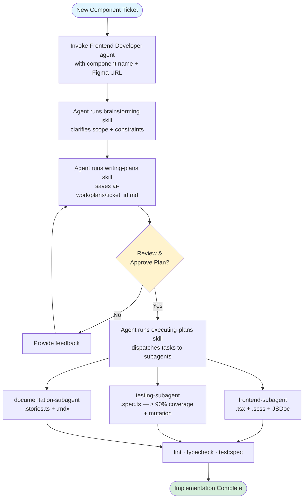
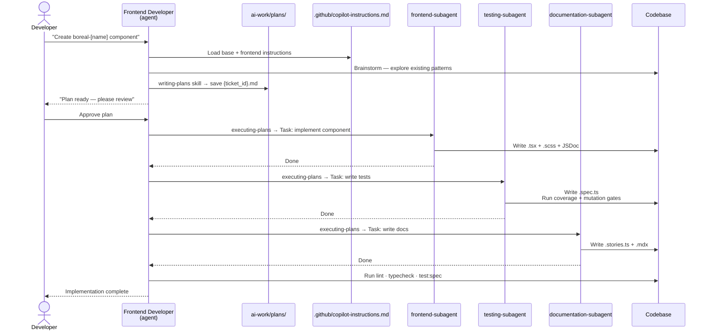

# Boreal DS — Agentic Implementation Process

This folder contains the artefacts produced and consumed by the AI-assisted implementation workflow for Boreal DS components. The process uses specialist agents that collaborate via shared plan and session files.

---

## Participants

| Agent / Skill               | File                                       | Role                                                                                                                                   |
| --------------------------- | ------------------------------------------ | -------------------------------------------------------------------------------------------------------------------------------------- |
| **Frontend Developer**      | `.agents/agents/frontend-developer.md`     | SDLC coordinator. Sequences brainstorming → writing-plans → executing-plans. **Never writes code directly.**                           |
| **frontend-subagent**       | `.agents/agents/frontend-subagent.md`      | Implements Stencil components — props, SCSS tokens, `render()`, lifecycle hooks, FACE, and JSDoc.                                      |
| **testing-subagent**        | `.agents/agents/testing-subagent.md`       | Writes and fixes unit tests. Enforces the two-phase quality gate (≥ 90% coverage then ≥ 90% mutation score).                           |
| **documentation-subagent**  | `.agents/agents/documentation-subagent.md` | Creates Storybook stories (`.stories.ts`) and MDX documentation.                                                                       |
| **writing-plans** (skill)   | `.agents/skills/writing-plans/SKILL.md`    | Produces a task-by-task implementation plan saved to `ai-work/plans/`, with Executor fields so executing-plans can dispatch subagents. |
| **executing-plans** (skill) | `.agents/skills/executing-plans/SKILL.md`  | Reads a plan from `ai-work/plans/` and dispatches each task to the correct specialist subagent with review checkpoints.                |

---

## Workflow

### Implementation Flow

The following diagram shows the complete decision flow from ticket to implementation:



### Interaction Sequence

The following sequence diagram shows the detailed message flow between participants:



---

## Folder Reference

Only the following sub-folders are actively used by the agentic workflow:

### `ai-work/plans/`

Implementation plan documents produced by the **writing-plans** skill (via the **Frontend Developer** agent) and consumed task-by-task by the **executing-plans** skill.

Naming convention: `{ticket-id}-{component_name}.md`

Every plan file carries a YAML frontmatter block at line 1:

```yaml
---
status: pending
---
```

Valid values: `pending`, `in progress`, `done`. The **executing-plans** skill reads this field before starting — it refuses to run against a plan marked `done` and sets the status to `in progress` once execution begins.

[`INDEX.md`](../ai-work/plans/INDEX.md) is the single source of truth listing all plans grouped by status. Update it whenever a plan's status changes, or run the `sync-plans` command/prompt to rebuild it automatically.

### `ai-work/sessions/`

Per-component session state files managed exclusively by the **Frontend Developer** agent. Each file uses a strict two-zone structure:

- **`## Current State`** — always overwritten at the end of each agent run with the latest snapshot (Figma links, decided API, open questions, constraints). This is the fast-read target for subsequent runs.
- **`## History`** — append-only log of what changed each run, prefixed with a `### YYYY-MM-DD` timestamp header. Existing entries are never edited or deleted.

Naming convention: `{component_name}.md`

### `ai-docs/guidelines/`

Reference documents consulted by the **Frontend Developer** agent and specialist subagents before producing or executing a plan:

| File                 | Purpose                                          |
| -------------------- | ------------------------------------------------ |
| `release-process.md` | Release runbook executed by the Engineering Lead |

> **Coding conventions** (component architecture, token rules, naming) are defined in `.github/copilot-instructions.md` and the linked skill files, not in this folder.

> **Definition of Done** is defined in `ai-docs/guidelines/code-review-checklist.md` and must be fully satisfied before any ticket is marked complete.

---

## Usage

1. Open GitHub Copilot Chat.
2. Invoke the **Frontend Developer** agent with the component name, ticket ID, and Figma URL.
3. The agent runs the **brainstorming** skill to clarify scope, then the **writing-plans** skill to produce `ai-work/plans/{ticket_id}.md`.
4. Review and approve the plan.
5. Tell the agent to proceed — it runs the **executing-plans** skill, which dispatches each task to the correct specialist subagent with a review checkpoint after each one.

---

## Key Rules

- The **executing-plans** skill always reads the plan before dispatching any work. If the plan is missing or marked `done`, it stops.
- The **Frontend Developer** agent never writes implementation code — it coordinates only.
- All commits during implementation must be made via `pnpm commit` (Commitizen) to drive automatic versioning via `release-it`.
- `pnpm release:*` is the Engineering Lead's responsibility. Developers never run it.
