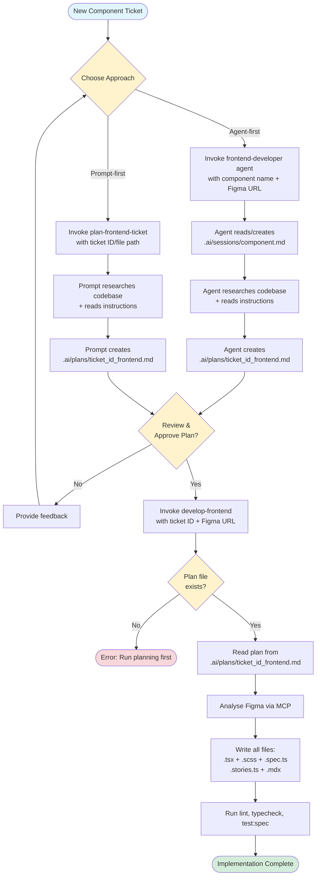
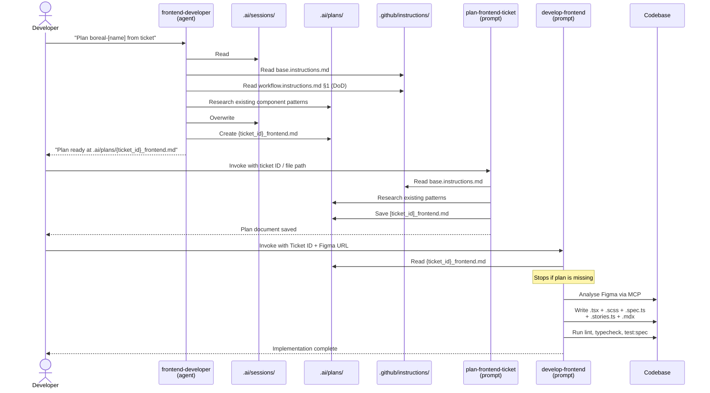

# Boreal DS — Agentic Implementation Process

This folder contains the artefacts produced and consumed by the AI-assisted implementation workflow for Boreal DS components. The process involves three distinct agent/prompt instances that collaborate via shared files.

---

## Participants

| Instance                 | File                                             | Role                                                                                                                            |
| ------------------------ | ------------------------------------------------ | ------------------------------------------------------------------------------------------------------------------------------- |
| **Frontend Developer**   | `.github/agents/frontend-developer.agent.md`     | Research & planning agent. Reads Figma and ticket context, then produces a detailed implementation plan. **Never writes code.** |
| **plan-frontend-ticket** | `.github/prompts/plan-frontend-ticket.prompt.md` | Prompt that structures a ticket's requirements into a step-by-step plan document saved in `.ai/plans/`.                         |
| **develop-frontend**     | `.github/prompts/develop-frontend.prompt.md`     | Prompt that reads the plan and Figma design, then writes all implementation files (Stencil, SCSS, tests, stories, MDX).         |

---

## Workflow

### Implementation Flow

The following diagram shows the complete decision flow from ticket to implementation:



### Interaction Sequence

The following sequence diagram shows the detailed message flow between participants:



---

## Folder Reference

Only the following sub-folders are actively used by the agentic workflow:

### `.ai/plans/`

Implementation plan documents produced by the **Frontend Developer** agent or the **plan-frontend-ticket** prompt and consumed by the **develop-frontend** prompt.

Naming convention: `{ticket-id}-{component_name}.md`

Every plan file carries a YAML frontmatter block at line 1:

```yaml
---
status: pending
---
```

Valid values: `pending`, `in progress`, `done`. The **develop-frontend** prompt reads this field before starting — it will refuse to run against a plan marked `done` and will set the status to `in progress` once implementation begins.

[`INDEX.md`](plans/INDEX.md) is the single source of truth listing all plans grouped by status. Update it whenever a plan's status changes, or run the `sync-plans` command/prompt to rebuild it automatically.

### `.ai/sessions/`

Per-component session state files managed exclusively by the **Frontend Developer** agent. Each file uses a strict two-zone structure:

- **`## Current State`** — always overwritten at the end of each agent run with the latest snapshot (Figma links, decided API, open questions, constraints). This is the fast-read target for subsequent runs.
- **`## History`** — append-only log of what changed each run, prefixed with a `### YYYY-MM-DD` timestamp header. Existing entries are never edited or deleted.

Naming convention: `{component_name}.md`

### `.ai/guidelines/`

Reference documents consulted by both the **Frontend Developer** agent and the **plan-frontend-ticket** prompt before producing a plan:

| File                 | Purpose                                          |
| -------------------- | ------------------------------------------------ |
| `release-process.md` | Release runbook executed by the Engineering Lead |

> **Coding conventions** (component architecture, token rules, naming) are defined in [`.github/instructions/base.instructions.md`](../.github/instructions/base.instructions.md) and its linked instruction files, not in this folder.

> **Definition of Done** is defined in [`.github/instructions/workflow.instructions.md §1`](../.github/instructions/workflow.instructions.md) and must be fully satisfied before any ticket is marked complete.

---

## Usage

### Option A — Agent-first (recommended for new components)

1. Open GitHub Copilot Chat.
2. Invoke the **Frontend Developer** agent with the component name and Figma URL.
3. The agent reads or creates `.ai/sessions/{name}.md`, researches the codebase, and saves a plan to `.ai/plans/{ticket_id}_frontend.md`.
4. Review and approve the plan.
5. Invoke the **develop-frontend** prompt with the ticket ID and Figma URL to implement.

### Option B — Prompt-first (for well-defined tickets)

1. Invoke the **plan-frontend-ticket** prompt with the ticket ID or a local ticket file path.
2. The prompt produces `.ai/plans/{ticket_id}_frontend.md`.
3. Review and approve the plan.
4. Invoke the **develop-frontend** prompt with the ticket ID and Figma URL to implement.

---

## Key Rules

- The **develop-frontend** prompt always reads the plan before writing any code. If the plan is missing, it stops and prompts you to run planning first.
- The **Frontend Developer** agent never writes implementation code — it is a planning-only agent.
- All commits during implementation must be made via `pnpm commit` (Commitizen) to drive automatic versioning via `release-it`.
- `pnpm release:*` is the Engineering Lead's responsibility. Developers never run it.
