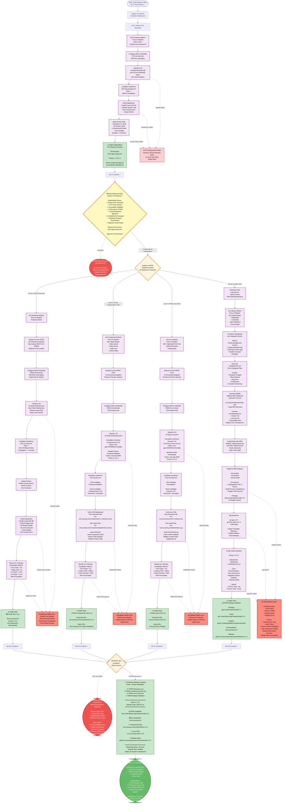

```mermaid
flowchart TD
    Start([Start: Code Merged to Main<br/>All CI Tests Passed ✓]) --> Trigger[Trigger CD Pipeline<br/>Automatic Deployment]

    Trigger --> J4_Start[Job 4: Deploy STG Storybook]

    %% Job 4 - Deploy STG Storybook
    J4_Start --> J4_Get[Get Storybook Artifacts<br/>From CI Pipeline<br/>Built in Job 3<br/>Includes All Components]
    J4_Get --> J4_Config[Configure AWS Credentials<br/>STG Environment<br/>IAM Role: stg-deploy]
    J4_Config --> J4_Upload[Upload to S3<br/>s3://pxg-storybook-stg<br/>aws s3 sync storybook-static/<br/>Set Cache Headers]
    J4_Upload --> J4_Invalidate[Invalidate CloudFront<br/>docs-stg.yourorg.com<br/>Path: /*<br/>Wait for Completion]
    J4_Invalidate --> J4_Verify[Verify Deployment<br/>• Health Check 200 OK<br/>• Sample Stories Load<br/>• No Console Errors<br/>• Search Works]
    J4_Verify --> J4_Smoke[Quick Smoke Tests<br/>• Storybook UI Loads<br/>• All Stories Listed<br/>• Components Render<br/>• Icons Display<br/>Duration: ~3 minutes]
    J4_Smoke --> J4_Notify[✅ Notify Stakeholders<br/>STG Ready for Review<br/><br/>Environment:<br/>docs-stg.yourorg.com<br/><br/>Version: 1.2.3-rc.1<br/><br/>Please review and approve<br/>for production deployment]
    J4_Notify --> J4_End[Job 4 Complete ✓]
    J4_Upload -.Upload Failed.-> Fail4[❌ STG Deployment Failed<br/>Previous Version Remains Active<br/>Fix Issue and Retry<br/>Notify Team]
    J4_Verify -.Verification Failed.-> Fail4
    J4_Smoke -.Smoke Tests Failed.-> Fail4

    %% Manual Approval Gate
    J4_End --> Approval{🔒 Manual Approval Gate<br/>Deploy to Production?<br/><br/>Stakeholder Review:<br/>✓ Review STG Storybook<br/>✓ All CI Tests Passed<br/>✓ Accessibility Validated<br/>✓ Performance Verified<br/>✓ Visual Regression Approved<br/>✓ CHANGELOG Reviewed<br/>✓ Breaking Changes Documented<br/>✓ Migration Guide Ready<br/><br/>Review Environment:<br/>docs-stg.yourorg.com<br/><br/>Approve for Production?}
    Approval -.Rejected.-> CancelEnd([⛔ Deployment Cancelled<br/>By Stakeholder<br/><br/>Feedback Provided<br/>Return to Development<br/>Address Concerns<br/>Create New PR])
    Approval -->|✅ Approved by Stakeholders| PRODStart{Deploy to PROD<br/>Parallel Execution<br/>All Distribution Channels}

    %% Job 5a - Deploy PROD Storybook
    PRODStart -->|Job 5a: PROD Storybook| J5a_Get[Get Storybook Artifacts<br/>From CI Pipeline<br/>Production Build]
    J5a_Get --> J5a_Backup[Backup Current PROD<br/>S3 Versioning Snapshot<br/>Tag: backup-2025-01-15-103000<br/>Rollback Point Created]
    J5a_Backup --> J5a_Config[Configure AWS Credentials<br/>PROD Environment<br/>IAM Role: prod-deploy<br/>Read-Only by Default]
    J5a_Config --> J5a_Upload[Upload to S3<br/>s3://pxg-storybook-prod<br/>Blue-Green Deployment<br/>Upload to New Path<br/>Keep Current Active]
    J5a_Upload --> J5a_Invalidate[Invalidate CloudFront<br/>docs.yourorg.com<br/>Path: /*<br/>Clear All Edge Caches<br/>Propagation: ~5 minutes]
    J5a_Invalidate --> J5a_Domain[Update Domain<br/>Switch to New Version<br/>Atomic Cutover<br/>Zero Downtime]
    J5a_Domain --> J5a_Verify[Verify Deployment<br/>• Health Check 200 OK<br/>• Critical Pages Load<br/>• All Stories Render<br/>• Search Functional<br/>• Icons Display<br/>• No Console Errors]
    J5a_Verify --> J5a_Monitor[Monitor for 5 Minutes<br/>CloudWatch Metrics:<br/>• Error Rate < 1%<br/>• Page Load < 3s<br/>• 4xx Rate < 0.5%<br/>• 5xx Rate < 0.1%<br/>Alert if Exceeded]
    J5a_Monitor --> J5a_Notify[✅ Notify Team<br/>📚 PROD Docs Live<br/><br/>docs.yourorg.com<br/>Version 1.2.3<br/>All Components Documented]
    J5a_Notify --> J5a_End[Job 5a Complete ✓]
    J5a_Upload -.Upload Failed.-> Rollback5a[❌ Rollback PROD Docs<br/>Restore from Backup<br/>Revert Domain Switch<br/>Notify Team Immediately<br/>Post-Incident Review]
    J5a_Verify -.Health Check Failed.-> Rollback5a
    J5a_Monitor -.High Error Rate.-> Rollback5a

    %% Job 5b - Deploy PROD Components CDN
    PRODStart -->|Job 5b: PROD Components CDN| J5b_Get[Get Component Artifacts<br/>From CI Pipeline<br/>Job 2 Build Output:<br/>• index.umd.js<br/>• index.esm.js<br/>• styles.css<br/>• Source Maps]
    J5b_Get --> J5b_Backup[Backup Current PROD CDN<br/>S3 Versioning Snapshot<br/>Preserve Previous Versions]
    J5b_Backup --> J5b_Config[Configure AWS Credentials<br/>PROD Environment<br/>CDN Deploy Role]
    J5b_Config --> J5b_Upload[Upload to S3<br/>s3://pxg-components-prod<br/><br/>Immutable Versioned:<br/>/components/v1.2.3/<br/>Cache: max-age=31536000,immutable<br/><br/>Mutable Pointer:<br/>/components/latest/<br/>Cache: max-age=3600<br/>Points to v1.2.3]
    J5b_Upload --> J5b_Invalidate[Invalidate CloudFront<br/>cdn.yourorg.com<br/><br/>Only Invalidate:<br/>/components/latest/*<br/><br/>Never Invalidate:<br/>/components/v1.2.3/*<br/>Versioned = Immutable]
    J5b_Invalidate --> J5b_Verify[Verify CDN Deployment<br/>Test Versioned Path:<br/>curl cdn.yourorg.com/components/v1.2.3/index.umd.js<br/><br/>Test Latest Path:<br/>curl cdn.yourorg.com/components/latest/index.umd.js<br/><br/>Load in Browser:<br/>Verify Component Loads<br/>Check CORS Headers<br/>Validate Content-Type]
    J5b_Verify --> J5b_Monitor[Monitor for 5 Minutes<br/>CloudWatch Metrics:<br/>• Error Rate < 1%<br/>• Latency P95 < 200ms<br/>• Cache Hit Rate > 90%<br/>Alert if Anomalies]
    J5b_Monitor --> J5b_Notify[✅ Notify Team<br/>🚀 PROD Components CDN Live<br/><br/>Versioned URL:<br/>cdn.yourorg.com/components/v1.2.3/<br/><br/>Latest URL:<br/>cdn.yourorg.com/components/latest/<br/>]
    J5b_Notify --> J5b_End[Job 5b Complete ✓]
    J5b_Upload -.Upload Failed.-> Rollback5b[❌ Rollback PROD CDN<br/>Restore from Backup<br/>Update /latest/ to Previous<br/>Notify Team]
    J5b_Verify -.Verification Failed.-> Rollback5b
    J5b_Monitor -.High Error/Latency.-> Rollback5b

    %% Job 5c - Deploy PROD Icons CDN
    PRODStart -->|Job 5c: PROD Icons CDN| J5c_Get[Get Icon Artifacts<br/>From CI Pipeline<br/>500+ Optimized SVG Files<br/>SVGO Processed<br/>Compressed]
    J5c_Get --> J5c_Backup[Backup Current PROD Icons<br/>S3 Versioning Snapshot<br/>Preserve Previous Versions]
    J5c_Backup --> J5c_Config[Configure AWS Credentials<br/>PROD Environment<br/>CDN Deploy Role]
    J5c_Config --> J5c_Upload[Upload to S3<br/>s3://pxg-icons-prod<br/><br/>Immutable Versioned:<br/>/icons/v2.1.0/<br/>• close.svg, menu.svg, etc.<br/>Cache: max-age=31536000,immutable<br/><br/>Mutable Pointer:<br/>/icons/latest/<br/>Cache: max-age=3600<br/>Points to v2.1.0]
    J5c_Upload --> J5c_Invalidate[Invalidate CloudFront<br/>icons.yourorg.com<br/><br/>Only Invalidate:<br/>/icons/latest/*<br/><br/>Never Invalidate:<br/>/icons/v2.1.0/*<br/>Versioned = Immutable]
    J5c_Invalidate --> J5c_Verify[Verify Icon CDN<br/>Test Versioned Path:<br/>curl icons.yourorg.com/v2.1.0/close.svg<br/><br/>Test Latest Path:<br/>curl icons.yourorg.com/latest/close.svg<br/><br/>Verify SVG Rendering<br/>Check CORS Headers<br/>Validate Content-Type: image/svg+xml]
    J5c_Verify --> J5c_Monitor[Monitor for 5 Minutes<br/>CloudWatch Metrics:<br/>• Error Rate < 1%<br/>• Latency P95 < 100ms<br/>• Cache Hit Rate > 95%<br/>Alert if Anomalies]
    J5c_Monitor --> J5c_Notify[✅ Notify Team<br/>🎨 PROD Icons CDN Live<br/><br/>Versioned URL:<br/>icons.yourorg.com/v2.1.0/<br/><br/>Latest URL:<br/>icons.yourorg.com/latest]
    J5c_Notify --> J5c_End[Job 5c Complete ✓]
    J5c_Upload -.Upload Failed.-> Rollback5c[❌ Rollback PROD Icons<br/>Restore from Backup<br/>Update /latest/ to Previous<br/>Notify Team]
    J5c_Verify -.Verification Failed.-> Rollback5c
    J5c_Monitor -.High Error/Latency.-> Rollback5c

    %% Job 5d - Publish NPM Package
    PRODStart -->|Job 5d: Publish NPM| J5d_Checkout[Checkout Code<br/>main Branch<br/>Latest Commit<br/>Clean Working Directory]
    J5d_Checkout --> J5d_Get[Get Library Artifacts<br/>From CI Pipeline<br/>Job 2 Build Output:<br/>• ESM Build<br/>• CJS Build<br/>• Type Definitions<br/>• Source Maps]
    J5d_Get --> J5d_Changesets[Consume Changesets<br/>npx changeset version<br/><br/>Actions:<br/>• Bump package.json versions<br/>• Update dependencies<br/>• Generate version tags<br/>• Handle monorepo packages]
    J5d_Changesets --> J5d_Changelog[Generate CHANGELOG.md<br/>From Changeset Files<br/><br/>Include:<br/>• Breaking Changes<br/>• New Features<br/>• Bug Fixes<br/>• Contributors<br/>• Semantic Versioning]
    J5d_Changelog --> J5d_SBOM[Generate SBOM<br/>Software Bill of Materials<br/>CycloneDX Format<br/><br/>npx @cyclonedx/cyclonedx-npm<br/>--output-file sbom.json<br/><br/>Contains:<br/>• All Dependencies<br/>• Version Info<br/>• License Info<br/>• Vulnerability Data<br/>Supply Chain Transparency]
    J5d_SBOM --> J5d_Auth[Authenticate with NPM<br/>Registry: registry.npmjs.org<br/>Use NPM_TOKEN Secret<br/>Scope: @yourorg<br/>Verify Token Valid]
    J5d_Auth --> J5d_Publish[Publish to NPM Registry<br/><br/>npm publish<br/>--provenance<br/>--access public<br/><br/>Provenance:<br/>• Cryptographic Link to Source<br/>• Build Process Transparency<br/>• Supply Chain Security<br/><br/>Package:<br/>@yourorg/components@1.2.3<br/>Immutable Version]
    J5d_Publish --> J5d_Tag[Tag Repository<br/><br/>git tag v1.2.3<br/>git push origin v1.2.3<br/>--follow-tags<br/><br/>Create Immutable Reference<br/>Enable Rollback<br/>Track Releases]
    J5d_Tag --> J5d_Release[Create GitHub Release<br/><br/>Version: v1.2.3<br/><br/>Attachments:<br/>• SBOM.json<br/>• CHANGELOG.md<br/><br/>Links:<br/>• Documentation: docs.yourorg.com<br/>• Migration Guide if breaking<br/>• Release Notes<br/><br/>Assets:<br/>• Source Code - zip<br/>• Source Code - tar.gz]
    J5d_Release --> J5d_Notify[✅ Notify Team<br/>📦 NPM Package Published<br/><br/>Package:<br/>@yourorg/components@1.2.3<br/><br/>Install:<br/>npm install @yourorg/components@1.2.3<br/><br/>Registry:<br/>npmjs.com/package/@yourorg/components<br/><br/>Documentation:<br/>docs.yourorg.com<br/><br/>Release:<br/>github.com/yourorg/components/releases/v1.2.3]
    J5d_Notify --> J5d_End[Job 5d Complete ✓]
    J5d_Publish -.Publish Failed.-> Rollback5d[❌ NPM Publish Failed<br/><br/>Possible Causes:<br/>• Auth Failed<br/>• Version Conflict<br/>• Network Issue<br/>• Registry Error<br/><br/>Actions:<br/>• Review Error Logs<br/>• Verify Token<br/>• Check Version Availability<br/>• npm deprecate if Partial<br/>• Manual Intervention Required<br/>• Notify Team Immediately]
    J5d_Tag -.Tag Failed.-> Rollback5d
    J5d_Release -.Release Failed.-> Rollback5d

    %% Final Convergence
    J5a_End --> FinalGate{All PROD Jobs<br/>Complete?<br/>Verify Success}
    J5b_End --> FinalGate
    J5c_End --> FinalGate
    J5d_End --> FinalGate

    FinalGate -.Any Job Failed.-> FailPROD([❌ Partial PROD Deployment<br/>Manual Intervention Required<br/><br/>Review Failed Jobs:<br/>• Check Error Logs<br/>• Verify Rollback Status<br/>• Determine Root Cause<br/><br/>Action Items:<br/>• Execute Rollback Plan<br/>• Notify Stakeholders<br/>• Document Incident<br/>• Schedule Post-Mortem<br/>• Plan Retry Strategy])
    FinalGate -->|All Jobs Success ✓| FinalNotify[🎉 Production Release Complete<br/>Email + Teams Notification<br/><br/>✅ PROD Storybook Live<br/>✅ PROD Components CDN Live<br/>✅ PROD Icons CDN Live<br/>✅ NPM Package Published<br/><br/>━━━━━━━━━━━━━━━━━━━━━━<br/>Version: 1.2.3<br/>Release Date: 2025-01-15<br/>━━━━━━━━━━━━━━━━━━━━━━<br/><br/>📦 NPM Installation:<br/>npm install @yourorg/components@1.2.3<br/><br/>📚 Documentation:<br/>docs.yourorg.com<br/><br/>🚀 Components CDN:<br/>cdn.yourorg.com/components/v1.2.3/<br/><br/>🎨 Icons CDN:<br/>icons.yourorg.com/v2.1.0/<br/><br/>📝 Release Notes:<br/>github.com/yourorg/components/releases/v1.2.3<br/><br/>━━━━━━━━━━━━━━━━━━━━━━<br/>Monitoring Active: 24 hours<br/>Support Team: Notified<br/>Status: All Systems Operational]
    FinalNotify --> Success([✅ CD Pipeline Success<br/>🚀 Version 1.2.3 Released<br/><br/>Distribution Channels Live:<br/>✓ Public Documentation<br/>✓ NPM Package Registry<br/>✓ Components CDN<br/>✓ Icons CDN<br/><br/>Quality Metrics:<br/>✓ Test Coverage: 85%<br/>✓ Performance Score: 95<br/>✓ Accessibility: WCAG AA<br/>✓ Bundle Size: 320KB gzipped<br/><br/>Deployment Complete<br/>Monitoring Active<br/>Ready for Consumption])

    %% Styling
    classDef cdJob fill:#f3e5f5,stroke:#7b1fa2,stroke-width:2px,color:#000
    classDef decision fill:#fff3e0,stroke:#f57c00,stroke-width:3px,color:#000
    classDef fail fill:#ffcdd2,stroke:#d32f2f,stroke-width:2px,color:#000
    classDef success fill:#c8e6c9,stroke:#388e3c,stroke-width:2px,color:#000
    classDef rollback fill:#ff8a80,stroke:#d32f2f,stroke-width:3px,color:#000
    classDef endFail fill:#ef5350,stroke:#c62828,stroke-width:3px,color:#fff
    classDef endSuccess fill:#66bb6a,stroke:#388e3c,stroke-width:3px,color:#fff
    classDef approval fill:#fff9c4,stroke:#f57f17,stroke-width:4px,color:#000

    class J4_Get,J4_Config,J4_Upload,J4_Invalidate,J4_Verify,J4_Smoke,J4_Notify cdJob
    class J5a_Get,J5a_Backup,J5a_Config,J5a_Upload,J5a_Invalidate,J5a_Domain,J5a_Verify,J5a_Monitor,J5a_Notify cdJob
    class J5b_Get,J5b_Backup,J5b_Config,J5b_Upload,J5b_Invalidate,J5b_Verify,J5b_Monitor,J5b_Notify cdJob
    class J5c_Get,J5c_Backup,J5c_Config,J5c_Upload,J5c_Invalidate,J5c_Verify,J5c_Monitor,J5c_Notify cdJob
    class J5d_Checkout,J5d_Get,J5d_Changesets,J5d_Changelog,J5d_SBOM,J5d_Auth,J5d_Publish,J5d_Tag,J5d_Release,J5d_Notify cdJob
    class PRODStart,FinalGate decision
    class Approval approval
    class Fail4 fail
    class J4_Notify,J5a_Notify,J5b_Notify,J5c_Notify,J5d_Notify,FinalNotify success
    class Rollback5a,Rollback5b,Rollback5c,Rollback5d rollback
    class CancelEnd,FailPROD endFail
    class Success endSuccess
```