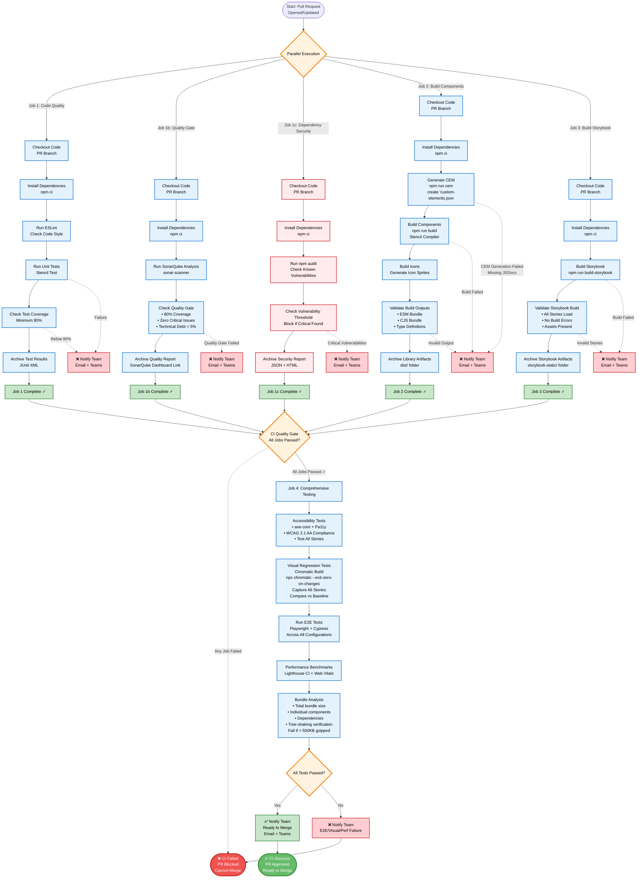

```mermaid
flowchart TD
  Start([Start: Pull Request<br/>Opened/Updated]) --> Parallel{Parallel Execution}

  %% Job 1 - Code Quality
  Parallel -->|Job 1: Code Quality| J1_Checkout[Checkout Code<br/>PR Branch]
  J1_Checkout --> J1_Install[Install Dependencies<br/>npm ci]
  J1_Install --> J1_Lint[Run ESLint<br/>Check Code Style]
  J1_Lint --> J1_Test[Run Unit Tests<br/>Stencil Test]
  J1_Test --> J1_Coverage[Check Test Coverage<br/>Minimum 80%]
  J1_Coverage --> J1_Archive[Archive Test Results<br/>JUnit XML]
  J1_Archive --> J1_End[Job 1 Complete ✓]
  J1_Test -.Failure.-> NotifyFail1[❌ Notify Team<br/>Email + Teams]
  J1_Coverage -.Below 80%.-> NotifyFail1

  %% Job 1b - SonarQube Quality Gate
  Parallel -->|Job 1b: Quality Gate| J1b_Checkout[Checkout Code<br/>PR Branch]
  J1b_Checkout --> J1b_Install[Install Dependencies<br/>npm ci]
  J1b_Install --> J1b_Sonar[Run SonarQube Analysis<br/>sonar-scanner]
  J1b_Sonar --> J1b_Gate[Check Quality Gate<br/>• 80% Coverage<br/>• Zero Critical Issues<br/>• Technical Debt < 5%]
  J1b_Gate --> J1b_Archive[Archive Quality Report<br/>SonarQube Dashboard Link]
  J1b_Archive --> J1b_End[Job 1b Complete ✓]
  J1b_Gate -.Quality Gate Failed.-> NotifyFail1b[❌ Notify Team<br/>Email + Teams]

  %% Job 1c - Dependency Security Scan
  Parallel -->|Job 1c: Dependency Security| J1c_Checkout[Checkout Code<br/>PR Branch]
  J1c_Checkout --> J1c_Install[Install Dependencies<br/>npm ci]
  J1c_Install --> J1c_Audit[Run npm audit<br/>Check Known Vulnerabilities]
  J1c_Audit --> J1c_Gate[Check Vulnerability Threshold<br/>Block if Critical Found]
  J1c_Gate --> J1c_Archive[Archive Security Report<br/>JSON + HTML]
  J1c_Archive --> J1c_End[Job 1c Complete ✓]
  J1c_Gate -.Critical Vulnerabilities.-> NotifyFail1c[❌ Notify Team<br/>Email + Teams]

  %% Job 2 - Build Components
  Parallel -->|Job 2: Build Components| J2_Checkout[Checkout Code<br/>PR Branch]
  J2_Checkout --> J2_Install[Install Dependencies<br/>npm ci]
  J2_Install --> J2_CEM[Generate CEM<br>npm run cem<br>create 'custom-elements.json]
  J2_CEM --> J2_Build[Build Components<br/>npm run build<br/>Stencil Compiler]
  J2_Build --> J2_Icons[Build Icons<br/>Generate Icon Sprites]
  J2_Icons --> J2_Validate[Validate Build Outputs<br/>• ESM Bundle<br/>• CJS Bundle<br/>• Type Definitions]
  J2_Validate --> J2_Archive[Archive Library Artifacts<br/>dist/ folder]
  J2_Archive --> J2_End[Job 2 Complete ✓]
  J2_CEM -.CEM Generation Failed<br>Missing JSDocs.-> NotifyFail2[❌ Notify Team<br/>Email + Teams]
  J2_Build -.Build Failed.-> NotifyFail2
  J2_Validate -.Invalid Output.-> NotifyFail2

  %% Job 3 - Build Storybook
  Parallel -->|Job 3: Build Storybook| J3_Checkout[Checkout Code<br/>PR Branch]
  J3_Checkout --> J3_Install[Install Dependencies<br/>npm ci]
  J3_Install --> J3_Build[Build Storybook<br/>npm run build-storybook]
  J3_Build --> J3_Validate[Validate Storybook Build<br/>• All Stories Load<br/>• No Build Errors<br/>• Assets Present]
  J3_Validate --> J3_Archive[Archive Storybook Artifacts<br/>storybook-static/ folder]
  J3_Archive --> J3_End[Job 3 Complete ✓]
  J3_Build -.Build Failed.-> NotifyFail3[❌ Notify Team<br/>Email + Teams]
  J3_Validate -.Invalid Stories.-> NotifyFail3

  %% Convergence - CI Gate
  J1_End --> CIGate{CI Quality Gate<br/>All Jobs Passed?}
  J1b_End --> CIGate
  J1c_End --> CIGate
  J2_End --> CIGate
  J3_End --> CIGate

  CIGate -.Any Job Failed.-> FailEnd([❌ CI Failed<br/>PR Blocked<br/>Cannot Merge])
  CIGate -->|All Jobs Passed ✓| J4_Testing[Job 4: Comprehensive Testing]

  %% Job 4 - Comprehensive Testing
  J4_Testing --> J4_Accessibility[Accessibility Tests<br/>• axe-core + Pa11y<br/>• WCAG 2.1 AA Compliance<br/>• Test All Stories]
  J4_Accessibility --> J4_Run[Visual Regression Tests<br/>Chromatic Build<br/>npx chromatic --exit-zero-on-changes<br/>Capture All Stories<br/>Compare vs Baseline]
  J4_Run --> J4_E2E[Run E2E Tests<br/>Playwright + Cypress<br/>Across All Configurations]
  J4_E2E --> J4_Perf[Performance Benchmarks<br/>Lighthouse CI + Web Vitals]
  J4_Perf --> J4_Summary[Bundle Analysis<br/>• Total bundle size<br/>• Individual components<br/>• Dependencies<br/>• Tree-shaking verification<br/>Fail if > 500KB gzipped]
  J4_Summary --> J4_Gate{All Tests Passed?}
  J4_Gate -->|Yes| NotifySuccess[✅ Notify Team<br/>Ready to Merge<br/>Email + Teams]
  J4_Gate -->|No| NotifyFail4[❌ Notify Team<br/>E2E/Visual/Perf Failure]
  NotifySuccess --> SuccessEnd([✅ CI Success<br/>PR Approved<br/>Ready to Merge])
  NotifyFail4 --> FailEnd

  %% Styling
  classDef ciJob fill:#e3f2fd,stroke:#1976d2,stroke-width:2px,color:#000
  classDef secJob fill:#ffebee,stroke:#c62828,stroke-width:2px,color:#000
  classDef decision fill:#fff3e0,stroke:#f57c00,stroke-width:3px,color:#000
  classDef notifyFail fill:#ffcdd2,stroke:#d32f2f,stroke-width:2px,color:#000
  classDef notifySuccess fill:#c8e6c9,stroke:#388e3c,stroke-width:2px,color:#000
  classDef endFail fill:#ef5350,stroke:#c62828,stroke-width:3px,color:#fff
  classDef endSuccess fill:#66bb6a,stroke:#388e3c,stroke-width:3px,color:#fff

  class J1_Checkout,J1_Install,J1_Lint,J1_Test,J1_Coverage,J1_Archive ciJob
  class J1b_Checkout,J1b_Install,J1b_Sonar,J1b_Gate,J1b_Archive ciJob
  class J2_Checkout,J2_Install,J2_CEM,J2_Build,J2_Icons,J2_Validate,J2_Archive ciJob
  class J3_Checkout,J3_Install,J3_Build,J3_Validate,J3_Archive ciJob
  class J1c_Checkout,J1c_Install,J1c_Audit,J1c_CX,J1c_Gate,J1c_Archive secJob
  class Parallel,CIGate,J4_Gate decision
  class J4_Testing,J4_Accessibility,J4_Run,J4_E2E,J4_Perf,J4_Summary ciJob
  class NotifyFail1,NotifyFail1b,NotifyFail1c,NotifyFail2,NotifyFail2b,NotifyFail3,NotifyFail4 notifyFail
  class NotifySuccess,SuccessGate,J1_End,J1b_End,J1c_End,J2_End,J3_End notifySuccess
  class FailEnd endFail
  class SuccessEnd endSuccess
```