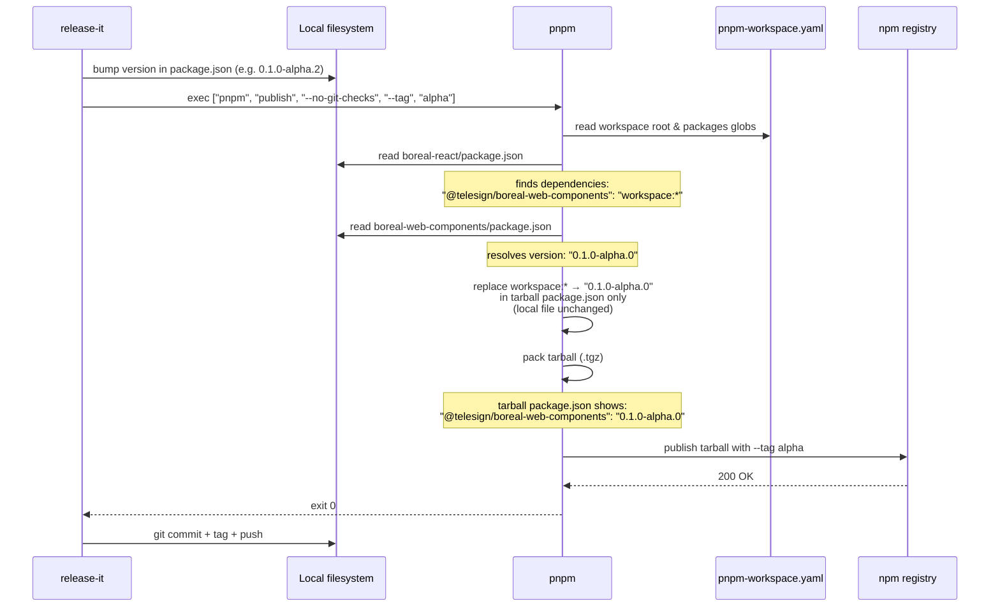

# release-it Publish Flow — Alpha Phase

> **Scope:** This diagram describes the publish sequence during the **alpha release phase**, where `workspace:*` (exact pin) is used and `publishPackageManager: "pnpm"` is required to prevent the raw workspace protocol from leaking into the published tarball.
>
> See `.claude/memory/release-it-pnpm-publish.md` for the full mechanics and gotchas.

