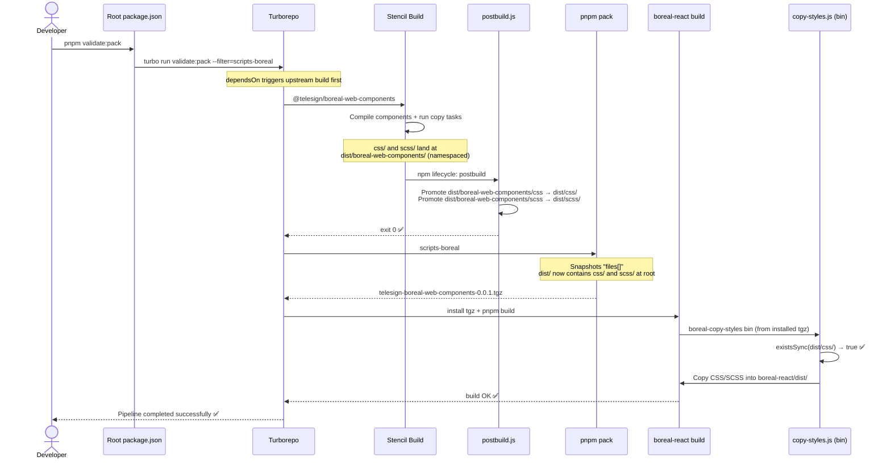
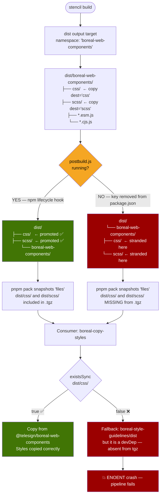

# validate:pack Pipeline Diagrams

Diagrams documenting the `pnpm validate:pack` pipeline for `@telesign/boreal-web-components`, covering the full build sequence and the critical `postbuild.js` promotion step.

---

## Sequence: validate:pack end-to-end

---

## Flowchart: postbuild.js promotion decision

