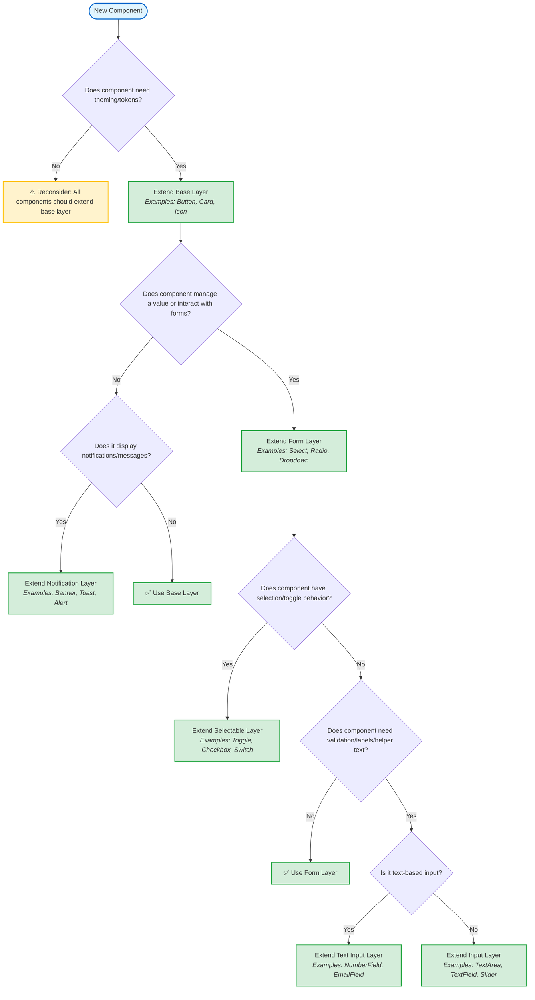

# PxG CL Code Practices & Development Guidelines

## Overview

This document defines mandatory code practices, quality standards, and development workflows for all contributors to the Proximus Global (PxG) component library. It ensures:

- Code quality and consistency across teams
- Reduced review friction and faster merges
- Maintainable, accessible, and well-tested components
- Consistent developer experience

---

## 1. COMPONENT DEVELOPMENT GUIDELINES

Component development guidelines establish the foundational patterns and naming conventions for building components in the library. These standards ensure components are architecturally sound, follow clear inheritance patterns, use consistent naming across properties, events, slots, and CSS classes, maintain predictable code organization, and implement robust property and event APIs that integrate seamlessly with web standards and modern frameworks.

### 1.1 Component Architecture & Inheritance

Component architecture defines how components are organized through inheritance and composition. A well-structured inheritance system centralizes common functionality—such as theming, form behavior, and validation logic—while keeping components modular and preventing unnecessary complexity. This layered approach ensures consistency, reduces code duplication, and makes components easier to maintain and extend.

#### Base Layer Hierarchy

The component library uses a layered inheritance model where each layer provides specific capabilities. Components should extend the lowest suitable base class that provides the required functionality.

| Layer                  | Purpose                                                                                     | Use When                                                                                                                          | Examples                                            |
| ---------------------- | ------------------------------------------------------------------------------------------- | --------------------------------------------------------------------------------------------------------------------------------- | --------------------------------------------------- |
| **Base Layer**         | Foundation for all components. Provides theming, design tokens, and shared visual behavior. | Every component must extend this base.                                                                                            | Toast, Button, Card, Icon                           |
| **Form Layer**         | Adds form association and value management.                                                 | Component manages a `value`, handles selection, or interacts with form-like logic.                                                | Select, Radio, Dropdown                             |
| **Selectable Layer**   | Extends form layer with selection/toggle behavior.                                          | Component can be selected, toggled, or checked.                                                                                   | Toggle, Checkbox, Switch, Radio                     |
| **Input Layer**        | Extends form layer with input validation and labels.                                        | Component is an input with validation, placeholder, helper text, or labels.                                                       | TextArea, TextField, Slider                         |
| **Text Input Layer**   | Extends input layer with text-specific features.                                            | Component handles text-based input behavior (pattern validation, character count, clear button).                                  | NumberField, EmailField, SearchField, PasswordField |
| **Notification Layer** | Provides notification/message display patterns.                                             | Component displays messages or notifications with variants, optional title/content/actions, dismissal, and accessibility support. | Banner, Toast, Alert, Notification                  |

#### Core Principles

**1. All Components Must Extend the Base Layer**

Every component in the library must extend the base layer. This ensures:

- Consistent access to design tokens and theming variables
- Shared visual behavior across the component library
- Unified approach to CSS custom properties and styling

**2. Extend the Lowest Suitable Layer**

Choose the minimal layer that provides the required functionality:

- ✅ **DO**: Extend the form layer for a simple dropdown that manages a value
- ❌ **DON'T**: Extend the input layer if your component doesn't require validation or labels
- ❌ **DON'T**: Use the form layer for components that don't interact with forms (e.g., Card, Badge, Icon)

**3. Single Responsibility Per Layer**

Each layer should have a clear, focused purpose:

- Base layer: theming, CSS tokens, slot detection
- Form layer: value management and form association
- Input layer: input validation and text-handling
- Notification layer: standardized notification structure

Avoid creating base classes with overlapping responsibilities or vague purposes.

**4. Avoid Over-Engineering**

Only use higher-layer abstractions when they're genuinely needed:

- Don't extend the input layer just because it "might need validation later"
- Don't use the text input layer for non-text inputs
- Keep the inheritance chain as short as practical

#### Decision-Making Guide

Use this flowchart to determine which layer to extend:



#### When to Create a New Base Layer

Create a new base component **only when multiple components need to share the same logic or lifecycle behavior**. Typical cases include:

- **Theming and design tokens** — Shared token access, CSS custom properties
- **Form behavior** — Value handling, validation, form association
- **Selection or toggling logic** — Checked/selected state management
- **Reusable input patterns** — Labels, placeholders, helper text, error states
- **Shared accessibility patterns** — ARIA attributes, keyboard navigation
- **Common event patterns** — Standardized event emission and handling

**Anti-patterns (Don't create base layers for):**

- ❌ Single-use logic that only one component needs
- ❌ Visual styling without shared behavior
- ❌ Component-specific business logic

#### How to Create a New Base Layer

**1. Extend the Right Abstraction**

Always start from the **lowest suitable layer**:

- Use the base layer for token or style management
- Use the form layer for form fields or inputs
- Use the selectable layer or input layer for specialized behavior

**2. Keep It Abstract and Focused**

A base layer should not render templates or be registered as a custom element. Its purpose is to encapsulate logic that child components can inherit, such as:

- Property syncing and reactive updates
- Event dispatching and handling
- Lifecycle hooks and state management
- Shared validation or computation logic

Keep responsibilities narrow and reusable; don't include component-specific logic.

**3. Define a Clear Responsibility and Scope**

Each base component should serve a **single, well-defined purpose**. Document:

- **What it provides**: Specific properties, methods, or behaviors
- **What it doesn't provide**: Boundaries and limitations
- **When to use it**: Clear criteria for extending this base
- **When not to use it**: Common misuse scenarios

**4. Use Consistent Naming**

Follow the naming convention:

- Use **PascalCase** for base class names
- Choose names that reflect **behavior, not appearance**
  - ✅ Good: `FormBase`, `SelectableFormBase`, `NotificationBase`, `TextInputBase`
  - ❌ Bad: `BlueButton`, `BigCard`, `UtilityClass`
- Use descriptive suffixes like `Base`, `Component`, or `Layer` to indicate abstraction level

**5. Document the Layer**

Every new base class must include comprehensive documentation:

```typescript
/**
 * Base class for components that display notifications or alerts.
 *
 * Provides:
 * - Variant support (info, success, warning, error)
 * - Optional title, content, and actions slots
 * - Automatic or manual dismissal
 * - Accessible attributes (role, aria-live)
 *
 * @example
 * class MyBanner extends NotificationBase {
 *   // Custom banner implementation
 * }
 */
```

Include:

- **Purpose**: What it provides and why it exists
- **Required properties or expected behavior**: What child components must implement
- **Usage examples**: When to use this base vs. others
- **Inheritance chain**: What it extends and what should extend it

#### Framework-Agnostic Considerations

These inheritance principles apply to any component framework:

**Universal Patterns:**

- Base classes provide shared functionality through inheritance
- Components extend the minimal base needed for their functionality
- Theming/styling is centralized in a common ancestor
- Form-related behavior is separated from presentational behavior
- Validation and input handling are distinct concerns

**Framework-Specific Implementation:**

- **Stencil**: Uses class-based inheritance with decorators (`@Component`, `@Prop`, `@Event`)
- **Lit**: Uses class-based inheritance with decorators (`@customElement`, `@property`, `@state`)
- **React**: Uses composition (Higher-Order Components or Hooks) instead of inheritance
- **Vue**: Uses mixins or composables instead of class inheritance

**Recommendation:** Regardless of framework, maintain clear separation of concerns:

- **Theming layer** — Design tokens, CSS variables
- **Form behavior layer** — Value management, validation
- **Component-specific logic** — Unique functionality

#### Rationale

This layered inheritance model provides several benefits:

1. **Code Reusability** — Common functionality is written once and inherited by all components
2. **Consistency** — All components share the same theming, form behavior, and validation patterns
3. **Maintainability** — Changes to base behavior automatically propagate to all child components
4. **Predictability** — Developers can reason about component behavior based on its base class
5. **Modularity** — Each layer has a single, well-defined responsibility
6. **Flexibility** — Components only inherit what they need, avoiding bloated base classes
7. **Testability** — Base behavior can be tested independently from component-specific logic

### 1.2 Component Naming Conventions

Consistent naming conventions across all component API surfaces ensure predictability, reduce cognitive load, and align with web standards. This section establishes naming patterns for custom elements, properties, methods, events, slots, CSS parts, and custom properties.

#### Naming Convention Reference

| Element                   | Format                        | Rules                                                                                                     | Examples                                                                                |
| ------------------------- | ----------------------------- | --------------------------------------------------------------------------------------------------------- | --------------------------------------------------------------------------------------- |
| **Custom Element Tag**    | `prefix-component-name`       | - kebab-case<br/>- Must contain hyphen<br/>- Prefix to avoid conflicts<br/>- Lowercase only               | `my-button`<br/>`app-dropdown`<br/>`ui-card`                                            |
| **Component Class**       | `PascalCase`                  | - PascalCase<br/>- Align with tag name<br/>- Descriptive, not generic                                     | `MyButton`<br/>`AppDropdown`<br/>`UiCard`                                               |
| **Properties (JS)**       | `camelCase`                   | - camelCase<br/>- Boolean prefix: `is*`, `has*`, `should*`, `can*`<br/>- Avoid negative booleans          | `disabled`<br/>`isOpen`<br/>`hasError`<br/>`maxLength`                                  |
| **Attributes (HTML)**     | `kebab-case`                  | - kebab-case (auto-mapped from camelCase)<br/>- Explicit mapping for HTML standards                       | `disabled`<br/>`is-open`<br/>`has-error`<br/>`max-length`                               |
| **Public Methods**        | `camelCase`                   | - camelCase<br/>- Start with descriptive verb<br/>- Clear action intent                                   | `open()`<br/>`close()`<br/>`validate()`<br/>`reset()`                                   |
| **Private Methods**       | `camelCase` or `#private`     | - Prefix with `_` or use `#` private fields<br/>- Not part of public API                                  | `_handleClick()`<br/>`#updateState()`                                                   |
| **Event Handlers**        | `handle*` or `on*`            | - Prefix: `handle*` or `on*`<br/>- Describe what is being handled                                         | `handleClick()`<br/>`onInputChange()`<br/>`handleKeyDown()`                             |
| **Custom Events**         | `prefix-event-name`           | - Prefix + kebab-case or camelCase<br/>- Descriptive action<br/>- Lifecycle: `-ing` suffix for cancelable | `my-change`<br/>`mySubmit`<br/>`my-opening` (cancelable)<br/>`my-open` (non-cancelable) |
| **Slots**                 | `kebab-case`                  | - Default slot: unnamed<br/>- Named slots: kebab-case, descriptive                                        | (unnamed default)<br/>`header`<br/>`footer`<br/>`prefix-icon`                           |
| **CSS Shadow Parts**      | `kebab-case`                  | - kebab-case<br/>- Descriptive element names<br/>- No prefix needed (scoped to component)                 | `button`<br/>`input-wrapper`<br/>`label`<br/>`error-message`                            |
| **CSS Custom Properties** | `--prefix-component-property` | - Double dash prefix<br/>- kebab-case<br/>- Include component name<br/>- Descriptive modifier             | `--my-button-bg-color`<br/>`--my-input-border-width`<br/>`--my-card-padding`            |

#### Boolean Property Naming

Boolean properties require special attention to ensure they work correctly with HTML attributes:

| Pattern                                              | Status           | Reasoning                                                                 | Example                                             |
| ---------------------------------------------------- | ---------------- | ------------------------------------------------------------------------- | --------------------------------------------------- |
| Positive boolean defaulting to `false`               | ✅ **Correct**   | Attribute presence = `true`. Can be set to `false` by omitting attribute. | `disabled`, `readonly`, `required`                  |
| Negative boolean defaulting to `true`                | ❌ **Incorrect** | Cannot be set to `false` from HTML (attribute presence always = `true`).  | ~~`enabled`~~, ~~`editable`~~                       |
| Boolean with `is*`, `has*`, `should*`, `can*` prefix | ✅ **Preferred** | Self-documenting, clear intent.                                           | `isOpen`, `hasError`, `shouldValidate`, `canSubmit` |

**Example:**

```typescript
// ✅ CORRECT
@property({ type: Boolean }) disabled = false;
@property({ type: Boolean }) isOpen = false;
@property({ type: Boolean }) hasError = false;

// ❌ INCORRECT
@property({ type: Boolean }) enabled = true;  // Can't set to false in HTML
```

#### Custom Element Tag Naming

Custom element tags must follow web standards:

**Requirements:**

- Must contain at least one hyphen (`-`)
- Must be lowercase
- Should use a prefix to avoid conflicts with other libraries or future HTML elements
- Should be descriptive and self-documenting

**Pattern:**

```
<prefix>-<component-name>
```

**Examples:**

```html
<!-- ✅ GOOD -->
<my-button>Click me</my-button>
<app-dropdown options="..."></app-dropdown>
<ui-card-header>Title</ui-card-header>

<!-- ❌ BAD -->
<button>Click me</button>
<!-- No hyphen, conflicts with native element -->
<MyButton>Click me</MyButton>
<!-- Not lowercase -->
<card>Content</card>
<!-- No prefix, could conflict -->
```

#### Property and Attribute Mapping

Properties (JavaScript) and attributes (HTML) should map predictably:

| Property (JavaScript) | Attribute (HTML) | Explicit Mapping Needed?   |
| --------------------- | ---------------- | -------------------------- |
| `disabled`            | `disabled`       | No (single word)           |
| `isOpen`              | `is-open`        | No (auto-converted)        |
| `maxLength`           | `max-length`     | No (auto-converted)        |
| `readOnly`            | `readonly`       | ✅ **Yes** (HTML standard) |
| `tabIndex`            | `tabindex`       | ✅ **Yes** (HTML standard) |
| `ariaLabel`           | `aria-label`     | ✅ **Yes** (ARIA standard) |

**Explicit Mapping Example:**

```typescript
// Explicit mapping for HTML standard attributes
@property({ attribute: 'readonly' })
readOnly: boolean = false;

@property({ attribute: 'tabindex' })
tabIndex: number = 0;

@property({ attribute: 'aria-label' })
ariaLabel: string;
```

#### Event Naming Patterns

Custom events should follow a consistent naming pattern:

**Format:**

```
<prefix>-<action>        // Non-cancelable
<prefix>-<action>-ing    // Cancelable (lifecycle events)
```

**Examples:**

| Event Type   | Event Name   | Cancelable | Usage                                |
| ------------ | ------------ | ---------- | ------------------------------------ |
| Value change | `my-change`  | No         | Fired after value changes            |
| Form submit  | `my-submit`  | No         | Fired after form submits             |
| Opening      | `my-opening` | ✅ Yes     | Fired before opening (can prevent)   |
| Opened       | `my-open`    | No         | Fired after opening (cannot prevent) |
| Closing      | `my-closing` | ✅ Yes     | Fired before closing (can prevent)   |
| Closed       | `my-close`   | No         | Fired after closing (cannot prevent) |

**Implementation Example:**

```typescript
// Cancelable event (before action)
const openingEvent = new CustomEvent('my-opening', {
  bubbles: true,
  composed: true,
  cancelable: true,
});
if (this.dispatchEvent(openingEvent)) {
  // Not prevented, proceed with opening
  this.isOpen = true;

  // Non-cancelable event (after action)
  this.dispatchEvent(
    new CustomEvent('my-open', {
      bubbles: true,
      composed: true,
    })
  );
}
```

#### Slot Naming

Slots provide content insertion points in components:

| Slot Type        | Naming                  | Example                                                                                                |
| ---------------- | ----------------------- | ------------------------------------------------------------------------------------------------------ |
| **Default slot** | Unnamed                 | `<slot></slot>`                                                                                        |
| **Named slots**  | kebab-case, descriptive | `<slot name="header"></slot>`<br/>`<slot name="footer"></slot>`<br/>`<slot name="prefix-icon"></slot>` |

**Usage Example:**

```html
<!-- Component definition -->
<div class="card">
  <slot name="header"></slot>
  <slot></slot>
  <!-- Default slot -->
  <slot name="footer"></slot>
</div>

<!-- Component usage -->
<my-card>
  <div slot="header">Card Title</div>
  <p>Default content goes here</p>
  <div slot="footer">Card Actions</div>
</my-card>
```

#### CSS Custom Properties Naming

CSS custom properties (CSS variables) enable theming and customization:

**Pattern:**

```
--<prefix>-<component>-<property>[-<modifier>]
```

**Structure:**

- `--prefix`: Library/app prefix
- `component`: Component name
- `property`: CSS property being customized
- `modifier`: Optional state/variant modifier

**Examples:**

```css
/* Component theming */
--my-button-bg-color
--my-button-text-color
--my-button-border-radius
--my-button-padding

/* State modifiers */
--my-button-bg-color-hover
--my-button-bg-color-active
--my-button-bg-color-disabled

/* Variant modifiers */
--my-button-primary-bg-color
--my-button-secondary-bg-color

/* Sizing */
--my-input-height
--my-input-padding-vertical
--my-input-padding-horizontal
```

#### Rationale

Consistent naming conventions provide several benefits:

1. **Predictability** — Developers can guess API names without consulting documentation
2. **Web Standards Alignment** — Follows HTML/CSS conventions (kebab-case for markup, camelCase for JavaScript)
3. **Conflict Avoidance** — Prefixes prevent conflicts with other libraries and future HTML elements
4. **Framework Compatibility** — Works seamlessly across vanilla JS, React, Vue, Angular, etc.
5. **Tooling Support** — IDEs, linters, and type checkers understand standard patterns
6. **Accessibility** — Proper ARIA attribute mapping ensures screen reader compatibility
7. **Maintainability** — Consistent patterns reduce cognitive load during code reviews and refactoring

### 1.3 Component Code Organization

Consistent code organization within component classes improves readability, maintainability, and code review efficiency. This section establishes the mandatory ordering of class members to ensure all components follow a predictable structure regardless of complexity.

#### Member Ordering Standard

All component classes must follow this member ordering:

| Order | Section                          | Description                                                          | Examples                                                                 |
| ----- | -------------------------------- | -------------------------------------------------------------------- | ------------------------------------------------------------------------ |
| 1     | **Static members**               | Static properties and methods, including element tag name and styles | `static tagName = 'my-button'`<br/>`static styles = css\`...\``          |
| 2     | **Private non-reactive members** | Private class properties that don't trigger re-renders               | `private helperInstance: Helper`<br/>`private cacheData: Map<>`          |
| 3     | **Element reference**            | Reference to the component's host element                            | `@Element() el!: HTMLElement`                                            |
| 4     | **Internal reactive state**      | Private reactive properties (internal state)                         | `@State() private isOpen = false`<br/>`@State() private count = 0`       |
| 5     | **Public reactive properties**   | Public properties that trigger re-renders when changed               | `@Prop() disabled = false`<br/>`@Prop() value: string`                   |
| 6     | **Property watchers**            | Handlers that run when specific properties change                    | `@Watch('disabled')`<br/>`@Watch('value')`                               |
| 7     | **Event declarations**           | Custom events emitted by the component                               | `@Event() myChange: EventEmitter`<br/>`@Event() mySubmit: EventEmitter`  |
| 8     | **Constructor**                  | Constructor (only if initialization logic is required)               | `constructor() { super(); }`                                             |
| 9     | **Lifecycle methods**            | Component lifecycle hooks in execution order                         | `connectedCallback()`<br/>`componentWillLoad()`<br/>`componentDidLoad()` |
| 10    | **Event listeners**              | Decorators for listening to DOM or custom events                     | `@Listen('click')`<br/>`@Listen('myCustomEvent')`                        |
| 11    | **Event handlers**               | Private methods that handle events                                   | `private handleClick()`<br/>`private onInputChange()`                    |
| 12    | **Public methods**               | Public API methods exposed to consumers                              | `async open()`<br/>`async close()`<br/>`async validate()`                |
| 13    | **Internal methods**             | Private/protected helper methods                                     | `private updateState()`<br/>`private calculateValue()`                   |
| 14    | **Render helpers**               | Private methods returning template fragments                         | `private renderHeader()`<br/>`private renderFooter()`                    |
| 15    | **render() method**              | Main render method (always last)                                     | `render() { return <Host>...</Host>; }`                                  |

#### Lifecycle Methods Ordering

Lifecycle methods within section 9 must follow their natural execution order based on when they are called during the component's lifecycle:

**Initial Load Cycle:**

| Order | Method                  | When It Runs                                                                                     |
| ----- | ----------------------- | ------------------------------------------------------------------------------------------------ |
| 1     | `connectedCallback()`   | Called every time component is connected to DOM (before `componentWillLoad` on first connection) |
| 2     | `componentWillLoad()`   | Called once, just after first connection to DOM. Good for async data loading.                    |
| 3     | `componentWillRender()` | Called before every `render()`                                                                   |
| 4     | `render()`              | Template rendering                                                                               |
| 5     | `componentDidRender()`  | Called after every `render()`                                                                    |
| 6     | `componentDidLoad()`    | Called once, just after first `render()` completes                                               |

**Update Cycle (triggered by prop/state changes):**

| Order | Method                    | When It Runs                                                               |
| ----- | ------------------------- | -------------------------------------------------------------------------- |
| 1     | `componentShouldUpdate()` | Called when prop/state changes. Returns boolean to allow/prevent rerender. |
| 2     | `componentWillUpdate()`   | Called before update render (never called on first render)                 |
| 3     | `componentWillRender()`   | Called before every `render()`                                             |
| 4     | `render()`                | Template rendering                                                         |
| 5     | `componentDidRender()`    | Called after every `render()`                                              |
| 6     | `componentDidUpdate()`    | Called after update render completes (never called on first render)        |

**Disconnection:**

| Order | Method                   | When It Runs                                                                        |
| ----- | ------------------------ | ----------------------------------------------------------------------------------- |
| 1     | `disconnectedCallback()` | Called every time component is disconnected from DOM (can be called multiple times) |

**Important Notes:**

- `connectedCallback()` can be called multiple times if element is moved in the DOM
- `componentWillLoad()` is only called once, even if element is reconnected
- Update lifecycle methods (`componentWillUpdate`, `componentDidUpdate`) are never called on first render
- Lifecycle methods bubble up from child to parent components

#### Alphabetical Ordering Within Sections

Within each section (except lifecycle methods), members should be ordered alphabetically:

```typescript
// ✅ GOOD - Alphabetical within section
@Prop() disabled: boolean;
@Prop() maxLength: number;
@Prop() value: string;

// ❌ BAD - Random ordering
@Prop() value: string;
@Prop() disabled: boolean;
@Prop() maxLength: number;
```

**Exception:** Lifecycle methods follow execution order, not alphabetical order.

#### Section Comments

Use clear section comments to separate major sections:

```typescript
@Component({ tag: 'my-component' })
export class MyComponent {
  // =========================================================================
  // 1. Static members
  // =========================================================================
  static tagName = 'my-component';

  // =========================================================================
  // 2. Private non-reactive members
  // =========================================================================
  private cacheMap = new Map();

  // =========================================================================
  // 3. Element reference
  // =========================================================================
  @Element() el!: HTMLElement;

  // =========================================================================
  // 4. Internal reactive state
  // =========================================================================
  @State() private isOpen = false;

  // =========================================================================
  // 5. Public reactive properties
  // =========================================================================
  @Prop() disabled = false;
  @Prop() value = '';

  // =========================================================================
  // 6. Property watchers
  // =========================================================================
  @Watch('value')
  handleValueChange(newValue: string) {
    // ...
  }

  // =========================================================================
  // 7. Event declarations
  // =========================================================================
  @Event() myChange: EventEmitter;

  // =========================================================================
  // 8. Constructor (only if needed)
  // =========================================================================

  // =========================================================================
  // 9. Lifecycle methods
  // =========================================================================
  componentWillLoad() {
    // ...
  }

  // =========================================================================
  // 10. Event listeners
  // =========================================================================
  @Listen('click')
  onHostClick() {
    // ...
  }

  // =========================================================================
  // 11. Event handlers
  // =========================================================================
  private handleClick = () => {
    // ...
  };

  // =========================================================================
  // 12. Public methods
  // =========================================================================
  async open() {
    // ...
  }

  // =========================================================================
  // 13. Internal methods
  // =========================================================================
  private updateCache() {
    // ...
  }

  // =========================================================================
  // 14. Render helpers
  // =========================================================================
  private renderHeader() {
    // ...
  }

  // =========================================================================
  // 15. Render method
  // =========================================================================
  render() {
    // ...
  }
}
```

#### Well-Organized Component Example

```typescript
import { Component, Element, Prop, State, Watch, Event, EventEmitter, Listen, h, Host } from '@stencil/core';

/**
 * Example button component demonstrating proper 15-section member ordering
 */
@Component({
  tag: 'example-button',
  styleUrl: 'example-button.scss',
  shadow: true,
})
export class ExampleButton {
  // =========================================================================
  // 1. Static members
  // =========================================================================
  static tagName = 'example-button';

  // =========================================================================
  // 2. Private non-reactive members
  // =========================================================================
  private rippleInstance: any;

  // =========================================================================
  // 3. Element reference
  // =========================================================================
  @Element() el!: HTMLElement;

  // =========================================================================
  // 4. Internal reactive state
  // =========================================================================
  @State() private pressed = false;

  // =========================================================================
  // 5. Public reactive properties (alphabetical)
  // =========================================================================
  @Prop({ reflect: true }) disabled = false;
  @Prop({ reflect: true }) type: 'button' | 'submit' | 'reset' = 'button';
  @Prop({ reflect: true }) variant: 'primary' | 'secondary' = 'primary';

  // =========================================================================
  // 6. Property watchers
  // =========================================================================
  @Watch('disabled')
  handleDisabledChange(isDisabled: boolean) {
    this.el.setAttribute('aria-disabled', String(isDisabled));
  }

  // =========================================================================
  // 7. Event declarations
  // =========================================================================
  /** Emitted when button is clicked */
  @Event() myClick: EventEmitter<HTMLElement>;

  /** Emitted when button receives focus */
  @Event() myFocus: EventEmitter<HTMLElement>;

  // =========================================================================
  // 8. Constructor (only if needed)
  // =========================================================================
  constructor() {
    this.handleClick = this.handleClick.bind(this);
  }

  // =========================================================================
  // 9. Lifecycle methods (execution order)
  // =========================================================================
  connectedCallback() {
    this.el.addEventListener('mousedown', this.handleMouseDown);
  }

  componentWillLoad() {
    this.validateProps();
  }

  disconnectedCallback() {
    this.el.removeEventListener('mousedown', this.handleMouseDown);
  }

  // =========================================================================
  // 10. Event listeners
  // =========================================================================
  @Listen('focus')
  onFocus() {
    this.myFocus.emit(this.el);
  }

  // =========================================================================
  // 11. Event handlers (alphabetical)
  // =========================================================================
  private handleClick = (event: MouseEvent) => {
    if (this.disabled) {
      event.preventDefault();
      return;
    }
    this.myClick.emit(this.el);
  }

  private handleMouseDown = () => {
    this.pressed = true;
    setTimeout(() => this.pressed = false, 200);
  }

  // =========================================================================
  // 12. Public methods (alphabetical, async)
  // =========================================================================
  async setFocus() {
    this.el.focus();
  }

  // =========================================================================
  // 13. Internal methods (alphabetical)
  // =========================================================================
  private validateProps() {
    const validTypes = ['button', 'submit', 'reset'];
    if (!validTypes.includes(this.type)) {
      console.warn(`Invalid type: ${this.type}`);
    }
  }

  // =========================================================================
  // 14. Render helpers (alphabetical)
  // =========================================================================
  private renderIcon() {
    return <slot name="icon" />;
  }

  // =========================================================================
  // 15. Render method (always last)
  // =========================================================================
  render() {
    return (
      <Host>
        <button
          type={this.type}
          disabled={this.disabled}
          class={{
            'button': true,
            [`button--${this.variant}`]: true,
            'button--pressed': this.pressed,
          }}
          onClick={this.handleClick}
        >
          {this.renderIcon()}
          <slot />
        </button>
      </Host>
    );
  }
}
```

#### Enforcement Approaches

In order to enforce consistent code organization across the component library, the following approaches can be combined to ensure compliance at different stages of development:

| Approach                | Description                                          | Example                                                  | Benefits                                                                                                                                 |
| ----------------------- | ---------------------------------------------------- | -------------------------------------------------------- | ---------------------------------------------------------------------------------------------------------------------------------------- |
| **ESLint Rules**        | Automated linting rules that enforce member ordering | `"@typescript-eslint/member-ordering": ["error", {...}]` | - Automated checking in IDE and CI/CD<br/>- Auto-fix capability<br/>- Immediate feedback to developers<br/>- See Section 2.1 for details |
| **Component Templates** | CLI generators with pre-ordered structure            | `npm run generate:component my-button`                   | - Developers start with correct structure<br/>- Includes section comments<br/>- Reduces manual setup<br/>- Consistent boilerplate        |
| **Pre-commit Hooks**    | Run linting before commits to block violations       | `husky` + `lint-staged` on `*.ts` files                  | - Prevents bad code from being committed<br/>- Forces compliance automatically<br/>- See Section 8.1 for details                         |
| **Code Snippets**       | IDE snippets for common patterns                     | VS Code snippets for component sections                  | - Quick insertion of properly ordered sections<br/>- Low overhead, no tooling needed<br/>- Developer convenience                         |

**Recommended Approach:**

Combine all approaches for maximum effectiveness:

1. **ESLint rules** as primary enforcement (catches violations automatically)
2. **Component templates** for new component creation (starts developers on the right path)
3. **Pre-commit hooks** as safety net (prevents violations from being committed)
4. **Code snippets** for developer convenience (speeds up development)

#### Rationale

Consistent code organization provides several benefits:

1. **Predictability** — Developers know exactly where to find specific members
2. **Faster Code Reviews** — Reviewers can quickly scan organized code
3. **Easier Navigation** — Jump to sections without scrolling through entire file
4. **Reduced Cognitive Load** — No mental overhead deciding where to place code
5. **Better Diffs** — Changes appear in logical sections, easier to understand in PRs
6. **Onboarding** — New developers learn structure once, apply everywhere
7. **Tool Support** — Linters and IDEs can enforce and auto-fix violations
8. **Consistency** — All components look similar, reducing surprises

#### Automated Component Generation

Component generators ensure CEM-compliant boilerplate from the start, reduce manual documentation errors, and maintain consistency across the codebase.

**Recommended Tools:**

| Tool | Template Engine | Customization | Setup | Maintenance | Best For |
| --- | --- | --- | --- | --- | --- |
| **Plop.js** (Recommended) | Handlebars | High (custom helpers) | ~5h | Active (2025) | CEM-compliant templates, custom workflows |
| **Hygen** (Alternative) | EJS | Medium (32 built-in helpers) | ~3.5h | Last update 2 years ago | Simpler setup, standard transformations |
| **Stencil CLI** (Reference) | N/A | None | 0 min | Active | Basic scaffolding only |

**Plop.js Setup (Recommended):**

Plop.js offers the most flexibility with custom helpers and has active maintenance. It's ideal for creating CEM-compliant component templates.

```bash
npm install --save-dev plop
```

**`plopfile.mjs`:**

```javascript
export default function (plop) {
  plop.setGenerator('component', {
    description: 'Create a new Stencil component with CEM documentation',
    prompts: [{
      type: 'input',
      name: 'name',
      message: 'Component name (e.g., my-button):',
    }],
    actions: [{
      type: 'add',
      path: 'src/components/{{kebabCase name}}/{{kebabCase name}}.tsx',
      templateFile: 'plop-templates/component.hbs',
    }],
  });
}
```

**Usage:**

```bash
npm run plop component
# or with name: npm run plop component my-button
```

**Hygen Setup (Alternative):**

Hygen is simpler and faster to set up with 32 built-in text transformations, though it lacks custom helper support and hasn't been updated since 2023.

```bash
npm install --save-dev hygen
hygen init self
hygen generator new component
```

Templates live in `_templates/component/new/` directory. Usage:

```bash
hygen component new --name my-button
```

**Benefits:**

- Consistent component structure across the project
- CEM-compliant JSDoc documentation included by default
- Faster development workflow (30+ minutes saved per component)
- Reduced documentation errors and omissions

**See Also:** Section 5.6 for complete CEM documentation standards.

---

#### CEM-Compliant JSDoc Documentation

The Custom Elements Manifest (CEM) analyzer extracts component metadata from JSDoc comments to generate machine-readable documentation. All components must include comprehensive JSDoc annotations to ensure accurate manifest generation.

**Required CEM JSDoc Tags:**

```typescript
/**
 * A customizable button component with multiple variants and states.
 * Supports icons, loading states, and accessibility features.
 *
 * @element example-button
 *
 * @slot - Default slot for button text
 * @slot icon-start - Icon displayed before button text
 * @slot icon-end - Icon displayed after button text
 *
 * @csspart button - The native button element
 * @csspart label - The button text container
 *
 * @cssprop --button-background - Background color of the button
 * @cssprop --button-color - Text color of the button
 * @cssprop --button-padding - Inner padding of the button
 *
 * @fires buttonClick - Fired when button is clicked. Detail: { timestamp: number }
 * @fires buttonFocus - Fired when button receives focus
 */
@Component({
  tag: 'example-button',
  styleUrl: 'example-button.scss',
  shadow: true,
})
export class ExampleButton {
  /**
   * Visual style variant of the button
   * @default 'primary'
   */
  @Prop({ reflect: true }) variant: 'primary' | 'secondary' | 'danger' = 'primary';

  /**
   * Disables the button and prevents interaction
   */
  @Prop({ reflect: true }) disabled: boolean = false;

  /**
   * Shows a loading spinner and disables interaction
   */
  @Prop() loading: boolean = false;

  /**
   * Emitted when the button is clicked
   */
  @Event() buttonClick: EventEmitter<{ timestamp: number }>;

  /**
   * Programmatically focuses the button
   */
  @Method()
  async setFocus() {
    this.buttonElement?.focus();
  }
}
```

**CEM JSDoc Best Practices:**

| Tag         | Usage                                               | Example                                                      |
| ----------- | --------------------------------------------------- | ------------------------------------------------------------ |
| `@element`  | Document component tag name (required)              | `@element my-button`                                         |
| `@slot`     | Document all slots including default                | `@slot - Default content`<br/>`@slot header - Header area`   |
| `@csspart`  | Document all exportable shadow parts                | `@csspart button - The native button element`                |
| `@cssprop`  | Document all CSS custom properties with description | `@cssprop --button-color - Text color of the button`         |
| `@fires`    | Document custom events with event detail structure  | `@fires myChange - Fired on change. Detail: { value: string}` |
| `@default`  | Document default values for props                   | `@default 'primary'`                                         |
| `@internal` | Mark internal/private implementation details        | `@internal`                                                  |

**See Also:** Section 5.6 for complete CEM setup, configuration, and integration with Storybook and IDEs.

---

### 1.4 Properties & Attributes

Properties and attributes define the public API for configuring component behavior and appearance. While naming conventions are covered in Section 1.2, this section focuses on property behavior—including reflection strategies, type handling, validation patterns, mutability, and reactive change handling.

#### Property Reflection Strategy

Property reflection controls whether property values sync back to HTML attributes. Reflection should be used sparingly for performance and only when necessary.

**When to Reflect:**

| Use Case                 | Reason                                                  | Example                          |
| ------------------------ | ------------------------------------------------------- | -------------------------------- |
| Accessibility attributes | Screen readers and assistive technology read attributes | `disabled`, `aria-label`, `role` |
| CSS styling selectors    | Allows CSS to style based on state                      | `variant`, `size`, `open`        |
| Simple primitive state   | Visual debugging in DevTools                            | `active`, `selected`             |

**When NOT to Reflect:**

| Use Case                        | Reason                                     | Example                    |
| ------------------------------- | ------------------------------------------ | -------------------------- |
| Complex objects/arrays          | Performance overhead, serialization issues | `data`, `config`, `items`  |
| Frequently changing values      | Excessive DOM updates                      | `currentValue`, `progress` |
| Internal implementation details | Not part of public API                     | `_cache`, `_state`         |

**Implementation:**

```typescript
// ✅ GOOD - Reflect primitives for a11y/styling
@Prop({ reflect: true }) disabled = false;
@Prop({ reflect: true }) variant: 'primary' | 'secondary' = 'primary';
@Prop({ reflect: true }) size: 'small' | 'medium' | 'large' = 'medium';

// ✅ GOOD - Don't reflect complex types
@Prop() data: Array<Item> = [];
@Prop() config: Configuration;

// ✅ GOOD - Don't reflect frequently changing values
@Prop() value: string;  // No reflect for input values
```

**Performance Note:** Every reflected property triggers a DOM mutation. Limit reflection to properties that genuinely need attribute sync.

#### Property Types & Coercion

Properties accept different types with specific coercion behavior:

| Type      | HTML Attribute Type | Coercion Behavior           | Example                             |
| --------- | ------------------- | --------------------------- | ----------------------------------- |
| `String`  | String              | Direct assignment           | `@Prop() label: string`             |
| `Number`  | String → Number     | Parsed via `Number()`       | `@Prop() count: number = 0`         |
| `Boolean` | Presence-based      | Attribute presence = `true` | `@Prop() disabled: boolean = false` |
| `Object`  | JSON string         | Parsed via `JSON.parse()`   | `@Prop() config: Config`            |
| `Array`   | JSON string         | Parsed via `JSON.parse()`   | `@Prop() items: Item[]`             |

**Type Declaration:**

```typescript
// String property
@Prop() label: string = 'Default Label';

// Number property
@Prop() maxLength: number = 100;

// Boolean property (presence-based)
@Prop() disabled: boolean = false;

// Object property (requires JSON in HTML)
@Prop() config: { theme: string; mode: string };

// Array property (requires JSON in HTML)
@Prop() items: Array<{ id: string; name: string }> = [];

// Union type (string enum)
@Prop() variant: 'primary' | 'secondary' | 'tertiary' = 'primary';
```

**HTML Usage:**

```html
<!-- String -->
<my-component label="Click Me"></my-component>

<!-- Number -->
<my-component max-length="50"></my-component>

<!-- Boolean (presence = true) -->
<my-component disabled></my-component>

<!-- Object (JSON string) -->
<my-component config='{"theme": "dark", "mode": "compact"}'></my-component>

<!-- Array (JSON string) -->
<my-component items='[{"id": "1", "name": "Item 1"}]'></my-component>
```

#### Property Validation

Validate property values to ensure they meet expected constraints and provide helpful warnings for invalid input.

**Validation Patterns:**

```typescript
import { Prop, Watch } from '@stencil/core';

export class MyComponent {
  // Enum validation
  @Prop({ reflect: true }) variant: 'primary' | 'secondary' | 'tertiary' = 'primary';

  @Watch('variant')
  validateVariant(newValue: string) {
    const validVariants = ['primary', 'secondary', 'tertiary'];
    if (!validVariants.includes(newValue)) {
      console.warn(
        `[my-component] Invalid variant: "${newValue}". ` +
          `Valid options: ${validVariants.join(', ')}. ` +
          `Falling back to "primary".`
      );
      this.variant = 'primary';
    }
  }

  // Range validation
  @Prop() maxLength: number = 100;

  @Watch('maxLength')
  validateMaxLength(newValue: number) {
    if (newValue < 0) {
      console.warn(`[my-component] maxLength cannot be negative. Using 0.`);
      this.maxLength = 0;
    }
    if (newValue > 1000) {
      console.warn(`[my-component] maxLength cannot exceed 1000. Using 1000.`);
      this.maxLength = 1000;
    }
  }

  // Required validation
  @Prop() name!: string;

  componentWillLoad() {
    if (!this.name) {
      console.error(`[my-component] "name" property is required.`);
    }
  }
}
```

**Validation Best Practices:**

| Practice                   | Description                                          | Example                                       |
| -------------------------- | ---------------------------------------------------- | --------------------------------------------- |
| **Fail gracefully**        | Provide sensible defaults instead of throwing errors | Fall back to `'primary'` for invalid variant  |
| **Console warnings**       | Warn developers about invalid values in development  | `console.warn()` for validation failures      |
| **Component name in logs** | Prefix messages with component name for clarity      | `[my-component] Invalid value...`             |
| **List valid options**     | Help developers fix the issue quickly                | `Valid options: primary, secondary, tertiary` |
| **Validate on change**     | Use `@Watch` to validate when properties change      | `@Watch('variant')`                           |
| **Validate on load**       | Check required properties in `componentWillLoad`     | Ensure `name` is provided                     |

#### Property Mutability

By default, properties are immutable (read-only from within the component). Use `mutable: true` only when the component needs to modify its own prop value.

**When to Use `mutable: true`:**

| Use Case                     | Reason                                     | Example                          |
| ---------------------------- | ------------------------------------------ | -------------------------------- |
| Controlled component pattern | Component normalizes/constrains values     | Input clamping values to min/max |
| Value normalization          | Component formats or validates input       | Formatting phone numbers         |
| Internal state sync          | Prop acts as both input and internal state | Accordion open state             |

**When NOT to Use `mutable: true`:**

| Use Case                 | Reason                               | Alternative            |
| ------------------------ | ------------------------------------ | ---------------------- |
| General state management | Props should be inputs, not state    | Use `@State()` instead |
| Temporary values         | Props are for external configuration | Use private properties |
| Computed values          | Derived from other properties        | Use getters            |

**Implementation:**

```typescript
// ✅ GOOD - Mutable for value normalization
@Prop({ mutable: true }) value: number = 0;

@Watch('value')
handleValueChange(newValue: number) {
  // Clamp value between min and max
  if (newValue < this.min) {
    this.value = this.min;
  } else if (newValue > this.max) {
    this.value = this.max;
  }
}

// ❌ BAD - Don't use mutable for internal state
@Prop({ mutable: true }) isOpen: boolean = false;  // Use @State instead

// ✅ GOOD - Use @State for internal state
@State() private isOpen: boolean = false;
```

#### Watch Decorators Pattern

`@Watch` decorators run when specific properties change. Use them for validation, side effects, or syncing state.

**Watch Pattern:**

```typescript
import { Prop, Watch } from '@stencil/core';

export class MyComponent {
  @Prop() disabled: boolean = false;

  @Watch('disabled')
  handleDisabledChange(newValue: boolean, oldValue: boolean) {
    // Update accessibility attributes
    this.el.setAttribute('aria-disabled', String(newValue));

    // Clear focus if disabled
    if (newValue && !oldValue) {
      this.el.blur();
    }
  }

  @Prop() value: string = '';

  @Watch('value')
  handleValueChange(newValue: string, oldValue: string) {
    // Emit change event
    this.myChange.emit({ value: newValue, previousValue: oldValue });

    // Validate new value
    this.validateValue(newValue);
  }
}
```

**Watch Best Practices:**

| Practice                      | Description                                       | Example                                         |
| ----------------------------- | ------------------------------------------------- | ----------------------------------------------- |
| **Name handlers clearly**     | Use `handle[PropName]Change` pattern              | `handleDisabledChange`, `handleValueChange`     |
| **Check old vs new**          | Avoid unnecessary work if value hasn't changed    | `if (newValue !== oldValue) { ... }`            |
| **Keep handlers focused**     | One responsibility per handler                    | Separate validation from event emission         |
| **Avoid infinite loops**      | Don't set the watched property inside its handler | Watch `value`, don't set `value` inside handler |
| **Use for side effects only** | Don't use for computed values (use getters)       | Update ARIA attributes, emit events             |

#### Common Patterns

**Pattern 1: Controlled vs Uncontrolled**

```typescript
// Controlled component (value managed externally)
@Prop() value: string;
@Event() myChange: EventEmitter<string>;

private handleInput(event: InputEvent) {
  const newValue = (event.target as HTMLInputElement).value;
  this.myChange.emit(newValue);  // Emit, don't update prop
}

// Uncontrolled component (internal state)
@State() private internalValue: string = '';
@Prop() defaultValue: string = '';

componentWillLoad() {
  this.internalValue = this.defaultValue;
}
```

**Pattern 2: Property with Fallback**

```typescript
@Prop() customLabel?: string;

get effectiveLabel(): string {
  return this.customLabel ?? 'Default Label';
}
```

**Pattern 3: Required Properties**

```typescript
@Prop() name!: string;  // TypeScript non-null assertion

componentWillLoad() {
  if (!this.name) {
    console.error('[my-component] Required property "name" is missing.');
  }
}
```

#### Rationale

Proper property design ensures:

1. **Performance** — Limiting reflection reduces DOM mutations
2. **Type Safety** — Explicit types prevent runtime errors
3. **Developer Experience** — Clear validation messages help debug issues
4. **Predictability** — Controlled mutability prevents unexpected behavior
5. **Maintainability** — Consistent patterns reduce cognitive load
6. **Accessibility** — Reflected properties enable assistive technology
7. **Framework Compatibility** — Well-designed properties work across frameworks

### 1.5 Custom Events

Custom events enable components to communicate state changes and user interactions to parent contexts. While event naming is covered in Section 1.2, this section focuses on event behavior—including emission patterns, event detail typing, bubbling/composition, cancelable events, and common event patterns.

#### Event Emission Rules

Events should only be emitted in response to **user interactions**, not programmatic changes. This prevents infinite loops and maintains predictable behavior.

**When to Emit Events:**

| Scenario                        | Emit Event? | Reason                      | Example                                 |
| ------------------------------- | ----------- | --------------------------- | --------------------------------------- |
| User clicks button              | ✅ Yes      | Direct user interaction     | `myClick` event on button click         |
| User types in input             | ✅ Yes      | Direct user interaction     | `myInput` event on keystroke            |
| User selects option             | ✅ Yes      | Direct user interaction     | `myChange` event on selection           |
| Component opens via user action | ✅ Yes      | User-triggered state change | `myOpen` event after user clicks toggle |

**When NOT to Emit Events:**

| Scenario                          | Emit Event? | Reason                               | Example                                         |
| --------------------------------- | ----------- | ------------------------------------ | ----------------------------------------------- |
| Property changed programmatically | ❌ No       | Not user-initiated                   | Don't emit `myChange` when `value` prop changes |
| Public method called              | ❌ No       | API call, not user action            | Don't emit `myOpen` when `open()` method called |
| Internal state update             | ❌ No       | Implementation detail                | Don't emit on internal state changes            |
| Initialization/lifecycle          | ❌ No       | Framework lifecycle, not user action | Don't emit on `componentWillLoad`               |

**Implementation:**

```typescript
import { Event, EventEmitter, Method } from '@stencil/core';

export class MyComponent {
  @Event() myChange: EventEmitter<string>;

  // ✅ GOOD - Emit on user interaction
  private handleInputChange(event: InputEvent) {
    const value = (event.target as HTMLInputElement).value;
    this.myChange.emit(value);
  }

  // ❌ BAD - Don't emit on property change
  @Prop() value: string;

  @Watch('value')
  handleValueChange(newValue: string) {
    // ❌ Don't do this
    // this.myChange.emit(newValue);
  }

  // ❌ BAD - Don't emit on public method call
  @Method()
  async setValue(value: string) {
    this.value = value;
    // ❌ Don't do this
    // this.myChange.emit(value);
  }
}
```

**Rationale:**

| Rule                        | Benefit                                                                 |
| --------------------------- | ----------------------------------------------------------------------- |
| User interaction only       | Prevents infinite loops when parent updates props in response to events |
| No emission on prop changes | Maintains unidirectional data flow (props down, events up)              |
| No emission on method calls | API calls are already programmatic; emitting creates redundancy         |
| Predictable behavior        | Developers can trust events represent user actions                      |

#### Event Detail Typing

Event detail payloads should be strongly typed to provide clear contracts and enable type safety.

**Event Detail Patterns:**

```typescript
import { Event, EventEmitter } from '@stencil/core';

// Pattern 1: Simple value
@Event() myChange: EventEmitter<string>;

this.myChange.emit('new-value');

// Pattern 2: Object with multiple values
@Event() mySelect: EventEmitter<{ id: string; label: string }>;

this.mySelect.emit({ id: '123', label: 'Option 1' });

// Pattern 3: Event with metadata
@Event() myValidate: EventEmitter<{
  value: string;
  isValid: boolean;
  errors: string[];
}>;

this.myValidate.emit({
  value: 'test@example.com',
  isValid: true,
  errors: []
});

// Pattern 4: Element reference
@Event() myClick: EventEmitter<HTMLElement>;

this.myClick.emit(this.el);

// Pattern 5: Custom type
interface SubmitDetail {
  formData: Record<string, any>;
  timestamp: number;
  source: 'user' | 'api';
}

@Event() mySubmit: EventEmitter<SubmitDetail>;

this.mySubmit.emit({
  formData: { name: 'John' },
  timestamp: Date.now(),
  source: 'user'
});
```

**Type Definition Best Practices:**

| Practice                               | Description                                     | Example                                                              |
| -------------------------------------- | ----------------------------------------------- | -------------------------------------------------------------------- |
| **Use interfaces for complex details** | Define reusable types for event payloads        | `interface ChangeDetail { value: string; }`                          |
| **Include context when helpful**       | Add metadata that helps event handlers          | Previous value, validation state                                     |
| **Keep details focused**               | Only include relevant information               | Don't include entire component state                                 |
| **Use discriminated unions**           | Enable type narrowing for different event types | `{ type: 'success'; data: T } \| { type: 'error'; message: string }` |

#### Bubbling & Composition

All custom events should bubble through the DOM and compose across shadow DOM boundaries to ensure they work in all contexts.

**Event Configuration:**

```typescript
// ✅ CORRECT - Always bubble and compose
this.dispatchEvent(
  new CustomEvent('my-change', {
    bubbles: true, // Event bubbles up through DOM
    composed: true, // Event crosses shadow DOM boundaries
    detail: { value: this.value },
  })
);

// ❌ INCORRECT - Event won't bubble or compose
this.dispatchEvent(
  new CustomEvent('my-change', {
    detail: { value: this.value },
  })
);
```

**Using @Event Decorator (Stencil):**

```typescript
// Stencil @Event automatically sets bubbles: true, composed: true
@Event() myChange: EventEmitter<string>;

// Emitting is simple
this.myChange.emit('new-value');

// Equivalent to:
this.dispatchEvent(new CustomEvent('myChange', {
  bubbles: true,
  composed: true,
  detail: 'new-value'
}));
```

**Why Bubbling & Composition Matter:**

| Feature                     | Reason                                                                 |
| --------------------------- | ---------------------------------------------------------------------- |
| **Bubbling**                | Parent elements can listen to events without direct reference to child |
| **Composition**             | Events cross shadow DOM boundaries, enabling event delegation          |
| **Framework compatibility** | React, Vue, Angular expect events to bubble                            |
| **Event delegation**        | Single listener can handle events from multiple children               |

#### Cancelable Events Pattern

Cancelable events allow parent components to prevent default behavior. Use the `-ing` suffix pattern for cancelable lifecycle events (covered in Section 1.2).

**Cancelable Event Implementation:**

```typescript
import { Event, EventEmitter } from '@stencil/core';

export class MyComponent {
  @State() private isOpen = false;

  // Cancelable event (before action)
  @Event() myOpening: EventEmitter<void>;

  // Non-cancelable event (after action)
  @Event() myOpen: EventEmitter<void>;

  async open() {
    // Emit cancelable event before action
    const event = this.myOpening.emit();

    // Check if event was prevented
    if (event.defaultPrevented) {
      console.log('Opening was prevented by parent');
      return; // Don't proceed
    }

    // Proceed with action
    this.isOpen = true;

    // Emit non-cancelable event after action
    this.myOpen.emit();
  }
}
```

**Consumer Usage:**

```html
<my-component id="modal"></my-component>

<script>
  const modal = document.getElementById('modal');

  // Prevent opening
  modal.addEventListener('myOpening', event => {
    if (someCondition) {
      event.preventDefault(); // Cancel the opening
    }
  });

  // React to opening (cannot prevent)
  modal.addEventListener('myOpen', () => {
    console.log('Modal opened');
  });
</script>
```

**Cancelable Event Patterns:**

| Event Type     | Cancelable? | Suffix | When Emitted                          |
| -------------- | ----------- | ------ | ------------------------------------- |
| `myOpening`    | ✅ Yes      | `-ing` | Before action (can be prevented)      |
| `myOpen`       | ❌ No       | None   | After action (already happened)       |
| `myClosing`    | ✅ Yes      | `-ing` | Before action (can be prevented)      |
| `myClose`      | ❌ No       | None   | After action (already happened)       |
| `mySubmitting` | ✅ Yes      | `-ing` | Before form submit (can be prevented) |
| `mySubmit`     | ❌ No       | None   | After form submit (already happened)  |

#### Event Declaration Best Practices

**JSDoc Documentation:**

```typescript
export class MyComponent {
  /**
   * Emitted when the component value changes due to user interaction.
   * @event myChange
   */
  @Event() myChange: EventEmitter<string>;

  /**
   * Emitted before the component opens. Can be prevented by calling
   * `event.preventDefault()` to cancel the opening action.
   * @event myOpening
   */
  @Event() myOpening: EventEmitter<void>;

  /**
   * Emitted when a selection is made.
   * @event mySelect
   */
  @Event() mySelect: EventEmitter<{
    /** The ID of the selected item */
    id: string;
    /** The label of the selected item */
    label: string;
  }>;
}
```

**Best Practices Table:**

| Practice                   | Description                              | Example                                        |
| -------------------------- | ---------------------------------------- | ---------------------------------------------- |
| **Document all events**    | Include JSDoc with clear description     | `@event myChange` tag                          |
| **Describe event detail**  | Explain payload structure and properties | Document each field in detail object           |
| **Note cancelable events** | Mention if/how event can be prevented    | "Can be prevented by calling preventDefault()" |
| **Specify trigger**        | Clarify what user action triggers event  | "Emitted when user clicks button"              |
| **Use consistent naming**  | Follow prefix + action pattern           | `myClick`, `myChange`, `mySubmit`              |

#### Common Event Patterns

**Form Events:**

```typescript
export class MyInput {
  @Event() myInput: EventEmitter<string>; // On each keystroke
  @Event() myChange: EventEmitter<string>; // On blur/enter
  @Event() myFocus: EventEmitter<void>; // On focus
  @Event() myBlur: EventEmitter<void>; // On blur

  private handleInput(event: InputEvent) {
    this.myInput.emit((event.target as HTMLInputElement).value);
  }

  private handleChange(event: Event) {
    this.myChange.emit((event.target as HTMLInputElement).value);
  }
}
```

**Lifecycle Events:**

```typescript
export class MyDialog {
  @Event() myOpening: EventEmitter<void>; // Cancelable
  @Event() myOpen: EventEmitter<void>; // Non-cancelable
  @Event() myClosing: EventEmitter<void>; // Cancelable
  @Event() myClose: EventEmitter<void>; // Non-cancelable

  async open() {
    if (!this.myOpening.emit().defaultPrevented) {
      this.isOpen = true;
      this.myOpen.emit();
    }
  }

  async close() {
    if (!this.myClosing.emit().defaultPrevented) {
      this.isOpen = false;
      this.myClose.emit();
    }
  }
}
```

**Action Events:**

```typescript
export class MyButton {
  @Event() myClick: EventEmitter<MouseEvent>;
  @Event() myFocus: EventEmitter<void>;

  private handleClick(event: MouseEvent) {
    if (!this.disabled) {
      this.myClick.emit(event);
    }
  }
}
```

**Selection Events:**

```typescript
export class MySelect {
  @Event() mySelect: EventEmitter<{ id: string; label: string }>;
  @Event() myDeselect: EventEmitter<{ id: string }>;

  private handleSelect(item: Item) {
    this.mySelect.emit({ id: item.id, label: item.label });
  }
}
```

#### Rationale

Proper event design ensures:

1. **Predictability** — Events represent user actions, not programmatic changes
2. **Framework Compatibility** — Bubbling/composition work across all frameworks
3. **Type Safety** — Typed event details catch errors at compile time
4. **Flexibility** — Cancelable events allow parent components to control behavior
5. **Debugging** — Clear event names and documentation aid troubleshooting
6. **Unidirectional Data Flow** — Props down, events up (standard pattern)
7. **Testability** — Predictable emission patterns make testing straightforward

---

## 2. LINTING & FORMATTING STANDARDS

Code consistency is enforced through automated linting and formatting tools. These tools catch common errors before code review, maintain uniform code style across the entire codebase, and eliminate subjective style debates. All code must pass linting checks before being merged to ensure quality and readability.

### 2.1 ESLint Configuration

ESLint enforces code quality rules and catches common errors. The configuration uses ESLint's flat config format and extends recommended presets for Stencil and TypeScript projects.

**Required Dependencies:**

```bash
npm install --save-dev eslint @eslint/js typescript typescript-eslint @stencil/eslint-plugin
```

**Base Configuration (`eslint.config.mjs`):**

This configuration should be placed at the root of the monorepo and serves as the foundation for all packages.

```javascript
// @ts-check
import eslint from '@eslint/js';
import tseslint from 'typescript-eslint';
import stencil from '@stencil/eslint-plugin';

export default [
  eslint.configs.recommended,
  ...tseslint.configs.recommended,
  ...stencil.configs.flat.recommended,
  {
    files: ['src/**/*.{ts,tsx}'],
    languageOptions: {
      parser: tseslint.parser,
      parserOptions: {
        project: './tsconfig.json',
      },
    },
    rules: {
      // TypeScript rules
      '@typescript-eslint/no-unused-vars': [
        'error',
        { argsIgnorePattern: '^_', varsIgnorePattern: '^_' },
      ],
      '@typescript-eslint/no-explicit-any': 'warn',
      '@typescript-eslint/explicit-function-return-type': 'off',

      // Stencil-specific rules
      '@stencil/async-methods': 'error',
      '@stencil/decorators-context': 'error',
      '@stencil/element-type': 'error',
      '@stencil/no-unused-watch': 'error',
      '@stencil/methods-must-be-public': 'error',
      '@stencil/props-must-be-readonly': 'error',
      '@stencil/required-jsdoc': 'error',
      '@stencil/strict-mutable': 'error',
    },
  },
  {
    // Test files - relaxed rules
    files: ['**/*.test.{ts,tsx}', '**/*.spec.{ts,tsx}'],
    rules: {
      '@typescript-eslint/no-explicit-any': 'off',
    },
  },
  {
    // Type definition files
    files: ['**/*.d.ts'],
    rules: {
      '@typescript-eslint/no-unused-vars': 'off',
    },
  },
];
```

**Package-Specific Configuration:**

Individual packages can extend the base configuration with package-specific rules:

```javascript
// packages/my-components/eslint.config.mjs
import baseConfig from '../../eslint.config.mjs';

export default [
  ...baseConfig,
  {
    files: ['src/**/*.{ts,tsx}'],
    rules: {
      // Override or add package-specific rules
      '@stencil/ban-prefix': ['error', ['stencil', 'stnl', 'st']],
    },
  },
];
```

**Key Rules Explained:**

| Rule                                | Enforcement | Rationale                                        |
| ----------------------------------- | ----------- | ------------------------------------------------ |
| `@stencil/async-methods`            | Error       | Ensures all public methods are async             |
| `@stencil/decorators-context`       | Error       | Validates decorators are used in correct context |
| `@stencil/element-type`             | Error       | Ensures `@Element()` has correct type            |
| `@stencil/no-unused-watch`          | Error       | Catches unused `@Watch()` declarations           |
| `@stencil/methods-must-be-public`   | Error       | Methods with `@Method()` must be public          |
| `@stencil/props-must-be-readonly`   | Error       | Props should be readonly (unless mutable)        |
| `@stencil/required-jsdoc`           | Error       | Enforces JSDoc on public APIs                    |
| `@stencil/strict-mutable`           | Error       | Validates mutable props are actually mutated     |
| `@typescript-eslint/no-unused-vars` | Error       | Prevents unused variables (ignore `_` prefix)    |

### 2.2 Prettier Configuration

Prettier handles code formatting automatically. The configuration prioritizes readability and consistency.

**Configuration (`.prettierrc`):**

```json
{
  "printWidth": 120,
  "tabWidth": 2,
  "useTabs": false,
  "semi": true,
  "singleQuote": true,
  "trailingComma": "es5",
  "bracketSpacing": true,
  "arrowParens": "avoid"
}
```

**Ignore Patterns (`.prettierignore`):**

```
# Build outputs
dist
loader
www

# Dependencies
node_modules

# Generated files
*.d.ts
```

### 2.3 IDE Integration

**VSCode Settings (`.vscode/settings.json`):**

```json
{
  "editor.formatOnSave": true,
  "editor.defaultFormatter": "esbenp.prettier-vscode",
  "editor.codeActionsOnSave": {
    "source.fixAll.eslint": true
  },
  "eslint.validate": ["javascript", "typescript", "tsx"]
}
```

**Recommended Extensions:**

| Extension        | Purpose                    |
| ---------------- | -------------------------- |
| ESLint           | Real-time linting feedback |
| Prettier         | Code formatting            |
| Stencil Snippets | Code snippets for Stencil  |

### 2.4 Running Linters

**NPM Scripts (`package.json`):**

```json
{
  "scripts": {
    "lint": "eslint .",
    "lint:fix": "eslint . --fix",
    "format": "prettier --write 'src/**/*.{ts,tsx,css,scss,json}'",
    "format:check": "prettier --check 'src/**/*.{ts,tsx,css,scss,json}'"
  }
}
```

**Note:** With flat config, ESLint automatically processes files based on the `files` patterns in your config. The `--ext` flag is no longer needed.

**Pre-commit Integration:**

Linting runs automatically before commits via pre-commit hooks (see Section 8.1).

**CI/CD Integration:**

All pull requests must pass linting checks before merge (see Section 8.2).

#### CEM Validation

The Custom Elements Manifest (CEM) generation serves as a documentation quality check, ensuring all components have complete and accurate metadata.

**Validation Commands:**

```bash
# Generate CEM and validate
npm run cem

# Verify the file exists and is valid JSON
test -f custom-elements.json && echo "CEM exists" || echo "CEM missing"
```

**What to Validate:**

- ✅ `custom-elements.json` exists in project root
- ✅ All public components are documented in the manifest
- ✅ No errors or warnings from CEM analyzer output
- ✅ File contains valid JSON with expected schema structure

**Quality Gates:**

The CEM generation command should complete without errors. Common issues include:

- Missing JSDoc annotations on public APIs (`@Prop`, `@Event`, `@Method`)
- Malformed JSDoc tags (e.g., incorrect `@fires` syntax)
- TypeScript compilation errors in component files

**See Also:**
- Section 5.6 for CEM configuration and setup
- Section 8.2 for CI/CD integration

#### Rationale

Automated linting provides:

1. **Consistency** — Uniform code style across all contributors
2. **Error Prevention** — Catches bugs and Stencil-specific issues before code review
3. **Type Safety** — TypeScript rules prevent common type-related errors
4. **API Quality** — Required JSDoc ensures public APIs are documented
5. **Developer Experience** — Immediate feedback in IDE
6. **Code Review Efficiency** — Focuses review on logic, not style

---

## 3. TYPESCRIPT STANDARDS

TypeScript provides type safety and better tooling support for the component library. This section defines compiler settings, type safety requirements, and coding patterns to ensure predictable behavior, catch errors early, and maintain code that's easy to refactor and understand.

### 3.1 Compiler Configuration

TypeScript compiler settings are defined in `tsconfig.json`. While Stencil has its own compiler and build system (configured in `stencil.config.ts`), it respects the TypeScript configuration for type checking, IDE support, and code analysis.

**Required Configuration (`tsconfig.json`):**

```json
{
  "compilerOptions": {
    /* Language & Environment */
    "target": "es2020",
    "lib": ["es2020", "dom", "dom.iterable"],
    "experimentalDecorators": true,
    "useDefineForClassFields": false,

    /* Modules */
    "module": "es2020",
    "moduleResolution": "node",
    "resolveJsonModule": true,
    "allowSyntheticDefaultImports": true,
    "esModuleInterop": true,

    /* Type Checking */
    "strict": true,
    "noUnusedLocals": true,
    "noUnusedParameters": true,
    "noImplicitReturns": true,
    "noFallthroughCasesInSwitch": true,
    "forceConsistentCasingInFileNames": true,

    /* Emit */
    "declaration": true,
    "declarationMap": true,
    "sourceMap": true,
    "outDir": "./dist",
    "rootDir": "./src",

    /* Interop Constraints */
    "allowJs": true,
    "skipLibCheck": true,

    /* Path Mapping */
    "baseUrl": ".",
    "paths": {
      "@/*": ["src/*"]
    }
  },
  "include": ["src/**/*.ts", "src/**/*.tsx"],
  "exclude": ["node_modules", "dist"]
}
```

**Key Options Explained:**

| Option                    | Value    | Rationale                                                                   |
| ------------------------- | -------- | --------------------------------------------------------------------------- |
| `experimentalDecorators`  | `true`   | **Required** for Stencil decorators (`@Component`, `@Prop`, `@State`, etc.) |
| `useDefineForClassFields` | `false`  | Ensures decorators work correctly with class fields                         |
| `target`                  | `es2020` | Stable ES version with broad browser support                                |
| `moduleResolution`        | `node`   | Standard Node.js module resolution (required by Stencil)                    |
| `strict`                  | `true`   | Enables all strict type-checking options                                    |
| `declaration`             | `true`   | Generates `.d.ts` files for type definitions and autocomplete               |
| `declarationMap`          | `true`   | Maps `.d.ts` files back to source for IDE navigation                        |
| `sourceMap`               | `true`   | Enables debugging in original TypeScript source                             |

**Monorepo-Specific Options:**

For monorepo projects with package references, add:

```json
{
  "compilerOptions": {
    "composite": true,
    "incremental": true
  }
}
```

| Option        | Purpose                                                  |
| ------------- | -------------------------------------------------------- |
| `composite`   | Enables project references for faster incremental builds |
| `incremental` | Caches build information to speed up subsequent builds   |

**Path Aliases:**

Path aliases improve import readability and refactoring:

```json
{
  "compilerOptions": {
    "baseUrl": ".",
    "paths": {
      "@/*": ["src/*"],
      "@/components/*": ["src/components/*"],
      "@/utils/*": ["src/utils/*"]
    }
  }
}
```

**Usage:**

```typescript
// Instead of:
import { formatDate } from '../../../utils/date';

// Use:
import { formatDate } from '@/utils/date';
```

**Note:** Stencil's `transformAliasedImportPaths` option (default: `true`) automatically resolves these aliases in the compiled output.

#### Rationale

Proper TypeScript configuration ensures:

1. **Decorator Support** — `experimentalDecorators` enables Stencil's core functionality
2. **Type Safety** — Strict mode catches errors at compile time
3. **Developer Experience** — Source maps and declaration maps enable debugging and IDE navigation
4. **Build Performance** — Incremental and composite builds speed up monorepo development
5. **Code Quality** — Unused variable checks prevent dead code

### 3.2 Type Safety Requirements

All components must follow strict type safety practices to ensure reliability and maintainability.

#### Avoid `Omit<>` for Component Props

Using TypeScript's `Omit<>` utility type to derive component props can break type inference and autocomplete.

❌ **DON'T:**

```typescript
interface BaseProps {
  value: string;
  disabled: boolean;
  onChange: (value: string) => void;
}

// Omit breaks prop reflection and type generation
@Component({ tag: 'my-input' })
export class MyInput {
  @Prop() props: Omit<BaseProps, 'onChange'>;
}
```

✅ **DO:**

```typescript
@Component({ tag: 'my-input' })
export class MyInput {
  @Prop() value: string;
  @Prop() disabled: boolean = false;
}
```

**Why:** Stencil generates type definitions from individual `@Prop()` decorators. Using `Omit<>` or other utility types prevents proper type generation and breaks IDE autocomplete for consumers.

#### Use `const` Enums or String Union Types

Enums can cause issues with tree-shaking and type generation. Prefer `const` enums or string union types.

❌ **DON'T:**

```typescript
export enum ButtonVariant {
  Primary = 'primary',
  Secondary = 'secondary',
  Danger = 'danger'
}

@Prop() variant: ButtonVariant;
```

✅ **DO (Option 1: String Union):**

```typescript
export type ButtonVariant = 'primary' | 'secondary' | 'danger';

@Component({ tag: 'my-button' })
export class MyButton {
  @Prop() variant: ButtonVariant = 'primary';
}
```

✅ **DO (Option 2: const enum):**

```typescript
export const enum ButtonVariant {
  Primary = 'primary',
  Secondary = 'secondary',
  Danger = 'danger',
}

@Component({ tag: 'my-button' })
export class MyButton {
  @Prop() variant: ButtonVariant = ButtonVariant.Primary;
}
```

**Why:** Regular enums generate runtime code that can't be tree-shaken. String unions are type-only and have zero runtime cost. `const` enums are inlined at compile time.

#### Exposing Types to Consumers

Component types are automatically exposed through generated `.d.ts` files. Consumers can import types when needed.

**Automatic Type Export:**

```typescript
// my-button.tsx
export interface ButtonClickDetail {
  timestamp: number;
  value: string;
}

@Component({ tag: 'my-button' })
export class MyButton {
  @Event() myClick: EventEmitter<ButtonClickDetail>;
}
```

**Consumer Usage:**

```typescript
// Consumer's code
import type { ButtonClickDetail } from 'your-library';

const button = document.querySelector('my-button');
button.addEventListener('myClick', (event: CustomEvent<ButtonClickDetail>) => {
  console.log(event.detail.timestamp);
});
```

**Guidelines:**

| Type                    | Export?              | Rationale                                      |
| ----------------------- | -------------------- | ---------------------------------------------- |
| Event detail interfaces | ✅ Yes               | Consumers need these for typed event handlers  |
| Public prop types       | ✅ Yes               | Useful for frameworks and type checking        |
| Internal state types    | ❌ No                | Implementation details, not part of public API |
| Utility types           | ✅ Yes (if reusable) | Only export if consumers would benefit         |

**Note:** Stencil automatically generates type definitions when `declaration: true` is set in `tsconfig.json` (see Section 3.1).

#### Rationale

Strict type safety provides:

1. **Autocomplete** — Proper types enable IDE autocomplete for component props and events
2. **Error Prevention** — Type errors caught at compile time, not runtime
3. **Refactoring Safety** — Changes to types are validated across the entire codebase
4. **Documentation** — Types serve as inline documentation for component APIs
5. **Framework Compatibility** — Proper type exports work with React, Vue, Angular type systems

### 3.3 Common Patterns & Best Practices

#### Common Types Organization

Shared types should be organized in a dedicated `types` directory for reusability and consistency.

**Directory Structure:**

```
src/
├── components/
│   └── my-button/
│       ├── my-button.tsx
│       └── my-button.types.ts
├── types/
│   ├── common.ts          # Shared base types
│   └── events.ts          # Common event detail types
└── utils/
```

**Common Types (`src/types/common.ts`):**

```typescript
// Shared size variants
export type Size = 'small' | 'medium' | 'large';

// Shared color variants
export type Variant = 'primary' | 'secondary' | 'success' | 'warning' | 'danger';

// Shared alignment
export type Alignment = 'start' | 'center' | 'end';

// Shared component states
export type ComponentState = 'idle' | 'loading' | 'error' | 'success';
```

**⚠️ Avoid Barrel Files:**

Do NOT create `index.ts` files that re-export everything (`export * from`). Barrel files cause:

- Poor tree-shaking and bundle bloat
- Slow TypeScript compilation and IDE performance
- Hidden dependency coupling

❌ **DON'T:**

```typescript
// src/types/index.ts - AVOID THIS PATTERN
export * from './common';
export * from './events';
```

✅ **DO:**

```typescript
// Import directly from source files
import type { Size, Variant } from '../../types/common';
import type { ButtonClickDetail } from './my-button.types';
```

#### Component Props Typing

Each component should define an explicit interface for its props, even when using decorators.

**Component-Specific Types (`my-button.types.ts`):**

```typescript
import type { Variant, Size } from '../../types';

export interface MyButtonProps {
  variant: Variant;
  size: Size;
  disabled: boolean;
  label: string;
}

export interface MyButtonClickDetail {
  buttonId: string;
  timestamp: number;
}
```

**Component Implementation (`my-button.tsx`):**

```typescript
import { Component, Prop, Event, EventEmitter, h } from '@stencil/core';
import type { MyButtonProps, MyButtonClickDetail } from './my-button.types';
import type { Variant, Size } from '../../types';

@Component({
  tag: 'my-button',
  styleUrl: 'my-button.css',
  shadow: true,
})
export class MyButton implements MyButtonProps {
  @Prop() variant: Variant = 'primary';
  @Prop() size: Size = 'medium';
  @Prop() disabled: boolean = false;
  @Prop() label: string;

  @Event() myClick: EventEmitter<MyButtonClickDetail>;

  private handleClick = () => {
    this.myClick.emit({
      buttonId: this.el.id,
      timestamp: Date.now(),
    });
  };

  render() {
    return (
      <button
        class={`button button--${this.variant} button--${this.size}`}
        disabled={this.disabled}
        onClick={this.handleClick}
      >
        {this.label}
      </button>
    );
  }
}
```

**Benefits:**

| Practice                   | Benefit                                       |
| -------------------------- | --------------------------------------------- |
| Separate `.types.ts` files | Clear separation of types from implementation |
| `implements` interface     | Ensures all props are declared                |
| Explicit prop types        | Better IDE support and autocomplete           |
| Barrel exports             | Single import point for consumers             |

#### Type Scaffolding Template

Use this template for new components:

```typescript
// src/components/my-component/my-component.types.ts
import type { Size, Variant } from '../../types';

/**
 * Props for MyComponent
 */
export interface MyComponentProps {
  // Add props here
  variant: Variant;
  size: Size;
}

/**
 * Event detail emitted by MyComponent
 */
export interface MyComponentEventDetail {
  // Add event detail here
}

// src/components/my-component/my-component.tsx
import { Component, Prop, Event, EventEmitter, h } from '@stencil/core';
import type { MyComponentProps, MyComponentEventDetail } from './my-component.types';

@Component({
  tag: 'my-component',
  styleUrl: 'my-component.css',
  shadow: true,
})
export class MyComponent implements MyComponentProps {
  // Props from interface
  @Prop() variant!: Variant;
  @Prop() size!: Size;

  // Events
  @Event() myEvent: EventEmitter<MyComponentEventDetail>;

  render() {
    return <div>Component content</div>;
  }
}
```

#### Library Distribution with Package Exports

For optimal tree-shaking and consumer experience, configure package subpath exports in `package.json`. Use wildcard patterns to avoid listing every component individually.

```json
{
  "name": "@your-org/component-library",
  "type": "module",
  "exports": {
    ".": {
      "import": "./dist/index.js",
      "types": "./dist/types/components.d.ts"
    },
    "./loader": {
      "import": "./loader/index.js",
      "types": "./loader/index.d.ts"
    },
    "./components/*": {
      "import": "./components/*"
    },
    "./types": {
      "import": "./dist/types/common.js",
      "types": "./dist/types/common.d.ts"
    },
    "./constants": {
      "import": "./dist/constants/index.js",
      "types": "./dist/types/constants/index.d.ts"
    }
  }
}
```

**Export Paths Explained:**

| Export             | Purpose                          | Consumer Usage                                       |
| ------------------ | -------------------------------- | ---------------------------------------------------- |
| `"."`              | Main bundle (all components)     | `import { Button } from '@lib'`                      |
| `"./loader"`       | Lazy-loading helper (Stencil)    | `import { defineCustomElements } from '@lib/loader'` |
| `"./components/*"` | Individual components (wildcard) | `import { Button } from '@lib/components/button'`    |
| `"./types"`        | Shared type definitions          | `import type { Size } from '@lib/types'`             |
| `"./constants"`    | Shared constants/enums           | `import { SIZES } from '@lib/constants'`             |

**Consumer Usage:**

```typescript
// Option 1: Quick start (imports full bundle)
import { Button, Input, Form } from '@your-org/component-library';

// Option 2: Optimal tree-shaking (per-component imports)
import { Button } from '@your-org/component-library/components/button';
import { Input } from '@your-org/component-library/components/input';

// Framework integration (lazy loading)
import { defineCustomElements } from '@your-org/component-library/loader';
defineCustomElements();

// Shared types
import type { Size, Variant } from '@your-org/component-library/types';
```

**Benefits:**

| Approach                    | Bundle Size | TypeScript Performance | Tree-Shaking | Scalability  |
| --------------------------- | ----------- | ---------------------- | ------------ | ------------ |
| Barrel imports (`export *`) | ❌ Large    | ❌ Slow                | ❌ Poor      | ❌ Manual    |
| Wildcard subpath exports    | ✅ Minimal  | ✅ Fast                | ✅ Excellent | ✅ Automatic |

**Note:** The wildcard pattern (`"./components/*"`) automatically scales as you add components—no need to update `package.json` for each new component.

#### Rationale

Organized types ensure:

1. **Bundle Efficiency** — Direct imports enable proper tree-shaking (avoid barrel files)
2. **Performance** — TypeScript resolves only what's imported, not entire module graphs
3. **Consistency** — Shared types enforce consistent prop names across components
4. **Type Safety** — `implements` ensures all interface props are declared
5. **Documentation** — Interfaces serve as contracts for component APIs
6. **Maintainability** — Explicit imports reveal true dependencies between modules

---

## 4. TESTING STANDARDS

Comprehensive testing ensures components work reliably across different scenarios and browsers. This section outlines the testing philosophy, required coverage levels, and specific approaches for unit, integration, visual regression, and accessibility testing to maintain high quality standards.

### 4.1 Test Runner & Philosophy

**Test Runner**

Use Stencil's built-in test runner (Jest + Puppeteer) for unit and end-to-end testing:

- **Zero configuration** — Pre-configured for Stencil projects created with `npm init stencil`
- **Integrated tooling** — Works seamlessly with Stencil compiler and build pipeline
- **Chrome-based testing** — Aligns with Chromatic free tier (Chrome-only visual testing)
- **Stencil-optimized helpers** — `newSpecPage()` for unit tests, `newE2EPage()` for E2E tests

**Commands:**

```bash
# Run unit tests
npm run test --spec

# Run unit tests in watch mode
npm run test --spec --watchAll

# Run E2E tests
npm run test --e2e

# Run with coverage
npm run test --spec --coverage
```

**Note on Multi-Browser Testing:**

Multi-browser functional testing via [@web/test-runner](https://modern-web.dev/docs/test-runner/overview/) provides minimal additional coverage for modern web components. Modern browsers have consistent JavaScript/DOM API implementations. If cross-browser issues arise, prioritize upgrading Chromatic to Starter tier ($179/month) for multi-browser **visual** testing, which catches 80% of browser-specific issues compared to ~5% from functional tests.

---

**Testing Philosophy**

**Test behavior, not implementation.** Focus on what the component does from a user's perspective, not how it does it internally.

**Core Principles:**

| Principle                         | Description                                      | Example                                                                |
| --------------------------------- | ------------------------------------------------ | ---------------------------------------------------------------------- |
| **Behavior over implementation**  | Test user-visible outcomes, not internal methods | ✅ Test error message display<br>❌ Test `validateInput()` method call |
| **Integration over dependencies** | Trust external libraries, test your integration  | ✅ Test validation styling applied<br>❌ Test email validator logic    |
| **Quality over quantity**         | Meaningful tests beat 100% coverage              | ✅ Edge cases and error scenarios<br>❌ Trivial getter/setter tests    |
| **Independence**                  | Each test should stand alone                     | ✅ Self-contained test setup<br>❌ Tests dependent on execution order  |

**What to Test:**

- ✅ User-visible behavior changes
- ✅ Different property/state combinations
- ✅ Error scenarios and edge cases
- ✅ Accessibility features (keyboard navigation, ARIA)
- ✅ Custom event emission and payloads

**What NOT to Test:**

- ❌ Internal method implementations
- ❌ External library functionality
- ❌ Trivial getters/setters without logic
- ❌ Implementation details that may change
- ❌ Code already tested indirectly

---

**Test Structure: AAA Pattern**

Use the **Arrange-Act-Assert (AAA)** pattern for all test types. This structure applies to unit, integration, E2E, visual, and accessibility tests:

```typescript
it('should emit event when button clicked', async () => {
  // ARRANGE - Set up the test environment
  const page = await newSpecPage({
    components: [MyButton],
    html: `<my-button label="Click me"></my-button>`,
  });
  const button = page.root;
  const eventSpy = jest.fn();
  button.addEventListener('buttonClick', eventSpy);

  // ACT - Perform the action being tested
  button.click();
  await page.waitForChanges();

  // ASSERT - Verify expected outcome
  expect(eventSpy).toHaveBeenCalledTimes(1);
  expect(eventSpy).toHaveBeenCalledWith(expect.objectContaining({ detail: { label: 'Click me' } }));
});
```

**Benefits:**

- **Readability** — Clear separation of setup, action, and verification
- **Maintainability** — Easy to identify what's being tested
- **Consistency** — Same pattern across all test types
- **Debugging** — Quickly locate which phase failed

### 4.2 Unit Testing

Unit tests verify individual component behavior in isolation using Stencil's testing utilities.

**Basic Structure:**

```typescript
import { newSpecPage } from '@stencil/core/testing';
import { MyButton } from './my-button';

describe('my-button', () => {
  it('should render with default props', async () => {
    const page = await newSpecPage({
      components: [MyButton],
      html: `<my-button>Click me</my-button>`,
    });

    expect(page.root).toEqualHtml(`
      <my-button>
        <button class="button button--primary">
          Click me
        </button>
      </my-button>
    `);
  });

  it('should emit custom event on click', async () => {
    // ARRANGE
    const page = await newSpecPage({
      components: [MyButton],
      html: `<my-button>Click me</my-button>`,
    });
    const spy = jest.fn();
    page.root.addEventListener('myClick', spy);

    // ACT
    const button = page.root.shadowRoot.querySelector('button');
    button.click();
    await page.waitForChanges();

    // ASSERT
    expect(spy).toHaveBeenCalledWith(
      expect.objectContaining({
        detail: expect.objectContaining({ timestamp: expect.any(Number) }),
      })
    );
  });
});
```

**Testing Guidelines:**

| Scenario             | Approach                                                     |
| -------------------- | ------------------------------------------------------------ |
| **Property changes** | Set prop, wait for changes, assert rendered output           |
| **Custom events**    | Add event listener, trigger action, verify event detail      |
| **Shadow DOM**       | Use `shadowRoot.querySelector()` to access internal elements |
| **Async behavior**   | Use `await page.waitForChanges()` after state updates        |
| **Error states**     | Test invalid inputs and error message rendering              |

**NPM Scripts:**

```json
{
  "scripts": {
    "test": "stencil test --spec",
    "test:watch": "stencil test --spec --watchAll",
    "test:coverage": "stencil test --spec --coverage"
  }
}
```

### 4.3 Integration Testing

Integration tests verify components work correctly together and with the DOM using end-to-end testing tools.

**Recommended Tools:**

| Tool            | Use Case                    | Benefits                        |
| --------------- | --------------------------- | ------------------------------- |
| **Playwright**  | E2E testing, cross-browser  | Fast, reliable, great debugging |
| **Stencil E2E** | Built-in E2E with Puppeteer | Integrated with Stencil build   |

**Example (Stencil E2E):**

```typescript
import { newE2EPage } from '@stencil/core/testing';

describe('form integration', () => {
  it('should validate and submit form', async () => {
    // ARRANGE
    const page = await newE2EPage();
    await page.setContent(`
      <my-form>
        <my-input name="email" required></my-input>
        <my-button type="submit">Submit</my-button>
      </my-form>
    `);
    const input = await page.find('my-input');
    const button = await page.find('my-button');

    // ACT - Submit without filling (should show error)
    await button.click();
    await page.waitForChanges();

    // ASSERT
    const error = await page.find('my-input >>> .error');
    expect(error).not.toBeNull();

    // ACT - Fill input (error should clear)
    await input.type('test@example.com');
    await page.waitForChanges();

    // ASSERT
    const errorAfter = await page.find('my-input >>> .error');
    expect(errorAfter).toBeNull();
  });
});
```

### 4.4 Visual Regression Testing

Visual regression testing catches unintended UI changes by comparing screenshots. For Storybook-based projects, **Chromatic** is the recommended approach.

#### Chromatic (Recommended)

Chromatic automatically captures screenshots of all Storybook stories and compares them against baselines without requiring test code.

**Setup:**

```bash
npm install --save-dev chromatic
```

**Configuration (`package.json`):**

```json
{
  "scripts": {
    "chromatic": "chromatic --project-token=<your-project-token>"
  }
}
```

**Storybook Integration:**

Chromatic automatically tests every story in your Storybook. No additional test code needed:

```typescript
// button.stories.tsx - Chromatic captures these automatically
export default {
  title: 'Components/Button',
  component: 'my-button',
};

export const Primary = () => `<my-button variant="primary">Primary</my-button>`;
export const Secondary = () => `<my-button variant="secondary">Secondary</my-button>`;
export const Disabled = () => `<my-button disabled>Disabled</my-button>`;
```

**Snapshot Calculation & Cost Planning:**

Chromatic charges based on snapshots. Calculate your usage to determine if the free tier is sufficient:

```
Snapshots per run = Stories × Viewports × Browsers

Components: Number of components in your library
States: Average states per component (default, hover, error, disabled, loading, etc.)
Stories: Components × States
Viewports: Desktop, tablet, mobile (typically 3)
Browsers: Chrome, Firefox, Safari, Edge (choose based on support requirements)
```

**Example Calculation:**

| Scenario               | Components | Avg States | Stories | Viewports | Browsers | Snapshots/Run |
| ---------------------- | ---------- | ---------- | ------- | --------- | -------- | ------------- |
| **Small Library**      | 20         | 2          | 40      | 3         | 1        | 120           |
| **Medium Library**     | 50         | 3          | 150     | 3         | 2        | 900           |
| **Large Library**      | 100        | 3          | 300     | 3         | 2        | 1,800         |
| **Enterprise Library** | 200        | 4          | 800     | 4         | 3        | 9,600         |

**Monthly Usage Estimate:**

```
PRs per month: ~20 (1 per workday)
Snapshots per PR: 900 (medium library)
Monthly snapshots: 20 × 900 = 18,000 snapshots

Chromatic Free Tier: 5,000 snapshots/month
Result: Exceeds free tier, need paid plan
```

**Cost Optimization Strategies:**

| Strategy                                | Snapshot Reduction | Trade-off                    |
| --------------------------------------- | ------------------ | ---------------------------- |
| Test 1 browser instead of 2             | 50% reduction      | Less cross-browser coverage  |
| Test 2 viewports instead of 3           | 33% reduction      | Miss tablet/mobile issues    |
| Run on `main` + critical PRs only       | ~70% reduction     | May miss issues earlier      |
| Group related states into single story  | 20-30% reduction   | Less granular diffs          |
| Use TurboSnap (changed components only) | 60-80% reduction   | Requires Chromatic paid tier |

**Pricing Tiers:**

- **Free**: $0/month - 5,000 snapshots, Chrome only
- **Starter**: $179/month - 35,000 snapshots, multi-browser (Safari, Firefox, Edge), extra snapshots $0.008 each
- **Pro**: $399/month - 85,000 snapshots, multi-browser, custom domain, extra snapshots $0.008 each
- **Enterprise**: Custom pricing - includes TurboSnap, SSO, priority support, custom data retention

**Benefits:**

| Feature                   | Benefit                                      |
| ------------------------- | -------------------------------------------- |
| **Zero test code**        | Automatically tests all Storybook stories    |
| **Cross-browser testing** | Chrome, Firefox, Safari, Edge support        |
| **Cloud baselines**       | No Git bloat from committed screenshots      |
| **Review UI**             | Web-based approval workflow for stakeholders |
| **Parallel execution**    | Fast testing, doesn't block CI pipeline      |
| **Collaboration**         | Designers approve visual changes without Git |

**When to Use Chromatic:**

- ✅ Projects using Storybook for documentation
- ✅ Teams needing visual approval workflows
- ✅ Medium to large component libraries (50+ components)
- ✅ Budget available for paid tier (or usage fits free tier)
- ✅ Multi-browser testing requirements

#### Alternative: Stencil Screenshot Testing

For projects without Storybook, tight budgets, or needing self-hosted solutions, use Stencil's built-in screenshot testing.

**Example:**

```typescript
import { newE2EPage } from '@stencil/core/testing';

describe('visual regression', () => {
  it('should match button variants screenshot', async () => {
    const page = await newE2EPage();
    await page.setContent(`
      <div>
        <my-button variant="primary">Primary</my-button>
        <my-button variant="secondary">Secondary</my-button>
        <my-button variant="danger">Danger</my-button>
      </div>
    `);

    await page.compareScreenshot('button-variants');
  });
});
```

**Configuration (`stencil.config.ts`):**

```typescript
export const config: Config = {
  testing: {
    screenshotConnector: './screenshot-connector.js',
  },
};
```

**When to Use Stencil Screenshots:**

- ✅ No Storybook setup
- ✅ Tight budget (completely free)
- ✅ Self-hosted requirements
- ✅ Simple component library (< 30 components)
- ❌ Need cross-browser testing (Stencil uses Chromium only)
- ❌ Need team approval workflows

#### Recommendation Summary

**Choose Chromatic if:**

- You have Storybook
- Monthly snapshots < 5,000 OR budget for paid tier
- Need cross-browser testing
- Need stakeholder visual approval workflow

**Choose Stencil Screenshots if:**

- No Storybook
- Zero budget for tooling
- Self-hosted requirement
- Small component library

### 4.5 Accessibility Testing

Accessibility testing ensures components work for all users, including those using assistive technologies. A comprehensive accessibility strategy combines automated testing, interactive testing, and manual verification.

#### Automated Accessibility Testing (Chromatic + Storybook)

**Chromatic automatically runs axe-core accessibility tests** on every Storybook story when integrated in your CI pipeline. This eliminates the need for writing separate jest-axe test code.

**How it works:**

1. **During development** - Storybook's [A11y addon](https://storybook.js.org/docs/writing-tests/accessibility-testing) runs axe-core locally:
   - Shows all violations in real-time
   - Highlights violating elements in the canvas
   - Provides detailed error descriptions and fix guidance

2. **In CI** - Chromatic runs axe-core on all stories:
   - Component-level testing (not page-level)
   - Regression tracking (flags only NEW violations)
   - Baseline management (accept existing debt, prevent new debt)
   - Multi-viewport support (tests across breakpoints)

**What Chromatic Tests:**

| Category                   | Examples                                                        |
| -------------------------- | --------------------------------------------------------------- |
| **Semantic HTML**          | Missing ARIA labels, invalid roles, improper heading hierarchy  |
| **Form accessibility**     | Missing labels, fieldset/legend issues, invalid autocomplete    |
| **Color contrast**         | Text contrast ratios (WCAG AA: 4.5:1 normal, 3:1 large text)    |
| **Images**                 | Missing alt text, decorative images without role="presentation" |
| **Interactive elements**   | Missing accessible names, invalid ARIA attributes               |
| **Keyboard accessibility** | Missing tabindex where needed, keyboard traps (structural only) |

**What Chromatic Does NOT Test:**

- ❌ Interactive keyboard behavior (Tab order, focus trapping, Enter/Space handling)
- ❌ Screen reader announcements and live regions
- ❌ Focus management during dynamic content changes
- ❌ Multi-browser accessibility (Chrome only)

**Setup:**

No additional test code required if Chromatic is integrated. Ensure Storybook A11y addon is installed:

```bash
npm install --save-dev @storybook/addon-a11y
```

**.storybook/main.ts:**

```typescript
export default {
  addons: ['@storybook/addon-a11y'],
};
```

#### Interactive Accessibility Testing

Automated tools catch ~40-60% of accessibility issues. Test interactive behavior with E2E tests:

```typescript
import { newE2EPage } from '@stencil/core/testing';

describe('keyboard accessibility', () => {
  it('should support keyboard navigation', async () => {
    // ARRANGE
    const page = await newE2EPage();
    await page.setContent(`
      <my-modal>
        <button>Close</button>
        <input type="text" />
      </my-modal>
    `);

    // ACT - Tab through focusable elements
    await page.keyboard.press('Tab');
    let focusedElement = await page.evaluate(() => document.activeElement.tagName);

    // ASSERT - First focusable element receives focus
    expect(focusedElement.toLowerCase()).toBe('button');

    // ACT - Continue tabbing
    await page.keyboard.press('Tab');
    focusedElement = await page.evaluate(() => document.activeElement.tagName);

    // ASSERT - Focus moves to input
    expect(focusedElement.toLowerCase()).toBe('input');

    // ACT - Activate with keyboard
    await page.keyboard.press('Escape');
    await page.waitForChanges();

    // ASSERT - Modal closes on Escape
    const modal = await page.find('my-modal');
    expect(await modal.getProperty('open')).toBe(false);
  });

  it('should trap focus within modal', async () => {
    // ARRANGE
    const page = await newE2EPage();
    await page.setContent(`
      <div>
        <button id="outside">Outside</button>
        <my-modal open>
          <button id="inside">Inside</button>
        </my-modal>
      </div>
    `);

    // ACT - Tab from last modal element
    const insideButton = await page.find('#inside');
    await insideButton.focus();
    await page.keyboard.press('Tab');

    // ASSERT - Focus stays within modal
    const focusedId = await page.evaluate(() => document.activeElement.id);
    expect(focusedId).not.toBe('outside');
  });
});
```

#### Manual Testing Checklist

Automated tools and E2E tests don't catch everything. Perform manual testing for critical components:

| Category                | Test                                                                                            | Tools                                             |
| ----------------------- | ----------------------------------------------------------------------------------------------- | ------------------------------------------------- |
| **Keyboard Navigation** | Tab through all interactive elements, Enter/Space to activate, Escape to close modals/dropdowns | Browser only                                      |
| **Screen Reader**       | Component announces correctly, live regions update properly, labels are descriptive             | VoiceOver (macOS), NVDA (Windows), JAWS (Windows) |
| **Focus Management**    | Visible focus indicators, logical tab order, focus returns after modals close                   | Browser + keyboard                                |
| **Zoom & Scaling**      | Layout doesn't break at 200% zoom, text remains readable                                        | Browser zoom (Cmd/Ctrl +)                         |
| **Color Blindness**     | Information not conveyed by color alone                                                         | Browser extensions (Colorblindly)                 |

#### When to Use jest-axe

Only use jest-axe if you're **NOT using Chromatic**. If Chromatic is integrated, it already runs axe-core automatically.

**Without Chromatic:**

```typescript
import { newSpecPage } from '@stencil/core/testing';
import { axe } from 'jest-axe';

describe('accessibility', () => {
  it('should have no axe violations', async () => {
    // ARRANGE
    const page = await newSpecPage({
      components: [MyButton],
      html: `<my-button>Click me</my-button>`,
    });

    // ACT
    const results = await axe(page.root);

    // ASSERT
    expect(results).toHaveNoViolations();
  });
});
```

#### Recommendation Summary

**With Chromatic (Recommended):**

- ✅ Chromatic handles automated axe-core testing
- ✅ Storybook A11y addon for dev feedback
- ✅ E2E tests for keyboard/focus behavior
- ✅ Manual testing for screen readers
- ❌ Skip jest-axe (redundant)

**Without Chromatic:**

- ✅ jest-axe in unit tests
- ✅ Storybook A11y addon for dev feedback
- ✅ E2E tests for keyboard/focus behavior
- ✅ Manual testing for screen readers

### 4.6 Running Tests

**Command Reference:**

```bash
# Run all tests
npm test

# Run specific test file
npm test -- src/components/my-button/my-button.spec.ts

# Watch mode
npm run test:watch

# Coverage report
npm run test:coverage

# E2E tests
npm run test:e2e

# Single test case (use .only in test file)
it.only('should render correctly', async () => { ... });
```

**CI/CD Integration:**

All tests must pass before merging (see Section 8.2 for CI configuration).

#### Rationale

Comprehensive testing ensures:

1. **Reliability** — Components work as expected across scenarios
2. **Regression Prevention** — New changes don't break existing functionality
3. **Documentation** — Tests serve as living usage examples
4. **Confidence** — Developers can refactor without fear
5. **Accessibility** — All users can interact with components
6. **Quality** — Bugs caught early in development, not production

---

## 5. DOCUMENTATION STANDARDS

Clear documentation enables developers to use components correctly and efficiently while providing non-technical stakeholders with accessible, navigable component information. This section establishes a dual-documentation strategy combining technical documentation (Storybook) for developers with user-friendly documentation (Notion/Confluence) for designers, product managers, and cross-team collaboration.

### 5.1 Documentation Strategy Overview

The component library uses a **two-tier documentation system** to serve different audiences effectively:

**1. Technical Documentation (Storybook)** - Developer-focused interactive documentation
**2. User-Friendly Documentation (Notion/Confluence)** - Design and cross-team collaboration hub

#### Why Both?

| Audience             | Tool               | Purpose                                                               |
| -------------------- | ------------------ | --------------------------------------------------------------------- |
| **Developers**       | Storybook          | Props, events, methods, code examples, API reference, live playground |
| **UX/UI Designers**  | Notion/Confluence  | Component gallery, design rationale, usage guidelines, "when to use"  |
| **Product Managers** | Notion/Confluence  | Component overview, status, roadmap, adoption tracking                |
| **QA/Testing Teams** | Storybook + Notion | Test scenarios, accessibility notes, edge cases                       |
| **All Teams**        | Notion → Storybook | Notion as "front door", Storybook for deep technical details          |

#### Benefits of Dual Documentation

- **Reduced friction** - Non-technical teams don't need to navigate Storybook's technical interface
- **Improved discovery** - Visual component gallery with search and categorization
- **Better collaboration** - Comments, feedback, and discussions in one place
- **Design alignment** - UX rationale and guidelines live alongside technical docs
- **Faster onboarding** - New team members start with high-level overview before diving deep
- **Cross-team visibility** - Everyone sees component status, roadmap, and adoption

---

### 5.2 Code Documentation (JSDoc/TSDoc)

Document component source code with JSDoc/TSDoc for inline documentation and IDE autocomplete.

#### Required Documentation

- Component class description
- All public `@Prop()`, `@State()`, `@Event()`, `@Method()` declarations
- Complex methods with parameters and return types
- Non-obvious behavior or edge cases

#### Example

```typescript
/**
 * A customizable button component with multiple variants and states.
 *
 * @slot - Default slot for button content (text or icons)
 * @slot icon-start - Optional icon displayed before button text
 * @slot icon-end - Optional icon displayed after button text
 */
@Component({
  tag: 'my-button',
  styleUrl: 'my-button.css',
  shadow: true,
})
export class MyButton {
  /**
   * The visual style variant of the button.
   * @default 'primary'
   */
  @Prop() variant: 'primary' | 'secondary' | 'danger' = 'primary';

  /**
   * Disables the button and prevents interaction.
   */
  @Prop() disabled: boolean = false;

  /**
   * Emitted when the button is clicked.
   */
  @Event() buttonClick: EventEmitter<{ timestamp: number }>;

  /**
   * Programmatically focuses the button.
   * Useful for accessibility and keyboard navigation scenarios.
   */
  @Method()
  async setFocus() {
    this.buttonElement?.focus();
  }

  /**
   * Validates the button's internal state.
   * @internal
   */
  private validateState() {
    // Implementation
  }
}
```

#### JSDoc Best Practices

| Practice            | Example                                           |
| ------------------- | ------------------------------------------------- |
| **Use `@default`**  | `@default 'primary'` for prop defaults            |
| **Document slots**  | `@slot icon-start - Icon before text`             |
| **Event details**   | `@event buttonClick - Emitted with { timestamp }` |
| **Mark internals**  | `@internal` for private implementation details    |
| **Parameter types** | `@param {string} value - The input value`         |
| **Return types**    | `@returns {Promise<boolean>} Validation result`   |

---

### 5.3 Technical Documentation (Storybook)

Storybook provides interactive component documentation for developers with live code examples, prop controls, and framework-specific usage.

#### Setup

```bash
npm install --save-dev @storybook/web-components @storybook/addon-docs @storybook/addon-a11y
```

#### Story Structure

Each component should have its own directory containing both story definitions (`.stories.tsx`) and documentation (`.mdx`). This separation allows stories to define interactive examples while MDX files provide narrative documentation.

**File Organization:**

```
components/
├── my-button/
│   ├── my-button.stories.tsx    # Story definitions and interactive examples
│   └── my-button.mdx            # Documentation narrative and layout
├── my-input/
│   ├── my-input.stories.tsx
│   └── my-input.mdx
└── my-dropdown/
    ├── my-dropdown.stories.tsx
    └── my-dropdown.mdx
```

**Why This Structure?**

- ✅ **Separation of concerns** — Stories focus on interactive examples, MDX focuses on documentation narrative
- ✅ **Maintainability** — Changes to component behavior only require updating `.stories.tsx`
- ✅ **Discoverability** — All component documentation lives in one directory
- ✅ **Reusability** — Stories can be referenced from MDX using `<Canvas of={Stories.Example} />`

---

**Why Use Lit for Stories?**

Stories use Lit's `html` tagged template literal for rendering, even though components are built with Stencil:

```typescript
import { html } from 'lit';
```

**Rationale:**

- ✅ **Framework-agnostic** — Lit is a rendering library, not a framework. Stories demonstrate components as standard web components.
- ✅ **Storybook compatibility** — `@storybook/web-components` uses Lit under the hood for rendering.
- ✅ **Property binding** — Lit's `.property=${value}` syntax binds JavaScript values directly to component properties (not HTML attributes).
- ✅ **Event handling** — Declarative event binding with `@eventName=${handler}`.
- ✅ **Conditional rendering** — `${condition ? html`...` : nothing}` for dynamic templates.

**Important:** Using Lit in stories does NOT mean components depend on Lit. Stencil components remain standalone web components that work in any framework or vanilla JavaScript.

---

**Documentation Approach: MDX Over `autodocs`**

**❌ Do NOT use `tags: ['autodocs']`**

Instead, create a dedicated `.mdx` file for each component.

**Why MDX?**

| Concern             | `autodocs` (Auto-generated) | `.mdx` (Manual)                                                            |
| ------------------- | --------------------------- | -------------------------------------------------------------------------- |
| **Customization**   | Limited layout control      | Full control over structure, headings, narrative                           |
| **User experience** | Generic API reference       | Tailored guidance: "When to use", usage examples, design rationale         |
| **Discoverability** | Props listed alphabetically | Organized by user workflows (installation → usage → properties → examples) |
| **Narrative**       | None                        | Explains "why" and "how", not just "what"                                  |
| **Interactivity**   | Basic Canvas blocks         | Custom Canvas placement, interactive demos, embedded links                 |

**MDX File Structure:**

Each component's `.mdx` file serves as the primary documentation page, combining narrative content with interactive examples. The structure follows a consistent pattern that guides users from installation through usage examples to API reference, ensuring developers can quickly find the information they need.

```mdx
// component-name.mdx

{/* Import Storybook documentation blocks */}
import { ArgTypes, Canvas, Meta, Subtitle, Title } from '@storybook/blocks';
import LinkTo from '@storybook/addon-links/react';
import { Callout } from '@/_storybook/components';

{/* Import all stories from the corresponding .stories file */}
import * as ComponentStories from './component-name.stories';

{/* Link this MDX file to the stories */}
<Meta of={ComponentStories} />

{/* Component title and brief description */}
<Title>Component Name</Title>
Brief 1-2 sentence description of the component and its primary purpose.

{/* Table of Contents - Optional for simple components, recommended for complex ones */}
<Subtitle>Table of contents</Subtitle>
- How to use it
- Framework integration
- When to use it
- Component preview
- States
- Form integration
- JavaScript API
- CSS custom properties
- Accessibility
- Properties
- Interact with the component
- Related components

{/* Installation and basic setup */}
<Subtitle>How to use it</Subtitle>
Installation steps, import statements, registration, and basic HTML usage example.

{/* Framework-specific integration examples - Conditional section */}
<Subtitle>Framework integration</Subtitle>
Examples showing how to use the component in different frameworks (Vanilla JS, React, Vue, Angular).
Include property binding, event handling, and framework-specific patterns.

{/* Usage guidelines and use cases */}
<Subtitle>When to use it</Subtitle>
- **Use Case 1**: Description of when to use this component
- **Use Case 2**: Another common scenario

**Best practices:**
- Best practice guidance

**Avoid using when:**
- Scenario where alternative approaches are better

{/* Live interactive examples */}
<Subtitle>Component preview</Subtitle>

<Callout variant="tip" icon="💡">
  You can click on the "Show code" button to see how to use the component.
</Callout>

Basic usage examples with Canvas blocks showcasing different variants and configurations.

<Canvas of={ComponentStories.Default} />
<Canvas of={ComponentStories.Variant} />

{/* Component states - Conditional section */}
<Subtitle>States</Subtitle>
Documentation of different interaction states (disabled, readonly, error, loading, etc.).

<Canvas of={ComponentStories.Disabled} />
<Canvas of={ComponentStories.Error} />

{/* Form integration - Conditional section for form components */}
<Subtitle>Form integration</Subtitle>
How the component works with HTML forms, validation, and submission.
Include examples of form association and validation patterns.

{/* JavaScript API - Conditional section for components with events/methods */}
<Subtitle>JavaScript API</Subtitle>

**Events:**
List of events the component emits with their payloads.

**Methods:**
Public methods available for programmatic control.

Code examples showing event listeners and method calls.

{/* CSS customization - Conditional section */}
<Subtitle>CSS custom properties</Subtitle>
List of CSS custom properties (CSS variables) available for styling customization.
Include default values and usage examples.

{/* Accessibility considerations */}
<Subtitle>Accessibility</Subtitle>
- **ARIA attributes**: Roles and attributes used
- **Keyboard navigation**: Supported keyboard interactions
- **Screen reader support**: How the component is announced
- **Focus management**: Focus indicators and tab order
- **Best practices**: Recommendations for accessible usage

{/* API reference - auto-generated */}
<Subtitle>Properties</Subtitle>
<ArgTypes of={ComponentStories} />

{/* Link to interactive story */}
<Subtitle>Interact with the component</Subtitle>
To interact with the component, test actions, verify accessibility compliance, and perform visual testing, navigate to the <LinkTo title={ComponentStories.default.title} story="default">Default</LinkTo> section.

{/* Cross-references - Optional section */}
<Subtitle>Related components</Subtitle>
See also: <LinkTo title="Components/Category/RelatedComponent">Related Component</LinkTo>
```

**Benefits of MDX:**

- ✅ **Tailored user experience** — Guide users through installation, usage, and examples.
- ✅ **Design rationale** — Explain "when to use" and "why" the component exists.
- ✅ **Cross-linking** — Use `LinkTo` for navigation between related components.
- ✅ **Custom layout** — Control visual hierarchy with custom CSS classes.

---

**Story File Structure:**

Story files define interactive examples and control configurations for components. They export story objects that render component variations, configure controls for the Storybook UI, and provide live examples that can be referenced from MDX documentation pages. Each story serves as both an interactive demo and a reusable code example.

```typescript
// my-button.stories.tsx

// Import custom Storybook types for type safety
import type { ColibriStoryMeta, ColibriStory } from '@/types/storybook';

// Import Lit for rendering templates
import { html, nothing } from 'lit';

// Define all args that will be available in stories
type StoryArgs = {
  variant: 'primary' | 'secondary' | 'danger';
  disabled: boolean;
  size: 'sm' | 'md' | 'lg';
};

// Meta configuration - applies to all stories in this file
const meta = {
  title: 'Components/Actions/Button', // Storybook sidebar location
  component: 'my-button', // Web component tag name

  // Define controls for the Storybook UI
  argTypes: {
    variant: {
      control: 'select',
      options: ['primary', 'secondary', 'danger'],
      description: 'Visual style variant of the button',
      table: {
        category: 'Core', // Group related controls together
        type: { summary: `'primary' | 'secondary' | 'danger'` },
        defaultValue: { summary: 'primary' },
      },
    },
    disabled: {
      control: 'boolean',
      description: 'Disables button interaction',
      table: {
        category: 'Core',
        type: { summary: 'boolean' },
        defaultValue: { summary: 'false' },
      },
      if: { arg: 'disabled', neq: false }, // Hide control when false
    },
  },

  // Default values for all stories
  args: {
    variant: 'primary',
    disabled: false,
  },
} satisfies ColibriStoryMeta<StoryArgs>;

export default meta;
type Story = ColibriStory<StoryArgs>;

/**
 * Default button story - appears first in Storybook
 */
export const Default: Story = {
  render: args => html`
    <my-button variant=${args.variant} ?disabled=${args.disabled}> Click me </my-button>
  `,
};

/**
 * Interactive example demonstrating event emission
 */
export const WithEvent: Story = {
  render: () => {
    // Event handler defined inside render function
    const handleClick = (e: CustomEvent) => {
      console.log('Button clicked:', e.detail);
    };

    return html` <my-button @buttonClick=${handleClick}> Click to see event </my-button> `;
  },
  parameters: {
    docs: {
      description: {
        // Additional context shown in the docs
        story: 'Demonstrates the `buttonClick` event emission. Check browser console.',
      },
    },
  },
};
```

**Key Story Patterns:**

| Pattern                   | Usage                                                                                     | Example                                                                  |
| ------------------------- | ----------------------------------------------------------------------------------------- | ------------------------------------------------------------------------ |
| **Property binding**      | Use `${value}` for strings, `?${boolean}` for booleans, `.${property}` for objects/arrays | `variant=${args.variant}` `?disabled=${args.disabled}`                   |
| **Conditional rendering** | Import `nothing` from Lit for conditional slots                                           | `${args.icon ? html`<col-icon name=${args.icon}></col-icon>` : nothing}` |
| **Event handling**        | Use `@eventName=${handler}` for declarative event binding                                 | `@buttonClick=${handleClick}`                                            |
| **Story-specific code**   | Override generated code with `parameters.docs.source.code` for clarity                    | See `col-toast.stories.tsx:204-224`                                      |
| **Hidden stories**        | Use `tags: ['!dev']` to hide internal/demo stories from navigation                        | `tags: ['!dev']` (story still accessible via MDX `LinkTo`)               |

#### Required Stories Per Component

Create comprehensive stories covering all component states and use cases:

| Story Type        | Purpose                                | Example                                 |
| ----------------- | -------------------------------------- | --------------------------------------- |
| **Default**       | Component with default props           | `Primary.args = { variant: 'primary' }` |
| **All Variants**  | All visual variants/states in one view | Grid of all button variants             |
| **Interactive**   | Demonstrates events and interactivity  | Button with click handler logging       |
| **With Content**  | Different content scenarios            | Long text, icons, empty state           |
| **Accessibility** | Focus states, keyboard navigation      | Tab order, keyboard activation demo     |
| **Edge Cases**    | Boundary conditions                    | Extremely long text, overflow handling  |
| **Responsive**    | Different viewport sizes               | Mobile, tablet, desktop layouts         |

#### TypeScript Type Safety

Use custom Storybook types for enhanced type checking and consistency:

```typescript
import type { ColibriStoryMeta, ColibriStory } from '@/types/storybook';

// Define story arguments type
type StoryArgs = {
  variant: 'primary' | 'secondary' | 'danger';
  disabled: boolean;
  size: 'sm' | 'md' | 'lg';
};

// Type-safe meta object
const meta: ColibriStoryMeta<StoryArgs> = {
  title: 'Components/Actions/Button',
  component: 'my-button',
  argTypes: {
    // Fully typed argTypes
  },
};

export default meta;

// Type-safe story definition
type Story = ColibriStory<StoryArgs>;
```

**Benefits:**

- ✅ Full TypeScript autocomplete for args
- ✅ Compile-time error detection
- ✅ Consistent typing across all stories
- ✅ IDE IntelliSense support

---

#### ArgTypes Organization

**Control Order:**

The order of controls in Storybook's controls panel is determined by the **order of properties in `argTypes`**, not by categories. Manually arrange properties for desired order:

```typescript
argTypes: {
  // Core properties first
  variant: { /* ... */ table: { category: 'Core' } },
  disabled: { /* ... */ table: { category: 'Core' } },

  // Appearance properties second
  size: { /* ... */ table: { category: 'Appearance' } },

  // Storybook-only controls last
  iconVisible: { /* ... */ table: { category: 'Storybook Controls' } },
}
```

**Category Configuration:**

```typescript
argTypes: {
  variant: {
    control: 'select',
    options: ['primary', 'secondary'],
    description: 'Visual style variant',
    table: {
      type: { summary: 'string' },
      defaultValue: { summary: 'primary' },
      category: 'Core',  // Groups related controls
    },
  },
}
```

**Storybook-Only Controls:**

For controls that don't represent component props (slots, visual toggles):

```typescript
argTypes: {
  // Real component props first...
  variant: { /* ... */ },

  // Storybook-only controls last
  iconVisible: {
    control: 'boolean',
    description: 'Toggles icon slot visibility. **Storybook control only, not a component prop.**',
    table: {
      category: 'Storybook Controls',
      disable: true,  // Hide from docs table, show in Canvas controls
    },
  },
  iconName: {
    control: 'select',
    options: ['search', 'user', 'settings'],
    description: 'Icon name for slot. **Storybook control only, not a component prop.**',
    if: { arg: 'iconVisible' },  // Conditional visibility
    table: { category: 'Storybook Controls' },
  },
},
args: {
  variant: 'primary',
  // Storybook-only controls at end
  iconVisible: false,
  iconName: 'search',
}
```

**Key Rules:**

- Always add note: `**Storybook control only, not a component prop.**`
- Use `table.disable: true` to hide from docs but keep in Canvas
- Place at end of `args` object
- Use separate category: `Storybook Controls` or `Slots`

---

#### Conditional Controls with `if` Property

Show/hide controls based on other control values for cleaner controls panel:

**Implementation:**

```typescript
// 1. Set "hidden" defaults in args
args: {
  label: '',           // Empty = hidden
  helper: '',          // Empty = hidden
  disabled: false,     // False = hidden
  maxLength: 0,        // Zero = hidden
}

// 2. Add conditional logic in argTypes
argTypes: {
  label: {
    control: 'text',
    description: 'Label text for the input',
    if: { arg: 'label', neq: '' },  // Only show when not empty
    table: { category: 'Core' },
  },
  helper: {
    control: 'text',
    description: 'Helper text below input',
    if: { arg: 'helper', neq: '' },
    table: { category: 'Core' },
  },
  disabled: {
    control: 'boolean',
    description: 'Disables the input',
    if: { arg: 'disabled', neq: false },  // Only show when true
    table: { category: 'State' },
  },
  maxLength: {
    control: 'number',
    description: 'Maximum character count',
    if: { arg: 'maxLength', neq: 0 },
    table: { category: 'Validation' },
  },
}

// 3. Override in individual stories
export const WithLabel: Story = {
  args: {
    label: 'Username',  // Shows label control
  },
};

export const Disabled: Story = {
  args: {
    disabled: true,  // Shows disabled control
  },
};
```

**Supported Conditions:**

- `eq` - equals value
- `neq` - not equals value
- `truthy` - is truthy
- `exists` - property exists

**Benefits:**

- ✅ Cleaner controls panel
- ✅ Focused documentation
- ✅ Reduced cognitive load
- ✅ Better UX for story exploration

---

#### Layout Parameter Configuration

Control how stories are positioned in Storybook's Canvas:

**Available Layouts:**

| Layout         | Use Case                 | Example                                 |
| -------------- | ------------------------ | --------------------------------------- |
| `'centered'`   | Small components         | Buttons, badges, icons                  |
| `'fullscreen'` | Full-width components    | Navigation, headers, dashboards         |
| `'padded'`     | Default, most components | Standard components with breathing room |

**Implementation Levels:**

```typescript
// Global (in .storybook/preview.js)
const preview = {
  parameters: {
    layout: 'centered', // Default for all stories
  },
};

// Component level (in meta)
const meta: Meta = {
  title: 'Organisms/Site Menu',
  component: 'site-menu',
  parameters: {
    layout: 'fullscreen', // Override for this component
  },
};

// Individual story level
export const MobileView: Story = {
  parameters: {
    layout: 'fullscreen', // Override for this story
  },
};
```

**When to Use:**

- **`fullscreen`**: Navigation, site menus, headers, sidebars, dashboards
- **`centered`**: Buttons, badges, inputs, small UI elements
- **`padded`**: General-purpose components (default)

---

#### Property Binding vs HTML Attributes

For components with `reflect: true` properties, use **HTML attribute syntax** instead of property binding to ensure code snippets appear in documentation:

```typescript
// ✅ CORRECT - Shows in generated code snippets
const renderComponent: Story['render'] = args => html`
  <my-select value=${args.value || nothing} label=${args.label || nothing}> </my-select>
`;

// ❌ INCORRECT - Doesn't appear in code snippets
const renderComponent: Story['render'] = args => html`
  <my-select
    .value=${args.value}      // Property binding hidden from docs
    .label=${args.label}      // Property binding hidden from docs
  >
  </my-select>
`;
```

**Why This Matters:**

- **Code snippet generation** - `formatCodeString()` only shows HTML attributes
- **Documentation clarity** - Developers see actual HTML syntax
- **`reflect: true` compatibility** - Works because properties sync to attributes
- **Consistency** - Matches other attribute usage patterns

---

#### Hiding Stories from Navigation

Use `tags: ['!dev']` to hide stories from sidebar while keeping them available for MDX documentation:

```typescript
export const InternalExample: Story = {
  args: {
    variant: 'internal',
  },
  render: renderComponent,
  tags: ['!dev'], // Hidden from navigation, available for MDX
};
```

**When to Use:**

- Stories meant only for MDX embedding
- Reducing sidebar clutter
- Internal/example stories not for standalone viewing

**In MDX:**

```mdx
import * as ButtonStories from './button.stories';

## Internal Example

<Canvas of={ButtonStories.InternalExample} />
```

---

#### Excluding Non-Story Exports

Use `excludeStories` to prevent template functions and utilities from being treated as stories:

```typescript
const meta: Meta = {
  title: 'Components/Grid',
  component: 'my-grid',
  excludeStories: [
    'GridTemplates', // Template functions
    'MockData', // Mock data objects
    'renderHelper', // Utility functions
  ],
};

// Not treated as a story
export const GridTemplates = {
  twoColumn: () => renderGrid({ cols: '2' }),
  threeColumn: () => renderGrid({ cols: '3' }),
};

// Actual story
export const Default: Story = {
  render: GridTemplates.twoColumn,
};
```

**Benefits:**

- ✅ Reusable template functions
- ✅ Cleaner navigation
- ✅ Better performance
- ✅ Organization without clutter

---

#### Dynamic Story Links in MDX

Use `LinkTo` component for dynamic, type-safe links that auto-update:

```mdx
import LinkTo from '@storybook/addon-links/react';
import * as ButtonStories from './button.stories';

## See Also

Navigate to the <LinkTo title={ButtonStories.default.title} story="primary">Primary Button</LinkTo> story.

<!-- Cross-component links -->

import DrawerMeta from '../drawer/drawer.stories';
<LinkTo title={DrawerMeta.title} story="default">Drawer component</LinkTo

>
```

**Benefits:**

- ✅ Auto-updates when story titles change
- ✅ TypeScript catches broken references
- ✅ No manual URL management
- ✅ Consistent linking approach

**Avoid:**

- ❌ Hardcoded markdown links: `[Button](/story/button--primary)`
- ❌ Manual URL construction

---

#### Form Component Story Patterns

For form components, demonstrate real-world integration with `<form>` elements and interactive examples.

**Basic Form Integration:**

```typescript
export const FormIntegration: Story = {
  render: args => {
    const handleSubmit = (event: Event) => {
      // Check if FormValidationController prevented submission
      if (event.defaultPrevented) {
        console.log('Form submission blocked by validation');
        return;
      }

      event.preventDefault();

      // Process form data only if validation passed
      const form = event.target as HTMLFormElement;
      const formData = new FormData(form);
      const data = Object.fromEntries(formData.entries());
      console.log('Form submitted:', data);
    };

    return html`
      <form @submit=${handleSubmit}>
        <my-text-field
          name="username"
          label="Username"
          required
          .value=${args.value}
        ></my-text-field>

        <button type="submit">Submit</button>
      </form>
    `;
  },
};
```

---

**Advanced Interactive Form Example:**

Create comprehensive form examples with code highlighting and live output display:

```typescript
import { html } from 'lit';
import { action } from '@storybook/addon-actions';
import hljs from 'highlight.js/lib/core';
import type { ColibriStoryMeta, ColibriStory } from '@/types/storybook';

export const InteractiveFormExample: Story = {
  name: 'Interactive Form Example',
  parameters: {
    controls: { disable: true },
    docs: {
      source: {
        // Transform the code snippet to show only the form HTML
        transform: (code: string) => {
          // Extract only the <form> element from the full story code
          const formMatch = code.match(/<form[^>]*slot="form"[^>]*>[\s\S]*?<\/form>/);
          return formatCodeString(formMatch?.[0] || '');
        },
      },
    },
  },
  render: () => {
    const formId = 'text-field-form-example';
    const outputId = 'text-field-form-output';

    // Detect if story is in docs mode vs story mode
    const isInDocs = window.location.search.includes('viewMode=docs');

    // Highlight JavaScript code snippet for display
    const codeSnippet = hljs.highlightAuto(`
      // Handle form submit with FormValidationController
      form.addEventListener('submit', (event) => {
        // Check if validation was already prevented
        if (event.defaultPrevented) {
          console.log('Form submission blocked by validation');
          return;
        }

        // Prevent page reload
        event.preventDefault();

        // Process form data only if validation passed
        const formData = new FormData(form);
        const formValues = Object.fromEntries(formData.entries());
        console.log('Form submitted successfully:', formValues);
      });

      // Handle form reset - FormResetController handles component reset automatically
      form.addEventListener('reset', (event) => {
        // Only handle UI cleanup - components reset automatically
        console.log('Form reset completed');
      });
    `).value;

    return html`
      <form-demo
        form-id="${formId}"
        output-id="${outputId}"
        title="Login Form"
        code-snippet="${codeSnippet}"
        code-theme="dark"
      >
        <form slot="form" id="${formId}" class="form-container">
          <my-text-field
            id="username"
            name="username"
            label="Username"
            value="John Doe"
            helper="Your public display name."
            required
            min-length="3"
            custom-width="100%"
          ></my-text-field>

          <my-text-field
            id="password"
            name="password"
            label="Password"
            input-type="password"
            value="password123"
            required
            min-length="8"
            helper="Must be at least 8 characters long."
            custom-width="100%"
          ></my-text-field>

          <my-text-field
            id="email"
            name="email"
            label="Email (Optional)"
            input-type="text"
            value="john.doe@example.com"
            pattern="^\\S+@\\S+\\.\\S+$"
            error-message="Please enter a valid email address."
            validation-timing="input"
            helper="We will use this to contact you."
            custom-width="100%"
          ></my-text-field>

          <my-group>
            <!-- Disable buttons in docs mode to prevent form submission -->
            <my-button type="submit" ?disabled=${isInDocs}>Submit</my-button>
            <my-button type="reset" ?disabled=${isInDocs}>Reset</my-button>
          </my-group>
        </form>
      </form-demo>
    `;
  },
};
```

**Key Techniques:**

1. **Code Snippet Transformation (`parameters.docs.source.transform`)**
   - Extracts only relevant code (form HTML) from full story
   - Uses regex to match `<form>` element with `slot="form"`
   - Shows clean, focused code in MDX documentation
   - Hides story boilerplate (IDs, wrapper components)

2. **Syntax Highlighting with highlight.js**
   - Import: `import hljs from 'highlight.js/lib/core'`
   - Use `hljs.highlightAuto(code)` for automatic language detection
   - Returns highlighted HTML in `.value` property
   - Pass to custom `<form-demo>` component for display
   - **Alternative**: Import specific language for smaller bundle:
     ```typescript
     import hljs from 'highlight.js/lib/core';
     import javascript from 'highlight.js/lib/languages/javascript';
     hljs.registerLanguage('javascript', javascript);
     ```

3. **Docs vs Story Mode Detection (`isInDocs`)**
   - Check: `window.location.search.includes('viewMode=docs')`
   - Returns `true` when story is rendered in MDX docs page
   - Returns `false` when story is rendered in interactive canvas
   - Use to disable interactive elements in docs (prevent form submission screenshots)
   - Apply with boolean attribute: `?disabled=${isInDocs}`

4. **Custom Demo Components**
   - Create reusable `<form-demo>` wrapper component
   - Displays form + code snippet + live output side-by-side
   - Accepts props: `form-id`, `output-id`, `title`, `code-snippet`, `code-theme`
   - Slots: `<form slot="form">` for form content

**Two-Event-Handler Pattern:**

Form validation uses capture phase (FormValidationController) + bubble phase (custom handler):

1. **FormValidationController** (capture phase):
   - Validates all fields before submission
   - Calls `event.preventDefault()` if validation fails

2. **Custom handler** (bubble phase):
   - Checks `event.defaultPrevented` to detect blocked submission
   - Processes data only if validation passed

**Best Practices:**

- ✅ Always use real `<form>` elements
- ✅ Check `event.defaultPrevented` before processing form data
- ✅ Use `parameters.docs.source.transform` to show clean code in MDX
- ✅ Disable interactive buttons in docs mode with `isInDocs` check
- ✅ Highlight code snippets with `hljs.highlightAuto()` for better readability
- ✅ Demonstrate validation states (required, pattern, min-length, error messages)
- ✅ Show accessibility features (labels, helper text, error messages)
- ✅ Include form reset handling (FormResetController handles component reset automatically)

---

#### Story Styling Best Practices

Use Lit's `css` template literal to define reusable, scoped styles for stories. This avoids inline styles and improves maintainability.

**Why Use `css` from Lit?**

- ✅ **Scoped styles** — Styles are isolated to story examples, won't affect other components
- ✅ **Reusability** — Define styles once, reuse across multiple stories
- ✅ **Type safety** — TypeScript autocomplete for CSS properties
- ✅ **Performance** — Lit optimizes CSS templates for efficient rendering
- ✅ **CSS variables** — Leverage design tokens and theme variables

**Pattern:**

```typescript
import { html, css } from 'lit';
import type { ColibriStoryMeta, ColibriStory } from '@/types/storybook';

// Define styles using Lit's css template literal
const styles = css`
  .demo-container {
    padding: 16px;
    border-radius: 4px;
    background: var(--my-theme-background);
    font-family: var(--my-typography-font-family);
  }

  .grid-item {
    padding: 12px;
    text-align: center;
    color: var(--my-theme-text-primary);
    background: var(--my-theme-primary-base);
    border: 1px solid var(--my-theme-primary-lighter);
  }

  .story-section {
    margin-bottom: 2rem;
  }

  .info-text {
    font-size: 0.875rem;
    color: var(--my-theme-text-secondary);
    margin-bottom: 1rem;
  }
`;

// Reusable render function that includes styles
const renderGrid = (args: GridArgs, items: TemplateResult[]) => html`
  <!-- Inject styles into the story -->
  <style>
    ${styles}
  </style>

  <!-- Use CSS classes defined above -->
  <div class="demo-container">
    <my-grid cols=${args.cols} gap=${args.gap}>
      ${items.map(item => html`<div class="grid-item">${item}</div>`)}
    </my-grid>
  </div>
`;

export const Default: Story = {
  render: args => renderGrid(args, [html`Item 1`, html`Item 2`, html`Item 3`, html`Item 4`]),
};

export const WithInfo: Story = {
  render: args => html`
    <style>
      ${styles}
    </style>
    <div class="story-section">
      <p class="info-text">This example demonstrates responsive grid behavior</p>
      ${renderGrid(args, [html`A`, html`B`, html`C`])}
    </div>
  `,
};
```

**Key Benefits:**

| Approach           | Issues                                       | `css` Method Approach         |
| ------------------ | -------------------------------------------- | ----------------------------- |
| Inline styles      | Hard to maintain, repetitive, no reusability | Centralized, reusable, scoped |
| `<style>` strings  | No syntax highlighting, error-prone          | Type-safe, autocomplete       |
| External CSS files | Global scope pollution, hard to track usage  | Scoped to stories only        |
| Style props        | Component-specific, verbose for demos        | Clean separation of concerns  |

**Best Practices:**

- ✅ Use CSS custom properties (design tokens) for theming
- ✅ Keep styles scoped to story examples (don't style actual components)
- ✅ Group related styles by story section (`.grid-item`, `.demo-container`, etc.)
- ✅ Inject styles in render function using `<style>${styles}</style>`
- ✅ Share style definitions across multiple stories in the same file
- ❌ Don't use inline `style=""` attributes for complex styling
- ❌ Don't define global styles that affect components outside stories

---

#### Reusable Story Patterns

Create shared render functions and styles to reduce duplication:

```typescript
// Shared styles for all button stories
const styles = css`
  .button-demo {
    display: flex;
    gap: 1rem;
    padding: 1rem;
    background: var(--demo-background);
  }
`;

// Shared render function
const renderButton: Story['render'] = args => html`
  <style>
    ${styles}
  </style>
  <div class="button-demo">
    <my-button variant=${args.variant} ?disabled=${args.disabled} size=${args.size || nothing}>
      ${args.label}
      ${args.iconName ? html`<my-icon slot="icon-start" name=${args.iconName}></my-icon>` : nothing}
    </my-button>
  </div>
`;

// Reuse across stories
export const Primary: Story = {
  args: { variant: 'primary', label: 'Primary' },
  render: renderButton,
};

export const WithIcon: Story = {
  args: { variant: 'primary', label: 'Save', iconName: 'save' },
  render: renderButton,
};
```

**Reusability Strategies:**

1. **Shared render functions** — Extract common rendering logic (see "Story Styling Best Practices" for style handling)
2. **Template collections** — Export reusable template objects for complex stories
3. **Helper functions** — Create utilities for generating grid items, form fields, etc.
4. **Style definitions** — Use `css` template literal for scoped, reusable styles
5. **Reusable Storybook components** — See "Reusable Storybook Components" section below

---

#### Reusable Storybook Components

Create specialized components for documentation and story examples. Understanding the distinction between React and Lit components is crucial for proper usage.

**Two Component Types:**

| Type                         | Technology           | Usage                        | Location                      | Import Pattern                                      |
| ---------------------------- | -------------------- | ---------------------------- | ----------------------------- | --------------------------------------------------- |
| **Documentation Components** | React (TSX)          | MDX files only               | `_storybook/components/*.tsx` | `import { Callout } from '@/_storybook/components'` |
| **Story Components**         | Lit (Web Components) | Story files (`.stories.tsx`) | `_storybook/components/*.ts`  | `import '@/_storybook/components/CodeBlock'`        |

**Why Two Types?**

- **MDX files** use React for rendering documentation blocks (Storybook's MDX renderer is React-based)
- **Story files** use Lit for rendering interactive examples (aligned with Storybook web components default library)

---

**React Components (for MDX Documentation):**

Use React components for custom documentation elements in `.mdx` files.

**Example: Callout Component**

```tsx
// _storybook/components/Callout/Callout.tsx
import React from 'react';
import styles from './Callout.module.css';

export interface CalloutProps {
  variant: 'info' | 'tip' | 'warning' | 'error';
  icon?: string;
  children: React.ReactNode;
}

/**
 * A React component for highlighting important information in MDX documentation
 *
 * Usage: MDX files only (not compatible with story files)
 */
export const Callout: React.FC<CalloutProps> = ({ variant, icon, children }) => {
  return (
    <div className={`${styles.callout} ${styles[variant]}`}>
      {icon && <div className={styles.icon}>{icon}</div>}
      <div className={styles.content}>{children}</div>
    </div>
  );
};
```

**Usage in MDX:**

```mdx
// my-button.mdx
import { Callout } from '@/\_storybook/components';

<Callout variant="info" icon="ℹ️">
  This component requires a minimum width of 48px for accessibility.
</Callout>

<Callout variant="warning" icon="⚠️">
  <p>Warning: This action cannot be undone.</p>
</Callout>

<Callout variant="tip" icon="💡">
  Pro tip: Use the `variant` prop to match your design system.
</Callout>
```

---

**Lit Components (for Story Files):**

Use Lit web components for interactive elements within story examples.

**Example: CodeBlock Component**

```typescript
// _storybook/components/CodeBlock/CodeBlock.ts
import { LitElement, html, css } from 'lit';
import { customElement, property } from 'lit/decorators.js';
import { unsafeHTML } from 'lit/directives/unsafe-html.js';

/**
 * A Lit web component for syntax-highlighted code blocks in story examples
 *
 * Usage: Story files (.stories.tsx) only
 */
@customElement('code-block')
export class CodeBlock extends LitElement {
  static styles = css`
    .code-block-container {
      background: var(--code-background);
      border-radius: 4px;
      padding: 1rem;
    }
  `;

  @property({ type: String })
  code = '';

  @property({ type: String, attribute: 'code-theme' })
  codeTheme = 'dark';

  @property({ type: String })
  language = '';

  @property({ type: String })
  title = '';

  render() {
    return html`
      <div class="code-block-container">
        ${this.title ? html`<h3>${this.title}</h3>` : ''}
        <pre><code class="language-${this.language}">${unsafeHTML(this.code)}</code></pre>
      </div>
    `;
  }
}

// TypeScript declaration for better IDE support
declare global {
  interface HTMLElementTagNameMap {
    'code-block': CodeBlock;
  }
}
```

**Usage in Stories:**

```typescript
// my-button.stories.tsx
import { html } from 'lit';
import '@/_storybook/components/CodeBlock';

export const WithCodeExample: Story = {
  render: () => html`
    <code-block
      code="const example = 'Hello World';"
      language="javascript"
      code-theme="dark"
      title="JavaScript Example"
    ></code-block>
  `,
};
```

---

**Component Organization:**

```
_storybook/
├── components/
│   ├── Callout/               # React component for MDX
│   │   ├── Callout.tsx
│   │   ├── Callout.module.css
│   │   └── index.ts
│   ├── CodeBlock/             # Lit component for stories
│   │   ├── CodeBlock.ts
│   │   ├── CodeBlock.styles.ts
│   │   └── index.ts
│   ├── FormDemo/              # Lit component for stories
│   │   ├── FormDemo.ts
│   │   └── index.ts
│   └── index.ts               # Central export
```

**Best Practices:**

- ✅ **React for MDX** — Use React components for custom documentation blocks, callouts, cards
- ✅ **Lit for stories** — Use Lit components for interactive demo wrappers, layout helpers
- ✅ **Clear naming** — Name components descriptively (e.g., `FormDemo`, `CodeBlock`, `Callout`)
- ✅ **Type declarations** — Add global `HTMLElementTagNameMap` for Lit components
- ✅ **JSDoc comments** — Document usage restrictions (MDX vs story files)
- ✅ **Central exports** — Export all components from `_storybook/components/index.ts`
- ❌ **Don't mix** — Never import React components in story files or Lit components in MDX files
- ❌ **Avoid complexity** — Keep reusable components simple and focused on one purpose

---

#### Story Organization Best Practices

**Story Organization:**

1. **Group by feature domain** - `Components/Actions/Button`, `Components/Forms/TextField`
2. **Use descriptive titles** - Clear hierarchy in sidebar navigation
3. **Tag with `autodocs`** - Automatic API documentation generation
4. **Document story purpose** - Use JSDoc comments and `parameters.docs.description.story`

**Example:**

```typescript
/**
 * Primary button variant for main call-to-action.
 * Limit to one primary button per screen or section.
 */
export const Primary: Story = {
  args: { variant: 'primary' },
  render: renderButton,
  parameters: {
    docs: {
      description: {
        story: 'Use primary buttons for the main action on a page or section.',
      },
    },
  },
};
```

---

### 5.4 User-Friendly Documentation (Notion/Confluence)

Complement Storybook with high-level, navigable documentation for non-technical teams.

#### Recommended Approach: Notion

**Why Notion:**

- ✅ Beautiful, intuitive UI (designer-friendly)
- ✅ Excellent embedding (Storybook iframes, Figma, videos)
- ✅ Great navigation (sidebar, breadcrumbs, backlinks, search)
- ✅ Inline comments and collaboration
- ✅ Public sharing for external stakeholders
- ✅ Database views for component tracking
- ✅ Proven pattern ([Aqua DS example](https://masivapp.notion.site/Components-2011de3976b9801388eadaacd389ee67))

**Pricing:**

| Tier           | Cost           | Features                              | Recommendation                   |
| -------------- | -------------- | ------------------------------------- | -------------------------------- |
| **Free**       | $0             | 10 guests, limited blocks             | Small teams (<5 users)           |
| **Plus**       | $10/user/month | Unlimited blocks, 100 guests          | Growing teams                    |
| **Business**   | $18/user/month | SSO, 250 guests, advanced permissions | **← Recommended for enterprise** |
| **Enterprise** | $25/user/month | SAML SSO, unlimited guests, audit log | Large organizations              |

**Estimated Cost:** ~$1,440/year for 6-8 UX/dev leads with edit access (unlimited read-only guests)

**Setup Instructions:**

1. Create Notion workspace: "PxG Component Library"
2. Use database view for component gallery
3. Embed Storybook iframes for live previews
4. Link to full Storybook for technical details
5. Set up page templates for consistency

**Recommended Structure:**

```
📚 PxG Component Library (Home)
├── 🆕 Quick Start
│   ├── Installation
│   ├── Getting Started
│   └── Migration Guide
├── 🔧 Framework Implementation
│   ├── Web Components
│   ├── Vue 3
│   ├── React
│   └── Angular
├── ⚛️ Components (Database View)
│   ├── 🏃 Actions
│   │   ├── Button
│   │   ├── Dropdown
│   │   └── Toggle
│   ├── 📝 Forms
│   │   ├── TextField
│   │   ├── Checkbox
│   │   └── Radio
│   ├── 🔔 Feedback
│   │   ├── Badge
│   │   ├── Banner
│   │   └── Toast
│   ├── 🗂️ Data
│   │   ├── Card
│   │   ├── Table
│   │   └── Pagination
│   └── 🧭 Navigation
│       ├── Tabs
│       ├── Breadcrumb
│       └── Steps
├── 🎨 Theming & Customization
│   ├── Design Tokens
│   ├── Custom Styles
│   └── Dark Mode
├── 💾 Icons
├── ♿ Accessibility Guidelines
├── ⏲️ Changelog
└── ⁉️ FAQ
```

**Component Page Template:**

For each component (e.g., Button), follow this structure:

```markdown
# Button Component

## Overview

Brief description of the button component and its primary purpose.
2-3 sentences maximum.

## When to Use

✅ Triggering immediate actions (submit, cancel, save)
✅ Navigation to other pages or sections
✅ Opening modals or dialogs

❌ Don't use for text links (use Link component)
❌ Don't use for toggle actions (use Toggle component)

## Design Rationale

Explanation of design decisions:

- Why this component exists
- UX principles applied
- Design system alignment
- Accessibility considerations

## Live Preview

[Embedded Storybook iframe showing interactive button variants]

<iframe src="https://storybook.example.com/iframe.html?id=button--all-variants" />

## Variants

### Primary

- **Purpose:** Main call-to-action
- **Usage:** Limit to one per screen/section
- **Example:** "Save Changes", "Submit Form"

### Secondary

- **Purpose:** Less prominent actions
- **Usage:** Supporting actions alongside primary
- **Example:** "Cancel", "Go Back"

### Danger

- **Purpose:** Destructive or irreversible actions
- **Usage:** Confirmation dialogs, delete operations
- **Example:** "Delete Account", "Remove Item"

## Usage Guidelines

### Do's

- ✅ Use clear, action-oriented labels ("Save Changes" not "OK")
- ✅ Provide visual feedback on hover/press
- ✅ Include loading states for async actions
- ✅ Ensure sufficient color contrast (4.5:1 minimum)

### Don'ts

- ❌ Don't use multiple primary buttons on same screen
- ❌ Don't use vague labels ("Click here", "Submit")
- ❌ Don't remove focus indicators
- ❌ Don't use danger variant for non-destructive actions

## Accessibility

**Keyboard Navigation:**

- `Tab` - Focus button
- `Enter` or `Space` - Activate button
- `Escape` - Close if button opens modal

**Screen Reader:**

- Announces as "Button"
- Reads label and state (pressed, disabled)
- Supports aria-label for icon-only buttons

**Focus Management:**

- Visible focus indicator (2px outline)
- Logical tab order
- Disabled buttons removed from tab order

**WCAG Compliance:** Level AA

## Technical Documentation

🔗 [View full API documentation in Storybook →](https://storybook.example.com/?path=/docs/button)

**Quick Reference:**

- **Props:** `variant`, `disabled`, `size`, `type`
- **Events:** `buttonClick`
- **Methods:** `setFocus()`
- **Slots:** `default`, `icon-start`, `icon-end`

## Related Components

- **ButtonGroup** - Group multiple buttons together
- **IconButton** - Button with icon only (no text)
- **Link** - Text links for navigation
- **Toggle** - On/off state switching

## Status

- **Version:** 2.1.0
- **Status:** ✅ Stable
- **Last Updated:** 2025-01-15
- **Breaking Changes:** None since v2.0

## Changelog

- **2.1.0** - Added `size` prop with sm/md/lg options
- **2.0.0** - Renamed `theme` prop to `variant`
- **1.5.0** - Added loading state support
```

#### Fallback: Confluence

**If Notion license not approved**, use Confluence (included in Atlassian license):

**Why Confluence:**

- ✅ Zero additional cost (existing license)
- ✅ Familiar to enterprise teams
- ✅ Jira integration for component requests/issues
- ✅ Page hierarchy and templates
- ✅ Inline comments and @mentions
- ✅ Content versioning

**Trade-offs:**

- ❌ Dated UI (less designer-friendly than Notion)
- ❌ Slower performance with large pages
- ❌ Less intuitive navigation
- ❌ Limited embedding capabilities

**Setup Instructions:**

1. Create Confluence space: "PxG Component Library"
2. Use page tree for component organization
3. Create page template (same structure as Notion template above)
4. Embed Storybook using iframe macro: `{iframe:url=https://storybook.example.com}`
5. Use labels for categorization (actions, forms, feedback, etc.)

**Confluence-Specific Tips:**

- Use **"Content by Label"** macro for dynamic component lists
- Use **"Excerpt"** macro for component summaries on index pages
- Use **"Panel"** macro for callouts (When to Use, Warnings)
- Use **"Code Block"** macro with language highlighting for examples
- Use **"Table of Contents"** macro for navigation within long pages
- Use **"Children Display"** macro to list all component pages

---

### 5.5 Accessibility Documentation

Document accessibility features comprehensively in both Storybook and Notion/Confluence.

#### Required in Storybook

**Accessibility Story:**

```typescript
export const AccessibilityDemo: Story = {
  render: () => html`
    <my-button aria-label="Close dialog" aria-expanded="false">
      <span aria-hidden="true">×</span>
    </my-button>
  `,
  parameters: {
    docs: {
      description: {
        story: `
**Keyboard Navigation:**
- Tab: Focus button
- Enter/Space: Activate button
- Escape: Close (if button controls dialog)

**Screen Reader:**
- Announces as "Close dialog, button"
- aria-expanded communicates dialog state
- Icon hidden from screen readers (aria-hidden)

**WCAG Compliance:**
- Level AA compliant
- 4.5:1 color contrast ratio
- Visible focus indicator (2px outline)
- Touch target size 44×44px minimum

**Testing:**
- Automated: axe-core via Chromatic
- Manual: Keyboard navigation verified
- Screen reader: Tested with VoiceOver, NVDA
        `,
      },
    },
    a11y: {
      config: {
        rules: [
          {
            id: 'button-name',
            enabled: true,
          },
          {
            id: 'color-contrast',
            enabled: true,
          },
        ],
      },
    },
  },
};
```

#### Required in Notion/Confluence

Document high-level accessibility for non-technical stakeholders:

**Accessibility Page Template:**

```markdown
# Accessibility Guidelines

## Component Accessibility Summary

### Keyboard Navigation

All components support keyboard navigation:

- **Tab**: Move focus between interactive elements
- **Enter/Space**: Activate buttons and controls
- **Escape**: Close modals, dropdowns, menus
- **Arrow Keys**: Navigate within lists, menus, tabs

### Screen Reader Support

Components include proper ARIA attributes:

- Semantic HTML elements (button, input, nav)
- ARIA labels for icon-only controls
- ARIA roles for custom widgets
- Live regions for dynamic content

### Visual Accessibility

- **Color Contrast**: WCAG AA (4.5:1) or AAA (7:1)
- **Focus Indicators**: Visible 2px outline
- **Text Sizing**: Scalable with browser zoom
- **Touch Targets**: Minimum 44×44px

### Testing Requirements

✅ Automated testing via Chromatic (axe-core)
✅ Keyboard navigation verification
✅ Screen reader testing (VoiceOver, NVDA, JAWS)
✅ Color contrast validation
✅ Zoom testing (up to 200%)

## Common Pitfalls to Avoid

❌ Using `<div>` instead of `<button>` for clickable elements
❌ Missing alt text on images
❌ Removing focus outlines for aesthetic reasons
❌ Color-only information (use icons + color)
❌ Insufficient color contrast
❌ Keyboard traps in modals/dropdowns
```

---

### 5.6 Custom Elements Manifest (CEM)

The Custom Elements Manifest is a machine-readable JSON file format that describes custom elements in your project. It provides metadata about components including properties, methods, attributes, events, slots, CSS Shadow Parts, and CSS custom properties.

#### Benefits

- **IDE Integration** - Enables autocomplete, IntelliSense, and inline documentation in VS Code and JetBrains IDEs
- **Storybook Auto-Documentation** - Automatically generates controls, args, and API tables
- **Framework Integration** - Enables automated generation of React wrappers and framework-specific bindings
- **API Validation** - Detects breaking changes in component APIs during minor/patch version updates
- **Component Cataloging** - Powers component discovery and registry systems
- **Enhanced Linting** - Enables context-aware validation of component usage

CEM is a [community standard](https://github.com/webcomponents/custom-elements-manifest) maintained by the web components community with participation from Google, Adobe, Microsoft, and other industry stakeholders.

#### Installation

```bash
# Install the core analyzer and type expansion plugin
npm install --save-dev @custom-elements-manifest/analyzer cem-plugin-expanded-types

# Optional: IDE integration helpers
npm install --save-dev custom-element-vs-code-integration custom-element-jet-brains-integration
```

#### Configuration

Create a `cem.config.mjs` file in your project root:

```javascript
import { expandTypesPlugin } from 'cem-plugin-expanded-types';

export default {
  globs: ['src/components/**/*.tsx'],
  exclude: ['src/**/*.spec.ts', 'src/**/*.stories.ts', 'src/**/*.css.ts'],
  stencil: true, // Enable Stencil framework support
  outdir: '.',
  packagejson: true,
  plugins: [expandTypesPlugin({ hideLogs: true })],
};
```

#### Storybook Integration

Enable automatic controls and documentation in Storybook:

```typescript
// .storybook/preview.ts
import { setCustomElementsManifest } from '@storybook/web-components';
import customElements from '../custom-elements.json';

setCustomElementsManifest(customElements);
```

See Section 5.3 for complete Storybook configuration.

#### IDE Integration

Enable autocomplete and inline documentation in VS Code:

**`.vscode/settings.json`**

```json
{
  "html.customData": ["./custom-elements.json"]
}
```

See Section 2.3 for additional IDE integration details.

#### Package Configuration

Declare the manifest location in `package.json`:

```json
{
  "customElements": "custom-elements.json"
}
```

#### Build Integration

Add CEM generation to your build scripts:

```json
{
  "scripts": {
    "cem": "cem analyze --config cem.config.mjs",
    "cem:watch": "cem analyze --config cem.config.mjs --watch",
    "build": "npm run cem && stencil build",
    "start": "concurrently \"npm:cem:watch\" \"npm:dev\""
  }
}
```

**See Also:**
- Section 1.3.X for CEM-compliant JSDoc authoring standards
- Section 8.2 for CI/CD integration
- Section 2.4.X for CEM validation in the linting workflow

---

### 5.7 Changelog Conventions

Maintain a changelog to track component updates, breaking changes, and deprecations.

#### Format

Follow [Keep a Changelog](https://keepachangelog.com/) conventions with semantic versioning.

**Categories:**

| Category       | Purpose                           | Example                                      |
| -------------- | --------------------------------- | -------------------------------------------- |
| **Added**      | New features                      | New `size` prop added                        |
| **Changed**    | Changes to existing functionality | `variant` prop now defaults to 'primary'     |
| **Deprecated** | Soon-to-be-removed features       | `theme` prop deprecated (use `variant`)      |
| **Removed**    | Removed features                  | `legacy` variant removed                     |
| **Fixed**      | Bug fixes                         | Focus ring now visible in high contrast mode |
| **Security**   | Security fixes                    | XSS vulnerability in link sanitization       |

#### Example (CHANGELOG.md)

```markdown
# Changelog

All notable changes to this project will be documented in this file.

The format is based on [Keep a Changelog](https://keepachangelog.com/),
and this project adheres to [Semantic Versioning](https://semver.org/).

## [2.1.0] - 2025-01-15

### Added

- **Button**: New `size` prop with 'sm', 'md', 'lg' options
- **TextField**: `maxLength` prop with character counter display
- **Dropdown**: `searchable` prop for filterable options
- **All components**: Support for CSS custom properties for theming

### Changed

- **Button**: `variant` prop now defaults to 'primary' (was 'default')
- **TextField**: Focus border width increased from 1px to 2px for visibility
- **Badge**: Updated color palette to match new design tokens

### Deprecated

- **Dropdown**: `expanded` prop deprecated in favor of `open` (will be removed in v3.0)
- **TextField**: `error-message` attribute deprecated (use `errorMessage` prop)

### Fixed

- **Checkbox**: Focus ring now visible in Windows high contrast mode
- **Table**: Fixed horizontal scroll behavior on mobile viewports
- **Modal**: Escape key now properly closes modal in all browsers
- **Badge**: Resolved color contrast issue in danger variant

### Security

- **Link**: Added URL sanitization to prevent javascript: and data: URLs

## [2.0.0] - 2024-12-01

### Breaking Changes

- **All components**: Updated to Stencil 4.0 (requires Node 18+)
- **Button**: Removed `theme` prop (use `variant` instead)
- **TextField**: `type` property renamed to `inputType` to avoid conflicts
- **Badge**: Removed `legacy` variant (use `secondary` instead)

### Migration Guide

See [Migration Guide v1 → v2](./MIGRATION.md) for detailed upgrade instructions.

## [1.5.0] - 2024-11-01

### Added

- **Button**: Loading state with spinner animation
- **TextField**: Clear button for quick value reset
- **Toast**: Auto-dismiss timeout configuration

### Fixed

- **Dropdown**: Keyboard navigation now properly cycles through options
- **Checkbox**: Click event no longer fires twice
```

#### Update Locations

Maintain changelog in three places:

1. **Root `CHANGELOG.md`** - Comprehensive technical changelog for developers
2. **Notion/Confluence Changelog Page** - User-friendly version with visual examples
3. **Storybook "What's New" Page** - Interactive demos of new features

---

### 5.8 Documentation Maintenance

Establish clear ownership and review cadence to keep documentation accurate and up-to-date.

#### Review Cadence

| Frequency          | Action                                                  | Owner                 |
| ------------------ | ------------------------------------------------------- | --------------------- |
| **Every PR**       | Update Storybook stories for component changes          | Developer (PR author) |
| **Every PR**       | Update JSDoc for API changes                            | Developer (PR author) |
| **Weekly**         | Review and triage Notion/Confluence comments            | UX Lead               |
| **Monthly**        | Audit Notion/Confluence content for accuracy            | Tech Writer / UX Lead |
| **Quarterly**      | Full documentation completeness audit                   | Tech Lead + UX Lead   |
| **Major Releases** | Update all examples, migration guides, breaking changes | Tech Lead             |

#### Ownership

| Documentation Type                       | Primary Owner            | Reviewer        |
| ---------------------------------------- | ------------------------ | --------------- |
| **JSDoc/TSDoc**                          | Component Developer      | Tech Lead       |
| **Storybook Stories**                    | Component Developer      | Tech Lead       |
| **Notion/Confluence - Design Rationale** | UX/UI Team               | Design Lead     |
| **Notion/Confluence - Usage Guidelines** | UX/UI Team + Developer   | Product Owner   |
| **Accessibility Docs**                   | Accessibility Specialist | QA Lead         |
| **Changelog**                            | Tech Lead                | Release Manager |

#### Quality Checklist

Before merging component changes, verify:

- [ ] JSDoc comments updated for all public APIs
- [ ] Storybook stories cover all variants and states
- [ ] Accessibility story includes keyboard/screen reader notes
- [ ] Notion/Confluence page updated (if design/usage changes)
- [ ] Changelog entry added (for user-facing changes)
- [ ] Migration notes written (for breaking changes)
- [ ] Related components cross-referenced

#### Stale Content Detection

Set up alerts for outdated documentation:

- **Notion**: Use "Last Edited" date in database view, flag pages >90 days old
- **Confluence**: Use "Content by Label" macro with "stale-docs" label
- **Storybook**: Add console warnings for deprecated stories
- **Automated**: GitHub Actions to detect missing stories for new components

---

## 6. GIT & VERSION CONTROL

Effective version control practices enable smooth collaboration across multiple teams. This section defines branching strategies, commit message conventions, submodule workflows, and merge strategies to maintain a clean, traceable repository history.

### 6.1 Branching Strategy

### 6.2 Commit Message Conventions

### 6.3 Submodule Workflow

### 6.4 Merge Strategies

---

## 7. PULL REQUEST STANDARDS

Pull requests are the primary mechanism for code review and quality assurance. This section establishes PR template requirements, review processes, approval criteria, and merge procedures to ensure consistent, high-quality contributions.

### 7.1 PR Template

### 7.2 Review Requirements

### 7.3 Approval Criteria

### 7.4 Merge Process

---

## 8. AUTOMATION & CI/CD

Automation reduces manual errors and accelerates development velocity. This section covers pre-commit hooks, continuous integration pipelines, and automated release processes that enforce quality gates and streamline deployment workflows.

### 8.1 Pre-commit Hooks

### 8.2 CI Pipeline

### 8.3 Automated Releases

---

## 9. APPENDICES

Supporting reference materials including configuration file locations, troubleshooting guides, tool documentation, frequently asked questions, and a glossary of terms used throughout this document.

### A. Configuration Files Reference

### B. Troubleshooting Common Issues

### C. Tools & Resources

### D. FAQ for Contributors

### E. Glossary of Terms

---

## REVISION HISTORY

### APPROVAL
