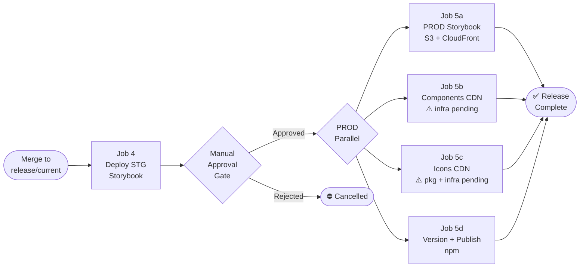

# Release Process — Boreal DS

## Overview

Releases are managed with [release-it](https://github.com/release-it/release-it) + [@release-it/conventional-changelog](https://github.com/release-it/conventional-changelog). Versioning is driven automatically from conventional commit history — no manual changeset files required.

Each publishable package has its own `.release-it.json` config and is released independently. Releases **must run from the `release/current` branch** with a clean working directory.

The full CI/CD pipeline is described in two diagrams:

- [`.ai/diagrams/pxg-ci-diagram-v2.md`](../diagrams/pxg-ci-diagram-v2.md) — PR validation (Jobs 1–4)
- [`.ai/diagrams/pxg-cd-diagram-v2.md`](../diagrams/pxg-cd-diagram-v2.md) — Deployment and release (Jobs 4–5d)

`apps/boreal-docs` and `examples/react-testapp` are never published to npm.

---

## Release Phases

This project follows a two-phase release strategy tied to the npm org used:

| Phase | npm org | npm dist-tag | Version format | Audience |
|---|---|---|---|---|
| **Alpha** (current) | `@telesign` | `alpha` | `0.x.y-alpha.N` | Internal test client only |
| **Stable** (future) | `@proximus` | `latest` | `1.0.0+` | Production consumers |

---

## Phase 1 — Alpha Releases (`@telesign`)

### Why `@telesign` and why `alpha`

The `@proximus` npm organization does not yet exist and requires admin provisioning. In the interim, packages are published under `@telesign` — an org the current team has publish access to. The `alpha` dist-tag ensures these packages never land in the `latest` channel, so they cannot be accidentally installed by anyone not explicitly targeting the alpha.

### Package names (alpha phase)

| Package | npm name |
|---|---|
| Web Components | `@telesign/boreal-web-components` |
| React wrappers | `@telesign/boreal-react` |
| Vue wrappers | `@telesign/boreal-vue` |
| Design tokens | `@telesign/boreal-style-guidelines` |

### How alpha consumers install packages

Consumers must explicitly opt into the `alpha` dist-tag:

```bash
npm install @telesign/boreal-web-components@alpha
npm install @telesign/boreal-react@alpha
npm install @telesign/boreal-vue@alpha
npm install @telesign/boreal-style-guidelines@alpha
```

Or pin to a specific alpha version:

```bash
npm install @telesign/boreal-web-components@0.1.0-alpha.3
```

A plain `npm install @telesign/boreal-web-components` (without `@alpha`) will fail to find a version because `latest` is never set during the alpha phase. This is intentional — it prevents unintended consumption.

### Alpha version progression

release-it + conventional-changelog determines the semver bump from commit types since the last tag. In pre-release mode (`--preRelease=alpha`), the bump always appends the pre-release identifier:

| Commit type | Previous version | Next version |
|---|---|---|
| `fix` or `chore` | `0.0.1-alpha.0` | `0.0.1-alpha.1` |
| `feat` | `0.0.1-alpha.3` | `0.1.0-alpha.0` |
| `feat!` or `BREAKING CHANGE` | `0.1.0-alpha.1` | `1.0.0-alpha.0` |

The pre-release counter resets to `.0` whenever the base semver component bumps. The base component (`0.0.x`, `0.x.0`, `x.0.0`) is always driven by the highest commit type in the log since the last tag.

### Running an alpha release

All releases must run from the `release/current` branch with a clean working directory.

```bash
git checkout release/current && git pull

# Release a single package
pnpm release:styles -- --preRelease=alpha   # @telesign/boreal-style-guidelines
pnpm release:wc    -- --preRelease=alpha   # @telesign/boreal-web-components
pnpm release:react -- --preRelease=alpha   # @telesign/boreal-react
pnpm release:vue   -- --preRelease=alpha   # @telesign/boreal-vue

# Release all packages in dependency order
pnpm release:all -- --preRelease=alpha
```

> **Flag forwarding caveat (pre-CI implementation):** `release:all` is a shell chain of sub-scripts (`release:styles && release:wc && ...`). Until each sub-script is updated to append `--` to its own `pnpm --filter ... run release` call, the `--preRelease=alpha` flag is **not automatically forwarded** to the individual package releases. Run per-package commands individually when flags must be guaranteed to propagate. This will be fixed when implementing the CI/CD pipeline — see `.ai/qa/INTEGRATED_MONOREPO_MIGRATION_V9.md`, CI/CD Alignment gap #2.

### Dry-run before every real release

Always preview before writing:

```bash
pnpm --filter @telesign/boreal-web-components run release -- --dry-run --preRelease=alpha
```

Pass criteria:
- Build runs cleanly
- CEM breaking-change report prints (Phase 2 feature)
- Changelog preview shows only commits since the last alpha tag
- No git commit, tag, or npm publish actually occurs

### What release-it does on a real alpha run

1. Runs `before:init` hook → `turbo run build --filter=<package>` (+ CEM check for web-components)
2. Reads git log since last tag, parses conventional commits
3. Determines semver bump (patch / minor / major) and appends `-alpha.N`
4. Bumps `package.json` version
5. Prepends generated changelog entries to `CHANGELOG.md`
6. Creates a git commit: `chore(release): * release @telesign/<package> v<version>`
7. Creates a git tag: `@telesign/<package>@<version>`
8. Publishes to npm with `--tag alpha`
9. Pushes commit and tag to `origin`

### Internal dependency ordering

`@telesign/boreal-react` and `@telesign/boreal-vue` both depend on `@telesign/boreal-web-components` via `workspace:*`. pnpm substitutes the actual published version at pack time. Release order must always be:

```
style-guidelines → web-components → validate:pack → react → vue
```

`pnpm release:all` enforces this order automatically. The `validate:pack` gate sits between `web-components` and the wrapper packages — it packs the real `web-components` `.tgz` artifact, installs it into `react-testapp` (replacing the workspace symlink), and runs `pnpm build`. If it fails, the chain stops and `react`/`vue` are not published.

---

## Phase 2 — Graduating to Stable (`@proximus`)

### Prerequisites before graduation

- [ ] `@proximus` npm organization created and team has publish access
- [ ] npm publish token for `@proximus` scope available for CI/CD
- [ ] All alpha testing feedback addressed
- [ ] Decision made on the first stable version number (typically `1.0.0`)

### Step 1 — Rename the npm scope in the codebase

Perform a global rename from `@telesign` → `@proximus` across all files. The affected files are the same set as the previous `@boreal-ds` → `@telesign` rename:

- All 4 `package.json` `name` fields
- All 4 `.release-it.json` files (tagName, tagAnnotation, commitMessage, hooks)
- Root `package.json` release scripts (`--filter` references)
- Internal workspace deps in `boreal-react/package.json` and `boreal-vue/package.json`
- `.lintstagedrc.js`, `.husky/pre-push`
- Stencil output targets (`stencilPackageName`, `componentCorePackage`)
- `examples/react-testapp` package.json and imports
- README files and Storybook docs

Run `pnpm install` after the rename to regenerate `pnpm-lock.yaml`.

### Step 2 — Remove the `alpha` dist-tag from all `.release-it.json` configs

In each of the 4 `.release-it.json` files, remove the `"tag": "alpha"` line from the `npm` section:

```json
"npm": {
  "publish": true,
  "publishPath": "."
}
```

Without `"tag"`, release-it publishes to the `latest` dist-tag — the npm default. This is the correct behavior for stable releases.

### Step 3 — Create git tag anchors for the migration point

release-it generates changelogs by walking git log between the previous tag and HEAD. The old tags are named `@telesign/<package>@x.y.z-alpha.N`. When release-it runs for `@proximus`, it will not find those old tags as anchors and will generate a changelog containing all commits since the beginning of the repository.

Fix this by creating a manual git tag with the new `@proximus` prefix at the exact commit where the last `@telesign` alpha was released:

```bash
# Find the commit SHA of the last @telesign alpha release for each package
git log --oneline | grep "release @telesign/boreal-web-components"

# Create anchor tags pointing to those commits
git tag @proximus/boreal-web-components@1.0.0 <sha>
git tag @proximus/boreal-react@1.0.0 <sha>
git tag @proximus/boreal-vue@1.0.0 <sha>
git tag @proximus/boreal-style-guidelines@1.0.0 <sha>

# Push the anchor tags
git push origin --tags
```

These anchor tags tell release-it where to start the changelog for the first `@proximus` release. After the anchor tags are pushed, the first `@proximus` release will only include commits made after the migration point.

### Step 4 — Run the first stable release

```bash
git checkout release/current && git pull

# Release all packages — no --preRelease flag for stable
pnpm release:all
```

release-it will:
- Detect the anchor tags created in Step 3
- Generate a changelog with only post-migration commits
- Publish to npm under `@proximus/*` with the `latest` dist-tag
- Create git tags: `@proximus/<package>@1.0.0`

### Step 5 — Deprecate the `@telesign` alpha packages on npm

Inform any alpha consumers that the packages have moved:

```bash
npm deprecate @telesign/boreal-web-components "Moved to @proximus/boreal-web-components. Please update your dependencies."
npm deprecate @telesign/boreal-react "Moved to @proximus/boreal-react. Please update your dependencies."
npm deprecate @telesign/boreal-vue "Moved to @proximus/boreal-vue. Please update your dependencies."
npm deprecate @telesign/boreal-style-guidelines "Moved to @proximus/boreal-style-guidelines. Please update your dependencies."
```

Deprecated packages remain installable but show a warning on `npm install`. They are not unpublished.

### Step 6 — Consumer migration instructions

Alpha consumers (the internal test client) update their `package.json`:

```diff
- "@telesign/boreal-web-components": "^0.1.0-alpha.3"
+ "@proximus/boreal-web-components": "^1.0.0"

- "@telesign/boreal-react": "^0.1.0-alpha.3"
+ "@proximus/boreal-react": "^1.0.0"
```

Then run `pnpm install` (or `npm install`). The old `@telesign` packages can be removed from `node_modules` manually or via `pnpm prune`.

---

## CI/CD Integration (Target State)

### Pipeline overview



### Job 5d in detail — release-it step

```groovy
stage('Release Packages') {
  environment {
    NPM_TOKEN = credentials('npm-publish-token')
  }
  steps {
    sh 'echo "//registry.npmjs.org/:_authToken=${NPM_TOKEN}" >> ~/.npmrc'
    sh 'fnm use'
    sh 'pnpm release:all -- --preRelease=alpha --ci'
  }
}
```

> `--ci` disables interactive prompts. `--preRelease=alpha` is removed when graduating to stable. The `npm-publish-token` Jenkins credential must have publish rights for the active org (`@telesign` during alpha, `@proximus` at stable).

### PR validation — conventional commit enforcement

Conventional commit format is enforced at commit time via commitlint + Husky. No separate CI check is required for changeset files (Changesets has been removed). The commit history itself is the source of truth for versioning.

---

## ⚠️ What's Missing for CI/CD Integration

### Jenkins jobs (none implemented yet)

| Job | Trigger | Purpose |
|---|---|---|
| PR validation (Jobs 1–4) | PR opened/updated | Code quality, tests, build, Storybook |
| CD pipeline (Jobs 4–5d) | Merge to `release/current` | STG deploy → approval → PROD deploy + npm publish |

### Credentials (Jenkins secrets)

| Secret ID | Used in | Purpose |
|---|---|---|
| `npm-publish-token` | Job 5d | npm token with publish rights for active org scope |
| `BITBUCKET_TOKEN` | All jobs | Bitbucket API access for status reporting |
| `AWS_STG_ROLE` | Job 4 | IAM role for STG S3/CloudFront |
| `AWS_PROD_ROLE` | Jobs 5a–5c | IAM role for PROD S3/CloudFront |

### AWS infrastructure (not provisioned)

- S3 buckets: `pxg-storybook-stg`, `pxg-storybook-prod`, `pxg-components-prod`, `pxg-icons-prod`
- CloudFront distributions for each bucket
- IAM roles: `stg-deploy`, `prod-deploy`

### Package and build gaps

| Gap | Notes |
|---|---|
| Icons package | `packages/boreal-icons` does not exist. Job 5c cannot run until created |
| CDN/UMD build | Job 5b expects a UMD bundle. Stencil produces ESM/CJS for npm but not a CDN-ready UMD. Needs a dedicated build target |
| SBOM tooling | `@cyclonedx/cyclonedx-npm` not installed. Add: `pnpm add -D -w @cyclonedx/cyclonedx-npm` |
| `fnm` on agents | Jenkins agents must have `fnm` installed and configured to respect `.node-version` |

---

## Release Manager Checklist

### Alpha release (current)

- [ ] On `release/current` branch with clean working directory
- [ ] Run dry-run and review changelog preview and version bump
- [ ] Confirm CEM breaking-change report (web-components only)
- [ ] Run `pnpm release:all -- --preRelease=alpha` (or per-package command)
- [ ] Verify packages appear on npm under `@telesign/*` with `alpha` dist-tag
- [ ] Notify internal test client of new alpha version

### Graduation to stable (`@proximus`)

- [ ] `@proximus` npm org created and publish token available
- [ ] Scope rename completed across codebase (`@telesign` → `@proximus`)
- [ ] `"tag": "alpha"` removed from all 4 `.release-it.json` files
- [ ] Git anchor tags created for each package at the migration point
- [ ] Anchor tags pushed to `origin`
- [ ] Dry-run passes for all 4 packages (no `--preRelease` flag)
- [ ] Run `pnpm release:all` — first stable `1.0.0` published to `latest`
- [ ] `npm deprecate @telesign/*` messages sent for all 4 packages
- [ ] Internal test client updated to `@proximus/*` dependencies
- [ ] Jenkins `npm-publish-token` credential updated to `@proximus` scope token
