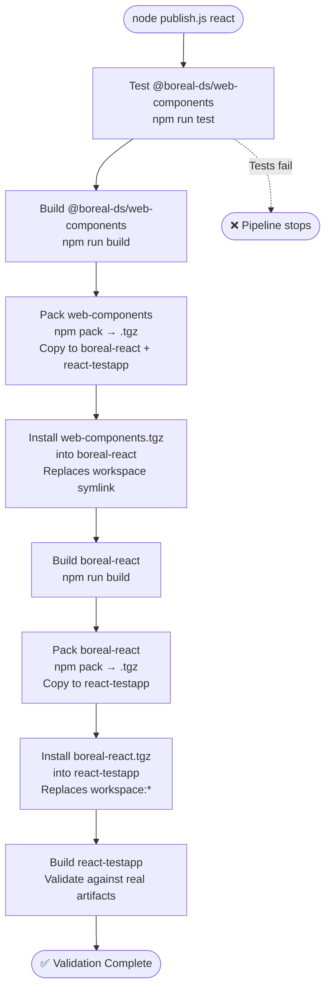
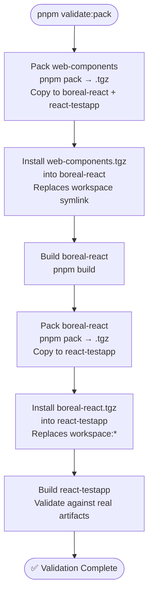

# scripts-boreal — Local Pack Validation Tool

## Purpose

`scripts-boreal` is a pre-release validation tool that addresses the core concern documented in [`.ai/research/adr_monorepo_orchestration_tool_decision.md`](../research/adr_monorepo_orchestration_tool_decision.md): ensuring consumers are validated against **real packed artifacts**, not workspace symlinks.

During normal development, `workspace:*` in `package.json` resolves to a local symlink — changes are immediate but the dependency boundary is invisible. `scripts-boreal` breaks that boundary deliberately: it packs each package into a `.tgz`, installs it into the consumer as a real artifact, and validates the result. This is the same artifact shape that would reach npm.

Reference: [`.ai/research/monorepo_orchestration_tool_transcript_takeaways.md`](../research/monorepo_orchestration_tool_transcript_takeaways.md) → "The key gap is validating the actual package that gets published. Local symlinks can mask issues with `exports`, missing files, or incorrect `publishConfig` paths. A tool that tests against real packed artifacts would catch these before they reach npm."

---

## What it does

**Current state (pre-migration)** — test and build are redundant once Turborepo is in place:



**After migration** — test and build steps removed; Turborepo handles them in CI before Job 5d runs:



The key transition is steps E and H — the workspace symlinks are replaced with real tarballs. If a package field is missing from `exports`, a file is excluded from `files`, or a `publishConfig` path is wrong, it will fail here rather than in production.

---

## Location in the monorepo

Source merged to `release/current` via `chore/create-local-pack`. Migration tasks applied on branch `feature/EOA-10230_implement_deployment_publishing_DG`.

```
scripts-boreal/
├── bin/
│   ├── boreal-pack.js     # CLI entry point
│   └── publish.js         # Main pipeline orchestrator
├── lib/
│   ├── cmd.js             # Shell command runner (execa)
│   ├── conf.js            # Package paths and names config
│   ├── install.js         # pack/uninstall/install helpers
│   ├── logger.js          # Chalk-based logger
│   └── __tests__/         # Vitest unit tests
├── package.json
└── vitest.config.ts
```

### Available scripts (post-migration)

```bash
pnpm validate:pack                              # CI gate: pack → install → build react-testapp
node scripts-boreal/bin/publish.js react        # Local dev: pack → install → run dev
node scripts-boreal/bin/publish.js react --ci  # Same as validate:pack, explicit
```

---

## Turborepo vs scripts-boreal — responsibility split

| Concern                                      | Turborepo                    | scripts-boreal              |
| -------------------------------------------- | ---------------------------- | --------------------------- |
| Build in dependency order                    | ✅ `"dependsOn": ["^build"]` | ❌ redundant                |
| Cache unchanged packages                     | ✅ content-addressed cache   | ❌ not applicable           |
| Run tests across packages                    | ✅ `pnpm test`               | ❌ redundant                |
| Pack → install as real artifact              | ❌ always uses symlinks      | ✅ only tool that does this |
| Validate `exports`, `files`, `publishConfig` | ❌                           | ✅                          |
| Reproduce consumer-side bugs                 | ❌                           | ✅                          |

Turborepo replaces the build orchestration entirely. `scripts-boreal` is only needed for the pack → install → validate boundary, which Turborepo by design does not cross.

---

## Where it fits in the CI/CD pipeline

`scripts-boreal` (headless — without `npm run dev`) should run as a **pre-publish gate in Job 5d** of the CD pipeline, before `pnpm release` pushes anything to npm.

See [`.ai/diagrams/pxg-cd-diagram-v2.md`](../diagrams/pxg-cd-diagram-v2.md) → Job 5d.

```
Job 5d sequence:
  1. pnpm version-packages
  2. git commit version bump
  3. scripts-boreal validate (pack → install → build react-testapp)  ← pre-publish gate
  4. Generate SBOM
  5. pnpm release  (build + changeset publish)
  6. git push --follow-tags
```

If step 3 fails, the publish is aborted — broken artifacts never reach the registry.

---

## ✅ Migration Tasks (completed)

### `bin/publish.js`

**Delete `testWebComponents()` and its call.**
Turborepo runs `pnpm test` in CI Job 1 before Job 5d. Running tests again inside scripts-boreal is redundant.

```js
// DELETE this function entirely:
const testWebComponents = async () => { ... };

// DELETE this call block from the IIFE:
try {
  await testWebComponents();
  ...
} catch (error) { ... }
```

**Delete `buildWebComponent()` and its call.**
Turborepo runs `pnpm build` in CI Job 2 in dependency order. The build is already complete by the time scripts-boreal runs.

```js
// DELETE:
const buildWebComponent = async () => { ... };

// DELETE from the IIFE:
await buildWebComponent();
```

**Remove `ensureNodeModules` import** — the function is deleted from `install.js` (see below).

```js
// DELETE from import line:
import { ensureNodeModules, installPack } from "../lib/install.js";
// REPLACE with:
import { installPack } from "../lib/install.js";
```

**Replace `npm run build` with `pnpm build`** in `buildWrapper()`.

```js
// BEFORE:
await run("npm", ["run", "build"], CONFIG[framework].wrapperRoute);
// AFTER:
await run("pnpm", ["build"], CONFIG[framework].wrapperRoute);
```

**Add `--ci` flag and replace `npm run dev` with conditional end state** in `installWrapperApp()`.

```js
// ADD at the top of the IIFE:
const isCi = process.argv.includes("--ci");

// CHANGE the function signature:
const installWrapperApp = async (tgzNameWrapper, framework, isCi) => {
  await installPack(
    CONFIG[framework].app,
    tgzNameWrapper,
    CONFIG[framework].wrapperName,
  );
  Logger.log("success", "Installed wrapper in app");

  if (isCi) {
    Logger.log("info", "Running build validation...");
    await run("pnpm", ["build"], CONFIG[framework].app);
    Logger.log(
      "success",
      "Pipeline completed successfully — artifact validation passed",
    );
  } else {
    Logger.log(
      "success",
      "Pipeline completed successfully — starting demo app...",
    );
    await run("pnpm", ["dev"], CONFIG[framework].app);
  }
};

// PASS isCi when calling:
await installWrapperApp(tgzNameWrapper, framework, isCi);
```

**Remove the `environment` argument** (`process.argv[3]`) — superseded by `--ci` flag.

```js
// DELETE:
const environment = process.argv[3] || "dev";
```

---

### `lib/install.js`

**Delete `hasNodeModules()` and `ensureNodeModules()`** — pnpm workspace root install handles all packages.

```js
// DELETE both exports:
export const hasNodeModules = cwd => ...
export const ensureNodeModules = async cwd => { ... }
```

**Simplify `installPack()`** — remove the `hasNodeModules` guard, replace `npm uninstall` and `npm install`.

```js
// BEFORE:
export const installPack = async (cwd, pack, uninstallName) => {
  if (!hasNodeModules(cwd)) {
    await ensureNodeModules(cwd);
  } else if (uninstallName) {
    await Cmd.run("npm", ["uninstall", uninstallName], cwd);
  }
  await Cmd.run("npm", ["install", pack], cwd);
};

// AFTER:
export const installPack = async (cwd, pack, uninstallName) => {
  if (uninstallName) {
    Logger.log("info", `Removing ${uninstallName}...`);
    await Cmd.run("pnpm", ["remove", uninstallName], cwd);
  }
  Logger.log("info", `Installing ${pack}...`);
  await Cmd.run("pnpm", ["add", pack], cwd);
};
```

---

### `lib/cmd.js`

**Replace `npm pack` with `pnpm pack`** in `tgzName()`.

```js
// BEFORE:
const { stdout } = await execa("npm", ["pack", "--silent"], { cwd: sourceDir });
// AFTER:
const { stdout } = await execa("pnpm", ["pack", "--silent"], {
  cwd: sourceDir,
});
```

---

### `lib/conf.js` — no changes needed

### `lib/logger.js` — no changes needed

### `lib/__tests__/`

**`install.spec.js`** — delete the `hasModules` and `ensureNodeModules` describe blocks entirely (functions are removed). Rewrite the `tgzName` describe to assert `pnpm remove` + `pnpm add` instead of `npm uninstall` + `npm install`. Remove the `existsSyncSpy` setup since `hasNodeModules` is gone.

**`cmd.spec.js`** — in the `tgzName` describe, update the assertion on line 65 from `['npm', 'pack', '--silent']` to `['pnpm', 'pack', '--silent']`.

---

### `pnpm-workspace.yaml`

Add `scripts-boreal` as a workspace member, then run `pnpm install` from the root:

```yaml
packages:
  - "packages/*"
  - "apps/*"
  - "examples/*"
  - "scripts-boreal"
```

---

### Root `package.json` — add script alias

```json
"validate:pack": "node scripts-boreal/bin/publish.js react --ci"
```

Jenkins invokes `pnpm validate:pack` in Job 5d as the pre-publish gate.

---

### Missing example apps (`conf.js`)

`conf.js` references paths that don't exist yet:

| Framework | Path in `conf.js`        | Status            |
| --------- | ------------------------ | ----------------- |
| react     | `examples/react-testapp` | ✅ exists         |
| vue       | `examples/app-vue-vite`  | ❌ does not exist |
| angular   | `examples/app-angular`   | ❌ does not exist |

Only the `react` pipeline can run until the Vue and Angular apps are created. No code change needed — the script fails gracefully when the app path is missing.

---

## Current state summary

| Item                                          | Status                                           |
| --------------------------------------------- | ------------------------------------------------ |
| Core pipeline logic                           | ✅ migrated — `npm` → `pnpm` throughout          |
| `testWebComponents()` / `buildWebComponent()` | ✅ deleted                                        |
| `ensureNodeModules` / `hasNodeModules`        | ✅ deleted from `install.js` and `publish.js`     |
| `--ci` flag                                   | ✅ implemented — conditional build vs dev end state |
| `environment` arg (`process.argv[3]`)         | ✅ removed                                        |
| Unit tests (Vitest)                           | ✅ 27/27 passing — assertions updated to `pnpm`  |
| Workspace registration                        | ✅ added to `pnpm-workspace.yaml`                 |
| Root `validate:pack` script                   | ✅ added to root `package.json`                  |
| Vue + Angular example apps                    | ⚠️ paths in `conf.js` exist but apps are missing |
| Wired into Jenkins Job 5d                     | ❌ not yet                                        |

---

## 🔮 Future work — multi-framework validate scripts

When `examples/app-vue-vite` and `examples/app-angular` are created, add per-framework scripts to the root `package.json` following **Option A** (separate scripts + aggregate):

```json
"validate:pack:react":   "node scripts-boreal/bin/publish.js react --ci",
"validate:pack:vue":     "node scripts-boreal/bin/publish.js vue --ci",
"validate:pack:angular": "node scripts-boreal/bin/publish.js angular --ci",
"validate:pack":         "pnpm validate:pack:react && pnpm validate:pack:vue && pnpm validate:pack:angular"
```

No changes to `publish.js` or `conf.js` are needed — both already support all three frameworks. Jenkins Job 5d calls `pnpm validate:pack` and gets full coverage automatically.
