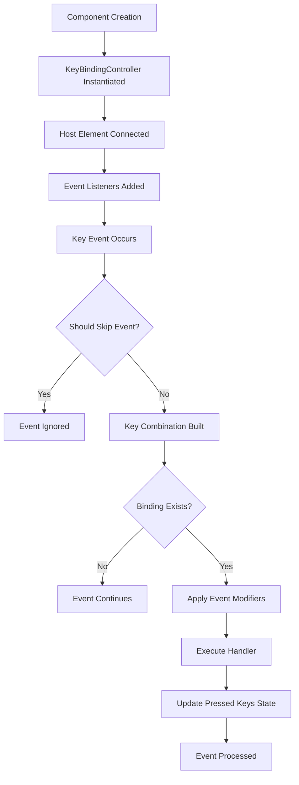
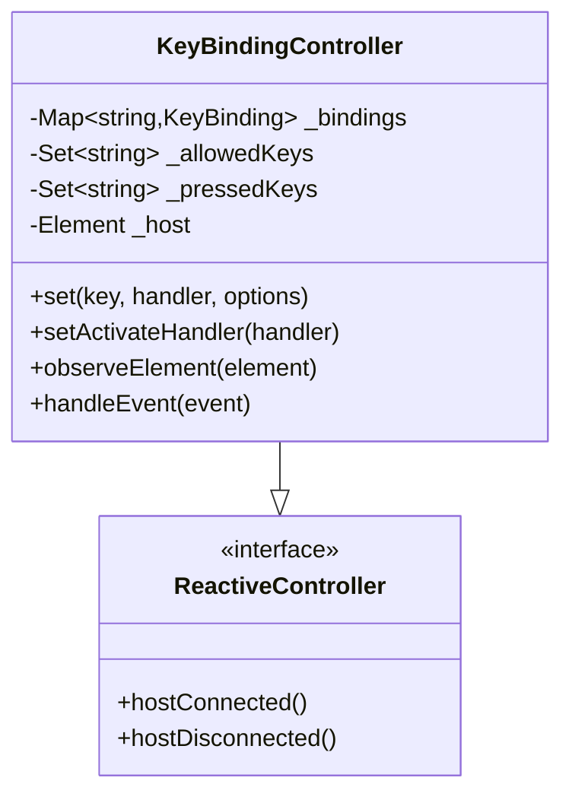
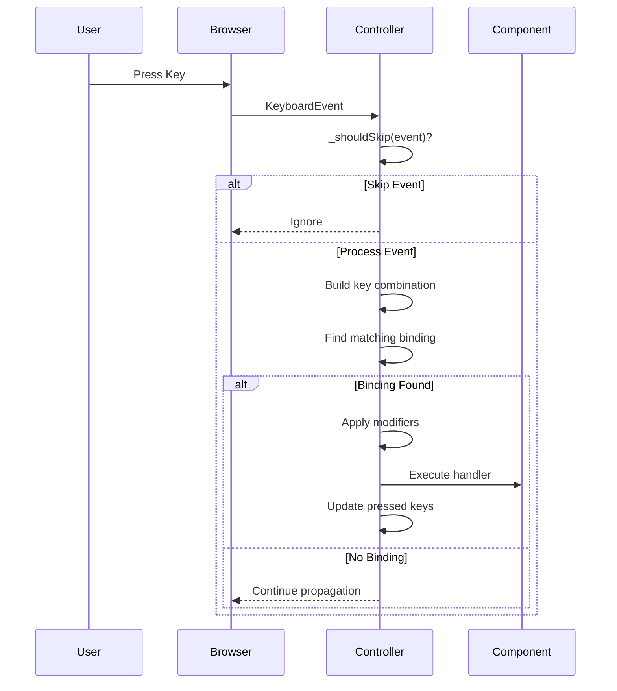
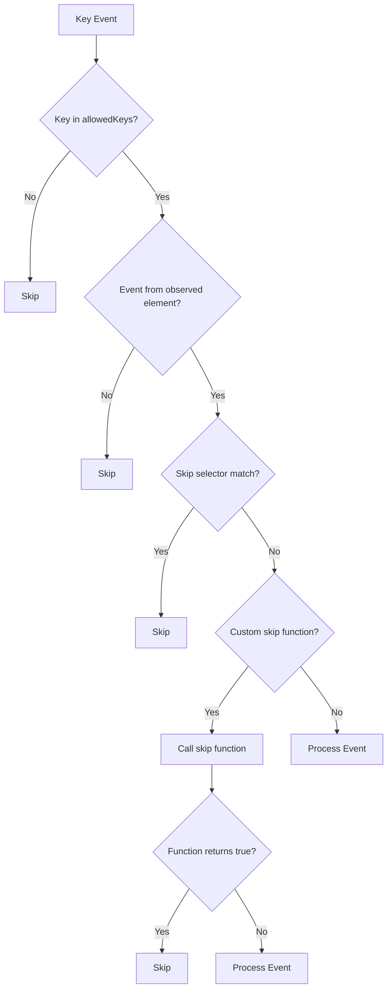
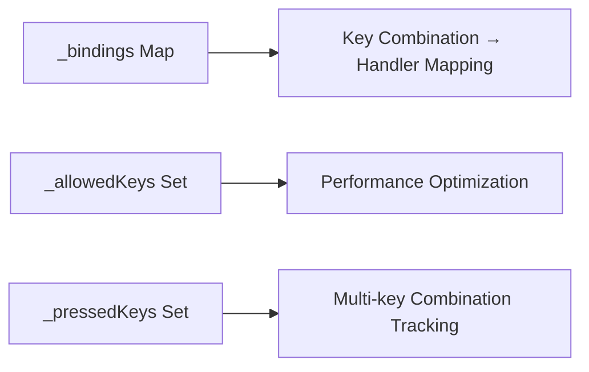
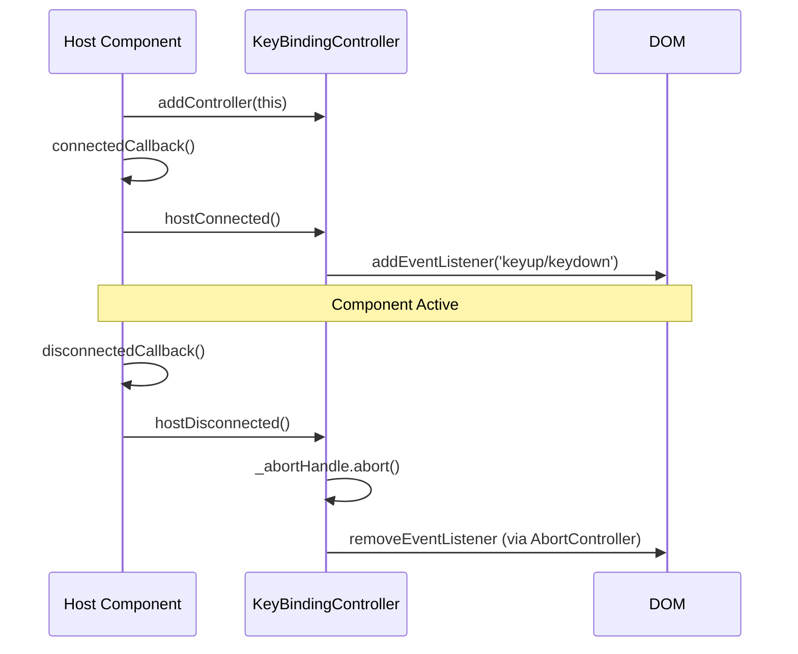

# Overall Flow


# Architecture and Design


# Key Processing Pipeline


# Event Filtering and Skip Logic


# State Management


# Lifecycicle Integration


# Chat details
odagora: #codebase how is keyboard navigation handled in this project?. Be thorough

GitHub Copilot: Based on the codebase analysis, keyboard navigation in this Ignite UI Web Components project is handled through a comprehensive and standardized approach. Here's a thorough breakdown:

## Core Architecture

### 1. Key Bindings Controller
The project uses a centralized `KeyBindingController` that implements the `ReactiveController` interface. This controller:

- Registers keyboard event listeners for `keyup` and `keydown` events
- Manages key combinations and modifiers (Shift, Alt, Ctrl)
- Provides built-in skip conditions to avoid handling events from input elements
- Supports event modifiers like `preventDefault` and `stopPropagation`

```typescript
// Key binding setup example
addKeybindings(this, { skip: () => this.hidden })
  .setActivateHandler(this.handleKeyboardEvent)
  .set('a', this.handleKeyboardEvent, { triggers: ['keydown'] })
  .set([shiftKey, 'c'], this.handleKeyboardEvent)
```

### 2. Predefined Key Constants
The project defines standard key constants in `key-bindings.ts`:
- `arrowUp`, `arrowDown`, `arrowLeft`, `arrowRight`
- `homeKey`, `endKey`, `pageUpKey`, `pageDownKey`
- `enterKey`, `spaceBar`
- Modifier keys: `shiftKey`, `altKey`, `ctrlKey`

## Component-Specific Implementations

### 1. Calendar Component
The `calendar` implements comprehensive keyboard navigation:

**Days View:**
- Arrow keys: Navigate between days
- `Home`/`End`: First/last day of month
- `PageUp`/`PageDown`: Previous/next month
- `Shift + PageUp/PageDown`: Previous/next year
- `Enter`/`Space`: Select date

**Months View:**
- Arrow keys: Navigate between months
- `Home`/`End`: First (January)/last (December) month
- `PageUp`/`PageDown`: Previous/next year
- Grid navigation with `MONTHS_PER_ROW` logic

**Years View:**
- Arrow keys: Navigate between years
- `Home`/`End`: First/last year in range
- `PageUp`/`PageDown`: Navigate by year pages (15 years)
- Grid navigation with `YEARS_PER_ROW` logic

### 2. Tree Component
The `IgcTreeNavigationService` handles tree-specific navigation:

```typescript
private handleNavigation(event: KeyboardEvent) {
  switch (event.key.toLowerCase()) {
    case 'home': // Focus first item
    case 'end': // Focus last item
    case 'arrowleft': // Collapse or move to parent
    case 'arrowright': // Expand or move to child
    case 'arrowup'/'arrowdown': // Move between siblings
    case '*': // Expand all
    case ' ': // Toggle selection
  }
}
```

The service also handles RTL (right-to-left) text direction by swapping left/right arrow behavior.

### 3. Stepper Component
The `stepper` supports:
- Arrow keys for navigation (orientation-aware)
- `Home`/`End`: First/last step
- `Enter`: Activate step
- RTL support with reversed arrow key behavior
- Vertical vs horizontal orientation handling

### 4. Combo Component
The `NavigationController` manages different contexts:
- **Main Input**: Handles dropdown opening/closing
- **Search Input**: Manages filtering and selection
- **List**: Item navigation and selection

### 5. Slider Component
The `slider` implements:
- Arrow keys: Small increments
- Page keys: Larger increments (10% of range)
- Thumb label display during navigation

## Key Features

### 1. Accessibility Support
- Full keyboard navigation compliance
- Proper focus management
- Screen reader compatibility
- ARIA attribute handling

### 2. Internationalization
- RTL (right-to-left) text direction support
- Locale-aware navigation patterns
- Direction-sensitive arrow key behavior

### 3. Event Handling Patterns
```typescript
// Standard event handling pattern
public navigateList(event: KeyboardEvent, container: IgcComboListComponent) {
  event.stopPropagation();
  if (this.listHandlers.has(event.key)) {
    event.preventDefault();
    this.listHandlers.get(event.key)!.call(this, container);
  }
}
```

### 4. Skip Conditions
The framework provides flexible skip conditions:
- Skip input elements by default
- Custom skip functions
- Element selector-based skipping
- Component state-based skipping

### 5. Modifier Key Support
- Key combinations (Shift + key, Alt + key, etc.)
- Multiple modifier support
- Context-sensitive behavior

## Testing Infrastructure

The project includes comprehensive keyboard navigation testing:
- `simulateKeyboard` utility for test keyboard events
- Extensive test suites for each component
- Accessibility testing integration
- Cross-browser compatibility testing

## Design Principles

1. **Consistency**: Standardized key bindings across components
2. **Accessibility**: WCAG compliance for keyboard navigation
3. **Flexibility**: Configurable behavior per component needs
4. **Performance**: Event delegation and efficient handling
5. **Maintainability**: Centralized controller with component-specific extensions

This architecture ensures that keyboard navigation is robust, accessible, and consistent across all components in the Ignite UI Web Components library.

Similar code found with 1 license type

odagora: Great, and how it's used within components? Give me the overall flow and a detailed explanation of the #file:key-bindings.ts controller. Consider using mermaid diagrams to illustrate the general flow

GitHub Copilot: Based on the key-bindings.ts file and the codebase analysis, here's a comprehensive explanation of how keyboard navigation is handled:

## Overall Flow


## Detailed KeyBindingController Explanation

### 1. **Architecture & Design**

The `KeyBindingController` implements the Lit `ReactiveController` interface, making it a lifecycle-aware component that integrates seamlessly with Lit web components.


### 2. **Key Processing Pipeline**


### 3. **Key Combination Building**

The controller builds key combinations by:

1. **Normalizing Keys**: Converting to lowercase
2. **Separating Modifiers**: Identifying Alt, Ctrl, Meta, Shift keys
3. **Creating Combinations**: Sorting and joining keys with '+'

```typescript
// Example combinations:
// Single key: "enter"
// With modifier: "shift+arrowdown"
// Multiple modifiers: "ctrl+shift+a"
```

### 4. **Event Filtering & Skip Logic**


**Default Skip Targets**: `['input', 'textarea', 'select']`

### 5. **Component Usage Pattern**

Here's how components typically use the controller:

````typescript
// Component implementation example
class MyComponent extends LitElement {
  private keyController = addKeybindings(this, {
    skip: (node) => node.hasAttribute('disabled')
  });

  connectedCallback() {
    super.connectedCallback();

    // Basic key bindings
    this.keyController
      .set('ArrowUp', this.handleArrowUp.bind(this))
      .set('ArrowDown', this.handleArrowDown.bind(this))
      .set(['Shift', 'Tab'], this.handleShiftTab.bind(this), {
        preventDefault: true
      })
      .setActivateHandler(this.handleActivate.bind(this));
  }

  private handleArrowUp(event: KeyboardEvent) {
    // Navigation logic
  }
}
````

### 6. **Key Features Deep Dive**

#### **Modifier Key Support**
```typescript
// Single modifier
this.keyController.set([shiftKey, 'ArrowDown'], handler);

// Multiple modifiers
this.keyController.set([ctrlKey, shiftKey, 'A'], handler);
```

#### **Trigger Types**
- `keydown`: Standard key press (default)
- `keyup`: Key release
- `keydownRepeat`: Key press that resets pressed state immediately

#### **Event Modifiers**
```typescript
this.keyController.set('Escape', handler, {
  preventDefault: true,    // Prevents default browser behavior
  stopPropagation: true,   // Stops event bubbling
  triggers: ['keyup']      // Only trigger on key release
});
```

#### **Element Observation**
```typescript
// Observe keyboard events on external element
const cleanup = this.keyController.observeElement(externalElement);

// Later cleanup
cleanup.unsubscribe();
```

### 7. **State Management**

The controller maintains three key data structures:


- **`_bindings`**: Maps key combinations to handlers and options
- **`_allowedKeys`**: Optimizes by only processing registered keys
- **`_pressedKeys`**: Tracks currently pressed keys for combinations

### 8. **Lifecycle Integration**


### 9. **Error Handling & Edge Cases**

The controller handles:
- **Invalid key combinations**: Silently ignored
- **Rapid key presses**: State cleanup on keyup
- **Element removal**: Automatic cleanup via AbortController
- **Focus changes**: Event path validation
- **Modifier-only presses**: No action taken

### 10. **Performance Optimizations**

1. **Early Exit**: Skip processing for unregistered keys
2. **Event Delegation**: Single listener per component
3. **Set Operations**: Fast key lookup and combination building
4. **AbortController**: Efficient cleanup without manual tracking

This architecture provides a robust, flexible, and performant foundation for keyboard navigation across all Ignite UI Web Components while maintaining consistency and accessibility standards.
