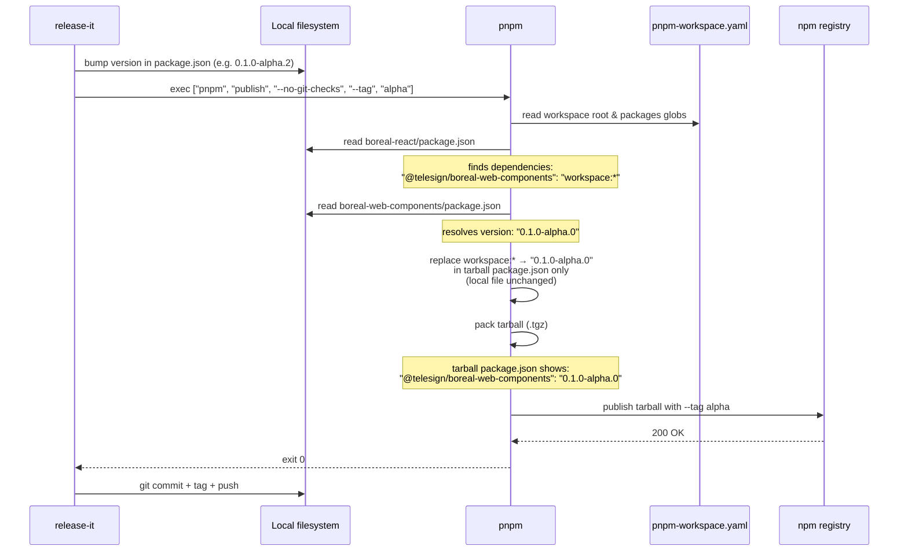

# release-it + pnpm publish — Mechanics and Gotchas

Source: First alpha release session (2026-03-10). release-it version: `19.2.4`.

---

## Critical: `publishCommand` is not a valid release-it option

Adding `"publishCommand": "pnpm publish --no-git-checks"` to a `.release-it.json` file is **silently ignored**. The field does not exist in release-it's npm plugin. When the field is present, release-it falls back to `npm publish`, bypassing pnpm entirely.

The source of this behavior in `node_modules/release-it/lib/plugin/npm/npm.js`:

```js
const publishPackageManager = this.options.publishPackageManager || 'npm';
return this.exec([publishPackageManager, 'publish', ...args], { ... });
```

The only supported field for overriding the publish executable is `publishPackageManager`.

---

## Correct release-it npm block for pnpm publish

```json
"npm": {
  "publish": true,
  "publishPath": ".",
  "tag": "alpha",
  "publishPackageManager": "pnpm",
  "publishArgs": ["--no-git-checks"]
}
```

| Field | Purpose |
|---|---|
| `publishPackageManager` | Swaps the publish executable (default: `npm`). Setting `"pnpm"` triggers workspace protocol replacement. |
| `publishArgs` | Extra flags appended to the publish command. `--no-git-checks` is pnpm-specific. |
| `tag` | npm dist-tag (equivalent to `--tag alpha`). |

When `publishPackageManager` is not `npm`, release-it automatically omits the `--workspaces=false` flag it would otherwise append for npm.

---

## pnpm workspace protocol replacement

`workspace:*` in `dependencies` is resolved by pnpm **at tarball creation time only**. The `package.json` on disk is never modified. The tarball's `package.json` receives the resolved version string.

| Protocol in `package.json` | Published as (if referenced package is at `0.1.0-alpha.0`) |
|---|---|
| `workspace:*` | `0.1.0-alpha.0` (exact pin) |
| `workspace:^` | `^0.1.0-alpha.0` (caret range) |
| `workspace:~` | `~0.1.0-alpha.0` (tilde range) |

Workspace replacement only occurs when pnpm is the publish executor. If `npm publish` runs instead (e.g. because `publishCommand` was used or `publishPackageManager` was omitted), the raw `workspace:*` string leaks into the published tarball and the registry rejects it with a 400 error.

---

## `workspace:*` (exact pin) is correct for alpha phase

`workspace:^` (caret range) mirrors the Beeq reference project pattern, but caret ranges only make sense once semver guarantees are in force. During alpha:

- Exact pin ensures consumers receive the specific tested combination of packages.
- A caret range over pre-release versions has unintuitive scoping: `^0.1.0-alpha.0` covers `0.1.0-alpha.1` and `0.1.0-alpha.2` but not `0.2.0-alpha.0` (semver excludes cross-tuple pre-releases from range resolution).

Use `workspace:^` only when the package reaches a stable release baseline.

---

## Why `dependencies` (not `peerDependencies`) for internal packages

Placing `@telesign/boreal-web-components` in `peerDependencies` of `@telesign/boreal-react` shifts the installation burden to the consumer. They must install the peer explicitly. The correct pattern keeps it in `dependencies` so pnpm includes it automatically when the consumer installs `@telesign/boreal-react`.

The `peerDependencies` approach was explored as a workaround for the `workspace:*` leak, but the root fix was ensuring pnpm executes the publish step (via `publishPackageManager: "pnpm"`).

---

## Full publish flow — sequence diagram



---

## Affected files

| File | Change made in this session |
|---|---|
| `packages/boreal-react/.release-it.json` | Replaced invalid `publishCommand` with `publishPackageManager: "pnpm"` and `publishArgs: ["--no-git-checks"]` |
| `packages/boreal-vue/.release-it.json` | Same fix |
| `packages/boreal-react/package.json` | Kept `@telesign/boreal-web-components: "workspace:*"` in `dependencies` (not `peerDependencies`) |

---

## Beeq reference pattern (for context)

`@beeq/react` places `@beeq/core: "^1.9.0"` in `dependencies`, not `peerDependencies`. Beeq uses Nx (not pnpm workspaces), so no `workspace:*` protocol is involved. The Boreal DS equivalent achieves the same auto-install behaviour via `workspace:*` in `dependencies` combined with `publishPackageManager: "pnpm"`.
