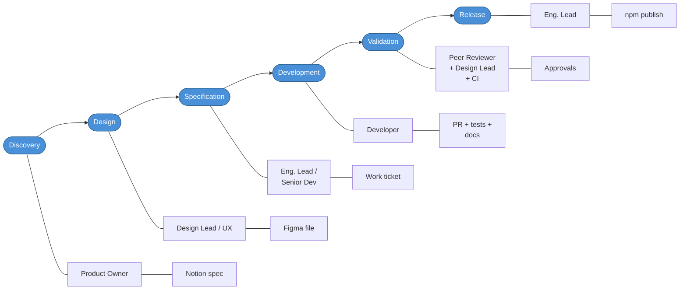

# End-to-End Workflow — Boreal DS

This document describes the standard lifecycle of a change in the Boreal DS monorepo, from the moment a request is initiated to the point where the code is successfully running in production (published to npm). It applies to new components, component changes, design token updates, tooling changes, and documentation updates.

---

## 1. Definition of Done

A change is considered **production-ready** when every item in this checklist is satisfied. No change may be merged to `release/current` until all applicable criteria are met.

### 📋 Pre-Development

- [ ] Figma design received, reviewed, and approved by UX/UI team
  - [ ] All component states covered (default, hover, focus, active, disabled, error)
  - [ ] All slots represented in each state combination
  - [ ] Designs cover all four brand themes (Proximus, Masiv, Telesign, BICS)
- [ ] Component classified (Atom / Molecule / Organism)
- [ ] Public API defined: props, events, slots, CSS parts
- [ ] Work tickets created and groomed with Acceptance Criteria and Dev Notes
- [ ] File structure planned following naming conventions (`bds-[name]`)

### 🔧 Development

- [ ] Component extends the most appropriate base layer (see [code practices](../../.ai/guidelines/code-practices-&-dev-guidelines.md))
- [ ] All props typed explicitly in TypeScript; no `any`
- [ ] Design tokens used exclusively — no hard-coded colours, spacing, or radii
- [ ] ARIA roles, labels, and keyboard interactions implemented
- [ ] Events dispatched with `bubbles: true, composed: true`
- [ ] No ESLint or TypeScript errors (`pnpm turbo lint typecheck`)
- [ ] Conventional commit messages used throughout (`pnpm commit`)

### 🧪 Testing

- [ ] ≥ 90% unit test coverage (Jest via `pnpm test:spec`)
- [ ] Component verified in `react-testapp` and a Vue consumer
- [ ] All visual states tested in Chrome and Firefox/Safari
- [ ] Component matches Figma within 2 px tolerance
- [ ] Keyboard navigation verified (Tab, Enter, Escape, Arrow keys as applicable)
- [ ] Works correctly with all four brand themes
- [ ] No regressions in existing Storybook stories

### 📚 Documentation

- [ ] Storybook story file (`bds-[name].stories.ts`) generated via `pnpm generate:story` and complete
- [ ] MDX file (`bds-[name].mdx`) complete with all required sections
- [ ] JSDoc added to all exported props, events, and methods
- [ ] Breaking changes documented with a migration path (if applicable)

### 🔍 Review & Release

- [ ] Pull request peer-reviewed and approved (no open comments)
- [ ] UX/UI team sign-off on visual output
- [ ] Bundle size impact reviewed and acceptable
- [ ] `CHANGELOG.md` updated automatically by release-it (not manually)
- [ ] `release/current` branch is clean before running release scripts
- [ ] Dry-run executed and verified before the real release
- [ ] Packages published to npm with the correct dist-tag

---

## 2. Systematic Process

### Phase 1 — Discovery

**Goal**: Establish shared understanding of the problem and its scope before any design or code work begins.

1. A request arrives (bug report, feature request, consumer need, or design system initiative).
2. The Product Owner logs the request and verifies it fits the design system's scope and roadmap.
3. The Design Lead confirms whether design inputs are required or if an existing Figma component covers the need.
4. The Engineering Lead estimates size and flags architectural considerations.
5. A decision is made: proceed, defer, or reject.

**Exit criterion**: A clearly described initiative with agreed scope moves to the Design phase.

---

### Phase 2 — Design

**Goal**: Produce a Figma design that fully specifies the component across all states, variants, and brand themes.

1. UX/UI team creates or updates the Figma design.
2. Designers verify coverage: every state, every slot, every brand theme, every interactive combination.
3. Design is reviewed by the Engineering Lead for technical feasibility and token alignment.
4. Design is shared with the team and locked for implementation.

**Exit criterion**: Figma design approved by Engineering Lead and shared with the team.

---

### Phase 3 — Specification

**Goal**: Translate the design into a precise, implementable work ticket and a formal API definition.

1. The Engineering Lead or Senior Developer authors the work ticket (see §4 — Technical Work Ticket).
2. The ticket defines the full public API: props, events, slots, CSS parts, and accessibility requirements.
3. The ticket is groomed in a team session; Acceptance Criteria are refined until they are unambiguous and testable.
4. Dev Notes are added to accelerate the assigned developer.
5. The ticket is estimated and added to the sprint.

**Exit criterion**: Ticket groomed, estimated, and accepted by the team.

---

### Phase 4 — Development

**Goal**: Implement the component to specification in the monorepo, following all code practices.

1. Developer creates a feature branch from `release/current` (`feature/[ticket]_bds-[name]` or `fix/[ticket]_bds-[name]`).
2. Component scaffolded via `pnpm generate:component`.
3. Implementation follows the base-layer inheritance model and design token system.
4. Developer runs `pnpm turbo lint typecheck test` frequently to catch issues early.
5. Developer writes or generates stories (`pnpm generate:story`) and the MDX doc in parallel with implementation.
6. Developer uses `pnpm commit` for all commits to enforce conventional commit format.

**Exit criterion**: All DoD Development and Testing checkboxes satisfied; PR opened.

---

### Phase 5 — Validation

**Goal**: Independently verify correctness, quality, and design fidelity before merge.

1. **Automated CI** runs on the PR: lint, typecheck, unit tests, build (Jobs 1–4 in the CI pipeline).
2. **Peer code review**: a second developer reviews the implementation against the ticket and code practices.
3. **UX/UI review**: the designer verifies the rendered output matches Figma in all states and themes.
4. All review feedback is addressed by the author; reviewers re-verify before approving.
5. PR is merged to `release/current` only after CI passes and all approvals are in.

**Exit criterion**: CI green, peer approval, UX/UI approval, no open review comments.

---

### Phase 6 — Release

**Goal**: Publish the approved change to npm and make it available to consumers.

1. Ensure `release/current` is clean and all intended changes are merged.
2. Run a dry-run for each affected package to preview the version bump and changelog entry.
3. Execute the release script(s) in dependency order (styles → web-components → react → vue).
4. Verify the published packages on npm.
5. Notify consumer teams of the new version and any breaking changes.

**Exit criterion**: Packages published to npm; consumers notified.

---

## 3. Participants & Responsibilities

| Participant                      | Role                                         | Responsibilities                                                                                                                                |
| -------------------------------- | -------------------------------------------- | ----------------------------------------------------------------------------------------------------------------------------------------------- |
| **Product Owner**                | Defines and prioritises the roadmap          | Receives and triages requests; maintains the backlog; accepts or rejects changes on behalf of consumers                                         |
| **Design Lead / UX Designer**    | Owns the Figma design                        | Produces and maintains designs for all states and themes; participates in API review; signs off visual output in the Validation phase           |
| **Engineering Lead**             | Owns the technical direction and quality bar | Reviews designs for feasibility; authors or reviews work tickets; conducts architectural reviews; approves non-standard patterns; runs releases |
| **Senior Developer**             | Implements and reviews complex changes       | Authors work tickets; implements high-complexity components; reviews PRs; mentors junior contributors                                           |
| **Developer**                    | Implements work tickets                      | Implements components following the code practices; writes tests and documentation; authors conventional commits; responds to review feedback   |
| **Peer Reviewer**                | Ensures code quality                         | Reviews PRs for correctness, adherence to coding standards, test coverage, and documentation completeness                                       |
| **Consumer Team Representative** | Represents consuming applications            | Provides requirements and context; validates that the implementation meets their needs; reports integration issues                              |

---

## 4. Deliverables

### 4.1 Product Specification (Notion document / PRD)

| Attribute            | Detail                                                                                                                              |
| -------------------- | ----------------------------------------------------------------------------------------------------------------------------------- |
| **Purpose**          | Communicates the intent, user problem, and scope of a change to all stakeholders before any design or engineering work begins       |
| **Owner**            | Product Owner                                                                                                                       |
| **Contents**         | Problem statement, user stories or job-to-be-done, out-of-scope items, success criteria, links to Figma, links to related tickets   |
| **Quality criteria** | Unambiguous problem statement; success criteria are measurable; scope boundaries are explicit; no implementation details prescribed |

---

### 4.2 Figma Design

| Attribute            | Detail                                                                                                                                                                                                                              |
| -------------------- | ----------------------------------------------------------------------------------------------------------------------------------------------------------------------------------------------------------------------------------- |
| **Purpose**          | Provides the authoritative visual specification for the component across all states, variants, sizes, and brand themes                                                                                                              |
| **Owner**            | Design Lead / UX Designer                                                                                                                                                                                                           |
| **Contents**         | All interactive states (default, hover, focus, active, disabled, error); all prop variants; all slot combinations; all four brand themes; responsive behaviour where applicable; annotation of spacing, typography, and token names |
| **Quality criteria** | Every state that can be expressed through a prop or slot is shown; tokens are named, not raw values; the design is self-explanatory without a verbal walkthrough; approved and linked in the work ticket                            |

---

### 4.3 Technical Work Ticket

| Attribute            | Detail                                                                                                                                                                                                            |
| -------------------- | ----------------------------------------------------------------------------------------------------------------------------------------------------------------------------------------------------------------- |
| **Purpose**          | Gives the implementing developer a precise, self-contained specification covering the full public API and all behaviour expectations                                                                              |
| **Owner**            | Engineering Lead or Senior Developer                                                                                                                                                                              |
| **Contents**         | Summary, background and context, full props table (name, type, default, reflection), events, slots, CSS parts, accessibility requirements, edge cases, Acceptance Criteria, Dev Notes                             |
| **Quality criteria** | Acceptance Criteria are independently verifiable; every prop, event, and slot is defined; no ambiguous requirements; a developer unfamiliar with the component could implement it correctly from the ticket alone |

---

### 4.4 Implementation

| Attribute            | Detail                                                                                                                                                                              |
| -------------------- | ----------------------------------------------------------------------------------------------------------------------------------------------------------------------------------- |
| **Purpose**          | The production-ready source code for the component, including styles and generated framework wrappers                                                                               |
| **Owner**            | Developer                                                                                                                                                                           |
| **Contents**         | Stencil component (`br-[name].tsx`), SCSS styles, unit tests, Storybook story file, MDX documentation file                                                                          |
| **Quality criteria** | Passes all CI checks (lint, typecheck, tests); no hard-coded values; no `any`; JSDoc on all exported API surface; matches Figma within 2 px; all DoD development criteria satisfied |

---

### 4.5 Automated Tests

| Attribute            | Detail                                                                                                                                                                                                                                                                                                  |
| -------------------- | ------------------------------------------------------------------------------------------------------------------------------------------------------------------------------------------------------------------------------------------------------------------------------------------------------- |
| **Purpose**          | Provide a repeatable, automated verification layer that guards against regressions                                                                                                                                                                                                                      |
| **Owner**            | Developer (authors); CI (executes)                                                                                                                                                                                                                                                                      |
| **Contents**         | Unit tests using Jest (Stencil spec runner); separate spec files per functionality type (a11y, basics, variants, events, slots) following `{bds-component}.functionality.spec.tsx` naming; tests for every prop, event, and slot; edge case and invalid-input coverage; snapshot tests where applicable |
| **Quality criteria** | ≥ 90% statement coverage; tests are independent and deterministic; test descriptions read as specifications ("renders a disabled button when `disabled` is true"); no tests that simply pass trivially                                                                                                  |

---

### 4.6 Validation Report (Review Outcome)

| Attribute            | Detail                                                                                                                             |
| -------------------- | ---------------------------------------------------------------------------------------------------------------------------------- |
| **Purpose**          | Document that all acceptance criteria have been verified by a party other than the author                                          |
| **Owner**            | Peer Reviewer (code quality); Design Lead (visual fidelity)                                                                        |
| **Contents**         | PR approval with inline comments addressed; UX/UI sign-off comment on the PR; CI pipeline status (all green)                       |
| **Quality criteria** | No open review comments; every Acceptance Criterion in the ticket has been verified and checked off; CI passes on the final commit |

---

### 4.7 Documentation

| Attribute            | Detail                                                                                                                                                                                                                                   |
| -------------------- | ---------------------------------------------------------------------------------------------------------------------------------------------------------------------------------------------------------------------------------------- |
| **Purpose**          | Enable consumers to understand, integrate, and use the component correctly without needing to read the source code                                                                                                                       |
| **Owner**            | Developer (authors); Engineering Lead (reviews)                                                                                                                                                                                          |
| **Contents**         | MDX file with: component overview, when to use / when not to use, vanilla JS + React + Vue code examples, interactive Canvas preview, props/events/slots table, accessibility guidelines (ARIA, keyboard, screen reader)                 |
| **Quality criteria** | Code examples are copy-paste ready and accurate; every public prop and event is described; accessibility section covers keyboard navigation and ARIA; a developer unfamiliar with the DS can integrate the component from the docs alone |

---

### 4.8 Published Release

| Attribute            | Detail                                                                                                                                                                                                                              |
| -------------------- | ----------------------------------------------------------------------------------------------------------------------------------------------------------------------------------------------------------------------------------- |
| **Purpose**          | Communicate the semantic impact of the change and deliver it to consumers via npm                                                                                                                                                   |
| **Owner**            | Engineering Lead (release execution)                                                                                                                                                                                                |
| **Contents**         | Updated `CHANGELOG.md` (auto-generated by release-it from conventional commits); published npm package at the correct version and dist-tag via `pnpm release:*` scripts                                                             |
| **Quality criteria** | Version bump type is correct (patch for fixes, minor for features, major for breaking changes); changelog entry is human-readable and links to the relevant PR or ticket; package is installable from npm immediately after release |

---

## 5. Quality Standards

### What "excellent" means for each deliverable

| Deliverable               | Excellent                                                                                                                                                            |
| ------------------------- | -------------------------------------------------------------------------------------------------------------------------------------------------------------------- |
| **Product Specification** | Stakeholders align after reading it without a meeting. Success criteria are measurable. Scope is bounded — it says what is out of scope as clearly as what is in.    |
| **Figma Design**          | A developer can implement the component without asking a single design question. Tokens are applied consistently. Every edge case is shown, not assumed.             |
| **Work Ticket**           | A developer new to the codebase could complete the ticket without pairing with the author. Acceptance Criteria are a test plan in plain language.                    |
| **Implementation**        | The code reads as documentation. No comment needed to explain intent. Tokens used throughout. Public API is stable and intuitive by induction from other components. |
| **Automated Tests**       | Failures are never false positives. Coverage does not inflate via trivial assertions. Tests encode the specification, not the implementation.                        |
| **Validation Report**     | Every acceptance criterion is explicitly verified. Reviewers catch issues the author missed. Design fidelity is confirmed in all themes.                             |
| **Documentation**         | External consumers self-serve successfully. Examples work on copy-paste. Accessibility section is actionable, not generic.                                           |
| **Published Release**     | Consumers know exactly what changed, why, and how to migrate if needed. No manual changelog editing. No release of a package that fails its own test suite.          |

---

## 6. Workflow Diagram

---

## 7. Branch Strategy Reference

| Branch                    | Purpose                                                             |
| ------------------------- | ------------------------------------------------------------------- |
| `release/current`         | Default branch. All PRs target this branch. Releases run from here. |
| `feature/[ticket]_[name]` | Feature or component branches cut from `release/current`.           |
| `fix/[ticket]_[name]`     | Bug fix branches cut from `release/current`.                        |

Releases must always run from `release/current` with a clean working directory. See [release-process.md](../../.ai/guidelines/release-process.md) for the full release runbook.
