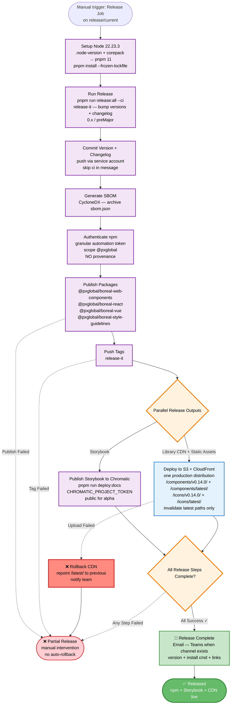

# CD Diagram v3 — Boreal DS

## Changes from v2

- **Trigger is a manual release job** on `release/current`, not an automatic run on merge. The manual trigger/approval *is* the gate — the separate STG deploy + manual-approval stage is removed.
- **Versioning stays on `release-it`** (Option A): `pnpm run release:all --ci` (bump + changelog). No Changesets (`pnpm version-packages` / `.changeset` files removed).
- **Storybook is published to Chromatic** (public for alpha) — the S3 + CloudFront Storybook deployment across STG/PROD is removed.
- **One production distribution** (S3 + CloudFront) hosts two content sets via path prefixes: **Library CDN** `/components/v{version}/` + `/components/latest/`, and **static assets (icons/fonts)** `/icons/v{version}/` + `/icons/latest/`. No STG/PROD duplication.
- **Library CDN serves the browser build (UMD/IIFE)** for **enterprise clients with npm registry restrictions** — a **new output target** on `boreal-web-components` (see CI v3).
- **npm provenance removed** (unsupported on self-hosted Jenkins and requires a public source repo); publishing uses a **granular automation token** for `@pxglobal`.
- Scope `@boreal-ds/*` → **`@pxglobal/*`**; versions stay **`0.x` (preMajor)** — e.g. the first `@pxglobal` release is `0.14.0`, not `1.2.3`.
- **No GitHub/Bitbucket "Release" object:** release-it creates and pushes the git tags; notifications carry the notes.
- Final convergence covers the three real outputs: **npm publish + Storybook (Chromatic) + Library CDN**.

## Deferred / out of scope

- STG/PROD multi-environment duplication (single production CDN).
- A separate `packages/boreal-icons` package (icon assets are served from the shared static-assets path).
- npm provenance and trusted publishing.

---

