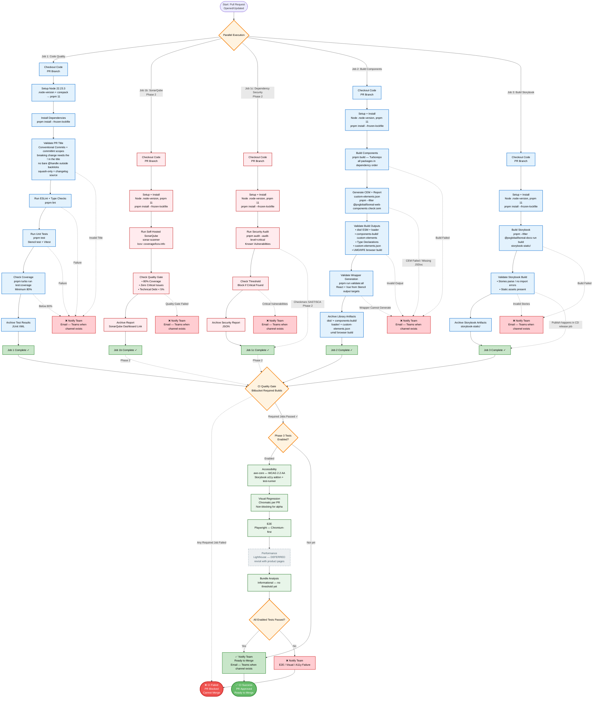

# CI Diagram v3 — Boreal DS

## Changes from v2

- Release tooling stays on `release-it` (Option A, ADR 0013): the `changeset status` gate is **removed** and replaced by **PR-title validation** (Conventional Commits + commitlint scopes). With squash-only merges, the PR title is the changelog/version source. Bitbucket's squash message lists the squashed commits indented, so a `BREAKING CHANGE:` footer inside it is ignored: the `!` in the title is what marks a breaking release, and a bare `@name` in a title becomes a link to a page that does not exist (verified in the first real release; see `CONTRIBUTING.md` and `RELEASING.md`).
- Added **type checks** alongside ESLint in Job 1.
- Every job pins **Node from `.node-version` (22.23.3)** and enables **pnpm 11 via corepack**.
- Coverage command is `pnpm turbo run test:coverage`; the gate stays at **80%** (matches `packages/boreal-web-components/testing.config.ts`). Tests: **Stencil test** (web-components) and **Vitest** (style-guidelines).
- Package scope `@boreal-ds/*` → **`@pxglobal/*`** (applied across jobs).
- Job 1b SonarQube: **self-hosted SonarQube** (SonarQube Cloud does not support on-prem Bitbucket Server); coverage fed via lcov.
- Job 1c: `pnpm audit --audit-level=critical`; Checkmarx SAST/SCA handled in Phase 2.
- Job 2: corrected build outputs — **no CJS bundle** (Stencil emits `dist/` ESM + loader); `components-build/` custom elements with type declarations; **`custom-elements.json` (CEM)** plus the `check:cem` breaking-change report; added **`pnpm run validate:all`** (React/Vue wrapper generation). Archive `dist/`, `components-build/`, `loader/`, `custom-elements.json`.
- Job 2 also produces the **browser build (UMD/IIFE)** for the Library CDN — a **new output target** (`umd/`), for enterprise/no-npm consumers (see CD v3).
- Job 3: **build only** — publishing Storybook to Chromatic moved to the release job (CD).
- CI gate: Phase 1 requires Jobs 1–3 via the Bitbucket *Required builds* merge check; Phase 2 adds SonarQube (Job 1b) and `pnpm audit` (Job 1c) to the required set.
- Job 4 (Phase 3): accessibility uses **axe-core only** (drop Pa11y), WCAG **2.2 AA**; visual regression via **Chromatic** (non-blocking for alpha); E2E uses **Playwright only** (drop Cypress), Chromium-first; **Lighthouse deferred**; bundle analysis is informational (no threshold defined yet).
- Notifications: **email now**, Microsoft Teams once a channel exists.

---

