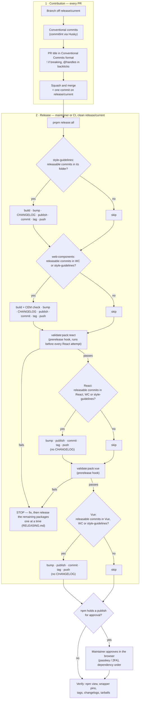
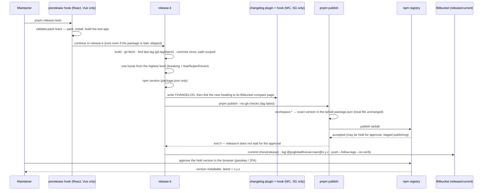

# release-it Publish Flow

> **Scope:** how a Boreal DS package release runs today (verified in the rehearsal and the first real release, 2026-10-09). Procedure, preconditions and recovery: `RELEASING.md`. Policy: `CONTRIBUTING.md`. The earlier alpha-phase diagram (`@telesign`, `alpha` dist-tag) is in `archive/`.

## Expected release process

Releasable = `feat`, `fix`, `perf`, `revert`, or breaking. Each check looks at commits since **that package's own** last tag, touching its own folder (web-components also counts style-guidelines; React and Vue also count both).

## One package, step by step

Notes:

- Publish happens **before** the commit, tag and push. A failed publish leaves nothing committed; a failed push leaves the package published with a local commit and tag (recovery: `RELEASING.md`).
- The commit, tag and push can happen up to a couple of minutes before an approved version becomes installable.
- A brand-new package name also gets a public placeholder version `0.0.0-stage` on its first publish.
