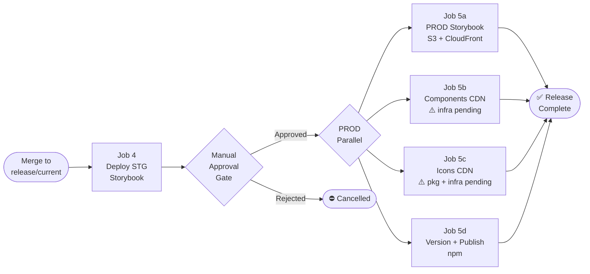

# Release Process — Boreal DS

> The maintainer procedure (preconditions, steps, verification, recovery, rehearsal) is maintained in the tracked `RELEASING.md` at the repository root. This internal guideline keeps the design background and the CI/CD target state; if the two differ, `RELEASING.md` wins.

## Overview

Releases are managed with [release-it](https://github.com/release-it/release-it) + [@release-it/conventional-changelog](https://github.com/release-it/conventional-changelog). Versioning is driven automatically from conventional commit history — no manual changeset files required.

Each publishable package has its own `.release-it.json` config and is released independently. Releases **must run from the `release/current` branch** with a clean working directory.

The full CI/CD pipeline is described in two diagrams:

- [`.ai/diagrams/pxg-ci-diagram-v2.md`](../diagrams/pxg-ci-diagram-v2.md) — PR validation (Jobs 1–4)
- [`.ai/diagrams/pxg-cd-diagram-v2.md`](../diagrams/pxg-cd-diagram-v2.md) — Deployment and release (Jobs 4–5d)

`apps/boreal-docs` and `examples/react-testapp` are never published to npm.

---

## Release Model

| Stage | npm org | npm dist-tag | Version format | Audience |
|---|---|---|---|---|
| **Alpha** (current) | `@pxglobal` | `latest` | plain `0.x.y`, starting at `0.14.0` | Internal test client and early adopters |
| **Stable** (future) | `@pxglobal` | `latest` | `1.0.0+` | Production consumers |

Alpha is a stated status (READMEs, Storybook, CONTRIBUTING.md), not a version suffix or dist-tag. `latest` always points at the newest version, so `npm install @pxglobal/<package>` works without a tag. Graduation to `1.0.0` is a deliberate maintainer decision, independent of the npm scope.

Versions up to `0.1.0-alpha.N` were published under `@telesign`. Those packages are deprecated, not unpublished, and their git tags are never deleted.

### Package names

| Package | npm name |
|---|---|
| `packages/boreal-style-guidelines` | `@pxglobal/boreal-style-guidelines` |
| `packages/boreal-web-components` | `@pxglobal/boreal-web-components` |
| `packages/boreal-react` | `@pxglobal/boreal-react` |
| `packages/boreal-vue` | `@pxglobal/boreal-vue` |

### Version progression (`preMajor`, `strictSemVer` off)

While below `1.0.0`, `preMajor` keeps every change out of major bumps:

| Highest commit since last release | Bump | Example |
|---|---|---|
| `feat`, `fix`, `perf`, `revert` | patch | `0.14.0` -> `0.14.1` |
| `BREAKING CHANGE:` footer or `!` | minor | `0.14.1` -> `0.15.0` |
| only `build`, `chore`, `ci`, `docs`, `style`, `refactor`, `test` | none, package skipped | no release |

No commit moves the library to `1.0.0` on its own.

### Path-scoped releases

Each package only counts commits that touch its own folder (web-components also counts style-guidelines; React and Vue also count web-components and style-guidelines). A package with no releasable commits is skipped without failing the chain. Tooling or config commits that touch a package folder must therefore use a non-releasing type.

### Running a release

Release commands run from `release/current` with a clean working directory, on macOS/Linux (CI or the release manager). Pass flags directly, without `--`.

```bash
pnpm release:styles        # @pxglobal/boreal-style-guidelines
pnpm release:wc-stack      # web-components -> validate:pack -> react -> vue
pnpm release:all           # every package, in dependency order
```

The wrappers' `prerelease` hook runs `validate:pack:react` / `validate:pack:vue`, so a wrapper is only released against a web-components build it was validated with. A design-token change in style-guidelines also triggers web-components and both wrappers.

### Dry run before every real release

```bash
pnpm --filter @pxglobal/boreal-web-components exec release-it --dry-run --ci \
  --no-git.requireBranch --no-git.requireCleanWorkingDir --no-git.requireUpstream --no-npm.publish
```

Review the proposed tag (`@pxglobal/<package>@<version>`), version and changelog window. Nothing is written, tagged or published.

### What release-it does on a real run

1. Checks branch, clean working directory and upstream
2. Resolves the last tag matching `@*/boreal-<package>@*` (covers both scopes)
3. Computes the bump from path-scoped conventional commits
4. Updates `package.json` and, for web-components and style-guidelines, `CHANGELOG.md`
5. Commits `chore(release): * release @pxglobal/<package> v<version>`
6. Tags `@pxglobal/<package>@<version>` and pushes
7. Publishes to npm with the `latest` dist-tag

### Changelogs

Two maintained changelogs: `packages/boreal-web-components/CHANGELOG.md` (components, tokens, React/Vue changes) and `packages/boreal-style-guidelines/CHANGELOG.md` (tokens). React and Vue have a pointer file only. Release notes are surfaced on the Storybook Changelog page.

### First `@pxglobal` release — runbook

Run once, by the publishing user, on macOS or Linux. Nothing here is reversible once it reaches npm or the remote, so every step ends with a check and a stop condition. A rehearsal against a local registry and a throwaway git remote must have passed first.

#### What a package release does, in order

For each package, `release-it` runs: build (and the CEM check for web-components) -> `git fetch` -> bump (`npm version`) and changelog -> **`npm publish`** -> `git commit` -> `git tag` -> `git push --follow-tags`. Publish happens **before** the commit, tag and push (release-it runs its npm plugin before its git plugin; confirmed in the rehearsal). The wrappers run `validate:pack:*` first, as a `prerelease` hook, even when the wrapper is then skipped. Each push also runs the repository's `pre-push` hook (the full web-components spec suite, about 50 seconds per push). Release pushes therefore skip that hook through `git.pushArgs` (`--follow-tags --no-verify`) in each `.release-it.json`: the tests already ran on the pull request, the release commit only changes versions and changelogs, and a hook failure after the publish would leave a package on npm without its commit and tag. Measured in the rehearsal for three packages: 275 s with hooks, 129 s with `HUSKY=0`, 138 s with the config only. Each wrapper also adds about a minute of pack validation.

#### Preconditions

| # | Check | Command / evidence |
|---|---|---|
| 1 | PR merged by squash with the `feat(release)` title and the `BREAKING CHANGE:` footer | `git log -1 --format=%B` on `release/current` |
| 2 | On `release/current`, up to date and clean | `git switch release/current && git pull && git status --short` (no output) |
| 3 | Node and dependencies | `fnm use`, `node -v` is `v22.23.3`, `pnpm install --frozen-lockfile` passes |
| 4 | `@pxglobal` org exists and the publishing user can publish to it | `npm whoami` returns the user; `npm org ls pxglobal` lists them |
| 5 | How npm authenticates the publish | Account with 2FA: run **without** `--ci` so release-it can prompt for the one-time password. Automation or granular token in `~/.npmrc`: `--ci` works. Never put a token in the repo or in an `.env` file |
| 6 | The user can push commits and tags to `release/current` | Confirm Bitbucket branch permissions beforehand; a protected branch makes the push fail after the publish (see recovery) |
| 7 | Storybook deploy token | `CHROMATIC_PROJECT_TOKEN` in the root `.env`, set by the user |
| 8 | Tags continuity | `git describe --tags --abbrev=0 --match '@*/boreal-web-components@*'` returns the last `@telesign` tag |

Stop if any check fails.

#### Procedure

1. **Pre-flight dry run**, per package (changes nothing):

   ```bash
   for p in style-guidelines web-components react vue; do
     pnpm --filter @pxglobal/boreal-$p exec release-it --dry-run --ci --no-git.requireUpstream --no-npm.publish --increment=0.14.0
   done
   ```

   Expected: each prints `(0.1.0-alpha.N...0.14.0)` and a tag `@pxglobal/boreal-<package>@0.14.0`; no `@telesign` link in the changelog preview. Stop if a version differs.

2. **Release** (builds, publishes, commits, tags, pushes; ordered style-guidelines -> web-components -> React -> Vue):

   ```bash
   pnpm release:all --increment=0.14.0
   ```

   Expected: four packages published at `0.14.0`; four release commits and four tags pushed. The wrappers' `validate:pack` runs before each. Stop at the first error and use the recovery table.

3. **Verify** (checklist below) before doing anything else.

4. **Deploy Storybook**: `pnpm deploy:docs`, then open the "What's new" page and confirm it lists `0.14.0`.

5. **Deprecate the old packages**, only after every verification item is green:

   ```bash
   for p in web-components react vue style-guidelines; do
     npm deprecate "@pxglobal/boreal-$p" "Moved to @pxglobal/boreal-$p (0.14.0 and later)"
   done
   ```

#### Verification checklist

- [ ] `npm view @pxglobal/boreal-<package> version dist-tags` shows `0.14.0` with `latest` for all four.
- [ ] `npm view @pxglobal/boreal-react@0.14.0 dependencies` and the same for Vue show `@pxglobal/boreal-web-components` at `0.14.0` (not `workspace:*`).
- [ ] The four tags `@pxglobal/boreal-<package>@0.14.0` exist on Bitbucket and the four `chore(release)` commits are on `release/current`.
- [ ] The web-components and style-guidelines changelogs gained a `0.14.0` section above the "Published as…" notice, with working Bitbucket links; React and Vue have none.
- [ ] No tarball holds a `CHANGELOG.md` or an internal link (`npm pack --dry-run` and a search of the packed README).
- [ ] A scratch project installs `@pxglobal/boreal-web-components` and the matching wrapper from npm and builds.
- [ ] The Storybook deploy shows the Welcome callout with `@pxglobal/boreal-web-components@0.14.0` and the "What's new" entries.

#### Titles and handles

A bare `@name` in a commit or PR title becomes a link to `https://bitbucket.c11.telesign.com/name` in the changelog. Wrap it in backticks (`@pxglobal`) or avoid it. Names containing a slash (`@pxglobal/boreal-react`) are left alone. The squash title of the scope-move PR therefore reads: `feat(release): EOA-18749 publish packages under the \`@pxglobal\` npm scope`.

#### Recovery

| Where it stopped | State | What to do |
|---|---|---|
| Build, CEM check or `validate:pack` fails | Nothing of that package published or committed; earlier packages in the chain are done | Fix the cause, then release the **remaining** packages one at a time, in order, with `pnpm release:styles`, `release:wc`, `release:react`, `release:vue` each followed by `--increment=0.14.0`. Do not rerun `release:all`: the explicit increment would try to release finished packages at `0.14.0` again |
| `npm publish` fails (login, OTP, org permission, network) | Nothing committed or tagged for that package; release-it restores the working tree | Same as above |
| Publish succeeded, then the push fails (branch permission, network) | Package is on npm; commit and tag exist **locally** | Do not rerun that package's release. Run `git push --follow-tags origin release/current`, then release the remaining packages one at a time as above |
| A wrong package was published | Published on npm | Never `npm unpublish`. Deprecate that version and release a corrected patch |

Verified in the rehearsal: a forced `--increment=0.14.0` on a package already at `0.14.0` fails with `Version not changed` (exit 1, nothing changed), and inside `release:all` that first failure stops the chain; a refused publish leaves the working tree restored and no commit or tag for that package.

Rule: the one-at-a-time rule applies only while `--increment=0.14.0` is in use. After the first release, plain `pnpm release:all` skips packages with nothing to release. After any interruption, read `git status`, `git log -3` and `npm view <package> version` before running anything again.

### Graduating to `1.0.0`

Decided by maintainers once alpha feedback is addressed. Release with `--increment=1.0.0`; from then on breaking -> major, `feat` -> minor, `fix` -> patch, and `preMajor` can be removed.

---

## CI/CD Integration (Target State)

### Pipeline overview



### Job 5d in detail — release-it step

```groovy
stage('Release Packages') {
  environment {
    NPM_TOKEN = credentials('npm-publish-token')
  }
  steps {
    sh 'echo "//registry.npmjs.org/:_authToken=${NPM_TOKEN}" >> ~/.npmrc'
    sh 'fnm use'
    sh 'pnpm release:all --ci'
  }
}
```

> `--ci` disables interactive prompts. The `npm-publish-token` Jenkins credential must have publish rights for the `@pxglobal` org.

### PR validation — conventional commit enforcement

Conventional commit format is enforced at commit time via commitlint + Husky. No separate CI check is required for changeset files (Changesets has been removed). The commit history itself is the source of truth for versioning.

---

## ⚠️ What's Missing for CI/CD Integration

### Jenkins jobs (none implemented yet)

| Job | Trigger | Purpose |
|---|---|---|
| PR validation (Jobs 1–4) | PR opened/updated | Code quality, tests, build, Storybook |
| CD pipeline (Jobs 4–5d) | Merge to `release/current` | STG deploy → approval → PROD deploy + npm publish |

### Credentials (Jenkins secrets)

| Secret ID | Used in | Purpose |
|---|---|---|
| `npm-publish-token` | Job 5d | npm token with publish rights for the `@pxglobal` org |
| `BITBUCKET_TOKEN` | All jobs | Bitbucket API access for status reporting |
| `AWS_STG_ROLE` | Job 4 | IAM role for STG S3/CloudFront |
| `AWS_PROD_ROLE` | Jobs 5a–5c | IAM role for PROD S3/CloudFront |

### AWS infrastructure (not provisioned)

- S3 buckets: `pxg-storybook-stg`, `pxg-storybook-prod`, `pxg-components-prod`, `pxg-icons-prod`
- CloudFront distributions for each bucket
- IAM roles: `stg-deploy`, `prod-deploy`

### Package and build gaps

| Gap | Notes |
|---|---|
| Icons package | `packages/boreal-icons` does not exist. Job 5c cannot run until created |
| CDN/UMD build | Job 5b expects a UMD bundle. Stencil produces ESM/CJS for npm but not a CDN-ready UMD. Needs a dedicated build target |
| SBOM tooling | `@cyclonedx/cyclonedx-npm` not installed. Add: `pnpm add -D -w @cyclonedx/cyclonedx-npm` |
| `fnm` on agents | Jenkins agents must have `fnm` installed and configured to respect `.node-version` |

---

## Release Manager Checklist

### Regular release

- [ ] On `release/current` with a clean working directory (macOS/Linux or CI)
- [ ] Dry run reviewed: tag, version, changelog window
- [ ] CEM breaking-change report confirmed (web-components only)
- [ ] `pnpm release:all` (or `release:styles` / `release:wc-stack`)
- [ ] Packages visible on npm under `@pxglobal/*` with the `latest` dist-tag
- [ ] Internal test client notified

### First `@pxglobal` release

- [ ] `@pxglobal` npm org created and publish token available
- [ ] `pnpm release:all --increment=0.14.0`
- [ ] `npm deprecate` run for the four `@telesign/*` packages
- [ ] Internal test client moved to `@pxglobal/*`
- [ ] Jenkins `npm-publish-token` updated to the `@pxglobal` token

---

## Rehearsal recipe (local registry, throwaway remote)

Run before any first or risky release. Nothing reaches Bitbucket or npm.

1. Scratch directory outside the repository. `git clone --no-hardlinks <repo> clone`, `git init --bare remote.git`, then in the clone `git checkout -b release/current`, `git remote set-url origin <path>/remote.git`, `git push -u origin release/current`. Check `git remote -v` shows only the bare repository. Keep the existing tags in the clone (`git.tagMatch` needs them).
2. Registry: install Verdaccio (latest, Node 22) in its own folder; config with a proxy to the public registry, `publish: $authenticated`, a local `htpasswd`. Start it on `127.0.0.1:4873` with the project's Node; create a throwaway user by `PUT /-/user/org.couchdb.user:<name>`; write the token to a separate npmrc (`registry=http://127.0.0.1:4873/`).
3. In the clone: `pnpm install --frozen-lockfile`; export `NPM_CONFIG_USERCONFIG=<npmrc>` and `NPM_CONFIG_REGISTRY=http://127.0.0.1:4873/`.
4. Scenarios: (a) `pnpm release:all --increment=0.14.0 --ci`; (b) the same without `--increment` and no new commits: every package says "No new version"; (c) a `fix(web-components)` commit then `pnpm release:wc-stack --ci`; (d) a `fix(vue)` commit then `pnpm release:all --ci`; (e) make one package's publish fail (registry rule `publish: nobody` for it; restart the registry) and recover one package at a time.
5. Verification: `npm view` versions and `dist-tags`, wrapper dependency pins, tags and release commits in the bare remote, changelog sections, `npm pack` of each published version (no `CHANGELOG.md`, no internal host), and an install in a scratch project.

Verdaccio renames its process (`pgrep -x verdaccio`); restart it after an "uplink is offline" error.
