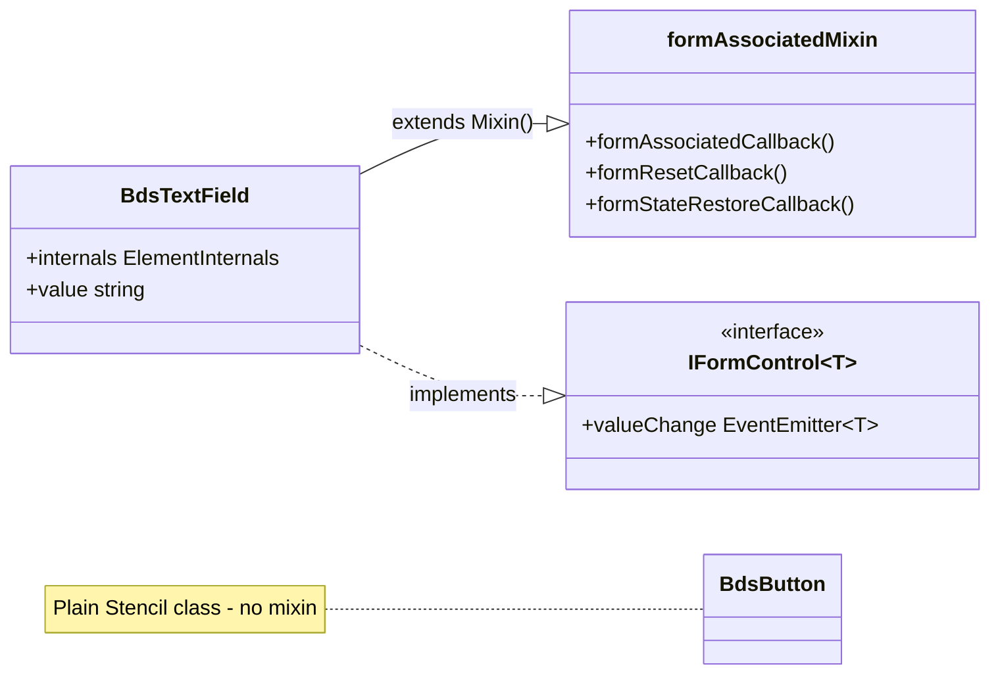
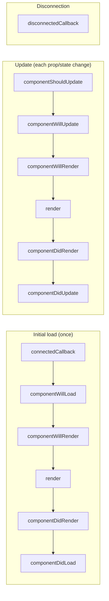
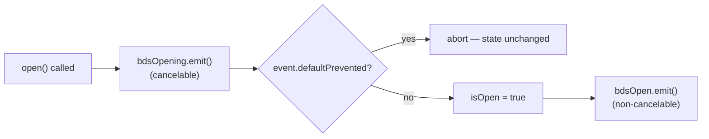
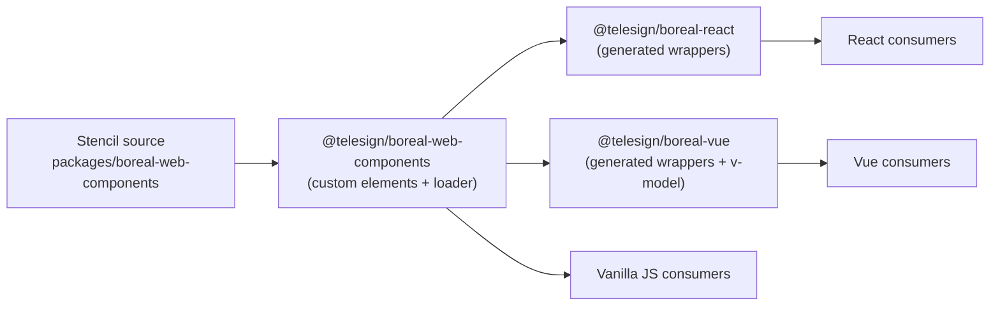
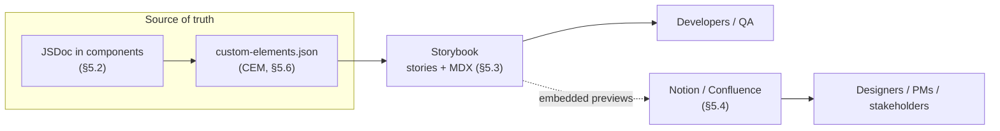
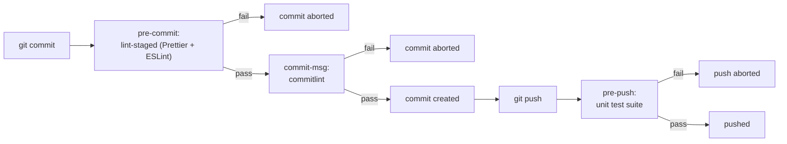

# Boreal DS — Development Standards

## Overview

This document defines mandatory code practices, quality standards, and development workflows for all contributors to the Proximus Global (PxG) component library. It ensures:

- Code quality and consistency across teams
- Reduced review friction and faster merges
- Maintainable, accessible, and well-tested components
- Consistent developer experience

---

## 1. COMPONENT DEVELOPMENT GUIDELINES

Component development guidelines establish the foundational patterns and naming conventions for building components in the library. These standards ensure components are architecturally sound, follow clear inheritance patterns, use consistent naming across properties, events, slots, and CSS classes, maintain predictable code organization, and implement robust property and event APIs that integrate seamlessly with web standards and modern frameworks.

### 1.1 Component Architecture & Inheritance

Component architecture defines how shared behavior is distributed across components. Boreal DS uses **mixin-based composition** via Stencil's `Mixin()` factory rather than class inheritance chains. This keeps components flat and avoids the fragility of deep prototype hierarchies.

#### Mixin Architecture

Components extend at most one mixin using the `Mixin()` factory from `@stencil/core`. Plain components that need no shared behavior are bare Stencil classes.

| Mixin                 | Purpose                                                                                                                                             | Components using it                                                                                                                                 |
| --------------------- | --------------------------------------------------------------------------------------------------------------------------------------------------- | --------------------------------------------------------------------------------------------------------------------------------------------------- |
| `formAssociatedMixin` | FACE lifecycle callbacks (`formAssociatedCallback`, `formResetCallback`, `formStateRestoreCallback`), `ElementInternals` wiring, form participation | `BdsTextField`, `BdsCheckbox`, `BdsCheckboxButton`, `BdsCheckboxCard`, `BdsCheckboxGroup`, `BdsRadioGroup`, `BdsSlider`, `BdsTagField`, `BdsToggle` |
| `anchoredMixin`       | Floating UI positioning, anchor element resolution                                                                                                  | `BdsPopover`, `BdsTooltip`                                                                                                                          |
| `backdropMixin`       | Backdrop overlay management and focus trapping                                                                                                      | `BdsDialog`                                                                                                                                         |
| `floatingMixin`       | Base floating positioning (used internally by `anchoredMixin`)                                                                                      | Not used directly                                                                                                                                   |
| `WithLinks`           | Renders `<a>` or `<button>` depending on `href` presence                                                                                            | `BdsListMenuItem`                                                                                                                                   |



**Form component pattern:**

```typescript
import { formAssociatedMixin, type IFormControl } from "@/mixins";

@Component({
  tag: "bds-my-field",
  styleUrl: "bds-my-field.scss",
  formAssociated: true,
})
export class BdsMyField
  extends Mixin(formAssociatedMixin)
  implements IMyField, IFormControl<string>
{
  @AttachInternals() internals!: ElementInternals;

  @Prop({ reflect: true }) readonly disabled: boolean = false;
  @State() private isDisabled: boolean = false;

  @Watch("disabled")
  onDisabledChange(next: boolean) {
    this.isDisabled = next;
  }

  @Prop({ mutable: true, reflect: true }) value: string = "";
  @Event() valueChange!: EventEmitter<string>;

  public formResetCallback(): void {
    this.value = "";
  }
}
```

**Plain component (no mixin):**

```typescript
@Component({ tag: "bds-button", styleUrl: "bds-button.scss" })
export class BdsButton implements IButton {
  // No extends — plain Stencil class
}
```

#### When to Add a New Mixin

Create a new mixin **only when two or more components share identical lifecycle logic that cannot be extracted into a utility function**. Typical cases:

- Browser API setup/teardown that must hook into Stencil lifecycle callbacks (`connectedCallback`, `disconnectedCallback`)
- DOM side effects that must run at specific component lifecycle moments

**Anti-patterns — do not create a mixin for:**

- ❌ Shared types or interfaces — use `types/` files instead
- ❌ Pure utility logic — use `@/utils/` instead
- ❌ Single-component behavior

**`@AttachInternals()` placement rule:** The `@AttachInternals()` decorator must appear on the component class body — never inside a mixin factory. Stencil resolves it at component registration time; placing it in a mixin factory produces a silent runtime failure. See [ADR 0001](../decisions/0001-attach-internals-must-be-on-component-class-not-in-mixin.md).

#### Why Mixins Instead of Base Classes

Stencil resolves decorators (`@Prop`, `@State`, `@Event`, …) at **compile time from the immediate class body** annotated with `@Component()` — it never traverses the prototype chain. Decorators declared in a base class are silently ignored: the component compiles, but those props and events do not work at runtime ([stenciljs/core#1060](https://github.com/stenciljs/core/issues/1060), [#1127](https://github.com/stenciljs/core/issues/1127)). The `Mixin()` factory avoids this by copying members directly into the component class body before `@Component` is processed.

Contracts stay explicit through interfaces, not inheritance: `IFormControl<T>` and `IFormAssociatedCallbacks` are interface types — TypeScript enforces the contract without dictating implementation.

### 1.2 Component Naming Conventions

Consistent naming across all API surfaces makes component APIs predictable and aligned with web standards: kebab-case in markup, camelCase in JavaScript.

#### Naming Convention Reference

| Element                   | Format                        | Rules                                                                                                                                       | Examples                               |
| ------------------------- | ----------------------------- | ------------------------------------------------------------------------------------------------------------------------------------------- | --------------------------------------- |
| **Custom element tag**    | `bds-component-name`          | kebab-case, lowercase, `bds` prefix                                                                                                         | `bds-text-field`, `bds-checkbox-group`  |
| **Component class**       | `PascalCase`                  | Aligns with the tag name                                                                                                                    | `BdsTextField`, `BdsCheckboxGroup`      |
| **Interface file**        | `IComponent.ts`               | Lives in the component's `types/` dir; never `IBdsComponent.ts` — the `Bds` prefix is reserved for tag and class names                      | `ITooltip.ts`, `IPopover.ts`            |
| **Properties (JS)**       | `camelCase`                   | `@Prop()` booleans: plain adjectives, no `is`/`has`/`show` prefix; `@State()` mirrors use `is*`; avoid negative booleans                    | `disabled`, `closable`, `maxLength`     |
| **Attributes (HTML)**     | `kebab-case`                  | Auto-mapped from camelCase; explicit mapping for HTML/ARIA standards (see below)                                                            | `max-length`, `readonly`                |
| **Public methods**        | `camelCase` verb              | Clear action intent; `@Method()` must be async                                                                                              | `open()`, `validate()`                  |
| **Private methods**       | `_camelCase` or `#private`    | Not part of the public API                                                                                                                  | `_handleClick()`, `#updateState()`      |
| **Event handlers**        | `handle*` or `on*`            | Describe what is being handled                                                                                                              | `handleClick()`, `onInputChange()`      |
| **Custom events**         | `bds{Action}` (camelCase)     | `-ing` suffix for cancelable lifecycle events; `valueChange` is reserved for Vue `v-model` — see §1.5                                       | `bdsChange`, `bdsOpening` (cancelable)  |
| **Slots**                 | `kebab-case`                  | Default slot unnamed; named slots descriptive                                                                                               | `prefix`, `suffix`, `icon`              |
| **CSS custom properties** | `--bds-<component>-<property>` | Public API documented via `@prop` in SCSS (see §5); internal implementation vars use the `--_` prefix and are never documented              | `--bds-divider-gap`, `--_col-base`      |

> CSS Shadow Parts (`::part()`) are not applicable — Boreal DS uses light DOM (`shadow: false`); consumers style components directly via class selectors.

#### Boolean Property Naming

| Pattern                                     | Status           | Reasoning                                                                          |
| ------------------------------------------- | ---------------- | ----------------------------------------------------------------------------------- |
| Positive boolean defaulting to `false`      | ✅ **Correct**   | Attribute presence = `true`; omit the attribute for `false`                         |
| Negative boolean defaulting to `true`       | ❌ **Incorrect** | Can never be set to `false` from HTML — attribute presence always means `true`      |
| `is*` / `has*` prefix on `@Prop()`          | ❌ **Not used**  | Native HTML style (`disabled`, `required`); prefixes are reserved for `@State()` mirrors |

```typescript
@Prop({ reflect: true }) readonly disabled: boolean = false; // ✅ plain adjective
@State() private isDisabled: boolean = false;                // ✅ is* on @State() mirror only

@Prop() isOpen: boolean = false;  // ❌ should be `open`
@Prop() enabled: boolean = true;  // ❌ negative boolean — unsettable from HTML
```

#### Explicit Attribute Mapping

Stencil auto-converts camelCase props to kebab-case attributes. Map explicitly only when an HTML/ARIA standard spells the attribute differently:

| Property    | Attribute    | Why           |
| ----------- | ------------ | ------------- |
| `readOnly`  | `readonly`   | HTML standard |
| `tabIndex`  | `tabindex`   | HTML standard |
| `ariaLabel` | `aria-label` | ARIA standard |

```typescript
// bds-text-field.tsx
@Prop({ attribute: 'readonly' }) readonly readOnly: boolean = false;
```

### 1.3 Component Code Organization

All component classes follow a mandatory member ordering so every component reads the same way regardless of complexity.

#### Member Ordering Standard

| Order | Section                          | Description                                              | Examples                                                                  |
| ----- | -------------------------------- | -------------------------------------------------------- | ------------------------------------------------------------------------- |
| 1     | **Static members**               | Static properties and methods, including style constants | `static styles = css\`...\``                                              |
| 2     | **Private non-reactive members** | Private class properties that don't trigger re-renders   | `private helperInstance: Helper`<br/>`private cacheData: Map<>`           |
| 3     | **Element reference**            | Reference to the component's host element                | `@Element() el!: HTMLElement`                                             |
| 4     | **Internal reactive state**      | Private reactive properties (internal state)             | `@State() private isOpen = false`                                         |
| 5     | **Public reactive properties**   | Public properties that trigger re-renders when changed   | `@Prop() disabled = false`<br/>`@Prop() value: string`                    |
| 6     | **Property watchers**            | Handlers that run when specific properties change        | `@Watch('disabled')`<br/>`@Watch('value')`                                |
| 7     | **Event declarations**           | Custom events emitted by the component                   | `@Event() bdsChange: EventEmitter`                                        |
| 8     | **Constructor**                  | Constructor (only if initialization logic is required)   | `constructor() { super(); }`                                              |
| 9     | **Lifecycle methods**            | Component lifecycle hooks in execution order             | `connectedCallback()`<br/>`componentWillLoad()`<br/>`componentDidLoad()`  |
| 10    | **Event listeners**              | Decorators for listening to DOM or custom events         | `@Listen('click')`                                                        |
| 11    | **Event handlers**               | Private methods that handle events                       | `private handleClick()`                                                   |
| 12    | **Public methods**               | Public API methods exposed to consumers                  | `async open()`<br/>`async close()`                                        |
| 13    | **Internal methods**             | Private/protected helper methods                         | `private updateState()`                                                   |
| 14    | **Render helpers**               | Private methods returning template fragments             | `private renderHeader()`                                                  |
| 15    | **render() method**              | Main render method (always last)                         | `render() { return <Host>...</Host>; }`                                   |

**Alphabetical ordering within sections** — members in each section are ordered alphabetically, with one exception: lifecycle methods (section 9) follow execution order.

#### Lifecycle Execution Order



Non-obvious behaviors:

- `connectedCallback()` runs again every time the element is moved in the DOM; `componentWillLoad()` runs only once, even after reconnection.
- `componentShouldUpdate()` returns a boolean that can prevent the re-render.
- Update hooks (`componentWillUpdate`, `componentDidUpdate`) are never called on the first render.
- Lifecycle methods bubble up from child to parent components.

#### Reference Skeleton

Section comments are optional but encouraged for large components (more than ~150 lines).

```typescript
@Component({ tag: 'bds-example', styleUrl: 'bds-example.scss' })
export class BdsExample implements IExample {
  // 1. Static members
  // 2. Private non-reactive members
  private cache = new Map<string, string>();

  // 3. Element reference
  @Element() el!: HTMLBdsExampleElement;

  // 4. Internal reactive state
  @State() private isPressed = false;

  // 5. Public reactive properties (alphabetical)
  @Prop({ reflect: true }) readonly disabled: boolean = false;
  @Prop({ reflect: true }) readonly variant: ExampleVariant = 'primary';

  // 6. Property watchers
  @Watch('variant')
  checkPropValues(): void {
    validatePropValue(Object.values(EXAMPLE_VARIANTS) as ExampleVariant[], 'primary', this.el as HTMLElement, 'variant');
  }

  // 7. Event declarations
  /** Emitted when the user clicks the component. */
  @Event() bdsClick!: EventEmitter<void>;

  // 8. Constructor (only if needed)

  // 9. Lifecycle methods (execution order)
  componentWillLoad(): void {
    this.checkPropValues();
  }

  // 10. Event listeners
  @Listen('focus')
  onFocus(): void {}

  // 11. Event handlers
  private handleClick = (): void => {
    if (!this.disabled) this.bdsClick.emit();
  };

  // 12. Public methods
  // 13. Internal methods
  // 14. Render helpers
  private renderIcon() {
    return <slot name="icon" />;
  }

  // 15. render() — always last
  render() {
    return (
      <Host>
        <button class={`example example--${this.variant}`} disabled={this.disabled} onClick={this.handleClick}>
          {this.renderIcon()}
          <slot />
        </button>
      </Host>
    );
  }
}
```

#### Enforcement

- Member ordering is enforced in **code review** today (see [code-review-checklist.md](./code-review-checklist.md)).
- Scaffolded files start in the correct shape (see below), which keeps most components compliant from day one.
- `@typescript-eslint/member-ordering` is **not currently configured** in `eslint.config.ts`; adopt it only if manual review proves insufficient.

#### Component & Story Scaffolding

- **Components:** `pnpm generate:component` (workspace root) runs Stencil's built-in `stencil generate` in `boreal-web-components` and scaffolds the component file structure.
- **Stories/MDX:** the Plop generator in `apps/boreal-docs` (`pnpm --filter @telesign/boreal-docs run generate`) scaffolds story and documentation files. Implementation notes and troubleshooting: [plop-generator-learnings.md](./plop-generator-learnings.md).

> JSDoc/CEM authoring standards for the generated files live in §5.2.

### 1.4 Properties & Attributes

Naming is covered in §1.2; this section covers property behavior — reflection, typing, validation, mutability, and watchers.

#### Property Reflection Strategy

Reflection syncs property values back to HTML attributes. Every reflected property triggers a DOM mutation, so reflect only when the attribute itself is needed:

| Reflect when…            | Reason                                                  | Example                          |
| ------------------------ | ------------------------------------------------------- | -------------------------------- |
| Accessibility attributes | Screen readers and assistive technology read attributes | `disabled`, `aria-label`, `role` |
| CSS styling selectors    | Allows CSS to style based on state                      | `variant`, `size`, `open`        |
| Simple primitive state   | Visual debugging in DevTools                            | `active`, `selected`             |

| Do NOT reflect…                 | Reason                                     | Example                    |
| ------------------------------- | ------------------------------------------ | -------------------------- |
| Complex objects/arrays          | Performance overhead, serialization issues | `data`, `config`, `items`  |
| Frequently changing values      | Excessive DOM updates                      | `value`, `progress`        |
| Internal implementation details | Not part of public API                     | `_cache`, `_state`         |

#### Type Inference and Default Values

When a prop has a default value, TypeScript infers its type — no explicit annotation:

```typescript
@Prop({ reflect: true }) readonly disabled = false;         // inferred boolean
@Prop({ reflect: true }) readonly orientation = 'vertical'; // inferred string
```

When there is no default, declare the type explicitly:

| Declaration        | Meaning                                                            |
| ------------------ | ------------------------------------------------------------------ |
| `name!: string`    | Required, no default — component cannot function without it        |
| `formId?: string`  | Optional, no default — `undefined` is a valid and meaningful value |
| `disabled = false` | Has default — behavioral, always a valid fallback                  |

**Never use constants as `@Prop()` default values.** Stencil resolves defaults at static analysis time (AST level): `= ORIENTATIONS.VERTICAL` records the identifier `ORIENTATIONS.VERTICAL` in `custom-elements.json` instead of `'vertical'`, leaking internals into Storybook ArgTypes and consumer IDEs. Constants are fine in logic (switch cases, class maps, `validatePropValue`) — never as the initializer.

```typescript
@Prop() readonly orientation: Orientation = 'vertical';              // ✅ CEM records 'vertical'
@Prop() readonly orientation: Orientation = ORIENTATIONS.VERTICAL;   // ❌ CEM records the identifier
```

#### Property Validation

For any enum-typed `@Prop()` (variant, size, type, …), use the shared `validatePropValue` utility from `@/utils/helpers/validateProps` with stacked `@Watch()` decorators on a single `checkPropValues()` method. **Always call `checkPropValues()` in `componentWillLoad()`** — `@Watch()` does not fire for the initial attribute value set in HTML before the component mounts; without the lifecycle call, an invalid initial attribute is silently accepted.

```typescript
@Watch("variant")
@Watch("size")
checkPropValues(): void {
  validatePropValue(Object.values(BUTTON_VARIANTS) as ButtonVariant[], "default", this.el as HTMLElement, "variant");
  validatePropValue(Object.values(BUTTON_SIZES) as ButtonSizes[], "medium", this.el as HTMLElement, "size");
}

componentWillLoad(): void {
  this.checkPropValues();
}
```

```ts
validatePropValue<T extends string>(
  acceptedValues: readonly T[],
  fallbackValue: T,
  element: HTMLElement,
  propertyName: string,
): void
```

When the current value is not in `acceptedValues`, the utility resets `element[propertyName]` to `fallbackValue` and emits a `console.warn` naming the tag, the invalid value, and the valid options. This is a **mutation strategy**: after `checkPropValues()` returns, all validated props hold a valid value.

| Rule                           | Detail                                                                             |
| ------------------------------ | ----------------------------------------------------------------------------------- |
| Use `Object.values(ENUM)`      | Keeps the accepted-values array in sync with the enum automatically                |
| Pass `this.el as HTMLElement`  | Keeps `validatePropValue` generic — avoid casting to a specific element type       |
| No inline literals             | Enum values are the single source of truth; do not duplicate them as string arrays |
| `checkPropValues` in section 6 | The method carries `@Watch()` decorators so it belongs with Property Watchers      |
| Call in `componentWillLoad()`  | Required to cover the initial render — `@Watch()` alone does not fire on mount     |

#### Property Mutability

Properties are immutable by default. Use `mutable: true` only when the component must modify its own prop value. The `stencil/strict-mutable` ESLint rule flags every `mutable: true` as a warning — intentional and accepted where internal mutation is genuinely required.

| Use `mutable: true` for…     | Example                          | NOT for…                 | Alternative            |
| ---------------------------- | -------------------------------- | ------------------------ | ---------------------- |
| Value normalization/clamping | Input clamping to min/max        | General state management | `@State()`             |
| Controlled component pattern | Component constrains its value   | Temporary values         | Private properties     |
| Prop that is also state      | Accordion open state             | Computed values          | Getters                |

**`disabled` is the exception — always use a `@State()` mirror, never `mutable: true`.** `disabled` is a native reflected attribute with browser-managed semantics; marking it mutable creates two writers on the same attribute (component + browser), which can race.

```typescript
/** Whether the component is disabled. */
@Prop({ reflect: true }) readonly disabled: boolean = false;
@State() private isDisabled: boolean = false;

@Watch('disabled')
onDisabledChange(next: boolean): void { this.isDisabled = next; }

componentWillLoad(): void { this.isDisabled = this.disabled; }
```

Render and toggle logic reads `this.isDisabled`; the `@Prop()` stays `readonly` and externally owned. In FACE components, `formAssociatedMixin` already provides `formDisabledCallback` — it sets `isDisabled` when the browser disables the control via a parent `<fieldset disabled>` or form logic; the component only needs to declare the `isDisabled` mirror.

#### Watch Decorators

`@Watch` handlers run when specific properties change. Use them for validation, side effects, or syncing state:

| Practice                      | Description                                       | Example                                         |
| ----------------------------- | ------------------------------------------------- | ----------------------------------------------- |
| **Name handlers clearly**     | Use `handle[PropName]Change` pattern              | `handleDisabledChange`, `handleValueChange`     |
| **Check old vs new**          | Avoid unnecessary work if value hasn't changed    | `if (newValue !== oldValue) { ... }`            |
| **Keep handlers focused**     | One responsibility per handler                    | Separate validation from event emission         |
| **Avoid infinite loops**      | Don't set the watched property inside its handler | Watch `value`, don't set `value` inside handler |
| **Use for side effects only** | Don't use for computed values (use getters)       | Update ARIA attributes, emit events             |

#### Component Interface Contract

`IComponent.ts` interfaces describe only what the **consumer configures** — the set of publicly settable `@Prop()` members.

The following must **not** be in `IComponent.ts`:

- **`@Event()` outputs** — `EventEmitter<T>` members are declared on the class body and documented via JSDoc. Adding them to the interface forces the type to reference an internal abstraction consumers never set.
- **Group-propagated props** — props the parent group component writes imperatively (e.g. `name`, `showDivider`, `isFirst`) are parent-child coordination details, not consumer API.
- **`@State()` mirrors** — internal reactive state (`isDisabled`, `isOpen`) is never part of the public API.

**Interface members must be optional when the prop has a default value.** A required interface member implies the consumer must always supply it explicitly. With optional members, bare-attribute patterns (`<bds-radio-group disabled>`) work as expected in React and HTML.

```typescript
// ✅ Correct — props with component-side defaults are optional in the interface
export interface IRadioGroup {
  name: string; // no default on component — required
  value?: string; // default = ''
  disabled?: boolean; // default = false
}

// ❌ Wrong — disabled has a default; marking it required is misleading
export interface IRadioGroup {
  name: string;
  disabled: boolean; // forces consumer to always pass disabled={false}
}
```

### 1.5 Custom Events

Canonical section for event behavior — emission rules, options, cancelable lifecycle events, and detail typing. Naming format (`bds{Action}`) is defined in §1.2; JSDoc requirements in §5.2.

#### Event Emission Rules

Events are emitted **only in response to user interactions**, never programmatic changes. This prevents infinite loops (parent updates a prop in response to an event that the prop change re-emits) and preserves unidirectional data flow: props down, events up.

| Scenario                          | Emit? | Reason                                    |
| --------------------------------- | ----- | ----------------------------------------- |
| User clicks / types / selects     | ✅    | Direct user interaction                   |
| Component opens via user action   | ✅    | User-triggered state change               |
| Property changed programmatically | ❌    | Not user-initiated; emitting causes loops |
| Public `@Method()` called         | ❌    | API call, not a user action               |
| Internal state update             | ❌    | Implementation detail                     |
| Initialization / lifecycle hooks  | ❌    | Framework lifecycle, not a user action    |

#### Event Options: Bare `@Event()` by Default

Boreal DS uses **light DOM** (`shadow: false`), so there is no shadow boundary: `composed: true` has no effect, and consumers attach listeners directly to the component element, so bubbling is not required either. The convention — enforced by [ADR 0003](../decisions/0003-event-options-convention.md) — is bare `@Event()` with no options:

```typescript
@Event() bdsChange!: EventEmitter<string>;
```

**Exception:** events caught by a parent component via `@Listen()` must declare `@Event({ bubbles: true })` — `@Listen()` relies on bubbling; without it the event never reaches the parent. Real example:

```typescript
// bds-radio.tsx — child emits with bubbles so the group can delegate
@Event({ bubbles: true }) bdsChange!: EventEmitter<RadioChangeDetail>;

// bds-radio-group.tsx — parent catches the bubbled child event
@Listen('bdsChange')
onChildChange(event: CustomEvent<RadioChangeDetail>) { ... }
```

Any other deviation requires a documented architectural reason in a JSDoc comment on the `@Event()` line.

#### Cancelable Lifecycle Events

Cancelable events use the `-ing` suffix and are emitted **before** the action; the plain-named event is emitted **after** and cannot be prevented.



```typescript
@Event({ cancelable: true }) bdsOpening!: EventEmitter<void>;
@Event() bdsOpen!: EventEmitter<void>;

async open() {
  const event = this.bdsOpening.emit();
  if (event.defaultPrevented) return;
  this.isOpen = true;
  this.bdsOpen.emit();
}
```

| Event pair                  | Cancelable | When emitted                   |
| --------------------------- | ---------- | ------------------------------ |
| `bdsOpening` / `bdsClosing` | ✅         | Before action (can be stopped) |
| `bdsOpen` / `bdsClose`      | ❌         | After action (already done)    |

#### Event Detail Typing

| Pattern             | When to use                 | Example                                                                            |
| ------------------- | --------------------------- | ----------------------------------------------------------------------------------- |
| Simple primitive    | Single scalar value         | `EventEmitter<string>`                                                             |
| Inline object       | Two or three related fields | `EventEmitter<{ id: string; label: string }>`                                      |
| Named interface     | Reusable or complex payload | `EventEmitter<RadioChangeDetail>`                                                  |
| Element reference   | Exposing the source element | `EventEmitter<HTMLElement>`                                                        |
| Discriminated union | Multiple event variants     | `EventEmitter<{ type: 'success'; data: T } \| { type: 'error'; message: string }>` |

Only include relevant data in the detail — never serialize the entire component state.

#### Reserved: `valueChange`

`valueChange` is reserved for Vue `v-model` integration on form components (see §1.6). Use `bds{Action}` names for all other events.

### 1.6 Developing for Output Targets

Boreal DS ships framework output targets — **Vue** (`@stencil/vue-output-target`) and **React** (`@stencil/react-output-target`). Components built in the Web Components package must follow additional conventions so the generated wrappers work correctly.



#### Vue `v-model` Support

The Vue output target maps one `@Prop()` / `@Event()` pair per component to `v-model`, configured in the `componentModels` array of [`targets/vue-output-target.ts`](../../packages/boreal-web-components/targets/vue-output-target.ts).

**Registration requirement:** every form component **must** be registered in `componentModels` in the same PR as the component itself — the output target does not infer `v-model` bindings from naming conventions. Value-based controls map `targetAttr: 'value'`; boolean controls (checkbox family) map `targetAttr: 'checked'`. Components sharing the same `event` + `targetAttr` pair are listed together:

```typescript
componentModels: [
  {
    elements: ['bds-text-field', 'bds-toggle', 'bds-radio-group', /* … */],
    event: 'valueChange',
    targetAttr: 'value',
  },
  {
    elements: ['bds-checkbox', 'bds-checkbox-card', 'bds-checkbox-button'],
    event: 'valueChange',
    targetAttr: 'checked',
  },
],
```

The Vue proxy reads `$event.detail` directly from the flat primitive payload — no `eventAttr` field is needed.

**Form control interface layering** (all defined in `form-associated.mixin.ts`, see [ADR 0002](../decisions/0002-iform-control-composite-interface-for-form-components.md)):

| Interface                  | Responsibility                                                                                         |
| -------------------------- | ------------------------------------------------------------------------------------------------------ |
| `IFormAssociatedCallbacks` | Declares `formDisabledCallback`, `formResetCallback`, `formStateRestoreCallback` signatures            |
| `IFormValueEmitter<T>`     | Declares `valueChange: EventEmitter<T>` — enforces consistent event naming                             |
| `IFormControl<T>`          | Composite: `IFormAssociatedCallbacks & IFormValueEmitter<T>` — the single interface a class implements |

```typescript
export class BdsTextField
  extends Mixin(formAssociatedMixin)
  implements ITextField, IFormControl<string>
{
  @AttachInternals() internals!: ElementInternals;
  @Event() valueChange!: EventEmitter<string>;
}
```

`valueChange` uses bare `@Event()` like all events — see §1.5 for the options convention.

#### React Wrapper Compatibility

React wrappers are generated automatically from `@Prop()` and `@Event()` declarations — no registration needed:

- `@Prop()` names follow camelCase; the wrapper forwards them directly.
- `@Event()` names are forwarded as `on<EventName>` callback props (`bdsChange` → `onBdsChange`).

---

## 2. LINTING & FORMATTING STANDARDS

Linting and formatting are fully automated. All code must pass both checks before merge; pre-commit hooks (§8.1) and CI (§8.2) enforce them.

### 2.1 ESLint Configuration

The authoritative configuration is [`packages/boreal-web-components/eslint.config.ts`](../../packages/boreal-web-components/eslint.config.ts) (each package carries its own flat config). Its structure:

- Extends `@eslint/js` recommended, `typescript-eslint` **recommendedTypeChecked**, and `@stencil/eslint-plugin` flat recommended.
- `eslint-plugin-jsdoc` validates custom tags (`@slot`, `@cssprop`, …) via `jsdoc/check-tag-names`.
- Relaxed overrides for test files (`*.spec.tsx`: `no-explicit-any` off), `.d.ts` files, and mixins (constructors need `...args: any[]`).
- Component `types/*.ts` files forbid default exports (`no-restricted-syntax`) — Stencil's declaration generator only resolves named exports in `components.d.ts` (see Appendix A.3 and [ADR 0006](../decisions/0006-stencil-interface-files-named-exports-only.md)).

**Key Rules Explained:**

| Rule                                  | Enforcement | Rationale                                                                                       |
| ------------------------------------- | ----------- | ----------------------------------------------------------------------------------------------- |
| `stencil/async-methods`               | Error       | Ensures all public `@Method()` are async                                                        |
| `stencil/ban-prefix`                  | Error       | Prevents `stencil`, `stnl`, `st` prefixes on component tags                                     |
| `stencil/decorators-context`          | Error       | Validates decorators are used in the correct context                                            |
| `stencil/decorators-style`            | Error       | Enforces inline style for `@Prop`/`@State`/`@Event`; multiline for `@Watch`/`@Listen`/`@Method` |
| `stencil/element-type`                | Error       | Ensures `@Element()` has correct host element type                                              |
| `stencil/no-unused-watch`             | Error       | Catches unused `@Watch()` declarations                                                          |
| `stencil/methods-must-be-public`      | Error       | Methods with `@Method()` must be public                                                         |
| `stencil/props-must-be-readonly`      | Error       | Props should be readonly (unless `mutable: true`)                                               |
| `stencil/required-jsdoc`              | Error       | Enforces JSDoc on public APIs                                                                   |
| `stencil/strict-mutable`              | Warn        | Flags `mutable: true` props — allowed but discouraged in most cases                             |
| `stencil/strict-boolean-conditions`   | Warn        | Warns about non-boolean conditions in JSX                                                       |
| `stencil/own-methods-must-be-private` | Error       | Internal methods should be private; only `@Method()` is public                                  |
| `stencil/own-props-must-be-private`   | Error       | Internal state props should not leak as public properties                                       |
| `stencil/single-export`               | Error       | Each file exports only the component class                                                      |
| `@typescript-eslint/no-unused-vars`   | Error       | Prevents unused variables (ignore `_` prefix)                                                   |
| `@typescript-eslint/no-explicit-any`  | Warn        | Treat as error during review — no `any` on exported APIs                                        |
| `jsdoc/check-tag-names`               | Error       | Validates custom JSDoc tags (`@slot`, `@fires`, `@cssprop`, etc.)                               |

### 2.2 Prettier Configuration

Prettier configs are per-package; the web-components config is [`packages/boreal-web-components/.prettierrc.json`](../../packages/boreal-web-components/.prettierrc.json). Key choices: `printWidth: 120`, single quotes, trailing commas everywhere, no tabs. Build outputs and generated files (`dist`, `loader`, `www`, `*.d.ts`) are excluded via per-package `.prettierignore`.

### 2.3 IDE Integration

`.vscode/settings.json` (checked in) preconfigures format-on-save with Prettier and ESLint auto-fix on save. Recommended extensions: **ESLint**, **Prettier**, **Stencil Snippets**.

### 2.4 Running Linters

Root workspace commands delegate to every package via Turborepo:

```bash
pnpm lint          # lint all packages
pnpm lint:fix      # auto-fix lint violations
pnpm format:check  # check formatting
pnpm format        # auto-format
```

Linting also runs automatically on staged files before every commit via Husky + lint-staged (§8.1), and as a mandatory CI gate on every PR (§8.2).

#### CEM Validation

The Custom Elements Manifest doubles as a documentation quality gate — it fails when public API metadata is missing or malformed (missing JSDoc on `@Prop`/`@Event`/`@Method`, malformed tags, TS compilation errors):

```bash
pnpm --filter @telesign/boreal-web-components check:cem
```

See §5.6 for CEM configuration and setup.

---

## 3. TYPESCRIPT STANDARDS

TypeScript settings, type-safety requirements, and type organization patterns for the component library.

### 3.1 Compiler Configuration

The authoritative configuration is [`packages/boreal-web-components/tsconfig.json`](../../packages/boreal-web-components/tsconfig.json) (the monorepo root carries a minimal legacy `tsconfig.json` from the Stencil starter).

**Key Options Explained:**

| Option                    | Value     | Rationale                                                                    |
| ------------------------- | --------- | ----------------------------------------------------------------------------- |
| `experimentalDecorators`  | `true`    | **Required** for Stencil decorators (`@Component`, `@Prop`, `@State`, etc.)  |
| `useDefineForClassFields` | `false`   | Ensures decorators work correctly with class fields                          |
| `target`                  | `es2020`  | Stable ES version with broad browser support                                 |
| `module`                  | `esnext`  | Enables top-level await and latest module features for bundlers              |
| `moduleResolution`        | `bundler` | Aligns with Vite/Rollup resolution; supports `exports` field in package.json |
| `jsx` / `jsxFactory`      | `react` / `h` | Required by Stencil — maps `h()` as the JSX factory                      |
| `declaration` + `declarationMap` | `true` | Generates `.d.ts` for consumers; maps back to source for IDE navigation |

Notes:

- `composite` / `incremental` project references are **not used** — Turborepo handles incremental build caching at the pipeline level.
- The `@/` alias maps to the package `src/` root (`baseUrl: "./src/"`, `paths: { "@/*": ["./*"] }`). Stencil's `transformAliasedImportPaths` (default `true`) resolves the alias in compiled output.
- The config does not set `strict: true`, and `noImplicitAny` is off for legacy reasons — **treat implicit `any` as an error in code review regardless**; all exported API surfaces must have explicit types.

```typescript
import { formatDate } from "@/utils/date"; // not '../../../utils/date'
```

### 3.2 Type Safety Requirements

**Never derive `@Prop()` declarations from utility types like `Omit<>`.** Stencil generates type definitions from individual `@Prop()` decorators; wrapping props in utility types breaks type generation and consumer autocomplete. Declare each prop individually.

**Prefer string union types (or `const enum`) over regular enums.** Regular enums generate runtime code that can't be tree-shaken; string unions are type-only with zero runtime cost.

```typescript
export type ButtonVariant = "primary" | "secondary" | "danger";

@Prop() readonly variant: ButtonVariant = "primary";
```

**Exposing types to consumers** — types are shipped automatically through generated `.d.ts` files (`declaration: true`):

| Type                    | Export?              | Rationale                                      |
| ----------------------- | -------------------- | ----------------------------------------------- |
| Event detail interfaces | ✅ Yes               | Consumers need these for typed event handlers  |
| Public prop types       | ✅ Yes               | Useful for frameworks and type checking        |
| Internal state types    | ❌ No                | Implementation details, not part of public API |
| Utility types           | ✅ Yes (if reusable) | Only export if consumers would benefit         |

### 3.3 Type Organization Patterns

#### Directory Structure

Each component carries its own `types/` subdirectory:

```
src/
├── components/
│   └── bds-button/
│       ├── bds-button.tsx
│       ├── bds-button.scss
│       ├── bds-button.spec.tsx
│       └── types/
│           ├── IButton.ts       ← interface (public props)
│           ├── enum.ts          ← BUTTON_VARIANTS, BUTTON_SIZES, …
│           └── types.ts         ← ButtonVariant, ButtonSize, …
└── utils/
    └── helpers/
        └── validateProps.ts
```

#### No Barrel Files

Do **not** create `index.ts` files that re-export everything (`export * from`). Barrel files hurt tree-shaking, slow TypeScript compilation and IDE performance, and hide dependency coupling. Import directly from source files:

```typescript
import type { ButtonVariant } from "./types/types"; // ✅ direct
// ❌ never: export * from './common' in an index.ts
```

#### Component Typing Pattern

The component implements its interface; single-prop types are referenced via indexed access instead of duplicated:

```typescript
import type { IButton } from './types/IButton';

@Component({ tag: 'bds-button', styleUrl: 'bds-button.scss' })
export class BdsButton implements IButton {
  @Element() el!: HTMLBdsButtonElement;

  @Prop({ reflect: true }) readonly variant: IButton['variant'] = 'primary';
  @Prop({ reflect: true }) readonly disabled: boolean = false;
}

// Utilities reference prop types from the interface — one authoritative place
function applyVariant(variant: IButton["variant"]) { ... }
```

Interface content rules (what belongs in `IButton`, optionality) are defined in §1.4 — Component Interface Contract.

#### Package Subpath Exports

The real `exports` map in [`packages/boreal-web-components/package.json`](../../packages/boreal-web-components/package.json) (condensed):

```json
"exports": {
  ".":                 { "import": "./dist/.../boreal-web-components.esm.js", "types": "./dist/types/components.d.ts" },
  "./loader":          { "import": "./loader/index.js", "types": "./loader/index.d.ts" },
  "./components/*.js": { "import": "./components-build/*.js", "types": "./components-build/*.d.ts" },
  "./types":           { "import": "./dist/collection/types/index.js", "types": "./dist/types/types/index.d.ts" },
  "./css/*":           "./dist/css/*",
  "./scss/*":          "./dist/scss/*"
}
```

- The wildcard `./components/*.js` entry gives consumers per-component imports with full tree-shaking and scales automatically as components are added.
- **The `types` condition on `./components/*.js` is mandatory** — without it, `moduleResolution: bundler` cannot locate the `.d.ts` for subpath imports and wrapper builds fail (see Appendix A.2 and [ADR 0005](../decisions/0005-exports-map-types-condition-component-subpaths.md)).

```typescript
import { defineCustomElements } from "@telesign/boreal-web-components/loader";
```

---

## 4. TESTING STANDARDS

Testing philosophy, required coverage, and the unit / integration / visual / accessibility testing approaches.

### 4.1 Test Runner & Philosophy

Unit tests run on Stencil's built-in test runner (Jest):

- **Integrated tooling** — works seamlessly with the Stencil compiler and build pipeline
- **Chrome-based testing** — aligns with Chromatic (Chrome-only visual testing)
- **Stencil-optimized helpers** — `newSpecPage()` for unit tests

Multi-browser *functional* testing adds little for modern web components (consistent JS/DOM implementations); if cross-browser issues arise, multi-browser **visual** testing via a Chromatic tier upgrade catches far more than functional tests would.

**Test behavior, not implementation** — focus on what the component does from a user's perspective:

| Principle                         | Description                                      | Example                                                                |
| --------------------------------- | ------------------------------------------------ | ----------------------------------------------------------------------- |
| **Behavior over implementation**  | Test user-visible outcomes, not internal methods | ✅ Test error message display<br>❌ Test `validateInput()` method call |
| **Integration over dependencies** | Trust external libraries, test your integration  | ✅ Test validation styling applied<br>❌ Test email validator logic    |
| **Quality over quantity**         | Meaningful tests beat 100% coverage              | ✅ Edge cases and error scenarios<br>❌ Trivial getter/setter tests    |
| **Independence**                  | Each test should stand alone                     | ✅ Self-contained test setup<br>❌ Tests dependent on execution order  |

Test: user-visible behavior, prop/state combinations, error scenarios and edge cases, accessibility features, custom event emission and payloads. Don't test: internal method implementations, external library functionality, trivial getters/setters, implementation details that may change.

**All tests use the Arrange-Act-Assert (AAA) pattern:**

```typescript
it("should emit event when button clicked", async () => {
  // ARRANGE
  const page = await newSpecPage({
    components: [BdsButton],
    html: `<bds-button label="Click me"></bds-button>`,
  });
  const eventSpy = jest.fn();
  page.root.addEventListener("bdsClick", eventSpy);

  // ACT
  page.root.click();
  await page.waitForChanges();

  // ASSERT
  expect(eventSpy).toHaveBeenCalledTimes(1);
});
```

### 4.2 Unit Testing

**Quality gate: every component must reach ≥ 90% statement coverage before its PR is merged.** Test *effectiveness* beyond coverage is validated with mutation testing (Stryker, run locally — configs are never pushed); see [stencil-unit-testing-patterns.md](./stencil-unit-testing-patterns.md) for the canonical `newSpecPage` patterns and spec organisation.

**Scaffolding: one spec file per functionality**, named `{bds-component}.{functionality}.spec.tsx`:

- `bds-component.a11y.spec.tsx`
- `bds-component.basics.spec.tsx`
- `bds-component.variants.spec.tsx`
- `bds-component.events.spec.tsx`
- `bds-component.slots.spec.tsx`

**Testing Guidelines:**

| Scenario             | Approach                                                           |
| -------------------- | ------------------------------------------------------------------ |
| **Property changes** | Set prop, wait for changes, assert rendered output                 |
| **Custom events**    | Add event listener, trigger action, verify event detail            |
| **Child elements**   | Use `root.querySelector()` — no shadow DOM, no `shadowRoot` needed |
| **Async behavior**   | Use `await page.waitForChanges()` after state updates              |
| **Error states**     | Test invalid inputs and error message rendering                    |

### 4.3 Integration Testing

The package exposes `pnpm --filter @telesign/boreal-web-components e2e` (`stencil test --e2e`, Puppeteer-based). **No E2E tests are currently written** — unit tests plus Chromatic cover today's needs. Reach for E2E tests when verifying multi-component flows that `newSpecPage` cannot express: real form submission across components, focus trapping, keyboard navigation across a composite widget.

### 4.4 Visual Regression Testing

Visual regression uses **Chromatic**: it captures screenshots of every Storybook story and compares them against cloud-hosted baselines — zero test code required. It runs through the docs app (`apps/boreal-docs`, `chromatic` script) as part of `pnpm deploy:docs`, configured with `--exit-zero-on-changes` (visual diffs are reported for review, not build failures).

| Feature                | Benefit                                       |
| ---------------------- | ---------------------------------------------- |
| **Zero test code**     | Automatically tests all Storybook stories     |
| **Cloud baselines**    | No Git bloat from committed screenshots       |
| **Review UI**          | Web-based approval workflow for stakeholders  |
| **Parallel execution** | Doesn't block the CI pipeline                 |

> Note: `chromatic --force-rebuild` does **not** bypass Turborepo's build cache — use `turbo run build --force` to force a fresh Storybook build.

### 4.5 Accessibility Testing

Automated tools catch ~40–60% of accessibility issues; the strategy combines three layers.

**1. Automated (axe-core):** during development, Storybook's A11y addon (installed and enabled in `apps/boreal-docs/.storybook/main.ts`) shows violations in real time. In CI, Chromatic runs axe-core on every story — component-level, regression-tracked (flags only *new* violations against the baseline).

| Chromatic axe-core covers                                       | It does NOT cover                                        |
| ---------------------------------------------------------------- | --------------------------------------------------------- |
| Semantic HTML, ARIA labels/roles, heading hierarchy             | Interactive keyboard behavior (tab order, focus trapping) |
| Form labels, fieldset/legend, autocomplete                      | Screen reader announcements and live regions              |
| Color contrast (WCAG AA: 4.5:1 normal, 3:1 large text)          | Focus management during dynamic content changes           |
| Missing alt text, accessible names, invalid ARIA attributes     | Multi-browser accessibility (Chrome only)                 |

jest-axe is **not installed** — it would duplicate Chromatic's axe-core run. Only add it if Chromatic is ever dropped.

**2. Interactive (E2E):** keyboard and focus behavior needs E2E tests (§4.3):

```typescript
it("should support keyboard navigation", async () => {
  const page = await newE2EPage();
  await page.setContent(`<bds-dialog open><button>Close</button></bds-dialog>`);

  await page.keyboard.press("Tab");
  const focused = await page.evaluate(() => document.activeElement.tagName);
  expect(focused.toLowerCase()).toBe("button");

  await page.keyboard.press("Escape");
  await page.waitForChanges();
  expect(await (await page.find("bds-dialog")).getProperty("open")).toBe(false);
});
```

**3. Manual — required for critical components:**

| Category                | Test                                                                                            | Tools                                             |
| ----------------------- | ----------------------------------------------------------------------------------------------- | -------------------------------------------------- |
| **Keyboard Navigation** | Tab through all interactive elements, Enter/Space to activate, Escape to close modals/dropdowns | Browser only                                      |
| **Screen Reader**       | Component announces correctly, live regions update properly, labels are descriptive             | VoiceOver (macOS), NVDA (Windows), JAWS (Windows) |
| **Focus Management**    | Visible focus indicators, logical tab order, focus returns after modals close                   | Browser + keyboard                                |
| **Zoom & Scaling**      | Layout doesn't break at 200% zoom, text remains readable                                        | Browser zoom (Cmd/Ctrl +)                         |
| **Color Blindness**     | Information not conveyed by color alone                                                         | Browser extensions (Colorblindly)                 |

### 4.6 Running Tests

```bash
pnpm test                                                          # all unit tests (workspace root)
pnpm --filter @telesign/boreal-web-components test:watch           # watch mode
pnpm --filter @telesign/boreal-web-components test:coverage        # coverage report
pnpm --filter @telesign/boreal-web-components test -- --testPathPattern=bds-button   # single component
pnpm --filter @telesign/boreal-web-components e2e                  # E2E (stencil test --e2e)
```

All tests must pass before merging (§8.2).

---

## 5. DOCUMENTATION STANDARDS

Documentation follows a **two-tier strategy**: technical documentation in Storybook for developers, and user-friendly documentation in Notion/Confluence for designers, product managers, and cross-team collaboration.

### 5.1 Documentation Strategy Overview



| Audience             | Tool               | Purpose                                                               |
| -------------------- | ------------------ | ----------------------------------------------------------------------- |
| **Developers**       | Storybook          | Props, events, methods, code examples, API reference, live playground |
| **UX/UI Designers**  | Notion/Confluence  | Component gallery, design rationale, usage guidelines, "when to use"  |
| **Product Managers** | Notion/Confluence  | Component overview, status, roadmap, adoption tracking                |
| **QA/Testing Teams** | Storybook + Notion | Test scenarios, accessibility notes, edge cases                       |
| **All Teams**        | Notion → Storybook | Notion as "front door", Storybook for deep technical details          |

### 5.2 Code Documentation (JSDoc / CEM)

JSDoc is the machine-readable source for the Custom Elements Manifest: the CEM analyzer reads decorators from the TypeScript AST and JSDoc comments to generate `custom-elements.json` (§5.6), which powers Storybook controls, IDE autocomplete, and the framework wrappers. The complete authoring reference — including module-level `@file` docs, method JSDoc, and the full pitfalls list — is [`jsdoc-template.md`](./jsdoc-template.md).

**Core rules:**

- **Every `@Prop()`, `@Event()`, and `@Method()` must have inline JSDoc** (`/** */`) directly above the decorator — enforced by `stencil/required-jsdoc: 'error'`.
- **Do not use `@attr`, `@property`, `@fires`, `@summary`, `@method`, `@element`, or `@default`** — the Stencil CEM plugin generates attributes, members, events, types, and defaults from the decorators themselves; these tags are redundant.
- **Do not use `@cssprop` in the TSX class JSDoc.** CSS custom properties are documented with `@prop` comments in the SCSS file, above the variable declaration inside the component's tag selector block — that is where Stencil reads them. Internal `--_*` variables get no `@prop` (not public API).
- **Never put `@internal` on a component class JSDoc** — it silently removes the entire component from `custom-elements.json` and the generated React/Vue wrappers.
- **Use `@file` (not `@fileoverview`)** for module-level documentation.
- **No `@part`** — light DOM, no shadow boundary.

The class-level JSDoc block has exactly two responsibilities: the **component description** (first paragraph → `description` field) and **`@slot` tags** (the only thing the plugin cannot infer). Nothing else.

```typescript
/**
 * Checkbox component for boolean selection with three visual states.
 *
 * @slot - Label content when no `label` prop is provided.
 */
@Component({ tag: "bds-checkbox", styleUrl: "bds-checkbox.scss", formAssociated: true })
export class BdsCheckbox {
  /** Whether the checkbox is selected. */
  @Prop({ mutable: true, reflect: true }) checked: boolean = false;

  /** Emitted when the checked state changes (for 2-way binding / v-model). */
  @Event() bdsChange!: EventEmitter<{ checked: boolean; value: string }>;
}
```

```scss
bds-dialog {
  /**
   * @prop --bds-dialog-width: Custom width when no preset size is active.
   */
  --bds-dialog-width: auto;
}
```

### 5.3 Technical Documentation (Storybook)

Storybook lives in the dedicated docs app **`apps/boreal-docs`**. The canonical patterns reference — derived from real story files — is [`storybook-patterns.md`](./storybook-patterns.md); this section defines the rules and decisions.

#### File Organization

Each component gets a directory under `apps/boreal-docs/src/stories/<category>/`, pairing story definitions with narrative documentation:

```
apps/boreal-docs/src/stories/
├── actions/
├── forms/
│   └── bds-text-field/
│       ├── bds-text-field.stories.ts   # story definitions and interactive examples
│       └── bds-text-field.mdx          # documentation narrative and layout
├── overlays/
└── …
```

Stories are **not** co-located with component sources — the docs app consumes the built web-components package, mirroring how consumers use it.

#### Rendering: Lit Templates

Stories render with Lit's `html` tagged template literal (`@storybook/web-components` uses Lit under the hood). This gives direct property binding (`.prop=${value}`), boolean attributes (`?disabled=${flag}`), declarative events (`@bdsChange=${handler}`), and conditional rendering (`${cond ? html`…` : nothing}`). Using Lit in stories does **not** add a Lit dependency to the components themselves.

#### Documentation Approach: MDX Over `autodocs`

**Do NOT use `tags: ['autodocs']`.** Every component gets a dedicated `.mdx` file:

| Concern             | `autodocs` (auto-generated) | `.mdx` (manual)                                                            |
| ------------------- | --------------------------- | --------------------------------------------------------------------------- |
| **Customization**   | Limited layout control      | Full control over structure, headings, narrative                           |
| **User experience** | Generic API reference       | Tailored guidance: "When to use", usage examples, design rationale         |
| **Discoverability** | Props listed alphabetically | Organized by user workflows (installation → usage → properties → examples) |
| **Narrative**       | None                        | Explains "why" and "how", not just "what"                                  |

The MDX file follows a consistent section order — *How to use it → Framework integration → When to use it → Component preview → States → Form integration → JavaScript API → CSS custom properties → Accessibility → Properties (`<ArgTypes/>`) → Interact with the component → Related components* — with `<Canvas of={Stories.X} />` blocks embedding stories. Full skeleton and real examples: [`storybook-patterns.md`](./storybook-patterns.md) and `bds-text-field.mdx`.

MDX imports come from `@storybook/addon-docs/blocks` (`Meta`, `Canvas`, `ArgTypes`, `Title`, `Subtitle`) plus `LinkTo` from `@storybook/addon-links/react`.

#### Story File Structure

Stories are typed with the custom `BorealStoryMeta` / `BorealStory` types from `@/types/stories`:

```typescript
import type { BorealStoryMeta, BorealStory } from "@/types/stories";
import { html, nothing } from "lit";

type StoryArgs = {
  variant: "primary" | "secondary";
  disabled: boolean;
};

const meta = {
  title: "Components/Actions/Button",   // sidebar location: group by feature domain
  component: "bds-button",
  argTypes: {
    variant: {
      control: "select",
      options: ["primary", "secondary"],
      description: "Visual style variant of the button",
      table: {
        category: "Core",
        type: { summary: `'primary' | 'secondary'` },
        defaultValue: { summary: "primary" },
      },
    },
  },
  args: { variant: "primary", disabled: false },
} satisfies BorealStoryMeta<StoryArgs>;

export default meta;
type Story = BorealStory<StoryArgs>;

export const Default: Story = {
  render: (args) => html`
    <bds-button variant=${args.variant} ?disabled=${args.disabled}>Click me</bds-button>
  `,
};
```

Shared render functions and `css` template-literal styles are extracted once per file and reused across stories; scope demo styles to story wrappers only — never style the components themselves.

#### Required Stories Per Component

| Story Type        | Purpose                                |
| ----------------- | -------------------------------------- |
| **Default**       | Component with default props           |
| **All Variants**  | All visual variants/states in one view |
| **Interactive**   | Demonstrates events and interactivity  |
| **With Content**  | Different content scenarios (long text, icons, empty) |
| **Accessibility** | Focus states, keyboard navigation      |
| **Edge Cases**    | Boundary conditions, overflow handling |
| **Responsive**    | Different viewport sizes (when layout-sensitive) |

#### ArgTypes Rules

- **Control order = `argTypes` declaration order** (categories do not reorder the panel). Arrange: core props → appearance → validation/state → Storybook-only controls last.
- Group related controls with `table.category` (`Core`, `Appearance`, `State`, …).
- **Storybook-only controls** (slot toggles, demo switches) must carry the note `**Storybook control only, not a component prop.**`, use a dedicated category (`Storybook Controls`), sit at the end of `args`, and use `table.disable: true` to stay out of the docs table while remaining in the Canvas panel.
- **Conditional controls** keep the panel clean: give the arg a "hidden" default (`''`, `false`, `0`) and reveal it with `if: { arg: 'label', neq: '' }` (conditions: `eq`, `neq`, `truthy`, `exists`); individual stories override the arg to surface the control.

#### Layout Parameter

| Layout         | Use Case                                        |
| -------------- | ------------------------------------------------ |
| `'centered'`   | Small components — buttons, badges, inputs      |
| `'fullscreen'` | Navigation, headers, sidebars, dashboards       |
| `'padded'`     | Default — general-purpose components            |

Set globally in `.storybook/preview.ts`, per component in `meta.parameters`, or per story in `Story.parameters`.

#### Attribute Syntax vs Property Binding

For `reflect: true` props, use **HTML attribute syntax** in templates — Storybook's code-snippet generation only shows attributes:

```typescript
// ✅ shows in generated "Show code" snippets
html`<bds-select value=${args.value || nothing} label=${args.label || nothing}></bds-select>`

// ❌ property bindings are invisible in the Source panel
html`<bds-select .value=${args.value}></bds-select>`
```

When a non-primitive prop genuinely requires `.property=${…}` binding, the generated snippet will not show it — document that usage in the MDX "How to use it" section with an explicit `<script>` example instead.

#### Hiding Stories from Navigation

`tags: ['!dev']` hides a story from the sidebar while keeping it available for MDX embedding via `<Canvas of={…}/>` (used e.g. in `bds-text-field.stories.ts`). Use for MDX-only examples and to reduce sidebar clutter.

#### Dynamic Story Links in MDX

Use `LinkTo` instead of hardcoded `/story/...` URLs — links auto-update when titles change and TypeScript catches broken references:

```mdx
import LinkTo from "@storybook/addon-links/react";
import * as ButtonStories from "./bds-button.stories";

<LinkTo title={ButtonStories.default.title} story="default">Button</LinkTo>
```

#### Form Component Stories

Form components must include a story demonstrating real `<form>` integration:

```typescript
export const FormIntegration: Story = {
  render: (args) => {
    const handleSubmit = (event: Event) => {
      if (event.defaultPrevented) return; // validation blocked submission (capture phase)
      event.preventDefault();
      const data = Object.fromEntries(new FormData(event.target as HTMLFormElement).entries());
      console.log("Form submitted:", data);
    };

    return html`
      <form @submit=${handleSubmit}>
        <bds-text-field name="username" label="Username" required .value=${args.value}></bds-text-field>
        <bds-button type="submit">Submit</bds-button>
      </form>
    `;
  },
};
```

Always use a real `<form>` element, check `event.defaultPrevented` before processing data, and demonstrate validation states (required, pattern, error messages).

#### Reusable Documentation Components

Two technologies, two contexts — never mix them:

| Type                         | Technology           | Usage                        | Location                | Example                              |
| ---------------------------- | -------------------- | ---------------------------- | ----------------------- | ------------------------------------ |
| **Documentation components** | React (TSX)          | `.mdx` files only            | `@/components/docs`     | `Callout`, `StoryName`, `DocsLinkTo` |
| **Story helpers**            | Lit (web components) | `.stories.ts` files only     | story files / helpers   | demo wrappers, layout helpers        |

Storybook's MDX renderer is React-based; the story renderer is Lit-based. Importing React components into story files (or Lit components into MDX) fails at render time.

#### Story Organization

1. **Group by feature domain** — `Components/Actions/Button`, `Components/Forms/TextField` (matches the `stories/<category>/` directory).
2. **Document story purpose** — JSDoc on the story export and/or `parameters.docs.description.story`.

---

### 5.4 User-Friendly Documentation (Notion/Confluence)

High-level, navigable documentation for non-technical teams complements Storybook. **Notion** is the chosen hub (designer-friendly UI, Storybook/Figma embedding, database views, public sharing — proven by the [Aqua DS pattern](https://masivapp.notion.site/Components-2011de3976b9801388eadaacd389ee67)). **Confluence is the fallback** if a Notion license is not approved: zero additional cost on the existing Atlassian license and Jira integration, at the price of a less designer-friendly UI and weaker embedding.

**Workspace structure:**

```
📚 PxG Component Library (Home)
├── 🆕 Quick Start (installation, getting started, migration)
├── 🔧 Framework Implementation (Web Components, Vue 3, React, Angular)
├── ⚛️ Components — database view, grouped by category
│      (Actions / Forms / Feedback / Data / Navigation)
├── 🎨 Theming & Customization (design tokens, custom styles, dark mode)
├── 💾 Icons
├── ♿ Accessibility Guidelines
├── ⏲️ Changelog
└── ⁉️ FAQ
```

**Component page template** — every component page follows the same outline:

| Section                     | Content                                                                  |
| --------------------------- | -------------------------------------------------------------------------- |
| **Overview**                | 2–3 sentence description and primary purpose                             |
| **When to Use**             | ✅ / ❌ scenarios, pointing to alternative components for the ❌ cases    |
| **Design Rationale**        | Why the component exists; UX principles; accessibility considerations    |
| **Live Preview**            | Embedded Storybook iframe                                                 |
| **Variants**                | Purpose, usage, and example label for each variant                       |
| **Usage Guidelines**        | Do's and don'ts                                                           |
| **Accessibility**           | Keyboard navigation, screen reader behavior, focus management, WCAG level |
| **Technical Documentation** | Link to the full Storybook API page + quick props/events/slots reference |
| **Related Components**      | Cross-references                                                          |
| **Status & Changelog**      | Version, stability, last update, recent changes                          |

---

### 5.5 Accessibility Documentation

Accessibility is documented in both tiers:

**In Storybook (per component):** an accessibility story (or MDX section) covering:

- Keyboard navigation (keys and behavior: Tab, Enter/Space, Escape, arrows)
- Screen reader behavior (announcement, ARIA roles/attributes used)
- WCAG compliance level, contrast ratio, focus indicator, touch target size
- How it was tested (Chromatic axe-core + manual VoiceOver/NVDA — see §4.5)

**In Notion/Confluence (library-wide):** one Accessibility Guidelines page summarizing keyboard conventions, screen reader support, visual accessibility (contrast, focus, zoom, touch targets), testing requirements, and common pitfalls (div-as-button, missing alt text, removed focus outlines, color-only information, keyboard traps).

---

### 5.6 Custom Elements Manifest (CEM)

`custom-elements.json` is the machine-readable description of every component — properties, attributes, events, slots, methods, and CSS custom properties. It is a [community standard](https://github.com/webcomponents/custom-elements-manifest) and powers IDE autocomplete, Storybook documentation, framework wrapper generation, and API-change detection.

**How it is generated:** Stencil's `docs-custom-elements-manifest` output target, configured in [`stencil.config.ts`](../../packages/boreal-web-components/stencil.config.ts), emits `custom-elements.json` on every build. The analyzer reads decorators from the TypeScript AST and JSDoc comments — authoring rules are in §5.2 and [`jsdoc-template.md`](./jsdoc-template.md).

**How it is consumed:**

| Consumer            | Mechanism                                                                                                     |
| ------------------- | -------------------------------------------------------------------------------------------------------------- |
| **API change gate** | `pnpm --filter @telesign/boreal-web-components check:cem` diffs the manifest against the published package (`@wc-toolkit/changelog`) and surfaces breaking/feature changes before release |
| **Storybook**       | Manifest metadata feeds ArgTypes documentation (§5.3)                                                          |
| **Wrappers**        | React/Vue output targets generate typed wrappers from the same component metadata (§1.6)                       |

---

### 5.7 Changelog Conventions

Changelogs are **auto-generated per package** — there is no manually maintained changelog. `release-it` with `@release-it/conventional-changelog` (preset: `conventionalcommits`) derives each package's `CHANGELOG.md` and the SemVer bump from commit messages (§6.2). This is why commit discipline matters: the commit type you choose is the changelog category and version impact consumers see.

| Commit type → Changelog impact | Example                                       |
| ------------------------------ | ---------------------------------------------- |
| `feat` → Features (MINOR)      | New `size` prop added                         |
| `fix` → Bug Fixes (PATCH)      | Focus ring now visible in high contrast mode  |
| `BREAKING CHANGE` → (MAJOR)    | `theme` prop removed (use `variant`)          |
| `docs`, `chore`, `ci`, …       | No changelog entry, no version impact         |

Release sequencing and the full release workflow: [`release-process.md`](./release-process.md).

---

### 5.8 Documentation Maintenance

| Frequency          | Action                                                  | Owner                 |
| ------------------ | ------------------------------------------------------- | --------------------- |
| **Every PR**       | Update Storybook stories + JSDoc for component changes  | Developer (PR author) |
| **Monthly**        | Audit Notion/Confluence content for accuracy            | Tech Writer / UX Lead |
| **Quarterly**      | Full documentation completeness audit                   | Tech Lead + UX Lead   |
| **Major releases** | Update examples, migration guides, breaking changes     | Tech Lead             |

| Documentation Type            | Primary Owner            | Reviewer        |
| ----------------------------- | ------------------------ | --------------- |
| **JSDoc / Storybook stories** | Component Developer      | Tech Lead       |
| **Notion/Confluence content** | UX/UI Team (+ Developer) | Design/Product  |
| **Accessibility docs**        | Accessibility Specialist | QA Lead         |

**Pre-merge checklist:** JSDoc updated for all public APIs · stories cover all variants and states · accessibility notes present · Notion/Confluence updated if design/usage changed · migration notes written for breaking changes.

## 6. GIT & VERSION CONTROL

### 6.1 Branching Strategy

Boreal DS uses a simplified **trunk-based** model with a single permanent integration and release branch. All development flows through short-lived branches that target `release/current`:

| Branch            | Type      | Description                                                           |
| ----------------- | --------- | ----------------------------------------------------------------------- |
| `release/current` | Permanent | Default branch. Reflects the latest published or in-progress release. |
| `feature/`        | Temporal  | Isolated work for a new feature or ticket.                            |
| `fix/` / `bugfix/`| Temporal  | Bug fixes (production / pre-production).                              |
| `docs/`           | Temporal  | Documentation-only changes.                                           |
| `chore/`          | Temporal  | Housekeeping and non-production changes.                              |

**Branch naming:** `type/TICKET-ID_short-description` — e.g. `feature/EOA-10057_add-text-field`.

Keep PRs small and short-lived; merge promptly so branches do not diverge from `release/current`.

### 6.2 Commit Message Conventions

All commits follow [Conventional Commits](https://www.conventionalcommits.org/en/v1.0.0/) in the project format **`type(scope): TICKET-ID description`**. Use the guided prompt: `pnpm commit` (commitizen + `@commitlint/cz-commitlint`); commitlint validates every message in the `commit-msg` hook (§8.1). The machine-readable history drives changelog generation and SemVer bumping (§5.7).

| Type                                                                | Changelog / SemVer impact |
| ------------------------------------------------------------------- | -------------------------- |
| `feat`                                                              | New feature → **MINOR**   |
| `fix`                                                               | Bug fix → **PATCH**       |
| `BREAKING CHANGE:` footer or `!` suffix                             | → **MAJOR**               |
| `build`, `chore`, `ci`, `docs`, `style`, `refactor`, `perf`, `test` | No SemVer impact          |

```
feat(web-components): EOA-12345 add bds-tag-field component

fix(react)!: EOA-12400 rename theme prop to variant

BREAKING CHANGE: `theme` prop removed — use `variant` instead.
```

### 6.3 Merge Strategies

**Squash and merge** is the default for all PRs into `release/current`: one Conventional-Commit-formatted commit per completed feature or fix, which keeps history clean and simplifies changelog generation and reversion.

---

## 7. PULL REQUEST STANDARDS

### 7.1 PR Template

| Field             | Content                                                                                                 | Required                             |
| ----------------- | --------------------------------------------------------------------------------------------------------- | ------------------------------------- |
| Title             | Must follow Conventional Commits format                                                                 | Required                             |
| Description       | Brief overview of what's added, its intended purpose (the why), and potential impact on the application | Required                             |
| Task correlation  | Link to the Jira ticket using auto-closing keywords (e.g., `Closes BDS-123`)                            | Required                             |
| Testing           | Specifies tests added or modified for the affected components                                           | Required if component added/modified |
| Quality checklist | Completed against the template checklist                                                                | Required                             |

### 7.2 Review Requirements

- Minimum **2 approvals** (excluding PR author) for merges into `release/current`; at least **1 must be a core maintainer**.
- Reviewers must inspect for gaps in accessibility, design tokens, and component adherence.
- All comments must be resolved before merge.

| Priority        | Review Area          | Key Question                                                                                    |
| --------------- | -------------------- | ------------------------------------------------------------------------------------------------ |
| High (CRITICAL) | CI/CD Integrity      | Did all checks (tests, linter, build) pass without errors?                                      |
| High (CRITICAL) | Testing & Regression | Were unit/integration tests added? Does the PR break existing tests on other components?        |
| High (CRITICAL) | Public API / SemVer  | If a public prop or method changed or was removed, is it flagged as a `BREAKING CHANGE`?        |
| Medium          | Component Adherence  | Are existing DS components and design tokens reused? Does code follow the design specification? |
| Medium          | Performance / DOM    | Is the HTML/DOM markup semantic and efficient? Risk of excessive re-renders?                    |
| Low             | Documentation        | Is the PR template complete? Is Storybook/Confluence updated if applicable?                     |
| Low             | Style and Naming     | Does code follow naming and style standards?                                                    |

### 7.3 Approval Criteria

A PR is eligible for merge only when:

1. **Technical** — all CI checks pass (linting, tests, quality gates, build); no console errors or warnings during QA review.
2. **Code quality** — new/modified components include unit tests (≥ 90% coverage, §4.2); bug fixes include a test that reproduces and validates the fix.
3. **Documentation** — PR template complete (§7.1); Storybook and user documentation updated where applicable; review requirements (§7.2) met.

---

## 8. AUTOMATION & CI/CD

### 8.1 Git Hooks

Husky manages three hooks (workspace root `.husky/`):

| Hook         | Runs                                                  | Purpose                                                  |
| ------------ | ------------------------------------------------------ | ---------------------------------------------------------- |
| `pre-commit` | `pnpm lint-staged`                                    | Prettier + ESLint on staged files only                   |
| `commit-msg` | `pnpm commitlint --edit "$1"`                         | Validates the message against Conventional Commits       |
| `pre-push`   | `stencil test --spec` in `boreal-web-components`      | Full unit test suite must pass before anything is pushed |



Staged-file tasks are defined in [`.lintstagedrc.js`](../../.lintstagedrc.js) per package path.

> **Non-obvious:** task values in `.lintstagedrc.js` are **functions, not strings** — this prevents lint-staged from appending matched file paths to the `pnpm --filter` commands, which would produce invalid CLI syntax.

### 8.2 CI Pipeline & Automated Releases

The CI pipeline is the final mandatory quality gate after local hooks: it runs the full test suite, coverage checks, and security scans on every PR into permanent branches. CD delivers validated artifacts per package. Full specification: [CI/CD Pipeline Strategy](https://telesign.atlassian.net/wiki/spaces/SENG/pages/1303773297) (Confluence); release workflow and sequencing: [`release-process.md`](./release-process.md) and [`publishing-and-deployment.md`](./publishing-and-deployment.md).

#### Wrapper Package Publishing Standards

Rules for `boreal-react` and `boreal-vue` (the Stencil output-target wrapper packages):

- **`"files": ["dist"]`** — publish only `dist/`. Never include `lib/`: it contains auto-generated Stencil proxy TypeScript source that must not ship to consumers ([ADR 0004](../decisions/0004-boreal-react-dist-structure.md)).
- **`"sideEffects": false`** — proxy modules are pure factories; without this field, webpack 5 cannot tree-shake unused component exports ([ADR 0008](../decisions/0008-sideeffects-false-wrapper-packages.md)). If consumers ever import CSS as a bare side effect, scope it to `["dist/css/**", "dist/scss/**"]` instead.
- **`types` co-located with JS in `dist/`** — `"types": "dist/index.d.ts"` and matching `exports.types`. Do not use `declarationDir`: splitting declarations into a subdirectory breaks the expected resolution path.

---

## 9. APPENDICES

### A. Troubleshooting Common Issues

#### A.1 pnpm virtual store resolves stale package after workspace source changes

**Symptom:** After modifying `boreal-web-components` source or `package.json`, builds in `boreal-react` or `boreal-vue` continue to fail as if the changes were not applied. TypeScript errors reference a module shape that should no longer exist.

**Cause:** pnpm's virtual store may have `boreal-react/node_modules/@telesign/boreal-web-components` resolved from a cached `.tgz` snapshot rather than the live workspace symlink. This can happen after branch switches, cherry-picks, or install failures.

**Fix:**

```bash
# From the workspace root
pnpm install
```

This reconciles all workspace symlinks and flushes stale virtual store entries. A full `pnpm install` is fast when the lockfile has not changed; it does not re-download packages.

---

#### A.2 Wrapper package build fails: `Cannot find module '@telesign/boreal-web-components/components/bds-X.js'`

**Symptom:** TypeScript emits `Cannot find module` errors for component subpath imports when building `boreal-react` or `boreal-vue`.

**Cause:** The `exports` map in `boreal-web-components/package.json` is missing the `types` condition on the `./components/*.js` entry. Without it, `moduleResolution: bundler` cannot locate the `.d.ts` file for the subpath.

**Expected shape:**

```json
"./components/*.js": {
  "import": "./components-build/*.js",
  "types": "./components-build/*.d.ts"
}
```

**See also:** [ADR 0005](./../decisions/0005-exports-map-types-condition-component-subpaths.md)

---

#### A.3 Stencil `components.d.ts` fails to compile: `Cannot find name 'IFoo'` or `BdsFooCustomEvent` not found

**Symptom:** After Stencil builds `components.d.ts`, TypeScript compilation of `boreal-react` or `boreal-vue` fails with errors about an interface (`IButton`, `IFoo`, etc.) or event type (`BdsFooCustomEvent`) being undefined.

**Cause:** The interface file in the component's `types/` subdirectory uses `export default interface` instead of `export interface`. Stencil's declaration generator only tracks named exports when building the global `Components` namespace in `components.d.ts`. With a default export, the interface is referenced but not imported, breaking the entire component's namespace and all derived types.

**Fix:** Convert to a named export throughout:

```ts
// types/IFoo.ts — WRONG
export default interface IFoo { ... }

// types/IFoo.ts — CORRECT
export interface IFoo { ... }
```

Update the import in the component file:

```ts
// bds-foo.tsx — WRONG
import IFoo from "./types/IFoo";

// bds-foo.tsx — CORRECT
import { IFoo } from "./types/IFoo";
```

**See also:** [ADR 0006](./../decisions/0006-stencil-interface-files-named-exports-only.md)
