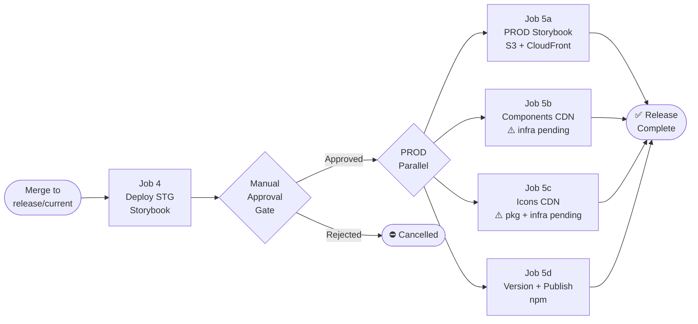

# Release Process — Boreal DS

> The maintainer procedure (preconditions, steps, verification, recovery, rehearsal) is maintained in the tracked `RELEASING.md` at the repository root. This internal guideline keeps the design background and the CI/CD target state; if the two differ, `RELEASING.md` wins.

## Overview

Releases are managed with [release-it](https://github.com/release-it/release-it) + [@release-it/conventional-changelog](https://github.com/release-it/conventional-changelog). Versioning is driven automatically from conventional commit history — no manual changeset files required.

Each publishable package has its own `.release-it.json` config and is released independently. Releases **must run from the `release/current` branch** with a clean working directory.

The full CI/CD pipeline is described in two diagrams, and the release of one package in `ai-docs/diagrams/release-it-publish-flow.md`:

- [`ai-docs/diagrams/pxg-ci-diagram-v3.md`](../diagrams/pxg-ci-diagram-v3.md) — PR validation (Jobs 1–4)
- [`ai-docs/diagrams/pxg-cd-diagram-v3.md`](../diagrams/pxg-cd-diagram-v3.md) — the release job: npm publish, Storybook (Chromatic), Library CDN

`apps/boreal-docs` and `examples/react-testapp` are never published to npm.

---

## Release Model

| Stage | npm org | npm dist-tag | Version format | Audience |
|---|---|---|---|---|
| **Alpha** (current) | `@pxglobal` | `latest` | plain `0.x.y`, starting at `0.14.0` | Internal test client and early adopters |
| **Stable** (future) | `@pxglobal` | `latest` | `1.0.0+` | Production consumers |

Alpha is a stated status (READMEs, Storybook, CONTRIBUTING.md), not a version suffix or dist-tag. `latest` always points at the newest version, so `npm install @pxglobal/<package>` works without a tag. Graduation to `1.0.0` is a deliberate maintainer decision, independent of the npm scope.

Versions up to `0.1.0-alpha.N` were published under `@telesign`. Those packages are deprecated, not unpublished, and their git tags are never deleted.

### Package names

| Package | npm name |
|---|---|
| `packages/boreal-style-guidelines` | `@pxglobal/boreal-style-guidelines` |
| `packages/boreal-web-components` | `@pxglobal/boreal-web-components` |
| `packages/boreal-react` | `@pxglobal/boreal-react` |
| `packages/boreal-vue` | `@pxglobal/boreal-vue` |

### Version progression (`preMajor`, `strictSemVer` off)

While below `1.0.0`, `preMajor` keeps every change out of major bumps:

| Highest commit since last release | Bump | Example |
|---|---|---|
| `feat`, `fix`, `perf`, `revert` | patch | `0.14.0` -> `0.14.1` |
| `BREAKING CHANGE:` footer or `!` | minor | `0.14.1` -> `0.15.0` |
| only `build`, `chore`, `ci`, `docs`, `style`, `refactor`, `test` | none, package skipped | no release |

No commit moves the library to `1.0.0` on its own.

### Path-scoped releases

Each package only counts commits that touch its own folder (web-components also counts style-guidelines; React and Vue also count web-components and style-guidelines). A package with no releasable commits is skipped without failing the chain. Tooling or config commits that touch a package folder must therefore use a non-releasing type.

### Running a release

The procedure — preconditions, dry run, the commands, npm's approval step, verification checklist, recovery table, handling of titles and handles, forcing a specific version, and the rehearsal recipe — is maintained in the tracked **`RELEASING.md`** at the repository root. This guide keeps the design background only, so there is one copy of the steps to keep current.

In short: from a clean `release/current` on macOS or Linux, run `pnpm release:all` (or `release:wc-stack` / `release:styles`) with flags passed without `--`. For each package `release-it` builds, bumps, writes the changelog (web-components and style-guidelines only), publishes, then commits, tags and pushes. The wrappers run `validate:pack:*` as a `prerelease` hook. A design-token change in style-guidelines also triggers web-components and both wrappers.

### Changelogs

Two maintained changelogs: `packages/boreal-web-components/CHANGELOG.md` (components, tokens, React/Vue changes) and `packages/boreal-style-guidelines/CHANGELOG.md` (tokens). React and Vue have a pointer file only. Release notes are surfaced on the Storybook "What's new" page, and the newest heading of each changelog is linked to its Bitbucket compare page by a hook (`scripts-boreal/README.md`, Release helpers).

### Graduating to `1.0.0`

Decided by maintainers once alpha feedback is addressed. Release with `--increment=1.0.0` (see "Forcing a specific version" in `RELEASING.md`); from then on breaking → major, `feat` → minor, `fix` → patch, and `preMajor` can be removed.

### Lessons from the first real release (2026-10-09)

- npm's staged publishing held each publish for a browser approval and created a `0.0.0-stage` placeholder per new package; release-it did not wait for the approval, so tags were pushed up to about two minutes before the versions were installable (`RELEASING.md`, "Approving the publish").
- The generator's compare links are rejected by Bitbucket Server; the working format is produced by a hook script.
- Release pushes skip the slow `pre-push` hook through `git.pushArgs`.
- A bare `@name` in a title becomes a link to a page that does not exist; a breaking change needs the `!` in the PR title because Bitbucket's squash message hides a footer.

---

## CI/CD Integration (Target State)

### Pipeline overview



### Job 5d in detail — release-it step

```groovy
stage('Release Packages') {
  environment {
    NPM_TOKEN = credentials('npm-publish-token')
  }
  steps {
    sh 'echo "//registry.npmjs.org/:_authToken=${NPM_TOKEN}" >> ~/.npmrc'
    sh 'fnm use'
    sh 'pnpm release:all --ci'
  }
}
```

> `--ci` disables interactive prompts. The `npm-publish-token` Jenkins credential must have publish rights for the `@pxglobal` org.

### PR validation — conventional commit enforcement

Conventional commit format is enforced at commit time via commitlint + Husky. No separate CI check is required for changeset files (Changesets has been removed). The commit history itself is the source of truth for versioning.

---

## ⚠️ What's Missing for CI/CD Integration

### Jenkins jobs (none implemented yet)

| Job | Trigger | Purpose |
|---|---|---|
| PR validation (Jobs 1–4) | PR opened/updated | Code quality, tests, build, Storybook |
| CD pipeline (Jobs 4–5d) | Merge to `release/current` | STG deploy → approval → PROD deploy + npm publish |

### Credentials (Jenkins secrets)

| Secret ID | Used in | Purpose |
|---|---|---|
| `npm-publish-token` | Job 5d | npm token with publish rights for the `@pxglobal` org |
| `BITBUCKET_TOKEN` | All jobs | Bitbucket API access for status reporting |
| `AWS_STG_ROLE` | Job 4 | IAM role for STG S3/CloudFront |
| `AWS_PROD_ROLE` | Jobs 5a–5c | IAM role for PROD S3/CloudFront |

### AWS infrastructure (not provisioned)

- S3 buckets: `pxg-storybook-stg`, `pxg-storybook-prod`, `pxg-components-prod`, `pxg-icons-prod`
- CloudFront distributions for each bucket
- IAM roles: `stg-deploy`, `prod-deploy`

### Package and build gaps

| Gap | Notes |
|---|---|
| Icons package | `packages/boreal-icons` does not exist. Job 5c cannot run until created |
| CDN/UMD build | Job 5b expects a UMD bundle. Stencil produces ESM/CJS for npm but not a CDN-ready UMD. Needs a dedicated build target |
| SBOM tooling | `@cyclonedx/cyclonedx-npm` not installed. Add: `pnpm add -D -w @cyclonedx/cyclonedx-npm` |
| `fnm` on agents | Jenkins agents must have `fnm` installed and configured to respect `.node-version` |

---

## Release Manager Checklist

See `RELEASING.md` ("Before you start", "Regular release", "Verification checklist"). The Jenkins `npm-publish-token` credential must belong to the `@pxglobal` organization.
