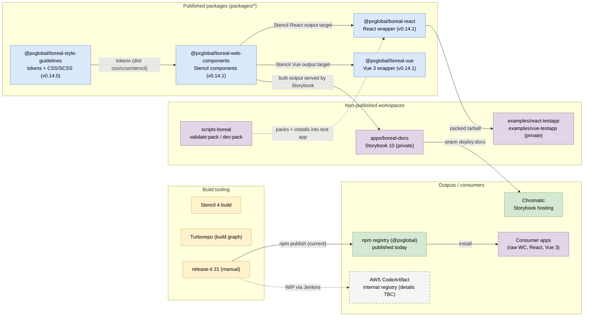

# Boreal DS - monorepo architecture (pnpm workspaces + Turborepo)

Draw.io source: [`boreal-architecture.drawio`](boreal-architecture.drawio)

```mermaid
flowchart LR
    subgraph PUB["Published packages (packages/*)"]
        direction LR
        SG["@pxglobal/boreal-style-guidelines<br/>tokens + CSS/SCSS (v0.14.0)"]
        WC["@pxglobal/boreal-web-components<br/>Stencil components (v0.14.1)"]
        RE["@pxglobal/boreal-react<br/>React wrapper (v0.14.1)"]
        VU["@pxglobal/boreal-vue<br/>Vue 3 wrapper (v0.14.1)"]
    end

    subgraph NONPUB["Non-published workspaces"]
        direction LR
        DOCS["apps/boreal-docs<br/>Storybook 10 (private)"]
        EX["examples/react-testapp<br/>examples/vue-testapp (private)"]
        SB["scripts-boreal<br/>validate:pack / dev:pack"]
    end

    subgraph TOOLING["Build tooling"]
        direction LR
        ST["Stencil 4 build"]
        TU["Turborepo (build graph)"]
        RI["release-it 21 (manual)"]
    end

    subgraph OUT["Outputs / consumers"]
        direction TB
        NPM["npm registry (@pxglobal)<br/>published today"]
        CA["AWS CodeArtifact<br/>internal registry (details TBC)"]
        CH["Chromatic<br/>Storybook hosting"]
        CONS["Consumer apps<br/>(raw WC, React, Vue 3)"]
    end

    SG -- "tokens (dist css/scss/stencil)" --> WC
    WC -- "Stencil React output target" --> RE
    WC -- "Stencil Vue output target" --> VU
    WC -- "built output served by Storybook" --> DOCS
    RE -- "packed tarball" --> EX
    SB -. "packs + installs into test app" .-> RE
    RI -- "npm publish (current)" --> NPM
    RI -. "WIP via Jenkins" .-> CA
    DOCS -- "pnpm deploy:docs" --> CH
    NPM -- "install" --> CONS

    classDef pkg fill:#dae8fc,stroke:#6c8ebf,color:#000
    classDef priv fill:#e1d5e7,stroke:#9673a6,color:#000
    classDef tool fill:#fff2cc,stroke:#d6b656,color:#000
    classDef out fill:#d5e8d4,stroke:#82b366,color:#000
    classDef wip fill:#f5f5f5,stroke:#666,stroke-dasharray:5 5,color:#000
    class SG,WC,RE,VU pkg
    class DOCS,EX,SB,CONS priv
    class ST,TU,RI tool
    class NPM,CH out
    class CA wip
```
