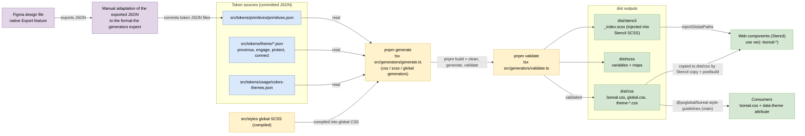

# Design token flow (packages/boreal-style-guidelines)

Draw.io source: [`boreal-token-flow.drawio`](boreal-token-flow.drawio)

```mermaid
flowchart LR
    FIG["Figma design file<br/>native Export feature"]
    MAN["Manual adaptation of the exported JSON<br/>to the format the generators expect"]

    subgraph SRC["Token sources (committed JSON)"]
        direction TB
        P["src/tokens/primitives/primitives.json"]
        TH["src/tokens/theme/*.json<br/>proximus, engage, protect, connect"]
        US["src/tokens/usage/colors-themes.json"]
    end

    GS["src/styles global SCSS (compiled)"]
    GEN["pnpm generate<br/>tsx src/generators/generate.ts<br/>(css / scss / global generators)"]
    VAL["pnpm validate<br/>tsx src/generators/validate.ts"]

    subgraph DIST["dist outputs"]
        direction TB
        CSS["dist/css<br/>boreal.css, global.css, theme-*.css"]
        SCSS["dist/scss<br/>variables + maps"]
        STN["dist/stencil<br/>_index.scss (injected into Stencil SCSS)"]
    end

    WC["Web components (Stencil)<br/>use var(--boreal-*)"]
    CONS["Consumers<br/>boreal.css + data-theme attribute"]

    FIG -- "exports JSON" --> MAN
    MAN -- "commits token JSON files" --> P
    P -- "read" --> GEN
    TH -- "read" --> GEN
    US -- "read" --> GEN
    GS -- "compiled into global CSS" --> GEN
    GEN -- "pnpm build = clean, generate, validate" --> VAL
    VAL -- "validated" --> CSS
    VAL --> SCSS
    VAL --> STN
    STN -- "injectGlobalPaths" --> WC
    CSS -- "copied to dist/css by Stencil copy + postbuild" --> WC
    CSS -- "@pxglobal/boreal-style-guidelines (main)" --> CONS

    classDef design fill:#e1d5e7,stroke:#9673a6,color:#000
    classDef src fill:#dae8fc,stroke:#6c8ebf,color:#000
    classDef step fill:#fff2cc,stroke:#d6b656,color:#000
    classDef out fill:#d5e8d4,stroke:#82b366,color:#000
    class FIG,MAN design
    class P,TH,US src
    class GS,GEN,VAL step
    class CSS,SCSS,STN,WC,CONS out
```
