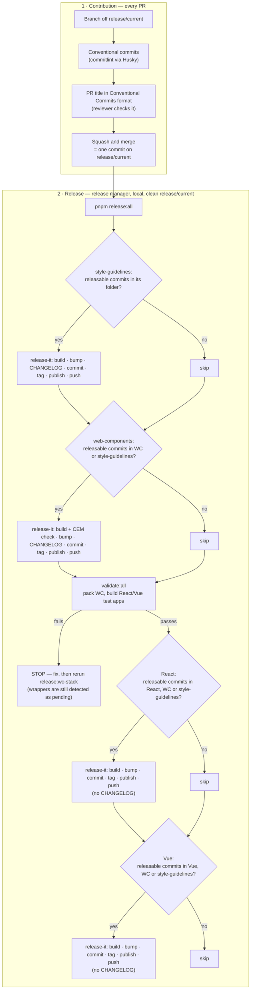

# Release Process Remediation (Option A: patch `release-it`) Implementation Plan

> **For Claude:** REQUIRED SUB-SKILL: Use executing-plans to implement this plan task-by-task.

**Goal:** Make the alpha release process correct and shareable — escalating versions, two accurate changelogs (web-components and style-guidelines), no empty releases, wrappers always pinned to the current web-components version, working Bitbucket Server links — and move publishing to the `@pxglobal` npm scope while staying on the `-alpha.N` track.

**Ticket brief:** [`ai-work/tickets/EOA-18749-release-process-remediation.md`](../tickets/EOA-18749-release-process-remediation.md)

**Architecture:** Keep `release-it` + `@release-it/conventional-changelog` (ADR 0013, Option A, accepted 2026-10-01). Every fix is native configuration in the four `.release-it.json` files plus root `package.json` scripts — no custom release scripts. Upgrading to `release-it@21` + `@release-it/conventional-changelog@12` (T0) makes skipping packages without releasable commits native: preset 10.x gives only `feat`/`fix`/`perf`/`revert` the `bump` effect (all other standard types are `hidden`), so a window with none of them yields no bump, and plugin 12 no longer falls back to a prerelease increment. Release topology (not drift detection) keeps wrappers pinned: each package's "has it changed?" check also counts the folders it is built from, so a style-guidelines change cascades to web-components and both wrappers, and a web-components change cascades to both wrappers.

**Tech Stack:** Node `22.23.3`, `release-it@21.1.0`, `@release-it/conventional-changelog@12.0.2` (preset `conventionalcommits`) — target versions after T0, re-fetched from the npm registry at execution time; installed before T0: Node `22.21.1`, `release-it@19.2.4`, plugin `10.0.5`; pnpm workspaces, Turborepo, Bitbucket Server (`origin` = project `DEV`).

**Related:** ADR `ai-docs/decisions/0013-release-tooling-release-it-vs-changesets.md` · rubric `ai-work/research/2026-10-01-EOA-18749-release-tooling-rubric.md` · rejected alternative `EOA-18749-release-process-remediation-migrate-changesets.md`

---

## Files to create / modify

| File                                                                                                                                   | Notes                                                                                                                               |
| -------------------------------------------------------------------------------------------------------------------------------------- | ----------------------------------------------------------------------------------------------------------------------------------- |
| `packages/boreal-web-components/CHANGELOG.md` | Modify — maintained changelog (also covers React/Vue): backfill (T1), link rewrite (T6), trim to own entries (T7), "moved" notice (T10) |
| `packages/boreal-react/CHANGELOG.md` | Modify — replaced by a pointer to the web-components changelog (T7); scope name in pointer (T10) |
| `packages/boreal-vue/CHANGELOG.md` | Modify — replaced by a pointer to the web-components changelog (T7); scope name in pointer (T10) |
| `packages/boreal-styleguidelines/CHANGELOG.md` | Modify — maintained changelog: T6, trim to own entries (T7), "moved" notice (T10); path changes in T9 |
| `packages/boreal-*/.release-it.json` (×4) | Modify — `strictSemVer` + `preMajor` (T2), path scoping + header prefix + wrapper changelogs off (T3), skip-unchanged (T4), link formats (T5), scope + `latest` tag (T10) |
| `package.json` (root)                                                                                                                  | Modify — `release:wc-stack`, `release:all` recomposed (T4); `--filter` names (T10)                                                  |
| `.node-version`, `.nvmrc`, `README.md` | Modify — Node `22.23.3` (T0) |
| `package.json` (root) devDependencies, `pnpm-lock.yaml` | Modify — `release-it`, `@release-it/conventional-changelog` upgrade (T0) |
| `packages/boreal-*/package.json` (×4)                                                                                                  | Modify — `repository.url` (T5); `name` + workspace deps (T10)                                                                       |
| `packages/boreal-styleguidelines/` → `packages/boreal-style-guidelines/`                                                               | Rename (T9)                                                                                                                         |
| `.lintstagedrc.js`, `README.md`, `packages/boreal-style-guidelines/README.md`, `packages/boreal-web-components/scripts/copy-styles.js` | Modify — folder-name references (T9)                                                                                                |
| 135 tracked files containing `@telesign` (excluding CHANGELOGs and lockfile)                                                           | Modify — scope rename (T10); grouped list in T10                                                                                    |
| `pnpm-lock.yaml`                                                                                                                       | Regenerate — T9, T10                                                                                                                |
| `CONTRIBUTING.md`                                                                                                                      | New — workspace root (T11)                                                                                                          |
| `apps/boreal-docs/src/stories/welcome.mdx` | Modify — scope-agnostic version (T10); alpha \"Release status\" section, Proximus Global wording (T11b) |
| `apps/boreal-docs/src/stories/changelog.mdx` | New — public Changelog page rendering the two maintained changelogs (T11b) |
| `apps/boreal-docs/src/utils/changelog.ts` + spec | New — strips internal Bitbucket links before rendering (T11b) |
| `README.md`, `apps/boreal-docs/README.md`, `apps/boreal-docs/src/stories/layouts/bds-grid/bds-grid.mdx` | Modify — \"Proximus Group\" → \"Proximus Global\" (T11b) |
| `ai-docs/guidelines/release-process.md`                                                                                                | Modify — untracked doc, rewritten for the new model (T11)                                                                           |

---

## Context

### Defects from the 2026-08-12 audit (re-verified 2026-10-01)

1. **Unparseable squash-merge titles.** Bitbucket Server prefixes squash commits with `Pull request #N: `, which no `headerPattern` accepts, so `@release-it/conventional-changelog` drops them. Re-verification against `release/current` found **8 squash commits**; 5 of them carry user-facing changes missing from published changelogs (see T1). The original audit's `bds-table` v4 example (`d3bb6f51`) is not on `release/current` — v4 landed as conventional commit `7a1e4a53` and _is_ in the changelog. 103 other `Pull request #` commits are true merge commits whose branch commits are parsed normally. Title-format compliance stays unenforced (no server-side hook access — former A1, not viable).
2. **No per-package path scoping.** All four configs read the whole repo log, producing byte-identical shared entries across web-components/React/Vue.
3. **Version base never escalates.** In a prerelease, the plugin only bumps the prerelease counter unless `strictSemVer` is set (`index.js:123` of plugin 10.0.5; same behaviour in 12.0.2), violating `feat`→MINOR / `fix`→PATCH.
4. **Broken links.** All ~2,560 historical links use `bitbucket.c11.telesign.com/7999/dev/boreal-ds/commit/<hash>` (derived from the SSH remote). `repository.url` is inconsistent: web-components still has the Stencil starter URL; React/Vue point at project `SAN`; style-guidelines at `scm/san/...`. Confirmed project: **`DEV`** (matches `origin`).
5. **Wrapper pin drift.** `workspace:*` becomes an exact web-components version at publish time; a wrapper that doesn't release keeps the stale pin.

### Confirmed decisions

- Option A (patch `release-it`). **Squash and merge is the required merge strategy** — documented in CONTRIBUTING.md (T11); enforcing it in Bitbucket's repository merge-strategy settings needs admin access and is raised with DevOps (T14). With squash-only, the PR title is the only changelog/bump source.
- **No empty releases.** A package is released only when its trigger folders contain at least one **releasable** commit since its last tag — `feat`, `fix`, `perf`, `revert`, or a breaking change (`!` / `BREAKING CHANGE:`). Commits of other types (`docs`, `test`, `chore`, `style`, `refactor`, `build`, `ci`) never trigger a release on their own; they ship with the next releasable change. Skipped packages exit 0 ("No new version to release") and the chain continues. Native after T0 (verified in T2 against preset 10.4.0 `whatBump.js`/`constants.js`): the preset's default type table gives `feat`/`fix`/`perf`/`revert` the `bump` effect and every other standard type `hidden`, so a window without them returns a null bump, plugin 12 returns no version for a null bump (`if (!releaseType) return null;`), and `release-it@21` then logs "No new version to release" and exits (`lib/index.js` ~L134). (Plugin 10 instead fell back to a `prerelease` increment, which is why T0 comes first.) Exception: the first `@pxglobal` release publishes all four packages (they are new npm packages) — packages with no releasable commits get an explicit `--increment=prerelease` in T16.
- **Commit-type table** (decided 2026-10-01, plain titles): preset 10.4.0's **built-in defaults already are this table** — `feat` → "Features", `fix` → "Bug Fixes", `perf` → "Performance Improvements", `revert` → "Reverts" (visible + bump); `docs`, `style`, `chore`, `refactor`, `test`, `build`, `ci` hidden (no changelog, no bump); unknown types never bump. No `types` override and no `bumpStrict` (that option no longer exists in 10.x) are needed; the same table appears in CONTRIBUTING.md. Per-type bump levels (BEEQ-style `semverBump`) rejected: they need a JS config, which breaks `check-cem-changes.ts`.
- **Consumer-visible changes are typed `fix`/`feat`** regardless of the kind of work (e.g. `fix(web-components): …` for a Stencil config change that alters output, `fix(deps): …` for runtime dependencies; `chore(deps): …` for devDependencies) — the convention used by semantic-release and Renovate. Documented in CONTRIBUTING.md (T11).
- **Release topology.** `release:styles` is independent. `release:wc-stack` = web-components → `validate:all` → React → Vue. Trigger folders: style-guidelines = its own; web-components = its own + style-guidelines (decision (a): tokens are compiled into web-components at build time via `stencil.config.ts:8` and `copy-styles.js`); React/Vue = their own + web-components + style-guidelines. Version bumps stay scoped to each package's own folder, except web-components, whose bump also counts style-guidelines commits.
- **npm scope `@pxglobal`** (`@proximus` is taken). Rename happens during alpha, as the last code task before the end-to-end test. Versions restart at an explicit `0.14.0` (see below); `git.tagMatch` or anchor tags bridge the tag-name change; both maintained changelogs keep their history plus a one-line "moved" notice; `latest` tracks the newest alpha (`"tag": "latest"`). Old `@telesign` packages are deprecated, never unpublished.
- **Two maintained changelogs** (decided 2026-10-01): `boreal-web-components/CHANGELOG.md` (the product changelog — its own changes, token changes from style-guidelines, and wrapper-only changes labelled by scope) and `boreal-styleguidelines/CHANGELOG.md` (token changes). React and Vue still version, tag, and publish, but write no changelog (`infile: false`); their `CHANGELOG.md` becomes a pointer to web-components'. Evidence: 100% of the 536 React and 699 Vue historical entries duplicate web-components entries, and only 6 / 11 of them touched the wrapper; no CHANGELOG ships in any npm tarball (`files` field); BEEQ keeps a single changelog. Trade-off (accepted 2026-10-01, option 1): a wrapper-only change appears under the *next* web-components release, not under the wrapper's own version; documented in CONTRIBUTING.md. Alternatives considered — wrapper changelogs scoped to own changes (option 2) and BEEQ-style fixed versioning (option 3, conflicts with no-empty-releases) — revisit option 3 in T17.
- Folder rename `boreal-styleguidelines` → `boreal-style-guidelines`, done just before the scope rename so its triggered releases fold into the first `@pxglobal` release.
- **0.x version policy — `preMajor: true`** (decided 2026-10-02, option 2): while below `1.0.0`, breaking → minor, `feat`/`fix`/`perf`/`revert` → patch (the preset shifts every level down one). Breaking changes never push the library to `1.0.0`/`2.0.0` during alpha. Feature vs. fix is still visible in the changelog sections, not in the version number.
- **No prerelease suffix under `@pxglobal`; first version `0.14.0`** (decided 2026-10-02). Rationale: with `latest` = newest version the suffix no longer prevents accidental installs, `0.x` already signals instability, and plain versions let consumers' `^0.14.0` ranges pick up fixes/features automatically while stopping at the next breaking change (`0.15.0` under `preMajor`). `0.14.0` comes from replaying the full git history under the documented `feat` → minor standard (web-components and React reach `0.14.0` including pending commits; 5 → 81 components since the first release). PR 1 keeps `preRelease: "alpha"` + `strictSemVer` so any interim `@telesign` release stays on the alpha line; Task 10 removes both and the first `@pxglobal` release uses `--increment=0.14.0`.
- **Alpha stays as the stated status**, not in the version string: README badge/notice per package, the Storybook welcome page, and CONTRIBUTING.md. Confirm with the epic owner (EOA-18400 says "remains in alpha this PI") that this means status, not a version suffix — before Task 10.
- **Public docs** (decided 2026-10-02): Storybook is a public static site and Bitbucket is internal, so release notes are published as a Storybook **Changelog** page (option C) rendering the two maintained changelogs, with every internal Bitbucket link (commit hashes, compare links — 711 in web-components' file) stripped at render time. The welcome page states the alpha status (versioning rules, `@telesign` migration, contact, link to the Changelog page). Company name: **Proximus Global**.
- Alpha graduation: stay at `0.x` until real-world feedback is addressed; then go straight to `1.0.0` with one deliberate release (`--increment=1.0.0`, optionally preceded by `1.0.0-rc.N`) and remove `preMajor` from all four configs (T17).
- **History across the scope move** (decided 2026-10-02): old `@telesign` versions are **not** republished under `@pxglobal` (npm cannot move versions between names; rebuilding ~44 old versions would publish new builds, not the shipped code). History is carried by: the repo CHANGELOGs (kept in full, with a "moved" notice), `@telesign/*` git tags (**never deleted** — historical compare links depend on them), `CHANGELOG.md` shipped inside the two maintained tarballs, a "previously published as" note in each README, and the `npm deprecate` message on every `@telesign` version. The move itself is a changelog entry: the rename lands as `feat(release): …` with a `BREAKING CHANGE:` footer, and the first release sets all four packages to `0.14.0` explicitly.
- CHANGELOG cleanup: tier 1 required, tier 2 recommended, tier 3 open decision (T13).

### Expected release process



Releasable = `feat`, `fix`, `perf`, `revert`, or breaking. Each "releasable commits" check looks at commits since **that package's own** last tag.

| Merged PR (squash commit) | Released |
| --- | --- |
| `fix(web-components): …` | web-components, React, Vue |
| `feat(styles): …` in style-guidelines | all four |
| `fix(vue): …` only in `packages/boreal-vue` | Vue only (changelog entry appears under the next web-components release) |
| `test(…)`, `docs(…)`, `chore(…)`, `refactor(…)` only | nothing — ships with the next releasable change |
| Docs app only (`apps/boreal-docs`) | nothing (Storybook deploys separately) |

### Shared dry-run recipe

All `release-it` validation in this plan is dry-run only, run from the repo root on the feature branch:

`pnpm --filter <package-name> exec release-it --dry-run --ci --no-git.requireBranch --no-git.requireCleanWorkingDir --no-git.requireUpstream --no-npm.publish`

The last two flags are needed only on a feature branch without upstream and without npm login (confirmed in T0, 2026-10-02: release-it 21's strict CLI parsing accepts all of them; without `--no-npm.publish` the npm plugin runs `npm whoami` even in dry-run). After upgrading in an existing checkout, run `rm -rf node_modules && pnpm install` — a leftover hoisted preset 9.x makes every dry run fail with `headerPartial is not a function`. Never run without `--dry-run`. Never push tags.

---

## Jira Alignment (EOA-18749)

| EOA-18749 acceptance criterion                             | Covered by                        |
| ---------------------------------------------------------- | --------------------------------- |
| Meeting with DevOps (Branislav)                            | T14 (EOA-18870)                   |
| Prioritize public NPM registry                             | T10 + EOA-18864 (external)        |
| CI fails if React/Vue wrappers cannot generate             | T15 — deferred until EOA-18870    |
| Wrapper-generation smoke test in CI                        | T15 — deferred                    |
| Release automation reviewed and consistent across packages | ADR 0013 + T2–T5                  |
| Release order documented or automated end-to-end           | T4 (automated) + T11 (documented) |
| Dry-run release validated                                  | Every config task + T8            |
| Alpha versioning policy documented                         | T2 + T11                          |

| Sub-task | Status (2026-10-02) | Plan task |
| --- | --- | --- |
| EOA-18863 — 01-Initial Review | Closed | Audit + ADR 0013 |
| EOA-18864 — 02-Create Proximus NPM Organization & Users | In Progress | External prerequisite for T16 (`@pxglobal` org) |
| EOA-18867 — 03-Decide Package Strategy for Stable Version | In Progress | 0.x/`preMajor` policy, `0.14.0` start, no suffix (decided); graduation path T17 |
| EOA-18940 — 04-Harden Release Tooling & Versioning | Open | T0, T0c, T2–T5, T8, T8b Windows gate, T8c upgrade guide (PR 1) |
| EOA-18868 — 05-Perform CHANGELOG cleanup | Open | T1, T6, T7 (PR 1); T13 tier 3 decision |
| EOA-18865 — 06-Rename the NPM Scope in the Codebase | In Progress | T9, T10 (PR 2) |
| EOA-18869 — 07-Create CONTRIBUTING.md file and Document Policies | Open | T11, T11b (PR 2); T21 internal docs |
| EOA-18866 — 08-Test New Release & Deployment Process with One User | Open | T16 (after teammate's PTO) |
| EOA-18938 — 09-Create a System Information Confluence Page | Open | T21 (Confluence part) |
| EOA-18870 — 10-Meet with Branislav from DevOps Team to Review Commitments for PI9 | Open | T14 |

---

## Progress (updated 2026-10-05)

Branch `chore/EOA-18749_release-tooling-hardening` (PR 1), local only, not pushed. Task 0 includes the commitlint 21 upgrade that was folded in.

| Task | Status | Commit |
| --- | --- | --- |
| T0 Node + release tooling (+ commitlint 21) | done | `0252c7b3` |
| T0c pnpm 11.28.2 | done | `714b9320` |
| T1 Changelog backfill (6 entries) | done | `b4c6ee0b` |
| T2 `strictSemVer` + `preMajor` | done | `fa0ee7eb` |
| T3 Path scoping, header patterns, wrapper changelogs off | done | `c36b5522` |
| T4 pnpm-native orchestration + wrapper gates | done | `0e43dbaa` |
| T5 Bitbucket Server links (`commitUrlFormat`/`compareUrlFormat`, `repository.url`) | **next** | — |
| T6 Changelog link rewrite · T7 Trim + wrapper pointers · T8 Wrapper-only release check | pending (PR 1) | — |
| T8b Windows verification gate · T8c Contributor upgrade guide | pending (PR 1, before merge) | — |
| T9 Folder rename · T10 Scope rename + `0.14.0` · T11 CONTRIBUTING.md · T11b Storybook | pending (PR 2) | — |
| T12 ADR close-out · T21 Docs sync · follow-ups T13–T26 | pending / after first release | — |

## Tasks

### Task 0: Upgrade Node and release tooling

**Status: done 2026-10-02/05 — committed `0252c7b3` (manual tests run and passed).**

**Executor:** @release-subagent
**Files:**

- `.node-version`, `.nvmrc` (modify — `22.23.3`)
- `README.md` (modify — Node version mention)
- `package.json` (root, modify — devDependencies: `release-it`, `@release-it/conventional-changelog`, `@commitlint/cli`, `@commitlint/config-conventional`, `@commitlint/cz-commitlint`)
- `pnpm-lock.yaml` (regenerate)

**Integration research pass:**

- [ ] Versions: fetch `https://registry.npmjs.org/release-it/latest` and `https://registry.npmjs.org/@release-it%2fconventional-changelog/latest` before installing (2026-10-01: `21.1.0` / `12.0.2`); both require Node `^22.22.2 || ^24.15.0 || >=26.0.0`. Latest Node 22 LTS: `22.23.3` (2026-09-23).
- [ ] Breaking changes: `release-it` 20/21 — Node 22.21+ required, strict CLI argument parsing, GitLab certificate checks (not used), `semver` replaced by `verkit` in 21.1. Plugin 11/12 — release-it 20+ peer, "skip prereleases without a recommended bump", "use resolved tag as recommended bump boundary", tag prefix derived from the resolved tag.
- [ ] Call sites: the four `.release-it.json` configs (unchanged in this task), the root `release:*` scripts, `check-cem-changes.ts` (reads `.release-it.json` only — unaffected).
- [ ] Preset resolution (found 2026-10-02): plugin 12 needs `conventional-changelog-conventionalcommits@10.x`, but `@commitlint/config-conventional@20` hoists `9.1.0`, and the preset loader resolves the hoisted one → every dry run fails with `headerPartial is not a function`. Fix: upgrade commitlint to 21 (`@commitlint/cli`, `config-conventional`, `cz-commitlint`; requires Node ≥ 22.12), whose config depends on preset `^10`. Verify a single preset version is installed and the `commit-msg` hook + `pnpm commit` still work.

**Acceptance criteria:**

- Node `22.23.3` in `.node-version` and `.nvmrc`; README matches.
- `release-it`, `@release-it/conventional-changelog` and the three `@commitlint/*` packages at the fetched latest versions; no other dependency changes; a single `conventional-changelog-conventionalcommits` version (10.x) installed.
- Existing configs still load; the shared dry-run recipe's flags are accepted under strict CLI parsing (correct the recipe in Context if not).

**Manual test _(required — not waiveable)_:**

- [ ] Given `fnm use` (installing `22.23.3`) and a fresh `pnpm install`, when running `pnpm build`, `pnpm test`, and `pnpm validate:all`, then all pass. Pass: green.
- [ ] Given the dry-run recipe for each of the four packages (recipe corrected to add `--no-git.requireUpstream --no-npm.publish` on a feature branch without upstream or npm login), then each completes without config or CLI errors. Pass: 4/4 previews, no publish/tag/commit.
- [ ] Given a throwaway commit attempt with an invalid message and then a valid one on a scratch branch, then `commit-msg` rejects the first and accepts the second; `pnpm commit` starts its prompt. Pass: commitlint 21 works with the repo's custom rules and scope list.

**Commit:** `build(release): EOA-18749 upgrade Node to 22.23.3, release-it and commitlint to latest`

---

### Task 0c: Update pnpm to the latest 11.x

**Status: done 2026-10-02/05 — committed `714b9320` (manual tests run and passed).**

**Executor:** @release-subagent
**Files:** `package.json` (root — `packageManager` and, if needed, `engines.pnpm`), `pnpm-lock.yaml` (only if pnpm rewrites it), `README.md` (pnpm version mentions)

**Integration research pass:**

- [ ] Version: fetch `https://registry.npmjs.org/pnpm` and use the `latest-11` dist-tag (2026-10-02: `11.28.2`; `latest` is 12.x — out of scope, see T24). Pin with `corepack use pnpm@latest-11` (writes `packageManager` with the hash).
- [ ] Context7 (pnpm docs): pnpm 11 keeps `.npmrc` for registry/auth only and pnpm settings in `pnpm-workspace.yaml`; no `pnpm` field in `package.json`; `npm_config_*` env vars are no longer read — confirm none of the repo scripts rely on them.
- [ ] Call sites: README mentions pnpm 11 and `corepack use pnpm@latest-11`; `ai-docs/guidelines/cicd-dependency-installation.md` says v10.7.1 (stale, fixed in T21).

**Acceptance criteria:**

- `packageManager` pins the fetched `latest-11` version; installing with `--frozen-lockfile` is clean (lockfile unchanged or only the expected rewrite, committed in the same change).
- No other dependency changes.

**Manual test _(required — not waiveable)_:**

- [ ] Given `corepack enable` and a clean `rm -rf node_modules && pnpm install --frozen-lockfile`, when running `pnpm -v`, `pnpm build`, `pnpm test`, `pnpm validate:all`, then all pass. Pass: green.
- [ ] Given the dry-run recipe for each of the four packages, then results match Task 3's table (style-guidelines "No new version to release"; web-components/react/vue `0.1.1-alpha.0`). Pass: unchanged.

**Commit:** `build(workspace): EOA-18749 update pnpm to the latest 11.x`

---

### Task 1: Backfill changelog entries lost to squash-merge titles

**Status: done 2026-10-02/05 — committed `b4c6ee0b` (manual tests run and passed).**

**Executor:** main thread
**Files:**

- `packages/boreal-web-components/CHANGELOG.md` (modify)

**Integration research pass:**

- [ ] Call sites: the plugin only prepends new sections above existing ones — editing older sections by hand is safe for future runs.
- [ ] Boundary case: `fae7c6fd` (#183 tree-menu, `feat(...)` title) is not yet released — it must **not** be backfilled; T3's header-prefix fix picks it up in the next release.
- [ ] Default: non-user-facing squashes (`e0f480f9` #148 chore, `dcf35283` #26 docs) get no entry, matching the preset's hidden types.
- [ ] Two-changelog model: #112 also touched React/Vue, but wrapper changelogs become pointers (T7) — web-components only.

**Acceptance criteria:**

- One entry per PR, under the first web-components version whose tag contains it (`git tag --contains <hash>`):

  | PR                      | Commit     | Section  | Version                                                                                                                          |
  | ----------------------- | ---------- | -------- | -------------------------------------------------------------------------------------------------------------------------------- |
  | #112 toast | `bdda44c4` | Features | `0.1.0-alpha.7` |
  | #122 autocomplete multi | `a5fac247` | Features | `0.1.0-alpha.7`                                                                                                                  |
  | #146 bds-table v2       | `7c7f3836` | Features | `0.1.0-alpha.9`                                                                                                                  |
  | #159 bds-table v3       | `fab67bea` | Features | `0.1.0-alpha.10`                                                                                                                 |
  | #173 bds-setting-step   | `f3ee62eb` | Features | `0.1.0-alpha.12`                                                                                                                 |
  | bds-banner (`feat/EOA-10054 banner component`, no `type:`) | `afead60b` | Features | `0.1.0-alpha.0` |

- Completeness scan (2026-10-02): every non-merge commit touching the four packages (~1,200) was run against the exact `headerPattern`. 35 fail to parse in the web-components/style-guidelines windows: the 5 PRs above, #183 (unreleased), 2 docs-only PRs (hidden types), `afead60b` (banner, above), `18322e0b` (`feat/refine-tokens-docs`, borderline — not backfilled), and ~25 Dec 2025–Feb 2026 bootstrap commits (not backfilled). React/Vue folders add only bootstrap commits. Only standard commit types exist in history (no hidden-type typos).
- Entry format matches neighbouring generated lines (`* **web-components:** <description> ([<short-hash>](<link>))`), with the link already in the corrected `/projects/DEV/repos/boreal-ds/commits/<hash>` form so T6's rewrite doesn't need to handle it.
- Descriptions are consumer-facing (use the plan/ticket title, e.g. "add bds-table v3: dataset mode, column footer, server-side loading, virtualization"), not the raw branch name.

**Manual test _(required — not waiveable)_:** non-visual; validate by inspection.

- [ ] Given each backfilled hash, when running `git tag --contains <hash>` for the package, then the earliest tag matches the section the entry was placed in. Pass: all 6 entries placed correctly.
- [ ] Given the edited files, when previewed as Markdown, then lists and links render without breaking neighbouring entries. Pass: no formatting regressions.

**Commit:** `docs(release): EOA-18749 backfill changelog entries lost to squash-merge titles`

---

### Task 2: Version escalation via `strictSemVer` and the 0.x policy (`preMajor`)

**Status: done 2026-10-02/05 — committed `fa0ee7eb` (manual tests run and passed).**

**Executor:** @release-subagent
**Files:**

- `packages/boreal-styleguidelines/.release-it.json` (modify)
- `packages/boreal-web-components/.release-it.json` (modify)
- `packages/boreal-react/.release-it.json` (modify)
- `packages/boreal-vue/.release-it.json` (modify)

**Integration research pass:**

- [ ] Call sites: the bump decision is made once, inside the plugin (escalates only when `strictSemVer` is set or the latest version isn't a prerelease — re-check the line in plugin 12 after T0). All four configs need the flag.
- [ ] Boundary case: a history with only hidden types — handled in T3 by the preset's default type effects; record the current behaviour here for comparison.
- [ ] Default: the alpha counter resets to `.0` on each base escalation (e.g. `0.1.0-alpha.12` → `0.1.1-alpha.0`) — expected.
- [ ] `preMajor` is a preset option, so this task switches the `preset` field to the object form `{ "name": "conventionalcommits", "preMajor": true }`; T3 keeps this object unchanged (no `bumpStrict`/`types`). Re-check `preMajor` handling in the preset version installed by T0 (`whatBump.js`: level shifts down one when `preMajor` is set).
- [ ] Pending commits measured 2026-10-02 against `origin/release/current`: web-components, React and Vue each have 8 `feat` commits and 0 breaking in their bump paths; style-guidelines has none.

**Acceptance criteria:**

- `"strictSemVer": true` and the preset object with `"preMajor": true` are set in the `@release-it/conventional-changelog` block of all four configs.
- While below `1.0.0`: breaking → `preminor`; `feat`/`fix`/`perf`/`revert` → `prepatch`; all staying on the `alpha` prerelease id.
- The shared dry-run recipe's override flags are confirmed working (or the recipe in Context is corrected).

**Manual test _(required — not waiveable)_:** dry-run only.

- [ ] Given web-components at `0.1.0-alpha.12` with 8 `feat` commits and no breaking ones since its tag, when running the dry-run recipe, then the proposed version is `0.1.1-alpha.0`. Pass: base escalates (patch, per `preMajor`); no plain `alpha.13`.
- [ ] Given a throwaway local commit with a `BREAKING CHANGE:` footer in web-components (scratch branch, deleted afterwards), when dry-running, then the proposed version is `0.2.0-alpha.0`. Pass: breaking → minor; never `1.0.0-alpha.0`. This also confirms the custom `parserOpts` keep the preset's `BREAKING CHANGE` note keyword.
- [ ] Given each of the other three packages, when dry-run, then the proposed version matches the highest commit type since its tag. Pass: no publish, no tag, no commit.

**Commit:** `build(release): EOA-18749 escalate prerelease versions with strictSemVer and 0.x preMajor policy` (committed)

---

### Task 3: Path-scoped changelog/bump and squash-prefix parsing

**Status: done 2026-10-02/05 — committed `c36b5522` (manual tests run and passed).**

**Executor:** @release-subagent
**Files:**

- `packages/boreal-*/.release-it.json` (×4, modify)

**Integration research pass:**

- [ ] Call sites: both commit readers need the path — `commitsOpts.path` (bump recommendation, `GetCommitsParams`) and `gitRawCommitsOpts.path` (changelog text, `GitLogParams`); both accept `string | string[]` (installed `@conventional-changelog/git-client` types). Setting only one leaves the other reading the whole repo.
- [ ] Paths per package — bump (`commitsOpts.path`, which is also the release trigger) / changelog (`gitRawCommitsOpts.path`): style-guidelines `.` / `.`; web-components `.` + `../boreal-styleguidelines` / `.` + `../boreal-styleguidelines` + `../boreal-react` + `../boreal-vue` (wrapper-only changes are listed but never bump web-components); React/Vue `.` + `../boreal-web-components` + `../boreal-styleguidelines` / no changelog (`infile: false`).
- [ ] Boundary case: with the preset's default types (no override) a window with only hidden types (or no commits) yields a null bump → "No new version to release", exit 0.
- [ ] Breaking-change header (T2 finding, 2026-10-02): `feat(scope)!: …` IS recognised as breaking (the preset's own `breakingHeaderPattern` still applies, bump `0.2.0-alpha.0` under `preMajor`), but the custom `headerPattern`'s ticket-ID prefix group is not used for `!` headers, so the changelog subject keeps the ticket ID (e.g. `EOA-18749 scratch bang change`). Task 3 keeps the `!` handling and makes the ticket ID strip for `!` headers too (extend `headerPattern` with an optional `!`, or drop the custom `parserOpts` in favour of the preset's parser plus only the optional `Pull request #N: ` prefix and ticket-ID stripping).
- [ ] Boundary case: with `infile: false`, confirm the wrapper release still runs (version, tag, publish) and nothing is written to its `CHANGELOG.md`.
- [ ] Boundary case: the header prefix is optional — plain conventional commits and `Pull request #N: type(scope): …` must both parse; branch-name titles (`Pull request #159: Feature/EOA-15507 …`) still don't parse (accepted gap).
- [ ] Coupling: `check-cem-changes.ts` reads `npm.tag` only — unaffected.
- [ ] Forward note: T9 renames the style-guidelines folder — every path added here is updated there.

**Acceptance criteria:**

- Both path fields set per the paths listed above; React and Vue have `infile: false`.
- `headerPattern` accepts an optional leading `Pull request #<digits>: ` and still yields `type`, `scope`, `subject`.
- No other parser behaviour changes (existing ticket-ID stripping preserved).
- All four configs keep the preset object form from T2 (`{ "name": "conventionalcommits", "preMajor": true }`) and rely on the preset's default type table from Context — no `types` override, no `bumpStrict`.

**Manual test _(required — not waiveable)_:** dry-run only.

- [ ] Given the dry-run recipe for React, when it completes, then a version and tag are proposed and no changelog write is planned. Pass: `CHANGELOG.md` untouched.
- [ ] Given the dry-run for web-components, when inspecting the preview, then it contains only commits that touched web-components, style-guidelines, or a wrapper folder. Pass: no docs-app-only or tooling-only entries.
- [ ] Given the dry-run for web-components, when inspecting the preview, then `fae7c6fd` (#183 tree-menu) appears as a feature. Pass: squash prefix parsed.
- [ ] Given the dry-run for style-guidelines, when inspecting the preview, then it is empty or contains only style-guidelines commits. Pass: no cross-package leakage.
- [ ] Given the web-components preview, then only the sections Features / Bug Fixes / Performance Improvements / Reverts appear, with those exact titles. Pass: no hidden types listed.
- [ ] Given a scratch `feat(web-components)!: EOA-18749 …` commit, then it is breaking (minor bump under `preMajor`) AND its changelog subject has no ticket ID. Pass: `!` handled cleanly.
- [ ] Given style-guidelines (no releasable commits since `alpha.3` in its folder — only valid when no `fix`/`feat` commit on the branch touches `packages/boreal-styleguidelines`, so release-tooling commits on this branch must be typed `build`/`chore`), when dry-running, then it reports "No new version to release" and exits 0. Pass: native skip works.
- [ ] Given React, when dry-running, then the proposed bump follows web-components' commits (`0.1.0-alpha.14` → `0.1.1-alpha.0` from the pending `feat` commits). Pass: wrapper picks up web-components changes.

**Commit:** `build(release): EOA-18749 scope changelogs and bumps per package, parse squash-merge titles` (committed; header ≤ 100 characters is enforced by commitlint)

---

### Task 4: Web-components stack orchestration (pnpm-native)

**Status: done 2026-10-02/05 — committed `0e43dbaa` (manual tests run and passed).**

**Executor:** @release-subagent
**Files:**

- `package.json` (root, modify — scripts only)
- `packages/boreal-react/package.json`, `packages/boreal-vue/package.json` (modify — `prerelease` gate scripts)

**Design (decided 2026-10-02 after comparing Turborepo, `npm-run-all2` and pnpm-native):** no new dependency. pnpm already owns the workspace graph: `pnpm --filter … --workspace-concurrency=1 run release <flags>` runs the selected packages' `release` scripts one at a time in dependency order and forwards the flags to every release-it call. Verified read-only against the real repo on pnpm 11.1.1: order styles → web-components → react → vue, flags reach every release-it call. In a throwaway project, a package's `prerelease` script runs before its `release` (also when filtered to a single package) and a failing one stops the chain. Turborepo was evaluated: its docs forward `--` args to all named tasks and `--concurrency=1` serialises, but `release` is stateful and uncached, needs a `^release` ordering edge, and the `validate:all` gate would have to depend on the web-components release (a plain `validate:all` would then trigger a release); the repo also has an earlier Turbo TUI/PTY hang. `npm-run-all2` works but adds a dependency for one chain.

**Integration research pass:**

- [ ] Selectors: `release:all` → `--filter "./packages/*"` (all four); `release:wc-stack` → `--filter "...@telesign/boreal-web-components" --filter "!./apps/*" --filter "!./examples/*"`. pnpm semantics (verified in T4 with Context7 and by listing the selection): `name...` = the package and its **dependencies**, `...name` = the package and its **dependents**; `...web-components` alone also matched `boreal-docs` and the example apps (they depend on it), hence the two exclusions. Result: exactly web-components, react, vue (style-guidelines excluded).
- [ ] Order: topological from `workspace:*` dependencies, including the devDependency edge style-guidelines → web-components; react and vue are independent of each other (order between them not guaranteed on newer pnpm — acceptable).
- [ ] Gates: react and vue each get `"prerelease": "pnpm -w run validate:pack:react"` / `"…:vue"` (pnpm pre-script hooks; cross-platform). Replaces the `validate:all` step in the chain and also protects a standalone `release:react` / `release:vue`. Trade-off accepted: each wrapper validates just before its own release; the gate runs even when release-it would skip.
- [ ] `validate:pack` restores, with `git checkout HEAD --` on exit, exactly three paths (verified in T4): the framework wrapper's `package.json`, the framework test app's `package.json`, and the root `pnpm-lock.yaml` — it does NOT touch the root `package.json`. It cannot undo a release bump (release-it commits the bump before the next package's gate runs) but it discards uncommitted edits to those files, so commit edits to wrapper `package.json`/lockfile before running a gate (follow-up T23). Residual risk: if a gate fails after web-components was published, web-components stays released and the wrappers do not; rerunning is safe because web-components then skips.
- [ ] `release:publish` stays `release:all` + `deploy:docs` (inspect only; do not run).
- [ ] Usage: flags are passed WITHOUT `--` (`pnpm run release:all --dry-run --ci …`); with `--` pnpm forwards a literal `--` and release-it fails with "Unexpected positional argument". Document in CONTRIBUTING.md and the release guideline.

**Acceptance criteria:**

- Root scripts: `release:all` and `release:wc-stack` as above; `release:styles|wc|react|vue` unchanged; extra args reach every release-it call.
- No package is released without a releasable commit in its bump paths; when web-components releases, both wrappers release in the same run.
- No new dependency; `pnpm install --frozen-lockfile` clean.

**Manual test _(required — not waiveable)_:** dry-run only on a scratch branch (commits touch a real file inside the relevant package; delete branch and any local scratch tags afterwards). Flags: `--dry-run --ci --no-git.requireBranch --no-git.requireCleanWorkingDir --no-git.requireUpstream --no-npm.publish`.

- [ ] Baseline: style-guidelines "No new version to release"; web-components, react, vue `0.1.1-alpha.0`; the react and vue `prerelease` gates ran; order styles → web-components → react → vue.
- [ ] Nothing pending (local scratch tags `…@0.1.0-alpha.99` at HEAD): all four skip, exit 0.
- [ ] `test(web-components)` only: nothing releases.
- [ ] `fix(web-components)`: web-components, react, vue release; styles skips.
- [ ] `fix(styles)`: all four release.
- [ ] `fix(react)` touching only react: only react releases; `pnpm run release:react <flags>` alone also runs its gate.
- [ ] Failure path: a failing `prerelease` gate (temporary scratch change, not committed) stops before that wrapper's release and exits non-zero.

**Commit:** `build(release): EOA-18749 orchestrate web-components stack release`

---

### Task 5: Bitbucket Server links (forward-only)

**Executor:** @release-subagent
**Files:**

- `packages/boreal-*/.release-it.json` (×4, modify)
- `packages/boreal-*/package.json` (×4, modify — `repository.url` only)

**Integration research pass:**

- [ ] Call sites: links are currently derived from the SSH remote, not `package.json`; fix them via the `conventionalcommits` preset's `commitUrlFormat` / `compareUrlFormat` in plugin config. `repository.url` is fixed for npm metadata consistency.
- [ ] Boundary case: compare links use `@`-containing tag names — verify Bitbucket Server's compare URL accepts them (encode if needed).

**Acceptance criteria:**

- `repository.url` = `https://bitbucket.c11.telesign.com/projects/DEV/repos/boreal-ds` in all four packages (replaces the Stencil starter URL and the `SAN` URLs).
- Commit links: `https://bitbucket.c11.telesign.com/projects/DEV/repos/boreal-ds/commits/<hash>`. Compare links: the Bitbucket Server compare view between the two tags.

**Manual test _(required — not waiveable)_:** dry-run + browser.

- [ ] Given a web-components dry-run, when opening one generated commit link and one compare link in the browser, then both load the right page. Pass: no 404.

**Commit:** `build(release): EOA-18749 generate Bitbucket Server commit and compare links`

---

### Task 6: CHANGELOG cleanup tier 1 — rewrite historical links

**Executor:** main thread
**Files:**

- `packages/boreal-web-components/CHANGELOG.md` (modify)
- `packages/boreal-styleguidelines/CHANGELOG.md` (modify)

**Acceptance criteria:**

- Only the two maintained changelogs are rewritten; the wrapper files are replaced in T7.
- Every `bitbucket.c11.telesign.com/7999/dev/boreal-ds/commit/<hash>` → `/projects/DEV/repos/boreal-ds/commits/<hash>`; every compare link → the format T5 settled on. Mechanical regex rewrite; no other text changes.
- Zero occurrences of `7999/dev/boreal-ds` remain.

**Manual test _(required — not waiveable)_:**

- [ ] Given the rewritten files, when grepping for `7999/dev`, then there are no matches. Pass: 0 hits.
- [ ] Given three random commit links and one compare link per file, when opened in the browser, then each resolves. Pass: no 404.
- [ ] Given `git diff --stat`, then only link text changed (line count unchanged). Pass: identical line counts.

**Commit:** `docs(release): EOA-18749 rewrite historical changelog links for Bitbucket Server`

---

### Task 7: CHANGELOG cleanup tier 2 — trim to own entries and replace wrapper changelogs

**Executor:** main thread
**Files:**

- `packages/boreal-web-components/CHANGELOG.md` (modify)
- `packages/boreal-styleguidelines/CHANGELOG.md` (modify)
- `packages/boreal-react/CHANGELOG.md` (modify — replaced)
- `packages/boreal-vue/CHANGELOG.md` (modify — replaced)

**Integration research pass:**

- [ ] Ownership rule mirrors T3's changelog paths, decided per entry with `git show --name-only <hash>`: web-components keeps entries touching web-components, style-guidelines, React, or Vue; style-guidelines keeps entries touching style-guidelines.
- [ ] Measured 2026-10-01: web-components 699 entries (568 touch web-components or style-guidelines — wrapper-touching entries to be added to that count at execution); style-guidelines 628 entries, 20 touch its folder.
- [ ] Boundary case: entries removed from web-components (docs app, tooling) must not belong to any maintained changelog — they are dropped, not moved.
- [ ] Default: version headings stay even when a section ends up empty, with the line `No changes in this package.`

**Acceptance criteria:**

- Both maintained changelogs contain only entries matching the ownership rule.
- Every React/Vue historical entry is already present in web-components' changelog (verified 100% on 2026-10-01) — re-check before replacing the files.
- React and Vue `CHANGELOG.md` each become a short pointer: the package is generated from `@telesign/boreal-web-components` and released with it; see that package's `CHANGELOG.md` (relative link); history up to the current version is in git.

**Manual test _(required — not waiveable)_:**

- [ ] Given every commit hash in the React and Vue changelogs before the change, when checked against web-components' changelog before trimming, then all are present. Pass: 0 missing.
- [ ] Given ten sampled remaining entries per maintained changelog, when checking their commits' touched paths, then each matches the ownership rule. Pass: 20/20.
- [ ] Given the wrapper pointer files, when rendered, then the relative link opens web-components' changelog. Pass: link resolves on Bitbucket.

**Commit:** `docs(release): EOA-18749 trim changelogs to owned entries and point wrapper changelogs to WC`

---

### Task 8: Validate wrapper-only selective release

**Executor:** @release-subagent
**Files:** none (verification-only)

**Acceptance criteria:**

- Confirms `release:react` / `release:vue` can release a single wrapper for wrapper-only maintenance, without touching web-components or the other wrapper.

**Manual test _(required — not waiveable)_:** dry-run with a throwaway scratch commit touching only `packages/boreal-vue`.

- [ ] Given that commit, when dry-running the stack, then only Vue proposes a release. Pass: React, web-components and style-guidelines skip.

**Commit:** N/A — verification only.

---

### Task 8b: Windows verification gate (teammates)

**Executor:** Windows teammate(s) — a macOS/Linux session cannot run it; main thread prepares and shares the checklist and records the results.
**When:** after Tasks 0–8 are committed and the branch is pushed for PR 1, **before PR 1 is merged**. At least one successful run per shell below is required; repeat the "release flags" part again before the first real release (T16) if the release will be run from Windows.
**Files:** none (verification only). Share the checklist below as the PR 1 description section "Windows verification" and as a comment on EOA-18940 (the Jira subtask is visible to the team; `ai-work/` is not).

**What is Windows-sensitive here:** pnpm runs scripts through `cmd.exe` by default; the new `release:wc-stack` / `release:all` scripts use `run-s "step {@}"` with double-quoted arguments from `npm-run-all2`; release-it hooks use `&&`; path scoping uses relative pathspecs (`../boreal-web-components`); Husky hooks (commitlint) run through Git for Windows; line endings can dirty `git status`; `validate:all` packs and builds the React/Vue test apps. Known earlier Windows issues in this repo: Sass backslash paths, Turbo interactive hang.

**Pre-check without a teammate's machine (no external hosting — the codebase lives only in Bitbucket; never push it to GitHub, decided 2026-10-02):**

1. **Local Windows 11 VM on the developer's Mac** (Parallels, UTM, or VMware Fusion; Microsoft's Windows 11 evaluation/dev images). Everything stays on the machine: clone from Bitbucket inside the VM, run the checklist. On Apple Silicon the guest is Windows 11 ARM — native Node 22 ARM64 works; the `puppeteer` postinstall (listed in `allowBuilds`) may fail to fetch a browser there, so set `PUPPETEER_SKIP_DOWNLOAD=1` for the VM install only (the release scripts do not need it).
2. **Company-managed Windows machine** inside the company tenant (Microsoft Dev Box, an Azure/AWS Windows VM, or a Windows 365 Cloud PC) — requested through IT/DevOps; code stays in company infrastructure.
3. **Windows Jenkins agent** (internal): add to the DevOps meeting agenda (T14) — a Windows job that runs the checklist on PRs would also cover future regressions.
4. **Teammates' run (acceptance gate, below)** — always required; options 1–3 only remove the obvious quoting/`--filter`/path failures first.

Not valid: Wine, WSL, or Linux containers (they do not reproduce `cmd.exe` semantics). Not allowed: external hosted CI on the Bitbucket code. What none of 1–3 fully proves: a real developer setup's Husky/Git-for-Windows hooks and `core.autocrlf` variations.

**Checklist (copy into the PR description):**

```markdown
## Windows verification (dry-run only — nothing is published, tagged or pushed)

Run each block in **two shells** (PowerShell and either cmd or Git Bash). Report: Windows version, shell, Node, pnpm, Git versions.

### Setup
1. `git fetch && git switch chore/EOA-18749_release-tooling-hardening`
2. `fnm use` (or install Node 22.23.3 with your manager), then `corepack enable`
3. Clean install: delete `node_modules`, then `pnpm install --frozen-lockfile`
   (a leftover install from before this branch breaks release-it with `headerPartial is not a function`)
4. `git status` → must be clean (if files show as modified, note the line-ending settings: `git config core.autocrlf`)

### Checks (flags are passed WITHOUT `--`)
F = `--dry-run --ci --no-git.requireBranch --no-git.requireCleanWorkingDir --no-git.requireUpstream --no-npm.publish`

| # | Command | Expected |
|---|---|---|
| 1 | `pnpm --filter @telesign/boreal-style-guidelines exec release-it F` | `No new version to release`, exit 0 |
| 2 | `pnpm --filter @telesign/boreal-web-components exec release-it F` | `0.1.0-alpha.12 → 0.1.1-alpha.0`; Features list includes "add bds-tree-menu and item with tests"; hook printed, not run |
| 3 | `pnpm run release:wc F --increment=0.14.0` | proposes `0.14.0` (checks `=` and dots in your shell) |
| 4 | `pnpm run release:all F` | styles: no new version; web-components, react, vue: `0.1.1-alpha.0`; the dry-run banner appears for every release step; `validate:all` runs once between web-components and react; exit 0 |
| 5 | `pnpm run release:wc-stack F --no-such-flag` | fails at the first step with an "Unknown option" error; react/vue steps never start; non-zero exit |
| 6 | `git status` | still clean (`validate:all` restores `package.json`/lockfile; report any diff) |
| 7 | Commit-message hook: `echo bad message \| pnpm commitlint` then `echo "chore(release): EOA-18749 test" \| pnpm commitlint` | first fails, second passes (Husky/commitlint under Windows) |

### Report
Paste each command's last ~15 lines (or "pass"), the versions above, and anything that differs (quoting errors, `{@}` not expanded, path or line-ending issues).
```

**Acceptance criteria:**

- At least one Windows teammate completes the checklist in two shells with all seven rows passing, or each deviation is logged as a follow-up task with an owner (a script/quoting fix goes back into Task 4 before PR 1 merges).
- Results (shell, versions, pass/fail table) are recorded as a comment on EOA-18940.
- If a row fails because of `run-s` quoting, fallback options (in order): adjust the quoting in the scripts; set `script-shell` in `.npmrc`; replace the chain with a small cross-platform Node script (last resort — it would be the plan's only custom script).

**Manual test:** the checklist above is the manual test.

**Commit:** only if a fix is needed: `build(release): EOA-18749 fix Windows script execution` (otherwise none).

---

### Task 8c: Contributor upgrade guide for PR 1 (teammates)

**Executor:** main thread
**When:** with Task 8b — paste into the PR 1 description (section "After you pull this") and post a short Teams/Jira note when PR 1 merges. `ai-work/` is not visible to the team, so the text lives in the PR.
**Files:** none (PR description, Jira comment on EOA-18940). The same content moves into CONTRIBUTING.md "Project setup" (T11) and the Confluence system page (T21).

**Text (copy into the PR description):**

```markdown
## After you pull this (PR 1 — release tooling)

### What changed for you
- Node **22.23.3** (was 22.21.1) and pnpm **11.28.2** (was 11.1.1, pinned in `packageManager`).
- commitlint 21, release-it 21 and the changelog plugin 12: your commit-message hook behaves as before.
- PR rules: **squash and merge only**; the PR title must be a Conventional Commit (it becomes the changelog entry).
  Types that do not alter what consumers receive (release config, CI, tooling, tests, docs) use `build|ci|chore|test|docs`.
- Release commands are for the release manager only (see below). Nothing else changes in your daily flow.

### Install / update (everyone)
1. Node: `fnm install` then `fnm use` (reads `.node-version`). Windows: use fnm for Windows (or nvm-windows with 22.23.3).
2. pnpm comes from Corepack — no separate install: `corepack enable` once, then `pnpm -v` must print **11.28.2**.
   If it prints something else you have another pnpm earlier on your PATH: remove it (`npm uninstall -g pnpm`, or `brew uninstall pnpm`, or delete the standalone `PNPM_HOME` install) and open a new terminal.
3. Windows only: Git for Windows (provides the shell Husky uses) — keep `core.autocrlf` as your team default.
4. Clean reinstall (required — a leftover install makes release-it fail with `headerPartial is not a function`):
   - macOS/Linux: `find . -name node_modules -type d -prune -exec rm -rf {} +` then `pnpm install`
   - Windows PowerShell: `Get-ChildItem -Recurse -Directory -Filter node_modules -Force | Remove-Item -Recurse -Force` then `pnpm install`
   Do not use `git clean -x`: it also deletes your local ignored files (such as `.env`).
5. First `pnpm build` may fail with `Property 'defaultValue' does not exist` in the color picker: delete the generated `packages/boreal-web-components/src/components.d.ts` and run it again.

### Nothing to uninstall
No global tools are needed or removed. You do NOT install release-it, commitlint, commitizen or turbo globally — they come from the repo.

### Release manager only
- Never use `--` before release flags: `pnpm run release:all --dry-run --ci …` (with `--`, pnpm forwards a literal `--` and release-it fails).
- `pnpm run release:all` = style-guidelines, then web-components → wrapper checks → react → vue; a package with no releasable commit is skipped.
```

**Acceptance criteria:** the section is in the PR 1 description and on EOA-18940; a teammate on macOS and one on Windows follow it from a stale checkout and end with `pnpm -v` = 11.28.2 and a passing `pnpm build` (reported in the Windows gate, T8b).

**Manual test:** follow the steps on a stale checkout (an old `node_modules`); pass = no `headerPartial` error and all checks of T8b row 1–2 green.

**Commit:** none.

---

### Task 9: Rename `packages/boreal-styleguidelines` → `packages/boreal-style-guidelines`

**Executor:** @release-subagent
**Files:**

- `packages/boreal-styleguidelines/` → `packages/boreal-style-guidelines/` (`git mv`)
- `.lintstagedrc.js`, `README.md`, `packages/boreal-style-guidelines/README.md`, `packages/boreal-web-components/scripts/copy-styles.js` (modify)
- `packages/boreal-*/.release-it.json` (modify — every `../boreal-styleguidelines` path from T3/T4)
- `pnpm-lock.yaml` (regenerate)

**Integration research pass:**

- [ ] Call sites: only the four tracked files above reference the folder name (verified with `git grep`), plus the T3/T4 paths. No `turbo.json`/`tsconfig` folder references.
- [ ] Boundary case: `git rev-list -- <path>` does not follow renames — the rename commit itself counts as a change in every trigger folder that includes style-guidelines, so the next run releases all four packages. Accepted: that run is the first `@pxglobal` release (T10), which publishes all four anyway.

**Acceptance criteria:**

- Folder renamed with history preserved; every reference updated; npm package name unchanged in this task.

**Manual test _(required — not waiveable)_:**

- [ ] Given a fresh `pnpm install`, when running `pnpm build` and `pnpm dev:components`, then both succeed and components render with tokens. Pass: no missing-path errors.
- [ ] Given `git grep boreal-styleguidelines` (excluding CHANGELOGs), then there are no matches. Pass: 0 hits.

**Commit:** `chore(release): EOA-18749 rename boreal-styleguidelines folder to boreal-style-guidelines`

---

### Task 10: Rename npm scope `@telesign` → `@pxglobal` and start at `0.14.0`

**Executor:** @release-subagent
**Files** (135 tracked files contain `@telesign`, excluding CHANGELOGs and the lockfile; regenerate the list with `git grep -l @telesign` at execution time):

- `packages/*/package.json` (×4) — `name`, wrapper `@telesign/boreal-web-components` deps, web-components devDep on style-guidelines
- `packages/*/.release-it.json` (×4) — `tagName`, `tagAnnotation`, `commitMessage`, hook filters, `npm.tag` → `"latest"`; remove `preRelease` and `strictSemVer` (keep `preMajor`)
- `package.json` (root) — every `--filter @telesign/...`
- `packages/boreal-web-components/stencil.config.ts` (`styleGuidelinesDir` path) and `targets/` (output-target package names); `scripts/copy-styles.js`; `src/components/forms/_shared/`
- `scripts-boreal/` (incl. `lib/__tests__`), `examples/react-testapp`, `examples/vue-testapp`
- `apps/boreal-docs/` (~100 story/MDX files with import paths)
- `.lintstagedrc.js`, `.husky/pre-push`, READMEs
- `packages/*/README.md` (×4) — alpha status notice + "Previously published as `@telesign/<pkg>` (up to `<last version>`)" note
- `apps/boreal-docs/src/stories/welcome.mdx` — version callout reads the package name from `package.json` instead of a hard-coded scope (content changes in T11)
- `packages/boreal-web-components/package.json`, `packages/boreal-styleguidelines/package.json` — add `CHANGELOG.md` to `files` (resolves the former T18)
- `pnpm-lock.yaml` (regenerate)

**Integration research pass:**

- [ ] Version: `package.json` versions stay at their `@telesign` values in this task; the first `@pxglobal` release sets `0.14.0` explicitly (`release:all --increment=0.14.0`; plugin 12 returns a valid explicit version as-is). Afterwards, bumps follow `preMajor` without a prerelease id.
- [ ] Tag continuity: plugin 12 derives the tag prefix from the tag `release-it` resolved, so try `git.tagMatch` (e.g. `@*/boreal-web-components@*`) first — if the dry-run shows the window starting at the last `@telesign` tag, no anchor tags are needed. Fallback: create **local** anchor tags `@pxglobal/<pkg>@<current version>` on the same commits as the latest `@telesign/<pkg>@<version>` tags; pushing them is deferred to T16 (outward-facing; requires explicit confirmation).
- [ ] Dist-tag: for a non-prerelease version `release-it` always resolves the npm tag to `latest` (`resolveTag`: `if (!isPreRelease) return DEFAULT_TAG`, confirmed via Context7 + source), so once the `preRelease`/`-alpha` suffix is dropped `npm.tag` is redundant; keep `"tag": "latest"` explicitly for readability and because `check-cem-changes.ts` reads it (defaults to `latest` when absent).
- [ ] Coupling: `check-cem-changes.ts` reads `npm.tag` → compares against `@pxglobal/...@latest`; on the first release unpkg returns 404 → existing "skipped" path (covered by `check-cem-changes.spec.ts`).
- [ ] CHANGELOG notice (web-components and style-guidelines only): add one line under the `# Changelog` header — `> Published as \`@telesign/<pkg>\` up to <version>; continues as \`@pxglobal/<pkg>\`.` The plugin inserts new sections after the header, so the notice ends up at the boundary between `@pxglobal` and `@telesign` releases — verify in the dry-run preview.
- [ ] Wrapper pointer files from T7 contain `@telesign` but are excluded by the CHANGELOG grep filter — update them explicitly.
- [ ] Versioning of the move: the rename commit touches all four package folders and carries `BREAKING CHANGE: packages moved from @telesign/* to @pxglobal/*`. The explicit `--increment=0.14.0` decides the version; the type and footer make the move a visible changelog entry (Features + BREAKING CHANGES). With squash-only merges, **the PR's squash commit message must carry this type and footer**.
- [ ] Tags: never delete `@telesign/*` tags. Prefer `git.tagMatch` over anchor tags so the first `@pxglobal` compare link starts at the real last `@telesign` tag.
- [ ] Out of scope here: deprecating `@telesign/*` (`npm deprecate`, admin user, after the first `@pxglobal` publish — T16).

**Contributor upgrade guide for PR 2 (paste into the PR 2 description, "After you pull this"):**

```markdown
## After you pull this (PR 2 — @pxglobal scope)

### What changed
- Packages are now `@pxglobal/boreal-web-components`, `@pxglobal/boreal-react`, `@pxglobal/boreal-vue`, `@pxglobal/boreal-style-guidelines` (was `@telesign/*`). The folder `packages/boreal-styleguidelines` is now `packages/boreal-style-guidelines`.
- Every `pnpm --filter @telesign/…` you typed becomes `pnpm --filter @pxglobal/…` (root scripts were updated for you).

### Steps (everyone)
1. **Delete the old folder** `packages/boreal-styleguidelines` — git removes the tracked files but leaves ignored ones (`node_modules`, `dist`), so the old folder stays behind:
   - macOS/Linux: `rm -rf packages/boreal-styleguidelines`
   - PowerShell: `Remove-Item -Recurse -Force packages\boreal-styleguidelines`
2. Clean reinstall as in PR 1 (delete every `node_modules`, then `pnpm install`) — the workspace package names changed.
3. Rebuild once: `pnpm build` (style guidelines first, then components).
4. Restart any running dev server (`pnpm dev:components` / `pnpm dev:docs`): Stencil and Storybook do not hot-reload dependency changes.
5. If you used `pnpm link` / `dev:pack:*` tarballs against another project, remove those links and rerun `pnpm dev:pack:react` / `dev:pack:vue`.
6. In IDE/editor settings that point at `packages/boreal-styleguidelines` (workspace folders, ESLint/TS paths), update them.

### Consumers of the packages (internal test client and any project using `@telesign/boreal-*`)
- Replace the dependency names and imports: `@telesign/boreal-X` → `@pxglobal/boreal-X`, version `^0.14.0` (old `@telesign` versions stay installable but are deprecated).
- `pnpm remove @telesign/boreal-web-components @telesign/boreal-react …` then `pnpm add @pxglobal/boreal-react @pxglobal/boreal-web-components` (the wrappers pin the matching web-components version).
- Installing needs no token; publishing rights belong to the release manager only.
```

**Acceptance criteria:**

- Zero `@telesign` references remain outside CHANGELOG history (and the notice lines); the wrapper pointer files name `@pxglobal/boreal-web-components`.
- All four configs publish to `latest`, with no `preRelease`/`strictSemVer`; `preMajor` stays.
- Each package's bump/changelog window starts at its last `@telesign` tag — via `git.tagMatch`, or via local anchor tags (fallback).
- The two maintained tarballs include `CHANGELOG.md` (`npm pack --dry-run`); every package README carries the alpha notice and the "previously published as" note.
- `welcome.mdx` shows `@pxglobal/boreal-web-components@<version>` without any hard-coded scope.

**Manual test _(required — not waiveable)_:**

- [ ] Given a fresh `pnpm install`, when running `pnpm build`, `pnpm test`, and `pnpm validate:all`, then all pass. Pass: green.
- [ ] Given `pnpm dev:components`, when opening the playground, then components render with tokens. Pass: no console errors.
- [ ] Given the dry-run recipe per package, then the proposed tag is `@pxglobal/<pkg>@<next version>`, with `--increment=0.14.0` the proposed version is `0.14.0` for all four packages (and without it, a `fix` scratch commit proposes a plain patch, e.g. `0.1.1`, not a prerelease), npm tag is `latest`, the changelog preview starts after the last `@telesign` tag and lists the move under Features. Pass: all four.
- [ ] Given `git grep @telesign -- ':!**/CHANGELOG.md'`, then there are no matches. Pass: 0 hits.

**Commit:** `feat(release): EOA-18749 publish packages under the @pxglobal npm scope` with footer `BREAKING CHANGE: packages moved from @telesign/* to @pxglobal/*` — the same message must be used as the PR's squash commit message.

---

### Task 11: CONTRIBUTING.md and release-process guideline

**Executor:** main thread
**Files:**

- `CONTRIBUTING.md` (create)
- `ai-docs/guidelines/release-process.md` (modify — untracked, not committed)

**Acceptance criteria:**

- `CONTRIBUTING.md` is self-contained (no links to untracked `ai-docs/` or `ai-work/`), based on the draft below, and every statement matches the behaviour verified in T2–T10.
- Includes the "Expected release process" diagram and the merged-PR → released-packages table from Context (Mermaid; check it renders on Bitbucket, otherwise embed an exported image).
- `release-process.md` is updated to the new model: alpha status under `@pxglobal` with plain `0.x` versions (no `alpha` dist-tag or `-alpha.N` suffix), `latest` = newest version, `preMajor` rules; graduation to `1.0.0` decoupled from the scope; anchor-tag procedure with the current alpha version; the version-progression table corrected (`strictSemVer`); `release:wc-stack`/skip-unchanged flow; the `@proximus` stable phase removed; and the false claim that `latest` is never set removed.
- Code of Conduct / IDE extensions sections omitted (nothing exists to link) — flagged, not invented.

**CONTRIBUTING.md draft:**

```markdown
# Contributing to Boreal DS

## How We Develop

We use Bitbucket Server to host code, track work via Jira, and review changes through pull requests.

## Branching

Boreal DS uses a trunk-based model with a single permanent integration/release branch, `release/current`. All work branches off it and merges back into it.

| Branch             | Type      | Description                                                           |
| ------------------ | --------- | --------------------------------------------------------------------- |
| `release/current`  | Permanent | Default branch. Reflects the latest published or in-progress release. |
| `feature/`         | Temporary | New feature or ticket work.                                           |
| `fix/` / `bugfix/` | Temporary | Bug fixes.                                                            |
| `docs/`            | Temporary | Documentation-only changes.                                           |
| `chore/`           | Temporary | Housekeeping/non-production changes.                                  |

Branch naming: `type/TICKET-ID_short-description`, e.g. `feature/EOA-10057_add-text-field`. Keep PRs small and short-lived.

## Commit Messages

All commits follow [Conventional Commits](https://www.conventionalcommits.org/en/v1.0.0/) in the format **`type(scope): TICKET-ID description`**. Use `pnpm commit` for a guided prompt; commitlint validates every message via a git hook.

Because releases are path-scoped, **any `feat`/`fix` commit that touches a package folder triggers a release of that package — including edits to its own `.release-it.json`, `package.json` scripts or tests**. Changes that don't alter what consumers receive (release config, CI, tooling, tests, docs) must use `build`, `ci`, `chore`, `test` or `docs`. If consumers can observe the change (compiled output, runtime dependencies, behavior), use `fix` (or `feat`) even if the work is build or refactor work — e.g. `fix(web-components): …` for a build-config change that alters output, `fix(deps): …` for a runtime dependency. Use `chore(deps): …` for devDependencies. Allowed scopes are enforced by commitlint (`react`, `vue`, `web-components`, `styles`, `docs`, `examples`, `scripts`, `workspace`, `ci`, `deps`, `release`, `multiple`).

| Type                                                                | Changelog / version impact (while below 1.0)                 |
| ------------------------------------------------------------------- | ------------------------------------------------------------ |
| `feat`                                                              | Changelog "Features"; patch (e.g. `0.14.0` → `0.14.1`) |
| `fix`                                                               | Changelog "Bug Fixes"; patch while below 1.0 |
| `perf` / `revert`                                                   | Changelog "Performance Improvements" / "Reverts"; patch while below 1.0 |
| `BREAKING CHANGE:` footer or `!` suffix                             | Minor (e.g. `0.14.1` → `0.15.0`); never moves the library to 1.0 on its own |
| `build`, `chore`, `ci`, `docs`, `style`, `refactor`, `test` | Not in the changelog; never triggers a release on its own — ships with the next releasable change |

## Pull Requests

- **Always use Squash and Merge.** Because PRs are squashed into a single commit, **the PR title itself becomes the changelog/version-bump source** — it MUST follow the Conventional Commits format above. Bitbucket pre-fills the title from the branch name (e.g. `Feature/EOA-123 my feature`), which does not match — always edit it. There is no automated check yet; an incorrectly formatted title is silently left out of the changelog and the version bump.
- PR description must state what changed, why, and link the Jira ticket (e.g. `Closes EOA-123`).
- Minimum 2 approvals (excluding the author), at least 1 from a core maintainer. All review comments must be resolved before merge.
- All CI checks (lint, tests, build) must pass; new/modified components need unit tests (≥ 90% coverage); bug fixes need a test that reproduces and validates the fix.

## Report a Bug

Open a Jira ticket with: a clear summary, the affected component/feature, environment (browser/OS/Boreal version/framework), steps to reproduce, expected vs. actual behavior.

## Project Setup

See [README.md](README.md).

## Release & Versioning

- Boreal is in **alpha**: APIs may still change based on feedback. Packages are published under `@pxglobal` on `0.x` versions and release independently; `npm install @pxglobal/<package>` installs the newest version. Use the default caret range (`^0.14.0`) to receive fixes and features automatically — breaking changes bump the minor version (`0.15.0`) and need an explicit upgrade.
- A package is released only when it (or a package it is built from) has a `feat`, `fix`, `perf`, `revert`, or breaking commit since its last release — there are no empty releases.
- `pnpm release:styles` releases `@pxglobal/boreal-style-guidelines`.
- `pnpm release:wc-stack` releases `@pxglobal/boreal-web-components`, validates the framework wrappers, then releases `@pxglobal/boreal-react` and `@pxglobal/boreal-vue` so they always depend on the newest web-components version. A design-token change in style-guidelines also triggers this stack.
- `pnpm release:all` runs both, in that order.
- Changes are recorded in two changelogs: `packages/boreal-web-components/CHANGELOG.md` (components, plus token changes and React/Vue wrapper changes) and `packages/boreal-style-guidelines/CHANGELOG.md` (design tokens). The React and Vue packages are generated from web-components and released with it, so they have no changelog of their own; each wrapper's npm page shows which web-components version it depends on.
- A change that only touches a wrapper (e.g. a Vue-specific fix) is published with that wrapper's release right away, but its changelog entry appears under the **next** web-components release. The git tag `@pxglobal/boreal-<react|vue>@<version>` marks exactly which wrapper version shipped it.
- Alpha stays in effect until real-world feedback has been addressed. Graduation to `1.0.0` is a deliberate release decided by the maintainers, regardless of the alpha counter; from then on, breaking → major, `feat` → minor, `fix` → patch.
- Versions up to `0.1.0-alpha.N` were published under `@telesign`; those packages are deprecated. `@pxglobal` starts at `0.14.0`.
```

**Manual test _(required — not waiveable)_:**

- [ ] Given the rendered `CONTRIBUTING.md`, when following each link, then all resolve. Pass: no broken links.
- [ ] Given each Release & Versioning bullet, when compared with T2–T10's dry-run evidence, then each is true. Pass: no unverified claim.

**Commit:** `docs(repo): EOA-18749 add CONTRIBUTING.md with release and versioning policy`

---

### Task 11b: Storybook alpha status and public Changelog page

**Executor:** @documentation-subagent
**Files:**

- `apps/boreal-docs/src/stories/welcome.mdx` (modify)
- `apps/boreal-docs/src/stories/changelog.mdx` (create)
- `apps/boreal-docs/src/utils/changelog.ts` (create) and its spec (create)
- `README.md`, `apps/boreal-docs/README.md`, `apps/boreal-docs/src/stories/layouts/bds-grid/bds-grid.mdx` (modify — company name)

**Utility discovery:** `apps/boreal-docs/src/utils/` has `formatters.ts`/`helpers.ts` (no Markdown/changelog helper); `src/components/docs` provides `Callout` (info/tip/warning/error), `DocsLinkTo`, `Card`. Reuse `Callout`, `Subtitle`, `DocsLinkTo`; add one small pure helper for link stripping.

**Integration research pass:**

- [ ] Import mechanism: confirm how the Storybook/Vite setup imports a workspace Markdown file as raw text (e.g. `?raw`) and renders it in MDX (`Markdown` doc block) — check `.storybook/main.ts` (`staticDirs`, MDX options) and the Storybook docs before writing the page.
- [ ] Boundary case: link stripping — `([abc1234](https://bitbucket…/commits/<hash>))` suffixes are removed entirely; version headings `## [0.14.0](https://bitbucket…/compare/…) (date)` keep the version and date as plain text; no other text changes. Zero `bitbucket.c11.telesign.com` occurrences in the rendered page.
- [ ] Boundary case: the `> Published as @telesign/… ; continues as @pxglobal/…` notice is kept (it's useful history).
- [ ] Default: web-components first (product changelog, covers React/Vue), then style-guidelines, each under its own subtitle; newest first as in the files.
- [ ] Consumer-facing text rule: no ticket IDs, PI numbers, or internal phase labels (re-checked 2026-10-02: 0 changelog entries contain ticket IDs).
- [ ] Contact (decided 2026-10-02): no personal emails on the public site. One sentence in one place in `welcome.mdx`: "Questions or feedback? Reach out to your Boreal component library point of contact." Replace with the shared alias or Teams channel once one exists (follow-up T20).

**Acceptance criteria:**

- Welcome callout: `**Alpha** — <name>@<version>` read from `package.json`; one sentence on what alpha means.
- Welcome "Release status" section (~20 lines): what alpha means; versioning table (breaking → minor, `feat`/`fix` → patch while below 1.0) and the `^0.14.0` recommendation; one-line `@telesign` → `@pxglobal` migration note; contact; link to the Changelog page via `DocsLinkTo`.
- Changelog page renders both maintained changelogs from the repo files at build time (no copied content), links stripped by the helper.
- "Proximus Group" replaced by "Proximus Global" in the listed files.

**Unit tests to cover** (helper spec): commit-link suffix removed; compare-link heading reduced to version + date; text without links unchanged; notice line preserved.

**Manual test _(required — not waiveable)_:** run `pnpm dev:docs` from the monorepo root.

- [ ] Given the Welcome page, then the callout shows `@pxglobal/boreal-web-components@<current version>` and the Release status section renders with a working link to the Changelog page. Pass: no console errors.
- [ ] Given the Changelog page, then both changelogs render, newest first, and the page contains no `bitbucket.c11.telesign.com` links (browser find). Pass: 0 hits.
- [ ] Given a static build (`build-storybook`), then the Changelog page renders identically. Pass: content present in the static output.

**Commit:** `docs(docs): EOA-18749 add alpha release status and public changelog page`

---

### Task 12: Close out ADR 0013

**Executor:** main thread
**Files:** `ai-docs/decisions/0013-release-tooling-release-it-vs-changesets.md` (modify — untracked)

**Acceptance criteria:**

- ADR Context corrected with T1's re-verification (8 squash commits; `bds-table` v4 not affected), the `DEV` project key, and the scope decision (`@pxglobal`, alpha). Decision already recorded (Accepted 2026-10-01).

**Manual test:** N/A — docs only; reviewed by the user.

**Commit:** N/A — untracked file.

---

### Task 21 (final): Documentation sync — internal docs and Confluence

**Executor:** main thread (with @technical-writer for long rewrites); Confluence edits require the user's confirmation per page before publishing.
**When:** after T16 (first real `@pxglobal` release), so every document describes verified behaviour — not the plan.
**Files / pages** (inventory 2026-10-02; re-run the searches at execution time — `grep -rlE "release-it|release:all|release:wc|preRelease|dist-tag|CHANGELOG|@telesign"` over `ai-docs`, `.agents`, `.claude`, READMEs; CQL `text ~ "boreal"` in space SENG):

| Target | Owner | Update |
| --- | --- | --- |
| `ai-docs/guidelines/release-process.md` | Boreal | Done in T11 — re-verify against T16's real run |
| `ai-docs/guidelines/cicd-dependency-installation.md` | Boreal | pnpm version (says v10.7.1; actual 11.x), install flags |
| `ai-docs/guidelines/publishing-and-deployment.md` | Boreal | Release commands, `@pxglobal`, `0.x`/`preMajor`, no `alpha` dist-tag, release:wc-stack, recovery |
| `ai-docs/guidelines/development-standards.md` | Boreal | §6.2 versioning (0.x rules), commit types/scopes, branch naming, squash-only, PR title |
| `ai-docs/guidelines/code-review-checklist.md`, `ai-docs/templates/code_review_checklist.md`, `ai-docs/templates/definition-of-done.md` | Boreal | PR title format check, consumer-visible change typed `fix`/`feat` |
| `ai-docs/diagrams/release-it-publish-flow-alpha.md` | Boreal | Replace with the "Expected release process" diagram; drop `alpha` dist-tag / `release:all --preRelease` |
| `ai-docs/diagrams/pxg-ci-diagram-v2.md` (and retire `pxg-ci-diagram.md`) | Boreal | Replace `changeset status` with PR-title validation; add `validate:all` + CEM report to the build job; `@pxglobal` names; coverage gate 90%; Node from `.node-version`, pnpm via corepack; JUnit archive |
| `ai-docs/diagrams/pxg-cd-diagram-v2.md` (and retire `pxg-cd-diagram.md`) | Boreal | Job 5d → manual `pnpm run release:all --ci` (npm automation token, push-capable service account, full clone with tags, `[skip ci]`); Storybook publish via Chromatic until S3 exists; `0.x` versions in examples; provenance removed unless CI moves to a supported provider |
| `ai-docs/decisions/0013-…md` | Boreal | Done in T12 — add T16 outcome |
| `.agents/agents/release-subagent.md`, `.agents/skills/infra-knowledge/SKILL.md`, `.agents/skills/create-pr/` (PR title = squash message), `.agents/README.md` | Boreal | New commands, policies, `@pxglobal` |
| `.agents/memory/release-it-pnpm-publish.md`, `scripts-boreal-pack-pipeline.md`, `MEMORY.md` | Boreal | Correct or retire outdated entries |
| `.agents/memory/github-actions-windows-debug-technique.md` | Boreal | Add a warning: the product code must not be pushed to GitHub (Bitbucket only); use a local Windows VM or a company-managed machine instead |
| `README.md`, package READMEs | Boreal | Done in T10/T11 — re-verify |
| Confluence **Boreal CL - Publishing & Deployment Guide** (SENG 1692827661) | Boreal | Rewrite to the new process (diagram, commands, versioning, CHANGELOG/Storybook changelog, `@pxglobal`) |
| Confluence **CI/CD Pipeline Strategy for Proximus Global Component Library** (SENG 1303773297) | Boreal | Versioning: changesets → release-it (link ADR 0013); `release/current` trunk instead of `dev`/`main`; `@pxglobal` names; coverage 90%; provenance caveat (Jenkins); Storybook on Chromatic for now; Phase 1 re-scope per T14 outcome (close EOA-7795/EOA-7802, S3 to Phase 4, add PR-title validation + manual release job, separate quality-gate ticket); embedded CI/CD diagrams replaced |
| Confluence **ADR-0011: Adopt release-it…** (SENG 2097872958) | Boreal | Add an "Amended by" note linking the published ADR 0013 decision |
| Confluence: publish ADR 0013 as a new ADR page | Boreal | Confirm the Confluence ADR number first (Confluence numbering differs from `ai-docs/decisions/`) |
| Confluence **ADR-0009: Layered Package Architecture**, **Boreal DS — Roadmap 2026** | Boreal | Check for `@telesign` names / alpha-version wording; update if present |
| Confluence consumer pages referencing `@telesign/boreal-*` (e.g. **Vue 3 + Boreal — Shared Migration Standards**, **Vue 3 + Boreal Migration Plan: Navigator**, **Boreal DS — Vue 3 Wrapper Review**) | Other teams | Do not edit — notify owners of the move to `@pxglobal` / `0.14.0` |

**Acceptance criteria:**

- Every Boreal-owned target above describes the release process exactly as executed in T16 (commands, versioning, scope, changelogs, branch/commit/PR rules) — no stale `release-it` alpha flow, `alpha` dist-tag, `@telesign` names, or `@proximus` references.
- Confluence pages updated only after the user approves each page's diff.
- Owners of consumer-owned pages notified (message drafted for the user to send).
- `sync-knowledge` run at the end so subagent memories that mention the old process are reconciled.

**Manual test _(required — not waiveable)_:**

- [ ] Given the repeated grep/CQL searches, then no Boreal-owned document references `--preRelease=alpha`, the `alpha` dist-tag, `@telesign/boreal-*` (outside history notes), or `@proximus`. Pass: 0 hits.
- [ ] Given the Confluence Publishing & Deployment Guide, when a team member follows it for a dry run, then every command works as written. Pass: dry run completes.

**Commit:** `docs(workspace): EOA-18749 sync internal documentation with the new release process` (tracked files only; `ai-docs/` and Confluence are not committed).

---

### Follow-up tasks (tracked, not part of the implementation sequence)

| #   | Task                                                                                                                                                                                                                                                                  | Status                    |
| --- | --------------------------------------------------------------------------------------------------------------------------------------------------------------------------------------------------------------------------------------------------------------------- | ------------------------- |
| T13 | CHANGELOG cleanup tier 3 — editorial noise in the two maintained changelogs (mostly web-components' ~570 remaining entries after T7). Decide invest or skip. | open decision             |
| T14 | EOA-18870 — DevOps meeting (Branislav). Agenda and asks below ("T14 agenda"). Record outcome in ADR 0013 and feed T21 (CI/CD diagrams + Confluence strategy page). | pending |
| T15 | CI wrapper-generation gate + drift smoke test (EOA-18749 AC 3–4). Re-scope into its own plan once T14 confirms access.                                                                                                                                                | deferred — blocked on T14 |
| T16 | EOA-18866 — end-to-end release with the admin user after the teammate returns: push anchor tags (if used), before publishing, run the CEM comparison once against `@telesign/boreal-web-components@alpha` (the first `@pxglobal` run finds nothing on unpkg and skips it); first `@pxglobal` release — `pnpm run release:all --increment=0.14.0`, all four at `0.14.0`; verify wrapper pins + `latest` + changelogs + `CHANGELOG.md` in the tarballs; then `npm deprecate @telesign/<pkg> "Moved to @pxglobal/<pkg> (0.14.0 and later)"` for all four. Requires EOA-18864. | pending — after PTO       |
| T17 | EOA-18867 — stable package strategy (graduation to `1.0.0`: optional `1.0.0-rc.N` phase, release with `--increment=1.0.0`, then remove `preMajor` from all four configs; consider per-component maturity labels such as experimental / preview / stable). Consider fixed (shared) versioning for web-components + wrappers, which would make the single product changelog fully consistent. Feed into ADR 0013 and CONTRIBUTING.md.                                                                                                                                                                  | pending                   |
| T18 | ~~README CHANGELOG link broken on npm~~ — resolved in T10 (`CHANGELOG.md` added to `files`). | moved to T10 |
| T20 | Replace the welcome page's "point of contact" line with a shared alias or Teams channel once one exists. | pending |
| T19 | ~~Upgrade commitlint 20 → 21~~ — pulled into T0 (preset resolution blocker). | moved to T0 |
| T22 | Raise `coverageThreshold` in `packages/boreal-web-components/testing.config.ts` from 80% to 90% (team standard, decided 2026-10-02) — measure current coverage with `pnpm test:coverage` first; close gaps or agree exceptions before enforcing, then align the CI gate (T14) and docs (T21). | pending |
| T23 | `pnpm validate:pack:*` runs `git checkout HEAD --` on the wrapper `package.json`, the test app `package.json` and the root `pnpm-lock.yaml` on exit, silently discarding uncommitted edits to them (found in T0, corrected in T4, 2026-10-02). Make the pack pipeline restore only what it changed (backup/restore) or refuse to run on a dirty `package.json`/lockfile. | pending |
| T24 | Upgrade pnpm 11 → 12 (own ticket, after the first real release T16): pin via `corepack use pnpm@12.x`, commit the one-time lockfile rewrite separately, confirm Jenkins agents' Node/Corepack support with DevOps (T14), grep CI scripts for `--resolution-only` and `--frozen-lockfile false` (none in the repo today), re-run Task 4 scenarios + the Windows checklist (T8b), update README and `cicd-dependency-installation.md`. | pending |
| T25 | **Review the external GitHub mirror** `dgonzalezts/boreal-ds` (remote `github`): found 2026-10-02 holding 6 branches of an older codebase and reachable anonymously (HTTP 200 → appears public); the AI-scaffold repo `dgonzalezts/boreal-ds-ai` (remote `ai`) is also public. Owner decides, with company security guidance: keep, make private, or delete the repo. Pushing or force-pushing does not retract data already exposed (GitHub: commits stay reachable by SHA, in forks/clones and cached views until Support purges them). Do not push the current codebase there. Decide whether to drop the `github` remote from local clones. | pending — owner: repo owner |
| T26 | **Evaluate moving Node 22 → 24 LTS** (own change, not in this ticket). Node 22 stays pinned in T0 (`22.23.3`) because it was the smallest step for `release-it` 21; Node 24 (\"Krypton\") is the newer LTS and Node 22 is in maintenance (end of life believed around April 2027 — verify on nodejs.org/en/about/previous-releases). Known: `release-it` 21 lists `^24.15.0`; pnpm 11.28.2 needs ≥ 22.13 and commitlint 21 ≥ 22.12, so both run on 24. To check: Stencil, Storybook, Chromatic, puppeteer, Playwright and example apps on 24; the Jenkins agents' Node version (T14 agenda item 14). Then update `.node-version`, `.nvmrc`, `engines.node`, README and re-run build/test/validate/dry-run + the Windows checklist (T8b). | pending |


#### T14 agenda — asks for the DevOps team (EOA-18870)

Context for the meeting: local hooks already run commitlint (`commit-msg`), `eslint --fix` + format on web-components/docs (`pre-commit`), and web-components spec tests **without coverage** (`pre-push`). They are skippable and never see the squash commit Bitbucket writes at merge time, so CI is still required.

**CI (every PR) — Phase 1 asks**

1. **PR title validation** against Conventional Commits + the commitlint scope list via the Bitbucket PR API (the squash commit = changelog/version source); plus the repository setting **squash-only merges**.
2. **Code quality job:** `pnpm install --frozen-lockfile` (Node from `.node-version`, pnpm 11 via corepack), `pnpm lint` + type checks for all packages, `pnpm test:coverage` with a **90%** gate (T22), JUnit archive (`jest-junit` already configured).
3. **Build job:** `pnpm build` (Turborepo), CEM generation, **`pnpm validate:all`** (pack web-components → build React/Vue test apps — the deferred "wrappers cannot generate" criterion), CEM breaking-change report as information.
4. **Storybook build job:** static build must succeed.
5. **CI gate:** all jobs green before merge.

**CD (after merge) — Phase 1 asks**

6. **Manual release job** on `release/current`: `pnpm run release:all --ci` with a granular npm automation token for `@pxglobal`, a service account allowed to push the release commit + tags (branch-protection exception for that account only), full clone with tags (no shallow clone), `[skip ci]` in release commits. Removes the single-publisher risk.
7. **Storybook publish** via Chromatic (`CHROMATIC_PROJECT_TOKEN`) after a release, until S3/CloudFront exists.

**Questions / re-scoping**

8. Platform: Jenkins on-prem + Bitbucket Server, Docker agents? Timeline for ITOPS-63109/63110/63111.
9. Branch protection for `release/current` (Confluence Phase 1 still says `dev`/`main`).
10. npm provenance: confirm it's unsupported on Jenkins (believed GitHub Actions / GitLab CI only) → drop from scope.
11. Phase 1 re-scope: close EOA-7795 (superseded by EOA-18864) and EOA-7802 (unit testing already set up); move ITOPS-63094 (S3/CloudFront) to Phase 4; separate ticket for the CI quality gate (Confluence reuses ITOPS-63111); add PR-title validation and the manual release job (pulled forward from ITOPS-63144, without changesets/provenance).
12. Notifications: Teams channel (none yet) or email in the meantime.
13. A Windows Jenkins agent (or Windows runner) to run the Windows checklist on PRs, since the code cannot be hosted on external CI.
14. Node version on the CI agents: which Node does Jenkins provide (we pin 22.23.3 via `.node-version`/fnm)? Is Node 24 LTS available, and what is their policy/timeline for moving off Node 22 (maintenance LTS)? Feeds T26.

**Later phases (no change needed):** SonarQube, Checkmarx, `pnpm audit`, Chromatic visual tests on PRs, axe/Pa11y, Playwright, Lighthouse, bundle budget, S3/CloudFront, components/icons CDN, SBOM.

---

## Verification

- Every config change (T2–T5, T8, T10) is validated with the shared dry-run recipe; scratch branches/commits used for testing are deleted and never pushed.
- No package is published, no tag is pushed, and no npm dist-tag or deprecation is changed during this plan — those happen in T16.
- Commits only after explicit user approval of each message.
