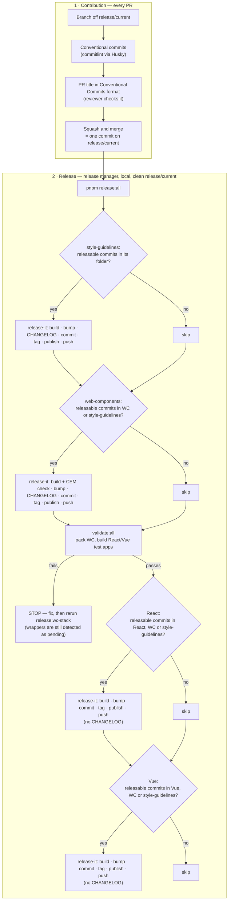

# Release Process Remediation (Option A: patch `release-it`) Implementation Plan

> **For Claude:** REQUIRED SUB-SKILL: Use executing-plans to implement this plan task-by-task.

**Goal:** Make the alpha release process correct and shareable — escalating versions, two accurate changelogs (web-components and style-guidelines), no empty releases, wrappers always pinned to the current web-components version, working Bitbucket Server links — and move publishing to the `@pxglobal` npm scope while staying on the `-alpha.N` track.

**Ticket brief:** [`ai-work/tickets/EOA-18749-release-process-remediation.md`](../tickets/EOA-18749-release-process-remediation.md)

**Architecture:** Keep `release-it` + `@release-it/conventional-changelog` (ADR 0013, Option A, accepted 2026-10-01). Every fix is native configuration in the four `.release-it.json` files plus root `package.json` scripts — no custom release scripts. Upgrading to `release-it@21` + `@release-it/conventional-changelog@12` (T0) makes skipping packages without releasable commits native: preset 10.x gives only `feat`/`fix`/`perf`/`revert` the `bump` effect (all other standard types are `hidden`), so a window with none of them yields no bump, and plugin 12 no longer falls back to a prerelease increment. Release topology (not drift detection) keeps wrappers pinned: each package's "has it changed?" check also counts the folders it is built from, so a style-guidelines change cascades to web-components and both wrappers, and a web-components change cascades to both wrappers.

**Tech Stack:** Node `22.23.3`, `release-it@21.1.0`, `@release-it/conventional-changelog@12.0.2` (preset `conventionalcommits`) — target versions after T0, re-fetched from the npm registry at execution time; installed before T0: Node `22.21.1`, `release-it@19.2.4`, plugin `10.0.5`; pnpm workspaces, Turborepo, Bitbucket Server (`origin` = project `DEV`).

**Related:** ADR `ai-docs/decisions/0013-release-tooling-release-it-vs-changesets.md` · rubric `ai-work/research/2026-10-01-EOA-18749-release-tooling-rubric.md` · rejected alternative `EOA-18749-release-process-remediation-migrate-changesets.md`

---

## Files to create / modify

| File                                                                                                                                   | Notes                                                                                                                                                                     |
| -------------------------------------------------------------------------------------------------------------------------------------- | ------------------------------------------------------------------------------------------------------------------------------------------------------------------------- |
| `packages/boreal-web-components/CHANGELOG.md`                                                                                          | Modify — maintained changelog (also covers React/Vue): backfill (T1), link rewrite (T6), trim to own entries (T7), "moved" notice (T10)                                   |
| `packages/boreal-react/CHANGELOG.md`                                                                                                   | Modify — replaced by a pointer to the web-components changelog (T7); scope name in pointer (T10)                                                                          |
| `packages/boreal-vue/CHANGELOG.md`                                                                                                     | Modify — replaced by a pointer to the web-components changelog (T7); scope name in pointer (T10)                                                                          |
| `packages/boreal-styleguidelines/CHANGELOG.md`                                                                                         | Modify — maintained changelog: T6, trim to own entries (T7), "moved" notice (T10); path changes in T9                                                                     |
| `packages/boreal-*/.release-it.json` (×4)                                                                                              | Modify — `strictSemVer` + `preMajor` (T2), path scoping + header prefix + wrapper changelogs off (T3), skip-unchanged (T4), link formats (T5), scope + `latest` tag (T10) |
| `package.json` (root)                                                                                                                  | Modify — `release:wc-stack`, `release:all` recomposed (T4); `--filter` names (T10)                                                                                        |
| `.node-version`, `.nvmrc`, `README.md`                                                                                                 | Modify — Node `22.23.3` (T0)                                                                                                                                              |
| `package.json` (root) devDependencies, `pnpm-lock.yaml`                                                                                | Modify — `release-it`, `@release-it/conventional-changelog` upgrade (T0)                                                                                                  |
| `packages/boreal-*/package.json` (×4)                                                                                                  | Modify — `repository.url` (T5); `name` + workspace deps (T10)                                                                                                             |
| `packages/boreal-styleguidelines/` → `packages/boreal-style-guidelines/`                                                               | Rename (T9)                                                                                                                                                               |
| `.lintstagedrc.js`, `README.md`, `packages/boreal-style-guidelines/README.md`, `packages/boreal-web-components/scripts/copy-styles.js` | Modify — folder-name references (T9)                                                                                                                                      |
| 135 tracked files containing `@telesign` (excluding CHANGELOGs and lockfile)                                                           | Modify — scope rename (T10); grouped list in T10                                                                                                                          |
| `pnpm-lock.yaml`                                                                                                                       | Regenerate — T9, T10                                                                                                                                                      |
| `CONTRIBUTING.md`                                                                                                                      | New — workspace root (T11)                                                                                                                                                |
| `apps/boreal-docs/src/stories/welcome.mdx`                                                                                             | Modify — scope-agnostic version (T10); alpha \"Release status\" section, Proximus Global wording (T11b)                                                                   |
| `apps/boreal-docs/src/stories/changelog.mdx`                                                                                           | New — public Changelog page rendering the two maintained changelogs (T11b)                                                                                                |
| `README.md`, `apps/boreal-docs/README.md`, `apps/boreal-docs/src/stories/layouts/bds-grid/bds-grid.mdx`                                | Modify — \"Proximus Group\" → \"Proximus Global\" (T11b)                                                                                                                  |
| `ai-docs/guidelines/release-process.md`                                                                                                | Modify — untracked doc, rewritten for the new model (T11)                                                                                                                 |

---

## Context

### Defects from the 2026-08-12 audit (re-verified 2026-10-01)

1. **Unparseable squash-merge titles.** Bitbucket Server prefixes squash commits with `Pull request #N: `, which no `headerPattern` accepts, so `@release-it/conventional-changelog` drops them. Re-verification against `release/current` found **8 squash commits**; 5 of them carry user-facing changes missing from published changelogs (see T1). The original audit's `bds-table` v4 example (`d3bb6f51`) is not on `release/current` — v4 landed as conventional commit `7a1e4a53` and _is_ in the changelog. 103 other `Pull request #` commits are true merge commits whose branch commits are parsed normally. Title-format compliance stays unenforced (no server-side hook access — former A1, not viable).
2. **No per-package path scoping.** All four configs read the whole repo log, producing byte-identical shared entries across web-components/React/Vue.
3. **Version base never escalates.** In a prerelease, the plugin only bumps the prerelease counter unless `strictSemVer` is set (`index.js:123` of plugin 10.0.5; same behaviour in 12.0.2), violating `feat`→MINOR / `fix`→PATCH.
4. **Broken links.** All ~2,560 historical links use `bitbucket.c11.telesign.com/7999/dev/boreal-ds/commit/<hash>` (derived from the SSH remote). `repository.url` is inconsistent: web-components still has the Stencil starter URL; React/Vue point at project `SAN`; style-guidelines at `scm/san/...`. Confirmed project: **`DEV`** (matches `origin`).
5. **Wrapper pin drift.** `workspace:*` becomes an exact web-components version at publish time; a wrapper that doesn't release keeps the stale pin.

### Confirmed decisions

- Option A (patch `release-it`). **Squash and merge is the required merge strategy** — documented in CONTRIBUTING.md (T11). With repo-admin rights the merge strategy and branch protections are self-serve (T14 item 9); only confirm whether the squash-only setting is repo-level or project-level. With squash-only, the PR title is the only changelog/bump source.
- **No empty releases.** A package is released only when its trigger folders contain at least one **releasable** commit since its last tag — `feat`, `fix`, `perf`, `revert`, or a breaking change (`!` / `BREAKING CHANGE:`). Commits of other types (`docs`, `test`, `chore`, `style`, `refactor`, `build`, `ci`) never trigger a release on their own; they ship with the next releasable change. Skipped packages exit 0 ("No new version to release") and the chain continues. Native after T0 (verified in T2 against preset 10.4.0 `whatBump.js`/`constants.js`): the preset's default type table gives `feat`/`fix`/`perf`/`revert` the `bump` effect and every other standard type `hidden`, so a window without them returns a null bump, plugin 12 returns no version for a null bump (`if (!releaseType) return null;`), and `release-it@21` then logs "No new version to release" and exits (`lib/index.js` ~L134). (Plugin 10 instead fell back to a `prerelease` increment, which is why T0 comes first.) Exception: the first `@pxglobal` release publishes all four packages (they are new npm packages) — packages with no releasable commits get an explicit `--increment=prerelease` in Task 12d.
- **Commit-type table** (decided 2026-10-01, plain titles): preset 10.4.0's **built-in defaults already are this table** — `feat` → "Features", `fix` → "Bug Fixes", `perf` → "Performance Improvements", `revert` → "Reverts" (visible + bump); `docs`, `style`, `chore`, `refactor`, `test`, `build`, `ci` hidden (no changelog, no bump); unknown types never bump. No `types` override and no `bumpStrict` (that option no longer exists in 10.x) are needed; the same table appears in CONTRIBUTING.md. Per-type bump levels (BEEQ-style `semverBump`) rejected: they need a JS config, which breaks `check-cem-changes.ts`.
- **Consumer-visible changes are typed `fix`/`feat`** regardless of the kind of work (e.g. `fix(web-components): …` for a Stencil config change that alters output, `fix(deps): …` for runtime dependencies; `chore(deps): …` for devDependencies) — the convention used by semantic-release and Renovate. Documented in CONTRIBUTING.md (T11).
- **Release topology.** `release:styles` is independent. `release:wc-stack` = web-components → `validate:all` → React → Vue. Trigger folders: style-guidelines = its own; web-components = its own + style-guidelines (decision (a): tokens are compiled into web-components at build time via `stencil.config.ts:8` and `copy-styles.js`); React/Vue = their own + web-components + style-guidelines. Version bumps stay scoped to each package's own folder, except web-components, whose bump also counts style-guidelines commits.
- **npm scope `@pxglobal`** (`@proximus` is taken). Rename happens during alpha, as the last code task before the end-to-end test. Versions restart at an explicit `0.14.0` (see below); `git.tagMatch` or anchor tags bridge the tag-name change; both maintained changelogs keep their history plus a one-line "moved" notice; `latest` tracks the newest alpha (`"tag": "latest"`). Old `@telesign` packages are deprecated, never unpublished.
- **Two maintained changelogs** (decided 2026-10-01): `boreal-web-components/CHANGELOG.md` (the product changelog — its own changes, token changes from style-guidelines, and wrapper-only changes labelled by scope) and `boreal-styleguidelines/CHANGELOG.md` (token changes). React and Vue still version, tag, and publish, but write no changelog (`infile: false`); their `CHANGELOG.md` becomes a pointer to web-components'. Evidence: 100% of the 536 React and 699 Vue historical entries duplicate web-components entries, and only 6 / 11 of them touched the wrapper; no CHANGELOG ships in any npm tarball (`files` field); BEEQ keeps a single changelog. Trade-off (accepted 2026-10-01, option 1): a wrapper-only change appears under the _next_ web-components release, not under the wrapper's own version; documented in CONTRIBUTING.md. Alternatives considered — wrapper changelogs scoped to own changes (option 2) and BEEQ-style fixed versioning (option 3, conflicts with no-empty-releases) — revisit option 3 in T17.
- Folder rename `boreal-styleguidelines` → `boreal-style-guidelines`, done just before the scope rename so its triggered releases fold into the first `@pxglobal` release.
- **0.x version policy — `preMajor: true`** (decided 2026-10-02, option 2): while below `1.0.0`, breaking → minor, `feat`/`fix`/`perf`/`revert` → patch (the preset shifts every level down one). Breaking changes never push the library to `1.0.0`/`2.0.0` during alpha. Feature vs. fix is still visible in the changelog sections, not in the version number.
- **No prerelease suffix under `@pxglobal`; first version `0.14.0`** (decided 2026-10-02). Rationale: with `latest` = newest version the suffix no longer prevents accidental installs, `0.x` already signals instability, and plain versions let consumers' `^0.14.0` ranges pick up fixes/features automatically while stopping at the next breaking change (`0.15.0` under `preMajor`). `0.14.0` comes from replaying the full git history under the documented `feat` → minor standard (web-components and React reach `0.14.0` including pending commits; 5 → 81 components since the first release). PR 1 keeps `preRelease: "alpha"` + `strictSemVer` so any interim `@telesign` release stays on the alpha line; Task 10 removes both and the first `@pxglobal` release uses `--increment=0.14.0`.
- **Alpha stays as the stated status**, not in the version string: README badge/notice per package, the Storybook welcome page, and CONTRIBUTING.md. **Confirmed by the user 2026-10-08:** no `-alpha` suffix; the alpha stage is reflected by staying below 1.0 (breaking changes bump the minor version).
- **Public docs** (decided 2026-10-02): Storybook is a public static site and Bitbucket is internal, so release notes are published as a Storybook **Changelog** page (option C) rendering the two maintained changelogs. **Links are kept as they are** (revised 2026-10-08, option B): the expected consumers are internal and signed in to Bitbucket, so commit and compare links stay clickable; accepted trade-off — the internal hostname, project and repo name are visible on the public page, and the links resolve only for signed-in readers. **`CHANGELOG.md` is not shipped inside the npm packages** (an npm publish cannot be retracted, and the file carries the internal links); release notes live on the Storybook Changelog page and, for repo readers, in the two `CHANGELOG.md` files. The welcome page states the alpha status (versioning rules, `@telesign` migration, contact, link to the Changelog page). Company name: **Proximus Global**.
- Alpha graduation: stay at `0.x` until real-world feedback is addressed; then go straight to `1.0.0` with one deliberate release (`--increment=1.0.0`, optionally preceded by `1.0.0-rc.N`) and remove `preMajor` from all four configs (T17).
- **History across the scope move** (decided 2026-10-02): old `@telesign` versions are **not** republished under `@pxglobal` (npm cannot move versions between names; rebuilding ~44 old versions would publish new builds, not the shipped code). History is carried by: the repo CHANGELOGs (kept in full, with a "moved" notice), `@telesign/*` git tags (**never deleted** — historical compare links depend on them), the public Storybook Changelog page (`CHANGELOG.md` is not shipped in the tarballs), a "previously published as" note in each README, and the `npm deprecate` message on every `@telesign` version. The move itself is a changelog entry: the rename lands as `feat(release): …` with a `BREAKING CHANGE:` footer, and the first release sets all four packages to `0.14.0` explicitly.
- CHANGELOG cleanup: tier 1 required, tier 2 recommended, tier 3 open decision (T13).

### Session decisions (2026-10-05)

Settled while aligning the CI/CD strategy page, the Phase 1–4 tickets, and the v3 diagrams with this plan:

- **Coverage standard is 80%** (`packages/boreal-web-components/testing.config.ts`); the earlier plan to raise it to 90% is superseded (T22).
- **The CI gate is PR-title validation**, not a changeset check: with squash-only merges the PR title is the changelog/bump source, so `changeset status` is not used.
- **npm provenance is dropped** — unsupported on self-hosted Jenkins and requires a public source repository; publishing uses a granular automation token for `@pxglobal`.
- **Storybook stays on Chromatic** and is **public for alpha**; it is not hosted on S3/CloudFront. Chromatic visual regression (ITOPS-63136) is added on top and is non-blocking for alpha.
- **One production S3 + CloudFront distribution** (no STG/PROD duplication) hosts the **Library CDN** (`/components/` — UMD/IIFE browser build for enterprise/no-npm clients, T27) and **static assets** (`/icons/`), version-pinned with `/latest/` pointers.
- **Single-environment Phase 4**: ITOPS-63138 / ITOPS-63146 re-scoped to one environment; ITOPS-63140 closed as superseded.
- **Phase 3 tooling**: axe-core only (Pa11y dropped; WCAG 2.2 AA), Playwright Chromium-first; **Lighthouse deferred** (ITOPS-63139).
- **CI quality gate = ITOPS-72071**; **manual release + Storybook deploy = ITOPS-63144**, relocated to Phase 1.
- **Branch/merge model**: single trunk `release/current`, squash-only; branch protections and the merge-strategy setting are self-serve with repo-admin rights.

### Expected release process



Releasable = `feat`, `fix`, `perf`, `revert`, or breaking. Each "releasable commits" check looks at commits since **that package's own** last tag.

| Merged PR (squash commit)                            | Released                                                                 |
| ---------------------------------------------------- | ------------------------------------------------------------------------ |
| `fix(web-components): …`                             | web-components, React, Vue                                               |
| `feat(styles): …` in style-guidelines                | all four                                                                 |
| `fix(vue): …` only in `packages/boreal-vue`          | Vue only (changelog entry appears under the next web-components release) |
| `test(…)`, `docs(…)`, `chore(…)`, `refactor(…)` only | nothing — ships with the next releasable change                          |
| Docs app only (`apps/boreal-docs`)                   | nothing (Storybook deploys separately)                                   |

### Shared dry-run recipe

All `release-it` validation in this plan is dry-run only, run from the repo root on the feature branch:

`pnpm --filter <package-name> exec release-it --dry-run --ci --no-git.requireBranch --no-git.requireCleanWorkingDir --no-git.requireUpstream --no-npm.publish`

The last two flags are needed only on a feature branch without upstream and without npm login (confirmed in T0, 2026-10-02: release-it 21's strict CLI parsing accepts all of them; without `--no-npm.publish` the npm plugin runs `npm whoami` even in dry-run). After upgrading in an existing checkout, run `rm -rf node_modules && pnpm install` — a leftover hoisted preset 9.x makes every dry run fail with `headerPartial is not a function`. Never run without `--dry-run`. Never push tags.

---

## Jira Alignment (EOA-18749)

| EOA-18749 acceptance criterion                             | Covered by                        |
| ---------------------------------------------------------- | --------------------------------- |
| Meeting with DevOps (Branislav)                            | T14 (EOA-18870)                   |
| Prioritize public NPM registry                             | T10 + EOA-18864 (external)        |
| CI fails if React/Vue wrappers cannot generate             | T15 — deferred until EOA-18870    |
| Wrapper-generation smoke test in CI                        | T15 — deferred                    |
| Release automation reviewed and consistent across packages | ADR 0013 + T2–T5                  |
| Release order documented or automated end-to-end           | T4 (automated) + T11 (documented) |
| Dry-run release validated                                  | Every config task + T8            |
| Alpha versioning policy documented                         | T2 + T11                          |

| Sub-task                                                                          | Status (2026-10-02) | Plan task                                                                       |
| --------------------------------------------------------------------------------- | ------------------- | ------------------------------------------------------------------------------- |
| EOA-18863 — 01-Initial Review                                                     | Closed              | Audit + ADR 0013                                                                |
| EOA-18864 — 02-Create Proximus NPM Organization & Users                           | In Progress         | External prerequisite for Task 12d (`@pxglobal` org)                                 |
| EOA-18867 — 03-Decide Package Strategy for Stable Version                         | In Progress         | 0.x/`preMajor` policy, `0.14.0` start, no suffix (decided); graduation path T17 |
| EOA-18940 — 04-Harden Release Tooling & Versioning                                | Open                | T0, T0c, T2–T5, T8, T8b Windows gate, T8c upgrade guide (PR 1)                  |
| EOA-18868 — 05-Perform CHANGELOG cleanup                                          | Open                | T1, T6, T7 (PR 1); T13 tier 3 decision                                          |
| EOA-18865 — 06-Rename the NPM Scope in the Codebase                               | In Progress         | T9, T10 (PR 2)                                                                  |
| EOA-18869 — 07-Create CONTRIBUTING.md file and Document Policies                  | Open                | T11, T11b (PR 2); T21 internal docs                                             |
| EOA-18866 — 08-Test New Release & Deployment Process with One User                | Open                | Tasks 12b–12d (run by this effort, decided 2026-10-08)                                                      |
| EOA-18938 — 09-Create a System Information Confluence Page                        | Open                | T21 (Confluence part)                                                           |
| EOA-18870 — 10-Meet with Branislav from DevOps Team to Review Commitments for PI9 | Open                | T14                                                                             |

---

## Progress (updated 2026-10-05)

**PR 1 merged 2026-10-08** into `release/current` as squash commit `c5d5dedb` (`build(release): EOA-18749 harden release tooling and changelogs`; tree identical to branch tip `c4395066`). **PR 2** work is on `feature/EOA-18749_pxglobal-npm-scope`, branched from `c5d5dedb`. Task 0 includes the commitlint 21 upgrade that was folded in.

| Task                                                                                   | Status                        | Commit     |
| -------------------------------------------------------------------------------------- | ----------------------------- | ---------- |
| T0 Node + release tooling (+ commitlint 21)                                            | done                          | `0252c7b3` |
| T0c pnpm 11.28.2                                                                       | done                          | `714b9320` |
| T1 Changelog backfill (6 entries)                                                      | done                          | `b4c6ee0b` |
| T2 `strictSemVer` + `preMajor`                                                         | done                          | `fa0ee7eb` |
| T3 Path scoping, header patterns, wrapper changelogs off                               | done                          | `c36b5522` |
| T4 pnpm-native orchestration + wrapper gates                                           | done                          | `0e43dbaa` |
| T5 Bitbucket Server links (`context` block + `repository` field removal) | done | `31785477`, `f0eef161` |
| T6 Changelog link rewrite | done | `b03a026a` |
| T7 Trim + wrapper pointers | done (Bitbucket pointer render check open until push) | `c4395066` |
| T8 Wrapper-only release check | done | — (verification only) |
| T8b Windows verification gate | bypassed (risk accepted 2026-10-08) | — |
| T8c Contributor upgrade guide | in PR 1 description (done) | — |
| T9 Folder rename | done (PR 2) | `7cd5af1c` |
| T10 Scope rename + `0.14.0` | done (PR 2) | `68157161` |
| T11 CONTRIBUTING.md + guideline + README | done (PR 2) | `62f80ef7` |
| T11b Storybook | done (PR 2) | `e99a4348` |
| T12 ADR close-out | done (untracked file) | — |
| T12b First-release runbook (docs) | done (untracked file; awaiting your review) | — |
| T12c Rehearsal on a local registry | done (its CONTRIBUTING.md edit shipped in `f418845e`) | — |
| T12e Tracked RELEASING.md + hook-free pushes | done (PR 2) | `2586d57b`, `f418845e` |
| T12f Version-heading compare links | done (PR 3 merged) | `c537da54` |
| T12d First real `@pxglobal` release + deploy + deprecation | done except the second-release check | release `d3047612`; `5e097600`, `b4e505b0`, `a0456dfe`, `377643ed` |
| Follow-ups T13–T26 | pending / after first release | — |
| T21 Docs sync — Confluence strategy page (SENG 1303773297)                             | in progress (started 2026-10-05, ahead of Task 12d) | —          |
| T21 Docs sync — internal docs (`ai-docs/`, `.agents/`, READMEs)                        | pending — re-verify after Task 12d | —          |

## Tasks

### Task 0: Upgrade Node and release tooling

**Status: done 2026-10-02/05 — committed `0252c7b3` (manual tests run and passed).**

**Executor:** @release-subagent
**Files:**

- `.node-version`, `.nvmrc` (modify — `22.23.3`)
- `README.md` (modify — Node version mention)
- `package.json` (root, modify — devDependencies: `release-it`, `@release-it/conventional-changelog`, `@commitlint/cli`, `@commitlint/config-conventional`, `@commitlint/cz-commitlint`)
- `pnpm-lock.yaml` (regenerate)

**Integration research pass:**

- [x] Versions: fetch `https://registry.npmjs.org/release-it/latest` and `https://registry.npmjs.org/@release-it%2fconventional-changelog/latest` before installing (2026-10-01: `21.1.0` / `12.0.2`); both require Node `^22.22.2 || ^24.15.0 || >=26.0.0`. Latest Node 22 LTS: `22.23.3` (2026-09-23).
- [x] Breaking changes: `release-it` 20/21 — Node 22.21+ required, strict CLI argument parsing, GitLab certificate checks (not used), `semver` replaced by `verkit` in 21.1. Plugin 11/12 — release-it 20+ peer, "skip prereleases without a recommended bump", "use resolved tag as recommended bump boundary", tag prefix derived from the resolved tag.
- [x] Call sites: the four `.release-it.json` configs (unchanged in this task), the root `release:*` scripts, `check-cem-changes.ts` (reads `.release-it.json` only — unaffected).
- [x] Preset resolution (found 2026-10-02): plugin 12 needs `conventional-changelog-conventionalcommits@10.x`, but `@commitlint/config-conventional@20` hoists `9.1.0`, and the preset loader resolves the hoisted one → every dry run fails with `headerPartial is not a function`. Fix: upgrade commitlint to 21 (`@commitlint/cli`, `config-conventional`, `cz-commitlint`; requires Node ≥ 22.12), whose config depends on preset `^10`. Verify a single preset version is installed and the `commit-msg` hook + `pnpm commit` still work.

**Acceptance criteria:**

- Node `22.23.3` in `.node-version` and `.nvmrc`; README matches.
- `release-it`, `@release-it/conventional-changelog` and the three `@commitlint/*` packages at the fetched latest versions; no other dependency changes; a single `conventional-changelog-conventionalcommits` version (10.x) installed.
- Existing configs still load; the shared dry-run recipe's flags are accepted under strict CLI parsing (correct the recipe in Context if not).

**Manual test _(required — not waiveable)_:**

- [x] Given `fnm use` (installing `22.23.3`) and a fresh `pnpm install`, when running `pnpm build`, `pnpm test`, and `pnpm validate:all`, then all pass. Pass: green.
- [x] Given the dry-run recipe for each of the four packages (recipe corrected to add `--no-git.requireUpstream --no-npm.publish` on a feature branch without upstream or npm login), then each completes without config or CLI errors. Pass: 4/4 previews, no publish/tag/commit.
- [x] Given a throwaway commit attempt with an invalid message and then a valid one on a scratch branch, then `commit-msg` rejects the first and accepts the second; `pnpm commit` starts its prompt. Pass: commitlint 21 works with the repo's custom rules and scope list. _(verified through commitlint on stdin; nothing was committed; `pnpm commit` prompt started)_

**Commit:** `build(release): EOA-18749 upgrade Node to 22.23.3, release-it and commitlint to latest`

---

### Task 0c: Update pnpm to the latest 11.x

**Status: done 2026-10-02/05 — committed `714b9320` (manual tests run and passed).**

**Executor:** @release-subagent
**Files:** `package.json` (root — `packageManager` and, if needed, `engines.pnpm`), `pnpm-lock.yaml` (only if pnpm rewrites it), `README.md` (pnpm version mentions)

**Integration research pass:**

- [x] Version: fetch `https://registry.npmjs.org/pnpm` and use the `latest-11` dist-tag (2026-10-02: `11.28.2`; `latest` is 12.x — out of scope, see T24). Pin with `corepack use pnpm@latest-11` (writes `packageManager` with the hash).
- [x] Context7 (pnpm docs): pnpm 11 keeps `.npmrc` for registry/auth only and pnpm settings in `pnpm-workspace.yaml`; no `pnpm` field in `package.json`; `npm_config_*` env vars are no longer read — confirm none of the repo scripts rely on them.
- [x] Call sites: README mentions pnpm 11 and `corepack use pnpm@latest-11`; `ai-docs/guidelines/cicd-dependency-installation.md` says v10.7.1 (stale, fixed in T21). _(README needed no edit; the stale v10.7.1 guideline is deferred to T21)_

**Acceptance criteria:**

- `packageManager` pins the fetched `latest-11` version; installing with `--frozen-lockfile` is clean (lockfile unchanged or only the expected rewrite, committed in the same change).
- No other dependency changes.

**Manual test _(required — not waiveable)_:**

- [x] Given `corepack enable` and a clean `rm -rf node_modules && pnpm install --frozen-lockfile`, when running `pnpm -v`, `pnpm build`, `pnpm test`, `pnpm validate:all`, then all pass. Pass: green.
- [x] Given the dry-run recipe for each of the four packages, then results match Task 3's table (style-guidelines "No new version to release"; web-components/react/vue `0.1.1-alpha.0`). Pass: unchanged.

**Commit:** `build(workspace): EOA-18749 update pnpm to the latest 11.x`

---

### Task 1: Backfill changelog entries lost to squash-merge titles

**Status: done 2026-10-02/05 — committed `b4c6ee0b` (manual tests run and passed).**

**Executor:** main thread
**Files:**

- `packages/boreal-web-components/CHANGELOG.md` (modify)

**Integration research pass:**

- [x] Call sites: the plugin only prepends new sections above existing ones — editing older sections by hand is safe for future runs. _(premise from plugin behaviour; confirm in the first real release)_
- [x] Boundary case: `fae7c6fd` (#183 tree-menu, `feat(...)` title) is not yet released — it must **not** be backfilled; T3's header-prefix fix picks it up in the next release.
- [x] Default: non-user-facing squashes (`e0f480f9` #148 chore, `dcf35283` #26 docs) get no entry, matching the preset's hidden types.
- [x] Two-changelog model: #112 also touched React/Vue, but wrapper changelogs become pointers (T7) — web-components only.

**Acceptance criteria:**

- One entry per PR, under the first web-components version whose tag contains it (`git tag --contains <hash>`):

  | PR                                                         | Commit     | Section  | Version          |
  | ---------------------------------------------------------- | ---------- | -------- | ---------------- |
  | #112 toast                                                 | `bdda44c4` | Features | `0.1.0-alpha.7`  |
  | #122 autocomplete multi                                    | `a5fac247` | Features | `0.1.0-alpha.7`  |
  | #146 bds-table v2                                          | `7c7f3836` | Features | `0.1.0-alpha.9`  |
  | #159 bds-table v3                                          | `fab67bea` | Features | `0.1.0-alpha.10` |
  | #173 bds-setting-step                                      | `f3ee62eb` | Features | `0.1.0-alpha.12` |
  | bds-banner (`feat/EOA-10054 banner component`, no `type:`) | `afead60b` | Features | `0.1.0-alpha.0`  |

- Completeness scan (2026-10-02): every non-merge commit touching the four packages (~1,200) was run against the exact `headerPattern`. 35 fail to parse in the web-components/style-guidelines windows: the 5 PRs above, #183 (unreleased), 2 docs-only PRs (hidden types), `afead60b` (banner, above), `18322e0b` (`feat/refine-tokens-docs`, borderline — not backfilled), and ~25 Dec 2025–Feb 2026 bootstrap commits (not backfilled). React/Vue folders add only bootstrap commits. Only standard commit types exist in history (no hidden-type typos).
- Entry format matches neighbouring generated lines (`* **web-components:** <description> ([<short-hash>](<link>))`), with the link already in the corrected `/projects/DEV/repos/boreal-ds/commits/<hash>` form so T6's rewrite doesn't need to handle it.
- Descriptions are consumer-facing (use the plan/ticket title, e.g. "add bds-table v3: dataset mode, column footer, server-side loading, virtualization"), not the raw branch name.

**Manual test _(required — not waiveable)_:** non-visual; validate by inspection.

- [x] Given each backfilled hash, when running `git tag --contains <hash>` for the package, then the earliest tag matches the section the entry was placed in. Pass: all 6 entries placed correctly.
- [ ] Given the edited files, when previewed as Markdown, then lists and links render without breaking neighbouring entries. Pass: no formatting regressions. — **open**: structural check only (same list format and link style as neighbouring entries); confirm the rendered view on Bitbucket during PR review.

**Commit:** `docs(release): EOA-18749 backfill changelog entries lost to squash-merge titles`

---

### Task 2: Version escalation via `strictSemVer` and the 0.x policy (`preMajor`)

**Status: done 2026-10-02/05 — committed `fa0ee7eb` (manual tests run and passed).**

**Executor:** @release-subagent
**Files:**

- `packages/boreal-styleguidelines/.release-it.json` (modify)
- `packages/boreal-web-components/.release-it.json` (modify)
- `packages/boreal-react/.release-it.json` (modify)
- `packages/boreal-vue/.release-it.json` (modify)

**Integration research pass:**

- [x] Call sites: the bump decision is made once, inside the plugin (escalates only when `strictSemVer` is set or the latest version isn't a prerelease — re-check the line in plugin 12 after T0). All four configs need the flag.
- [x] Boundary case: a history with only hidden types — handled in T3 by the preset's default type effects; record the current behaviour here for comparison.
- [x] Default: the alpha counter resets to `.0` on each base escalation (e.g. `0.1.0-alpha.12` → `0.1.1-alpha.0`) — expected.
- [x] `preMajor` is a preset option, so this task switches the `preset` field to the object form `{ "name": "conventionalcommits", "preMajor": true }`; T3 keeps this object unchanged (no `bumpStrict`/`types`). Re-check `preMajor` handling in the preset version installed by T0 (`whatBump.js`: level shifts down one when `preMajor` is set).
- [x] Pending commits measured 2026-10-02 against `origin/release/current`: web-components, React and Vue each have 8 `feat` commits and 0 breaking in their bump paths; style-guidelines has none.

**Acceptance criteria:**

- `"strictSemVer": true` and the preset object with `"preMajor": true` are set in the `@release-it/conventional-changelog` block of all four configs.
- While below `1.0.0`: breaking → `preminor`; `feat`/`fix`/`perf`/`revert` → `prepatch`; all staying on the `alpha` prerelease id.
- The shared dry-run recipe's override flags are confirmed working (or the recipe in Context is corrected).

**Manual test _(required — not waiveable)_:** dry-run only.

- [x] Given web-components at `0.1.0-alpha.12` with 8 `feat` commits and no breaking ones since its tag, when running the dry-run recipe, then the proposed version is `0.1.1-alpha.0`. Pass: base escalates (patch, per `preMajor`); no plain `alpha.13`.
- [x] Given a throwaway local commit with a `BREAKING CHANGE:` footer in web-components (scratch branch, deleted afterwards), when dry-running, then the proposed version is `0.2.0-alpha.0`. Pass: breaking → minor; never `1.0.0-alpha.0`. This also confirms the custom `parserOpts` keep the preset's `BREAKING CHANGE` note keyword.
- [x] Given each of the other three packages, when dry-run, then the proposed version matches the highest commit type since its tag. Pass: no publish, no tag, no commit.

**Commit:** `build(release): EOA-18749 escalate prerelease versions with strictSemVer and 0.x preMajor policy` (committed)

---

### Task 3: Path-scoped changelog/bump and squash-prefix parsing

**Status: done 2026-10-02/05 — committed `c36b5522` (manual tests run and passed).**

**Executor:** @release-subagent
**Files:**

- `packages/boreal-*/.release-it.json` (×4, modify)

**Integration research pass:**

- [x] Call sites: both commit readers need the path — `commitsOpts.path` (bump recommendation, `GetCommitsParams`) and `gitRawCommitsOpts.path` (changelog text, `GitLogParams`); both accept `string | string[]` (installed `@conventional-changelog/git-client` types). Setting only one leaves the other reading the whole repo.
- [x] Paths per package — bump (`commitsOpts.path`, which is also the release trigger) / changelog (`gitRawCommitsOpts.path`): style-guidelines `.` / `.`; web-components `.` + `../boreal-styleguidelines` / `.` + `../boreal-styleguidelines` + `../boreal-react` + `../boreal-vue` (wrapper-only changes are listed but never bump web-components); React/Vue `.` + `../boreal-web-components` + `../boreal-styleguidelines` / no changelog (`infile: false`).
- [x] Boundary case: with the preset's default types (no override) a window with only hidden types (or no commits) yields a null bump → "No new version to release", exit 0.
- [x] Breaking-change header (T2 finding, 2026-10-02): `feat(scope)!: …` IS recognised as breaking (the preset's own `breakingHeaderPattern` still applies, bump `0.2.0-alpha.0` under `preMajor`), but the custom `headerPattern`'s ticket-ID prefix group is not used for `!` headers, so the changelog subject keeps the ticket ID (e.g. `EOA-18749 scratch bang change`). Task 3 keeps the `!` handling and makes the ticket ID strip for `!` headers too (extend `headerPattern` with an optional `!`, or drop the custom `parserOpts` in favour of the preset's parser plus only the optional `Pull request #N: ` prefix and ticket-ID stripping).
- [x] Boundary case: with `infile: false`, confirm the wrapper release still runs (version, tag, publish) and nothing is written to its `CHANGELOG.md`.
- [x] Boundary case: the header prefix is optional — plain conventional commits and `Pull request #N: type(scope): …` must both parse; branch-name titles (`Pull request #159: Feature/EOA-15507 …`) still don't parse (accepted gap).
- [x] Coupling: `check-cem-changes.ts` reads `npm.tag` only — unaffected.
- [ ] Forward note: T9 renames the style-guidelines folder — every path added here is updated there. — **open**: applies when T9 runs.

**Acceptance criteria:**

- Both path fields set per the paths listed above; React and Vue have `infile: false`.
- `headerPattern` accepts an optional leading `Pull request #<digits>: ` and still yields `type`, `scope`, `subject`.
- No other parser behaviour changes (existing ticket-ID stripping preserved).
- All four configs keep the preset object form from T2 (`{ "name": "conventionalcommits", "preMajor": true }`) and rely on the preset's default type table from Context — no `types` override, no `bumpStrict`.

**Manual test _(required — not waiveable)_:** dry-run only.

- [x] Given the dry-run recipe for React, when it completes, then a version and tag are proposed and no changelog write is planned. Pass: `CHANGELOG.md` untouched.
- [x] Given the dry-run for web-components, when inspecting the preview, then it contains only commits that touched web-components, style-guidelines, or a wrapper folder. Pass: no docs-app-only or tooling-only entries.
- [x] Given the dry-run for web-components, when inspecting the preview, then `fae7c6fd` (#183 tree-menu) appears as a feature. Pass: squash prefix parsed.
- [x] Given the dry-run for style-guidelines, when inspecting the preview, then it is empty or contains only style-guidelines commits. Pass: no cross-package leakage.
- [x] Given the web-components preview, then only the sections Features / Bug Fixes / Performance Improvements / Reverts appear, with those exact titles. Pass: no hidden types listed. _(Features and Bug Fixes observed; no pending Performance/Reverts entries to show)_
- [x] Given a scratch `feat(web-components)!: EOA-18749 …` commit, then it is breaking (minor bump under `preMajor`) AND its changelog subject has no ticket ID. Pass: `!` handled cleanly.
- [x] Given style-guidelines (no releasable commits since `alpha.3` in its folder — only valid when no `fix`/`feat` commit on the branch touches `packages/boreal-styleguidelines`, so release-tooling commits on this branch must be typed `build`/`chore`), when dry-running, then it reports "No new version to release" and exits 0. Pass: native skip works.
- [x] Given React, when dry-running, then the proposed bump follows web-components' commits (`0.1.0-alpha.14` → `0.1.1-alpha.0` from the pending `feat` commits). Pass: wrapper picks up web-components changes.

**Commit:** `build(release): EOA-18749 scope changelogs and bumps per package, parse squash-merge titles` (committed; header ≤ 100 characters is enforced by commitlint)

---

### Task 4: Web-components stack orchestration (pnpm-native)

**Status: done 2026-10-02/05 — committed `0e43dbaa` (manual tests run and passed).**

**Executor:** @release-subagent
**Files:**

- `package.json` (root, modify — scripts only)
- `packages/boreal-react/package.json`, `packages/boreal-vue/package.json` (modify — `prerelease` gate scripts)

**Design (decided 2026-10-02 after comparing Turborepo, `npm-run-all2` and pnpm-native):** no new dependency. pnpm already owns the workspace graph: `pnpm --filter … --workspace-concurrency=1 run release <flags>` runs the selected packages' `release` scripts one at a time in dependency order and forwards the flags to every release-it call. Verified read-only against the real repo on pnpm 11.1.1: order styles → web-components → react → vue, flags reach every release-it call. In a throwaway project, a package's `prerelease` script runs before its `release` (also when filtered to a single package) and a failing one stops the chain. Turborepo was evaluated: its docs forward `--` args to all named tasks and `--concurrency=1` serialises, but `release` is stateful and uncached, needs a `^release` ordering edge, and the `validate:all` gate would have to depend on the web-components release (a plain `validate:all` would then trigger a release); the repo also has an earlier Turbo TUI/PTY hang. `npm-run-all2` works but adds a dependency for one chain.

**Integration research pass:**

- [x] Selectors: `release:all` → `--filter "./packages/*"` (all four); `release:wc-stack` → `--filter "...@telesign/boreal-web-components" --filter "!./apps/*" --filter "!./examples/*"`. pnpm semantics (verified in T4 with Context7 and by listing the selection): `name...` = the package and its **dependencies**, `...name` = the package and its **dependents**; `...web-components` alone also matched `boreal-docs` and the example apps (they depend on it), hence the two exclusions. Result: exactly web-components, react, vue (style-guidelines excluded).
- [x] Order: topological from `workspace:*` dependencies, including the devDependency edge style-guidelines → web-components; react and vue are independent of each other (order between them not guaranteed on newer pnpm — acceptable).
- [x] Gates: react and vue each get `"prerelease": "pnpm -w run validate:pack:react"` / `"…:vue"` (pnpm pre-script hooks; cross-platform). Replaces the `validate:all` step in the chain and also protects a standalone `release:react` / `release:vue`. Trade-off accepted: each wrapper validates just before its own release; the gate runs even when release-it would skip.
- [x] `validate:pack` restores, with `git checkout HEAD --` on exit, exactly three paths (verified in T4): the framework wrapper's `package.json`, the framework test app's `package.json`, and the root `pnpm-lock.yaml` — it does NOT touch the root `package.json`. It cannot undo a release bump (release-it commits the bump before the next package's gate runs) but it discards uncommitted edits to those files, so commit edits to wrapper `package.json`/lockfile before running a gate (follow-up T23). Residual risk: if a gate fails after web-components was published, web-components stays released and the wrappers do not; rerunning is safe because web-components then skips.
- [x] `release:publish` stays `release:all` + `deploy:docs` (inspect only; do not run).
- [x] Usage: flags are passed WITHOUT `--` (`pnpm run release:all --dry-run --ci …`); with `--` pnpm forwards a literal `--` and release-it fails with "Unexpected positional argument". Document in CONTRIBUTING.md and the release guideline.

**Acceptance criteria:**

- Root scripts: `release:all` and `release:wc-stack` as above; `release:styles|wc|react|vue` unchanged; extra args reach every release-it call.
- No package is released without a releasable commit in its bump paths; when web-components releases, both wrappers release in the same run.
- No new dependency; `pnpm install --frozen-lockfile` clean.

**Manual test _(required — not waiveable)_:** dry-run only on a scratch branch (commits touch a real file inside the relevant package; delete branch and any local scratch tags afterwards). Flags: `--dry-run --ci --no-git.requireBranch --no-git.requireCleanWorkingDir --no-git.requireUpstream --no-npm.publish`.

- [x] Baseline: style-guidelines "No new version to release"; web-components, react, vue `0.1.1-alpha.0`; the react and vue `prerelease` gates ran; order styles → web-components → react → vue.
- [x] Nothing pending (local scratch tags `…@0.1.0-alpha.99` at HEAD): all four skip, exit 0.
- [x] `test(web-components)` only: nothing releases.
- [x] `fix(web-components)`: web-components, react, vue release; styles skips.
- [x] `fix(styles)`: all four release.
- [x] `fix(react)` touching only react: only react releases; `pnpm run release:react <flags>` alone also runs its gate.
- [x] Failure path: a failing `prerelease` gate (temporary scratch change, not committed) stops before that wrapper's release and exits non-zero.

**Commit:** `build(release): EOA-18749 orchestrate web-components stack release`

---

### Task 5: Bitbucket Server links (forward-only)

**Status: done 2026-10-05 — part a committed `31785477`, part b (`repository` field removed from the four package.json files) committed `f0eef161`; browser check passed.**

**Executor:** @release-subagent
**Files:**

- `packages/boreal-*/.release-it.json` (×4, modify — `context` block)
- `packages/boreal-*/package.json` (×4, modify — **remove the `repository` field** (decided 2026-10-05): it is published to public npm, so an internal Bitbucket URL would be visible in package metadata; nothing in the repo reads it; the changelog link target for consumers is the public Storybook Changelog page, T11b)

**Integration research pass:**

- [x] Call sites: links are derived from the SSH remote by `readRepository()`, not from `package.json`. Preset 10.4.0 has no `commitUrlFormat`/`compareUrlFormat` (functions `formatCommitUrl`/`formatCompareUrl` instead, not settable from JSON); the JSON-settable plugin `context` (`host`, `owner`, `repository`, `commit`, `linkCompare`) overrides the remote-derived values (verified by dry run).
- [x] Boundary case: compare links — the template builds a path form `…/compare/<prev>...<cur>` (tags URL-encoded), which is not a Bitbucket Server route (those are `compare/commits?sourceBranch=…&targetBranch=…`) and cannot be expressed from JSON. Decision: `linkCompare: false`, so new version headings are plain `## <version> (<date>)`. Historical compare links are rewritten in T6 to a working form once one is confirmed in the browser.

**Acceptance criteria:**

- All four configs carry `context` = `{ "host": "https://bitbucket.c11.telesign.com", "owner": "projects/DEV/repos", "repository": "boreal-ds", "commit": "commits", "linkCompare": false }`.
- Generated commit links are `https://bitbucket.c11.telesign.com/projects/DEV/repos/boreal-ds/commits/<full hash>`, including squash-merged entries; no `7999` and no `/commit/` anywhere in a preview; version headings carry no compare link.
- [x] No `repository` field in any of the four `package.json` files (the Stencil starter URL and the `SAN`/`scm` URLs are gone); `pnpm install --frozen-lockfile` stays clean.

**Manual test _(required — not waiveable)_:** dry-run + browser.

- [x] Given dry runs of web-components (and a scratch token commit for style-guidelines, which has nothing pending), then commit links use the new base, headings are plain, and the preview contains 0 lines with `7999` or `/commit/` (also true for react and vue).
- [x] Given a web-components dry-run, when opening one generated commit link in the browser, then it loads the commit page. Pass: no 404. **Verified 2026-10-05** (signed-in Chrome): `…/projects/DEV/repos/boreal-ds/commits/b4cdb9860bc7e11f9b6c9a86522a68e6bd5035ef` loads the date-picker v2 squash commit. **Compare URL form confirmed for T6** (both load): `https://bitbucket.c11.telesign.com/projects/DEV/repos/boreal-ds/compare/commits?sourceBranch=refs%2Ftags%2F<newer tag, URL-encoded>&targetBranch=refs%2Ftags%2F<older tag, URL-encoded>` (Commits tab; source = newer tag, target = older base) and the same with `compare/diff?` (Diff tab); tags encode `@` as `%40` and `/` as `%2F`.

**Commit:** `build(release): EOA-18749 generate Bitbucket Server commit links in changelogs`

---

### Task 6: CHANGELOG cleanup tier 1 — rewrite historical links

**Status: done 2026-10-08 — committed `b03a026a` (manual tests run and passed).**

**Executor:** main thread
**Files:**

- `packages/boreal-web-components/CHANGELOG.md` (modify)
- `packages/boreal-styleguidelines/CHANGELOG.md` (modify)

**Acceptance criteria:**

- Only the two maintained changelogs are rewritten; the wrapper files are replaced in T7.
- Every `https://bitbucket.c11.telesign.com/7999/dev/boreal-ds/commit/<hash>` → `https://bitbucket.c11.telesign.com/projects/DEV/repos/boreal-ds/commits/<hash>`. Every compare link in a version heading, `…/7999/dev/boreal-ds/compare/<older tag>...<newer tag>` (tags raw or URL-encoded), → `https://bitbucket.c11.telesign.com/projects/DEV/repos/boreal-ds/compare/commits?sourceBranch=refs%2Ftags%2F<newer tag, URL-encoded>&targetBranch=refs%2Ftags%2F<older tag, URL-encoded>` (form confirmed in the browser in T5: source = newer, target = older; `@` → `%40`, `/` → `%2F`). Counts measured 2026-10-05: web-components 12 compare headings / 699 commit links (6 already in the new form from T1), style-guidelines 3 / 628. Mechanical regex rewrite; no other text changes.
- Zero occurrences of `7999/dev/boreal-ds` remain.

**Manual test _(required — not waiveable)_:**

- [x] Given the rewritten files, when grepping for `7999/dev`, then there are no matches. Pass: 0 hits. _(verified: 0 occurrences of the old `…/7999/dev/boreal-ds` URL form; the bare digits `7999` still appear inside some commit hashes, which is expected; 699+12 links rewritten in web-components, 628+3 in style-guidelines; every tag used in a compare link exists in git)_
- [x] Given three random commit links and one compare link per file, when opened in the browser, then each resolves. Pass: no 404. _(8/8 resolved in the signed-in Chrome session, 2026-10-08: commit pages titled by hash, compare pages load)_
- [x] Given `git diff --stat`, then only link text changed (line count unchanged). Pass: identical line counts. _(verified programmatically: line counts identical, 711 and 631 changed lines, all containing an old link, and the two files are identical to their originals once every URL is masked)_

**Commit:** `docs(release): EOA-18749 rewrite historical changelog links for Bitbucket Server`

---

### Task 7: CHANGELOG cleanup tier 2 — trim to own entries and replace wrapper changelogs

**Status: done 2026-10-08 — committed `c4395066`; one check open (pointer rendering on Bitbucket needs the branch pushed).**

**Executor:** main thread
**Files:**

- `packages/boreal-web-components/CHANGELOG.md` (modify)
- `packages/boreal-styleguidelines/CHANGELOG.md` (modify)
- `packages/boreal-react/CHANGELOG.md` (modify — replaced)
- `packages/boreal-vue/CHANGELOG.md` (modify — replaced)

**Integration research pass:**

- [x] Ownership rule mirrors T3's changelog paths, decided per entry with `git show --name-only <hash>`: web-components keeps entries touching web-components, style-guidelines, React, or Vue; style-guidelines keeps entries touching style-guidelines. _(applied by touched paths, one batched `git log --name-only` per 300 hashes)_
- [x] Measured 2026-10-01: web-components 699 entries (568 touch web-components or style-guidelines — wrapper-touching entries to be added to that count at execution); style-guidelines 628 entries, 20 touch its folder. _(re-measured 2026-10-08: web-components 705 entries incl. the 6 backfills → 581 kept, 124 dropped; style-guidelines 628 → 21 kept, 607 dropped, 3 empty sections removed; 1 hash with no touched files kept as-is)_
- [x] Boundary case: entries removed from web-components (docs app, tooling) must not belong to any maintained changelog — they are dropped, not moved. _(dropped entries: 46 without scope, 33 `docs`, 13 `web-components`-scoped but touching no package folder, 13 `workspace`, 12 `scripts`, 2 `Icons`)_
- [x] Default: version headings stay even when a section ends up empty, with the line `No changes in this package.` _(no release version ended up empty, so no line was added; the hand-written `0.0.x`, Future Improvements, Breaking Changes and Migration Guide blocks at the end of the style-guidelines file are untouched)_

**Acceptance criteria:**

- Both maintained changelogs contain only entries matching the ownership rule.
- Every React/Vue historical entry is already present in web-components' changelog (verified 100% on 2026-10-01) — re-check before replacing the files.
- React and Vue `CHANGELOG.md` each become a short pointer: the package is generated from `@telesign/boreal-web-components` and released with it; see that package's `CHANGELOG.md` (relative link); history up to the current version is in git.

**Manual test _(required — not waiveable)_:**

- [x] Given every commit hash in the React and Vue changelogs before the change, when checked against web-components' changelog before trimming, then all are present. Pass: 0 missing. _(0 of 536 / 699 missing from the web-components changelog)_
- [x] Given ten sampled remaining entries per maintained changelog, when checking their commits' touched paths, then each matches the ownership rule. Pass: 20/20. _(stronger than sampled: all 581 + 21 remaining entries checked, 0 not owned)_
- [ ] Given the wrapper pointer files, when rendered, then the relative link opens web-components' changelog. Pass: link resolves on Bitbucket. **Open:** the relative path `../boreal-web-components/CHANGELOG.md` resolves locally from both wrapper folders; rendering on Bitbucket needs the branch pushed (check during PR review).

**Commit:** `docs(release): EOA-18749 trim changelogs to owned entries and point wrapper changelogs to WC`

---

### Task 8: Validate wrapper-only selective release

**Status: done 2026-10-08 — verification only, no commit.**

**Executor:** @release-subagent
**Files:** none (verification-only)

**Acceptance criteria:**

- Confirms `release:react` / `release:vue` can release a single wrapper for wrapper-only maintenance, without touching web-components or the other wrapper.

**Manual test _(required — not waiveable)_:** dry-run with a throwaway scratch commit touching only `packages/boreal-vue`.

- [x] Given that commit, when dry-running the stack, then only Vue proposes a release. Pass: React, web-components and style-guidelines skip. _(verified 2026-10-08 on a scratch branch with local `…@0.1.0-alpha.99` tags at HEAD so every window was empty, plus one `fix(vue)` commit touching only `packages/boreal-vue`: `release:all` → style-guidelines, web-components and react "No new version to release"; vue `0.1.0-alpha.11 → 0.1.1-alpha.0`; both wrapper `prerelease` gates ran. `release:vue` alone: gate, then vue `→ 0.1.1-alpha.0`. `release:react` alone with nothing pending: gate, then "No new version to release".)_

**Commit:** N/A — verification only.

---

### Task 8b: Windows verification gate (teammates)

**Status: bypassed 2026-10-08 — risk accepted by the user.** Release commands run in CI/CD (Linux agents) or by the release manager on **macOS** (the admin npm user), never from a Windows machine; the only Windows teammate is on PTO; scripts verified on macOS only. Consequences: the checklist below is **not a merge requirement** and is kept as an optional reference for anyone who wants to run releases on Windows; release commands are documented as unsupported on Windows (use WSL2 or CI); the contributor-tooling rows (install, build, commit hook, reinstall guide) become a quick, non-blocking check by the Windows teammate after their return; no Windows check is needed before Task 12d because the admin user is on macOS. Mitigation: the first CI release job runs `release:all --dry-run` on the real agent before publishing (T14 item 18). Not an ADR 0013 revisit trigger: a Windows script issue would be fixed in our scripts, and changesets would not remove it.

**Executor:** Windows teammate(s) — a macOS/Linux session cannot run it; main thread prepares and shares the checklist and records the results.
**When:** after Tasks 0–8 are committed and the branch is pushed for PR 1, **before PR 1 is merged**. At least one successful run per shell below is required; repeat the "release flags" part again before the first real release (Task 12d) if the release will be run from Windows.
**Files:** none (verification only). Share the checklist below as the PR 1 description section "Windows verification" and as a comment on EOA-18940 (the Jira subtask is visible to the team; `ai-work/` is not).

**What is Windows-sensitive here:** pnpm runs scripts through `cmd.exe` by default; the new `release:wc-stack` / `release:all` scripts use pnpm `--filter` selectors with double-quoted `!` and `*` (`"...@telesign/boreal-web-components" --filter "!./apps/*"`), `--workspace-concurrency=1`, and `prerelease` hooks that call `pnpm -w run validate:pack:*`; release-it hooks use `&&`; path scoping uses relative pathspecs (`../boreal-web-components`); Husky hooks (commitlint) run through Git for Windows; line endings can dirty `git status`; `validate:all` packs and builds the React/Vue test apps. Known earlier Windows issues in this repo: Sass backslash paths, Turbo interactive hang.

**Pre-check without a teammate's machine (no external hosting — the codebase lives only in Bitbucket; never push it to GitHub, decided 2026-10-02):**

1. **Local Windows 11 VM on the developer's Mac** (Parallels, UTM, or VMware Fusion; Microsoft's Windows 11 evaluation/dev images). Everything stays on the machine: clone from Bitbucket inside the VM, run the checklist. On Apple Silicon the guest is Windows 11 ARM — native Node 22 ARM64 works; the `puppeteer` postinstall (listed in `allowBuilds`) may fail to fetch a browser there, so set `PUPPETEER_SKIP_DOWNLOAD=1` for the VM install only (the release scripts do not need it).
2. **Company-managed Windows machine** inside the company tenant (Microsoft Dev Box, an Azure/AWS Windows VM, or a Windows 365 Cloud PC) — requested through IT/DevOps; code stays in company infrastructure.
3. **Windows Jenkins agent** (internal): add to the DevOps meeting agenda (T14) — a Windows job that runs the checklist on PRs would also cover future regressions.
4. **Teammates' run (acceptance gate, below)** — always required; options 1–3 only remove the obvious quoting/`--filter`/path failures first.

Not valid: Wine, WSL, or Linux containers (they do not reproduce `cmd.exe` semantics). Not allowed: external hosted CI on the Bitbucket code. What none of 1–3 fully proves: a real developer setup's Husky/Git-for-Windows hooks and `core.autocrlf` variations.

**Checklist (copy into the PR description):**

```markdown
## Windows verification (dry-run only — nothing is published, tagged or pushed)

Run each block in **two shells** (PowerShell and either cmd or Git Bash). Report: Windows version, shell, Node, pnpm, Git versions.

### Setup

1. `git fetch && git switch chore/EOA-18749_release-tooling-hardening`
2. `fnm use` (or install Node 22.23.3 with your manager), then `corepack enable`
3. Clean install: delete `node_modules`, then `pnpm install --frozen-lockfile`
   (a leftover install from before this branch breaks release-it with `headerPartial is not a function`)
4. `git status` → must be clean (if files show as modified, note the line-ending settings: `git config core.autocrlf`)

### Checks (flags are passed WITHOUT `--`)

F = `--dry-run --ci --no-git.requireBranch --no-git.requireCleanWorkingDir --no-git.requireUpstream --no-npm.publish`

| #   | Command                                                                                                                    | Expected                                                                                                                                                                                  |
| --- | -------------------------------------------------------------------------------------------------------------------------- | ----------------------------------------------------------------------------------------------------------------------------------------------------------------------------------------- |
| 1   | `pnpm --filter @telesign/boreal-style-guidelines exec release-it F`                                                        | `No new version to release`, exit 0                                                                                                                                                       |
| 2   | `pnpm --filter @telesign/boreal-web-components exec release-it F`                                                          | `0.1.0-alpha.12 → 0.1.1-alpha.0`; Features list includes "add bds-tree-menu and item with tests"; hook printed, not run                                                                   |
| 3   | `pnpm run release:wc F --increment=0.14.0`                                                                                 | proposes `0.14.0` (checks `=` and dots in your shell)                                                                                                                                     |
| 4   | `pnpm run release:all F`                                                                                                   | styles: no new version; web-components, react, vue: `0.1.1-alpha.0`; the dry-run banner appears for every release step; the react and vue `prerelease` gates (pack validation) run, each just before its own release; exit 0 |
| 5   | `pnpm run release:wc-stack F --no-such-flag`                                                                               | fails at the first step with an "Unknown option" error; react/vue steps never start; non-zero exit                                                                                        |
| 6   | `git status`                                                                                                               | still clean (the pack validation restores the wrapper/test-app `package.json` and the lockfile; report any diff)                                                                                                            |
| 7   | Commit-message hook: `echo bad message \| pnpm commitlint` then `echo "chore(release): EOA-18749 test" \| pnpm commitlint` | first fails, second passes (Husky/commitlint under Windows)                                                                                                                               |

### Report

Paste each command's last ~15 lines (or "pass"), the versions above, and anything that differs (quoting errors in the `--filter` strings, a selector matching the wrong projects, path or line-ending issues).
```

**Acceptance criteria:**

- At least one Windows teammate completes the checklist in two shells with all seven rows passing, or each deviation is logged as a follow-up task with an owner (a script/quoting fix goes back into Task 4 before PR 1 merges).
- Results (shell, versions, pass/fail table) are recorded as a comment on EOA-18940.
- If a row fails because of script or `--filter` quoting, fallback options (in order): adjust the quoting in the scripts; set `script-shell` in `.npmrc`; replace the chain with a small cross-platform Node script (last resort — it would be the plan's only custom script).

**Manual test:** the checklist above is the manual test.

**Commit:** only if a fix is needed: `build(release): EOA-18749 fix Windows script execution` (otherwise none).

---

### Task 8c: Contributor upgrade guide for PR 1 (teammates)

**Executor:** main thread
**When:** with Task 8b — paste into the PR 1 description (section "After you pull this") and post a short Teams/Jira note when PR 1 merges. `ai-work/` is not visible to the team, so the text lives in the PR.
**Files:** none (PR description, Jira comment on EOA-18940). The same content moves into CONTRIBUTING.md "Project setup" (T11) and the Confluence system page (T21).

**Text (copy into the PR description):**

```markdown
## After you pull this (PR 1 — release tooling)

### What changed for you

- Node **22.23.3** (was 22.21.1) and pnpm **11.28.2** (was 11.1.1, pinned in `packageManager`).
- commitlint 21, release-it 21 and the changelog plugin 12: your commit-message hook behaves as before.
- PR rules: **squash and merge only**; the PR title must be a Conventional Commit (it becomes the changelog entry).
  Types that do not alter what consumers receive (release config, CI, tooling, tests, docs) use `build|ci|chore|test|docs`.
- Release commands are for the release manager only (see below). Nothing else changes in your daily flow.

### Install / update (everyone)

1. Node: `fnm install` then `fnm use` (reads `.node-version`). Windows: use fnm for Windows (or nvm-windows with 22.23.3).
2. pnpm comes from Corepack — no separate install: `corepack enable` once, then `pnpm -v` must print **11.28.2**.
   If it prints something else you have another pnpm earlier on your PATH: remove it (`npm uninstall -g pnpm`, or `brew uninstall pnpm`, or delete the standalone `PNPM_HOME` install) and open a new terminal.
3. Windows only: Git for Windows (provides the shell Husky uses) — keep `core.autocrlf` as your team default.
4. Clean reinstall (required — a leftover install makes release-it fail with `headerPartial is not a function`):
   - macOS/Linux: `find . -name node_modules -type d -prune -exec rm -rf {} +` then `pnpm install`
   - Windows PowerShell: `Get-ChildItem -Recurse -Directory -Filter node_modules -Force | Remove-Item -Recurse -Force` then `pnpm install`
     Do not use `git clean -x`: it also deletes your local ignored files (such as `.env`).
5. First `pnpm build` may fail with `Property 'defaultValue' does not exist` in the color picker: delete the generated `packages/boreal-web-components/src/components.d.ts` and run it again.

### Nothing to uninstall

No global tools are needed or removed. You do NOT install release-it, commitlint, commitizen or turbo globally — they come from the repo.

### Release manager only

- Never use `--` before release flags: `pnpm run release:all --dry-run --ci …` (with `--`, pnpm forwards a literal `--` and release-it fails).
- `pnpm run release:all` = style-guidelines, then web-components → wrapper checks → react → vue; a package with no releasable commit is skipped.
```

**Acceptance criteria:** the section is in the PR 1 description and on EOA-18940; a teammate on macOS and one on Windows follow it from a stale checkout and end with `pnpm -v` = 11.28.2 and a passing `pnpm build` (reported in the Windows gate, T8b).

**Manual test:** follow the steps on a stale checkout (an old `node_modules`); pass = no `headerPartial` error and all checks of T8b row 1–2 green.

**Commit:** none.

---

### Task 9: Rename `packages/boreal-styleguidelines` → `packages/boreal-style-guidelines`

**Status: done 2026-10-08 — committed `7cd5af1c`.**

**Executor:** @release-subagent
**Files:**

- `packages/boreal-styleguidelines/` → `packages/boreal-style-guidelines/` (`git mv`)
- `.lintstagedrc.js`, `README.md`, `packages/boreal-style-guidelines/README.md`, `packages/boreal-web-components/scripts/copy-styles.js` (modify)
- `packages/boreal-*/.release-it.json` (modify — every `../boreal-styleguidelines` path from T3/T4)
- `pnpm-lock.yaml` (3 lines — importer key and two `link:` paths; a regular `pnpm install` was NOT used because it re-resolved peer variants across hundreds of lines (`(supports-color@8.1.1)`), unrelated churn; a frozen install accepts the minimal edit)

**Integration research pass:**

- [x] Call sites: only the four tracked files above reference the folder name (verified with `git grep`), plus the T3/T4 paths. No `turbo.json`/`tsconfig` folder references. _(actual: 13 occurrences in 7 tracked files — `.lintstagedrc.js`, `README.md` ×4, the style-guidelines README, `copy-styles.js`, and the web-components/react/vue `.release-it.json` paths — plus 3 lines in `pnpm-lock.yaml`; no `turbo.json`/`tsconfig` references)_
- [x] Boundary case: `git rev-list -- <path>` does not follow renames — the rename commit itself counts as a change in every trigger folder that includes style-guidelines, so the next run releases all four packages. Accepted: that run is the first `@pxglobal` release (T10), which publishes all four anyway. _(the rename commit is typed `chore`, a hidden type, so it does not release anything on its own; the squash commit of this PR is what triggers the first `@pxglobal` release. At this point the old path has 0 pending releasable commits, so no window loses entries)_

**Acceptance criteria:**

- Folder renamed with history preserved; every reference updated; npm package name unchanged in this task.

**Manual test _(required — not waiveable)_:**

- [x] Given a fresh `pnpm install`, when running `pnpm build` and `pnpm dev:components`, then both succeed and components render with tokens. Pass: no missing-path errors. _(verified 2026-10-08: frozen install accepts the lockfile, workspace symlink now points to the new folder, `pnpm build` 7/7 tasks, 27,716 `--boreal-` token occurrences in the built CSS; `stencil build --dev --watch --serve --no-open` finished the build and served http://localhost:3333/ with HTTP 200, then stopped — rendering was not inspected visually; the pass criterion is no missing-path errors)_
- [x] Given `git grep boreal-styleguidelines` (excluding CHANGELOGs), then there are no matches. Pass: 0 hits. _(0 hits)_

**Commit:** `chore(release): EOA-18749 rename boreal-styleguidelines folder to boreal-style-guidelines`

---

### Task 10: Rename npm scope `@telesign` → `@pxglobal` and start at `0.14.0`

**Status: done 2026-10-08 — committed `68157161` with the `feat(release)` type and the `BREAKING CHANGE:` footer (the PR squash message must carry the same).**

**Executor:** @release-subagent
**Files** (135 tracked files contain `@telesign`, excluding CHANGELOGs and the lockfile; regenerate the list with `git grep -l @telesign` at execution time):

- `packages/*/package.json` (×4) — `name`, wrapper `@telesign/boreal-web-components` deps, web-components devDep on style-guidelines
- `packages/*/.release-it.json` (×4) — `tagName`, `tagAnnotation`, `commitMessage`, hook filters, `npm.tag` → `"latest"`; remove `preRelease` and `strictSemVer` (keep `preMajor`)
- `package.json` (root) — every `--filter @telesign/...`
- `packages/boreal-web-components/stencil.config.ts` (`styleGuidelinesDir` path) and `targets/` (output-target package names); `scripts/copy-styles.js`; `src/components/forms/_shared/`
- `scripts-boreal/` (incl. `lib/__tests__`), `examples/react-testapp`, `examples/vue-testapp`
- `apps/boreal-docs/` (~100 story/MDX files with import paths)
- `.lintstagedrc.js`, `.husky/pre-push`, READMEs
- `packages/*/README.md` (×4) — alpha status notice + "Previously published as `@telesign/<pkg>` (up to `<last version>`)" note
- `apps/boreal-docs/src/stories/welcome.mdx` — version callout reads the package name from `package.json` instead of a hard-coded scope (content changes in T11)
- `packages/boreal-styleguidelines/README.md` — the `CHANGELOG.md` link (broken on npm because the file is not in the tarball) points to the public Storybook Changelog page instead (confirm the Storybook URL from the Chromatic deployment)
- `pnpm-lock.yaml` (regenerate)

**Integration research pass:**

- [x] Version: `package.json` versions stay at their `@telesign` values in this task; the first `@pxglobal` release sets `0.14.0` explicitly (`release:all --increment=0.14.0`; plugin 12 returns a valid explicit version as-is). Afterwards, bumps follow `preMajor` without a prerelease id. _(package versions untouched; `--increment=0.14.0` accepted by all four packages: `0.1.0-alpha.3/.12/.14/.11 → 0.14.0`)_
- [x] Tag continuity: plugin 12 derives the tag prefix from the tag `release-it` resolved, so try `git.tagMatch` (e.g. `@*/boreal-web-components@*`) first — if the dry-run shows the window starting at the last `@telesign` tag, no anchor tags are needed. Fallback: create **local** anchor tags `@pxglobal/<pkg>@<current version>` on the same commits as the latest `@telesign/<pkg>@<version>` tags; pushing them is deferred to Task 12d (outward-facing; requires explicit confirmation). _(`git.tagMatch` `@*/boreal-<pkg>@*` resolves the last `@telesign` tags; the dry-run windows start there — web-components, React and Vue each list the same 8 pending features — and the new tags are `@pxglobal/boreal-<pkg>@0.14.0`; no anchor tags needed)_
- [x] Dist-tag: for a non-prerelease version `release-it` always resolves the npm tag to `latest` (`resolveTag`: `if (!isPreRelease) return DEFAULT_TAG`, confirmed via Context7 + source), so once the `preRelease`/`-alpha` suffix is dropped `npm.tag` is redundant; keep `"tag": "latest"` explicitly for readability and because `check-cem-changes.ts` reads it (defaults to `latest` when absent). _(`npm.tag` is `latest` in all four configs)_
- [x] Coupling: `check-cem-changes.ts` reads `npm.tag` → compares against `@pxglobal/...@latest`; on the first release unpkg returns 404 → existing "skipped" path (covered by `check-cem-changes.spec.ts`). _(`check-cem-changes` unchanged; its spec passes in the 12/12 test run; the live unpkg 404 path is exercised only in the first real release, Task 12d)_
- [x] CHANGELOG notice (web-components and style-guidelines only): add one line under the `# Changelog` header — `> Published as \`@telesign/<pkg>\` up to <version>; continues as \`@pxglobal/<pkg>\`.`The plugin inserts new sections after the header, so the notice ends up at the boundary between`@pxglobal`and`@telesign` releases — verify in the dry-run preview. _(added as the first content after `# Changelog` in both maintained changelogs; release-it prepends new sections right after the header, so the notice sits at the boundary — confirm in the Task 12d run)_
- [x] Wrapper pointer files from T7 contain `@telesign` but are excluded by the CHANGELOG grep filter — update them explicitly. _(updated to `@pxglobal/boreal-web-components`)_
- [x] Versioning of the move: the rename commit touches all four package folders and carries `BREAKING CHANGE: packages moved from @telesign/* to @pxglobal/*`. The explicit `--increment=0.14.0` decides the version; the type and footer make the move a visible changelog entry (Features + BREAKING CHANGES). With squash-only merges, **the PR's squash commit message must carry this type and footer**. _(commit `68157161` carries `feat(release): EOA-18749 publish packages under the @pxglobal npm scope` + `BREAKING CHANGE: packages moved from @telesign/* to @pxglobal/*`; the squash message must repeat it)_ — the explicit `--increment=0.14.0` already decides the version.
- [x] Tags: never delete `@telesign/*` tags. Prefer `git.tagMatch` over anchor tags so the first `@pxglobal` compare link starts at the real last `@telesign` tag. _(no tag touched)_
- [x] Out of scope here: deprecating `@telesign/*` (`npm deprecate`, admin user, after the first `@pxglobal` publish — Task 12d). _(not done here, by design — Task 12d)_

**Contributor upgrade guide for PR 2 (paste into the PR 2 description, "After you pull this"):**

```markdown
## After you pull this (PR 2 — @pxglobal scope)

### What changed

- Packages are now `@pxglobal/boreal-web-components`, `@pxglobal/boreal-react`, `@pxglobal/boreal-vue`, `@pxglobal/boreal-style-guidelines` (was `@telesign/*`). The folder `packages/boreal-styleguidelines` is now `packages/boreal-style-guidelines`.
- Every `pnpm --filter @telesign/…` you typed becomes `pnpm --filter @pxglobal/…` (root scripts were updated for you).

### Steps (everyone)

1. **Delete the old folder** `packages/boreal-styleguidelines` — git removes the tracked files but leaves ignored ones (`node_modules`, `dist`), so the old folder stays behind:
   - macOS/Linux: `rm -rf packages/boreal-styleguidelines`
   - PowerShell: `Remove-Item -Recurse -Force packages\boreal-styleguidelines`
2. Clean reinstall as in PR 1 (delete every `node_modules`, then `pnpm install`) — the workspace package names changed.
3. Rebuild once: `pnpm build` (style guidelines first, then components).
4. Restart any running dev server (`pnpm dev:components` / `pnpm dev:docs`): Stencil and Storybook do not hot-reload dependency changes.
5. If you used `pnpm link` / `dev:pack:*` tarballs against another project, remove those links and rerun `pnpm dev:pack:react` / `dev:pack:vue`.
6. In IDE/editor settings that point at `packages/boreal-styleguidelines` (workspace folders, ESLint/TS paths), update them.

### Consumers of the packages (internal test client and any project using `@telesign/boreal-*`)

- Replace the dependency names and imports: `@telesign/boreal-X` → `@pxglobal/boreal-X`, version `^0.14.0` (old `@telesign` versions stay installable but are deprecated).
- `pnpm remove @telesign/boreal-web-components @telesign/boreal-react …` then `pnpm add @pxglobal/boreal-react @pxglobal/boreal-web-components` (the wrappers pin the matching web-components version).
- Installing needs no token; publishing rights belong to the release manager only.
```

**Acceptance criteria:**

- Zero `@telesign` references remain outside CHANGELOG history (and the notice lines); the wrapper pointer files name `@pxglobal/boreal-web-components`.
- All four configs publish to `latest`, with no `preRelease`/`strictSemVer`; `preMajor` stays.
- Each package's bump/changelog window starts at its last `@telesign` tag — via `git.tagMatch`, or via local anchor tags (fallback).
- No package tarball contains `CHANGELOG.md` or any internal Bitbucket link (`npm pack --dry-run` on all four, then search the listing and the packed `README.md`) — **verified 2026-10-08: 0 changelog files, 0 internal-host mentions in README, package.json, dist and the other packed paths**; every package README carries the alpha notice and the "previously published as" note.
- `welcome.mdx` shows `@pxglobal/boreal-web-components@<version>` without any hard-coded scope.

**Manual test _(required — not waiveable)_:**

- [x] Given a fresh `pnpm install`, when running `pnpm build`, `pnpm test`, and `pnpm validate:all`, then all pass. Pass: green. _(2026-10-08: frozen install accepts the renamed lockfile; `pnpm build` 7/7; `pnpm test` 12/12 tasks, 357 suites / 4,199 tests; `validate:pack:react` and `validate:pack:vue` pass — run separately with backup/restore of the 5 files they revert, per T23)_
- [x] Given `pnpm dev:components`, when opening the playground, then components render with tokens. Pass: no console errors. _(`stencil build --dev --watch --serve --no-open`: build finished, http://localhost:3333/ → HTTP 200, no missing-path errors; not inspected visually)_
- [x] Given the dry-run recipe per package, then the proposed tag is `@pxglobal/<pkg>@<next version>`, with `--increment=0.14.0` the proposed version is `0.14.0` for all four packages (and without it, a `fix` scratch commit proposes a plain patch, e.g. `0.1.1`, not a prerelease), npm tag is `latest`, the changelog preview starts after the last `@telesign` tag and lists the move under Features. Pass: all four. _(verified for tag name, version and window start; "lists the move under Features" can only be seen once the squash commit exists — confirm in Task 12d)_
- [x] Given `git grep @telesign -- ':!**/CHANGELOG.md'`, then there are no matches. Pass: 0 hits. _(0 hits outside CHANGELOGs except the 4 intentional "previously published as" notes in the package READMEs)_

**Commit:** `feat(release): EOA-18749 publish packages under the @pxglobal npm scope` with footer `BREAKING CHANGE: packages moved from @telesign/* to @pxglobal/*` — the same message must be used as the PR's squash commit message.

---

### Task 11: CONTRIBUTING.md and release-process guideline

**Status: done 2026-10-08 — committed `68157161`.**

**Executor:** main thread
**Files:**

- `CONTRIBUTING.md` (create)
- `ai-docs/guidelines/release-process.md` (modify — untracked, not committed)

**Acceptance criteria:**
- **README (permanent setup knowledge, from the PR 1/PR 2 "After you pull this" guides):** Node/pnpm setup is already there; add a short **Troubleshooting** subsection with two entries — `release-it` fails with `headerPartial is not a function` → delete every `node_modules` and reinstall; first `pnpm build` fails with `Property 'defaultValue' does not exist` → delete the generated `packages/boreal-web-components/src/components.d.ts` and rebuild — and, under **Upgrading**, one line: after a Node, pnpm or release-tooling upgrade do a clean reinstall. In **Scripts**, document the `release:*` commands: flags are passed without `--`; they are run by CI/CD or the release manager on macOS/Linux and are not supported on Windows (use WSL2 or CI).
- **CONTRIBUTING.md:** "Project setup" links to the README sections above; "Release & Versioning" carries the release-command rules. One-time migration steps (the clean reinstall after pulling PR 1, deleting `packages/boreal-styleguidelines` after PR 2) stay only in the PR descriptions — they would go stale in permanent docs.

- `CONTRIBUTING.md` is self-contained (no links to untracked `ai-docs/` or `ai-work/`), based on the draft below, and every statement matches the behaviour verified in T2–T10.
- Includes the "Expected release process" diagram and the merged-PR → released-packages table from Context (Mermaid; check it renders on Bitbucket, otherwise embed an exported image).
- `release-process.md` is updated to the new model: alpha status under `@pxglobal` with plain `0.x` versions (no `alpha` dist-tag or `-alpha.N` suffix), `latest` = newest version, `preMajor` rules; graduation to `1.0.0` decoupled from the scope; anchor-tag procedure with the current alpha version; the version-progression table corrected (`strictSemVer`); `release:wc-stack`/skip-unchanged flow; the `@proximus` stable phase removed; and the false claim that `latest` is never set removed.
- Code of Conduct / IDE extensions sections omitted (nothing exists to link) — flagged, not invented.

**CONTRIBUTING.md draft:**

```markdown
# Contributing to Boreal DS

## How We Develop

We use Bitbucket Server to host code, track work via Jira, and review changes through pull requests.

## Branching

Boreal DS uses a trunk-based model with a single permanent integration/release branch, `release/current`. All work branches off it and merges back into it.

| Branch             | Type      | Description                                                           |
| ------------------ | --------- | --------------------------------------------------------------------- |
| `release/current`  | Permanent | Default branch. Reflects the latest published or in-progress release. |
| `feature/`         | Temporary | New feature or ticket work.                                           |
| `fix/` / `bugfix/` | Temporary | Bug fixes.                                                            |
| `docs/`            | Temporary | Documentation-only changes.                                           |
| `chore/`           | Temporary | Housekeeping/non-production changes.                                  |

Branch naming: `type/TICKET-ID_short-description`, e.g. `feature/EOA-10057_add-text-field`. Keep PRs small and short-lived.

## Commit Messages

All commits follow [Conventional Commits](https://www.conventionalcommits.org/en/v1.0.0/) in the format **`type(scope): TICKET-ID description`**. Use `pnpm commit` for a guided prompt; commitlint validates every message via a git hook.

Because releases are path-scoped, **any `feat`/`fix` commit that touches a package folder triggers a release of that package — including edits to its own `.release-it.json`, `package.json` scripts or tests**. Changes that don't alter what consumers receive (release config, CI, tooling, tests, docs) must use `build`, `ci`, `chore`, `test` or `docs`. If consumers can observe the change (compiled output, runtime dependencies, behavior), use `fix` (or `feat`) even if the work is build or refactor work — e.g. `fix(web-components): …` for a build-config change that alters output, `fix(deps): …` for a runtime dependency. Use `chore(deps): …` for devDependencies. Allowed scopes are enforced by commitlint (`react`, `vue`, `web-components`, `styles`, `docs`, `examples`, `scripts`, `workspace`, `ci`, `deps`, `release`, `multiple`).

| Type                                                        | Changelog / version impact (while below 1.0)                                                      |
| ----------------------------------------------------------- | ------------------------------------------------------------------------------------------------- |
| `feat`                                                      | Changelog "Features"; patch (e.g. `0.14.0` → `0.14.1`)                                            |
| `fix`                                                       | Changelog "Bug Fixes"; patch while below 1.0                                                      |
| `perf` / `revert`                                           | Changelog "Performance Improvements" / "Reverts"; patch while below 1.0                           |
| `BREAKING CHANGE:` footer or `!` suffix                     | Minor (e.g. `0.14.1` → `0.15.0`); never moves the library to 1.0 on its own                       |
| `build`, `chore`, `ci`, `docs`, `style`, `refactor`, `test` | Not in the changelog; never triggers a release on its own — ships with the next releasable change |

## Pull Requests

- **Always use Squash and Merge.** Because PRs are squashed into a single commit, **the PR title itself becomes the changelog/version-bump source** — it MUST follow the Conventional Commits format above. Bitbucket pre-fills the title from the branch name (e.g. `Feature/EOA-123 my feature`), which does not match — always edit it. There is no automated check yet; an incorrectly formatted title is silently left out of the changelog and the version bump.
- PR description must state what changed, why, and link the Jira ticket (e.g. `Closes EOA-123`).
- Minimum 2 approvals (excluding the author), at least 1 from a core maintainer. All review comments must be resolved before merge.
- All CI checks (lint, tests, build) must pass; new/modified components need unit tests (≥ 80% coverage); bug fixes need a test that reproduces and validates the fix.

## Report a Bug

Open a Jira ticket with: a clear summary, the affected component/feature, environment (browser/OS/Boreal version/framework), steps to reproduce, expected vs. actual behavior.

## Project Setup

See [README.md](README.md).

## Release & Versioning

- Boreal is in **alpha**: APIs may still change based on feedback. Packages are published under `@pxglobal` on `0.x` versions and release independently; `npm install @pxglobal/<package>` installs the newest version. Use the default caret range (`^0.14.0`) to receive fixes and features automatically — breaking changes bump the minor version (`0.15.0`) and need an explicit upgrade.
- A package is released only when it (or a package it is built from) has a `feat`, `fix`, `perf`, `revert`, or breaking commit since its last release — there are no empty releases.
- `pnpm release:styles` releases `@pxglobal/boreal-style-guidelines`.
- `pnpm release:wc-stack` releases `@pxglobal/boreal-web-components`, validates the framework wrappers, then releases `@pxglobal/boreal-react` and `@pxglobal/boreal-vue` so they always depend on the newest web-components version. A design-token change in style-guidelines also triggers this stack.
- `pnpm release:all` runs both, in that order.
- Changes are recorded in two changelogs: `packages/boreal-web-components/CHANGELOG.md` (components, plus token changes and React/Vue wrapper changes) and `packages/boreal-style-guidelines/CHANGELOG.md` (design tokens). The React and Vue packages are generated from web-components and released with it, so they have no changelog of their own; each wrapper's npm page shows which web-components version it depends on.
- A change that only touches a wrapper (e.g. a Vue-specific fix) is published with that wrapper's release right away, but its changelog entry appears under the **next** web-components release. The git tag `@pxglobal/boreal-<react|vue>@<version>` marks exactly which wrapper version shipped it.
- Alpha stays in effect until real-world feedback has been addressed. Graduation to `1.0.0` is a deliberate release decided by the maintainers, regardless of the alpha counter; from then on, breaking → major, `feat` → minor, `fix` → patch.
- Versions up to `0.1.0-alpha.N` were published under `@telesign`; those packages are deprecated. `@pxglobal` starts at `0.14.0`.
```

**Manual test _(required — not waiveable)_:**

- [x] Given the rendered `CONTRIBUTING.md`, when following each link, then all resolve. Pass: no broken links. _(all 5 README anchors and the README → CONTRIBUTING anchor checked programmatically; Mermaid diagram parses and renders, 20 nodes. Rendering on Bitbucket Server itself is unverified until the branch is pushed — check on the PR.)_
- [x] Given each Release & Versioning bullet, when compared with T2–T10's dry-run evidence, then each is true. Pass: no unverified claim. _(diagram corrected: validate:pack runs as a prerelease hook before every wrapper attempt, not only when releasable; PR-rule claims — 2 approvals, ≥80% coverage — are policy from the draft, not tool behaviour)_

**Commit:** `docs(workspace): EOA-18749 add CONTRIBUTING.md with release and versioning policy`

---

### Task 11b: Storybook alpha status and public Changelog page

**Status: done 2026-10-08 — implemented and verified on a static build, committed `e99a4348`. Review change the same day: page renamed "What's new"; outline is page title (h1) → file name (h2) → version (h3) → section (h4); no repeated "Changelog".** Executed on the main thread (small, fully specified task) instead of dispatching `@documentation-subagent`; `welcome.mdx` also said "Proximus Group" and was renamed too.

**Executor:** @documentation-subagent
**Files:**

- `apps/boreal-docs/src/stories/welcome.mdx` (modify)
- `apps/boreal-docs/src/stories/changelog.mdx` (create — page titled "What's new", as in BEEQ)
- `apps/boreal-docs/src/utils/changelog.ts` (create — `formatChangelog`: strips each file's `# Changelog` title and shifts headings one level down, skipping fenced code; no unit-test runner exists in the docs app, verified against the real files and in the browser)
- `packages/boreal-style-guidelines/CHANGELOG.md`, `packages/boreal-web-components/CHANGELOG.md` (modify — review change 2026-10-08, see below)
- `README.md`, `apps/boreal-docs/README.md`, `apps/boreal-docs/src/stories/layouts/bds-grid/bds-grid.mdx` (modify — company name)

**Utility discovery:** `src/components/docs` provides `Callout` (info/tip/warning/error), `DocsLinkTo`, `Card`. Reuse `Callout`, `Subtitle`, `DocsLinkTo`; add one small pure helper for link stripping.

**Integration research pass:**

- [x] Import mechanism: confirm how the Storybook/Vite setup imports a workspace Markdown file as raw text (e.g. `?raw`) and renders it in MDX (`Markdown` doc block) — check `.storybook/main.ts` (`staticDirs`, MDX options) and the Storybook docs before writing the page. _(Vite `?raw` through the existing `@packages` alias plus the `Markdown` doc block; no Storybook config change)_
- [x] Boundary case: links are kept as they are (decided 2026-10-08) — commit links (`…/projects/DEV/repos/boreal-ds/commits/<hash>`) and compare headings (`…/compare/commits?sourceBranch=…`) render as normal links; they resolve only for readers signed in to Bitbucket and show the internal hostname on the public page (accepted). _(commit links show the short hash, compare links the version text; internal host only appears on hover, no bare URL — checked on the static build)_
- [x] Boundary case: the `> Published as @telesign/… ; continues as @pxglobal/…` notice is kept (it's useful history). _(renders as a blockquote at the top of the web-components section)_
- [x] Default: web-components first (product changelog, covers React/Vue), then style-guidelines, each under its own subtitle; newest first as in the files. _(web-components, then style-guidelines, each under its own subtitle)_
- [x] Consumer-facing text rule: no ticket IDs, PI numbers, or internal phase labels (re-checked 2026-10-02: 0 changelog entries contain ticket IDs). _(no ticket IDs, PI numbers or phase labels in the new text)_
- [x] Contact (decided 2026-10-02): no personal emails on the public site. One sentence in one place in `welcome.mdx`: "Questions or feedback? Reach out to your Boreal component library point of contact." Replace with the shared alias or Teams channel once one exists (follow-up T20). _(sentence added once, in the Release Status section)_

**Acceptance criteria:**

- Welcome callout: `**Alpha** — <name>@<version>` read from `package.json`; one sentence on what alpha means.
- Welcome "Release status" section (~20 lines): what alpha means; versioning table (breaking → minor, `feat`/`fix` → patch while below 1.0) and the `^0.14.0` recommendation; one-line `@telesign` → `@pxglobal` migration note; contact; link to the "What's new" page via `DocsLinkTo`.
- Changelog page renders both maintained changelogs from the repo files at build time (no copied content, no link processing), as **Markdown** (e.g. the `Markdown` doc block), so commit references appear as short-hash links (`afead60`) and historical version headings as version-text links — no raw URL is visible on the page.
- "Proximus Group" replaced by "Proximus Global" in the listed files.

**Unit tests to cover:** none — the page renders the changelog files as they are (no helper), validated by the manual tests below.

**Manual test _(required — not waiveable)_:** run `pnpm dev:docs` from the monorepo root.

- [x] Given the Welcome page, then the callout shows `@pxglobal/boreal-web-components@<current version>` and the Release status section renders with a working link to the Changelog page. Pass: no console errors. _(static build: callout shows `@pxglobal/boreal-web-components@0.1.0-alpha.12` — becomes `0.14.0` after the first release; Release Status section renders with a link to `?path=/docs/changelog`; verified in a browser against `storybook build` output, not `pnpm dev:docs`)_
- [x] Given the Changelog page, then both changelogs render, newest first, and a commit link and a compare link on the page open the right Bitbucket pages for a signed-in reader, and visually the link text is the short hash / the version (not a full URL). Pass: both resolve and no bare URL is shown. _(both changelogs render, newest first; commit link text `7da8fb4`, compare link text `0.1.0-alpha.12`, 0 bare URLs. Opening the Bitbucket targets needs a signed-in reader — the hrefs follow the verified URL formats from Task 6)_
- [x] Given a static build (`build-storybook`), then the Changelog page renders identically. Pass: content present in the static output. _(`storybook build` succeeded; both pages present in `index.json` and rendered from the static output)_

**Commit:** `docs(docs): EOA-18749 add alpha release status and public changelog page`

---

**Review change 2026-10-08 (changelog alignment):** both changelogs now end at the last tagged release (`0.1.0-alpha.0`) and use only the generated section titles. Removed from style-guidelines: the never-tagged hand-written `0.0.1`/`0.0.2` entries and the `Future Improvements` / `Breaking Changes` / `Migration Guide` block; from both: the stray "All notable changes…" sentence and the duplicated breaking-change lines under `0.1.0-alpha.0`. Git history keeps the removed text. Page re-checked: 13 + 4 version headings, no removed text.

### Task 12: Close out ADR 0013

**Status: done 2026-10-08 — ADR updated (untracked file).**

**Executor:** main thread
**Files:** `ai-docs/decisions/0013-release-tooling-release-it-vs-changesets.md` (modify — untracked)

**Acceptance criteria:**

- [x] ADR Context corrected with T1's re-verification (8 squash commits; `bds-table` v4 not affected), the `DEV` project key, and the scope decision (`@pxglobal`, alpha). Decision already recorded (Accepted 2026-10-01).

**Manual test:** N/A — docs only; reviewed by the user.

**Commit:** N/A — untracked file.

---

### Task 12b: First `@pxglobal` release runbook

**Status: done 2026-10-08 — runbook written; awaiting your review (untracked file).**

**Why now:** decided 2026-10-08 — the first real release is part of this plan's scope and does not wait for a teammate. The whole workflow (publish, tags, changelog, deploy, deprecation) must be proven end to end by us before the process is shared with the team.

**Executor:** main thread
**Files:** `ai-docs/guidelines/release-process.md` (modify — untracked; replaces the short "First `@pxglobal` release" section with the runbook below)

**Acceptance criteria:**

- [x] **Preconditions, each verifiable by a command or a screen:** _(8 checks in a table with the command or evidence for each; adds how npm authenticates — OTP prompt without `--ci`, or a token with it)_
  - PR 2 squash-merged into `release/current` with the `feat(release)` title and the `BREAKING CHANGE:` footer; local `release/current` up to date and clean; `pnpm install --frozen-lockfile` passes on Node 22.23.3.
  - The `@pxglobal` org exists (EOA-18864); the publishing user is a member with publish rights; `npm whoami` returns that user; the 2FA/OTP method is at hand. Credentials never go into the repo, and `.env` files are not touched.
  - macOS or Linux shell (Windows unsupported).
  - The publishing user can push commits and tags straight to `release/current` (release-it pushes the release commit and tags; if the branch is protected the push fails). To confirm with Bitbucket permissions; added to the T14 agenda as an ask.
  - For the Storybook deploy: `CHROMATIC_PROJECT_TOKEN` in the root `.env`, provided by the user.
- [x] **Procedure with expected output and a stop condition per step:** pre-flight dry run of all four packages; `pnpm release:all --increment=0.14.0` (order and what each package prints); order of git push versus npm publish read from the dry-run output; Storybook deploy (`pnpm deploy:docs`); then deprecation. _(4 numbered steps plus what a package release does in order; publish-before-push order read from release-it 21.1.0's source, to be confirmed in 12c)_
- [x] **Verification checklist:** `npm view @pxglobal/<pkg> version dist-tags` shows `0.14.0` and `latest` for all four; the wrappers' published dependency on web-components is `0.14.0` (not `workspace:*`); four tags `@pxglobal/<pkg>@0.14.0` exist on Bitbucket; the web-components and style-guidelines changelogs gained a `0.14.0` section above the "moved" notice; no `CHANGELOG.md` or internal link in any tarball (`npm pack --dry-run`); the "What's new" page shows the new sections; a scratch project installs `@pxglobal/boreal-web-components` and the matching wrapper from npm and builds. _(7 items)_
- [x] **Recovery matrix:** what to do if the chain stops after style-guidelines, after web-components, or after React (which commands are safe to rerun: already-published packages are skipped as having no new commits, a tag-but-no-publish state needs a manual `npm publish` of the tag's tarball); policy: never `npm unpublish` — deprecate and release a patch. _(corrected during the task: because `--increment=0.14.0` forces the version, a rerun must release the remaining packages one at a time; confirmed or corrected by the 12c rerun test)_
- [x] **Deprecation:** the four `npm deprecate @telesign/<pkg> "Moved to @pxglobal/<pkg> (0.14.0 and later)"` commands, run only after all four `@pxglobal` packages verify. _(loop over the four packages, after all verification items are green)_
- [x] Open items recorded: who is the publishing user, whether a non-personal CI token is possible (T14). _(publishing user and token: precondition 5 and the new T14 agenda item for branch permissions and a non-personal token; the user decides who publishes before 12d)_

**Manual test:** N/A — documentation; reviewed by the user.

---

### Task 12c: Rehearse the release on a local registry

**Status: done 2026-10-08 — rehearsal passed; one defect found and mitigated (bare `@mentions` in titles), runbook and CONTRIBUTING updated.** Run in a scratch clone (throwaway bare remote, Verdaccio 6.10.5 on Node 22.23.3); nothing reached Bitbucket or npm.

**Why:** publishing to npm and pushing tags cannot be undone, and the pipeline has never run end to end under the new configuration. A rehearsal against a throwaway registry and a throwaway git remote exercises everything except the real npm org.

**Executor:** main thread (shell)
**Files:** none in the repo — everything runs in a scratch clone in the session scratchpad; nothing is pushed to Bitbucket or published to npm.

**Setup:**

- Scratch clone of the local repository, with a **local bare repository** as its `origin` (so release commits and tags push somewhere harmless) and `release/current` checked out.
- A local npm registry (Verdaccio; fetch the version from the npm registry before installing) on `127.0.0.1`, with throwaway test credentials created for it, and `npm_config_registry` pointing to it for the release commands.

**Manual test _(required — not waiveable)_:**

- [x] Given a fresh scratch clone, when running `pnpm release:all --increment=0.14.0 --ci`, then all four packages publish at `0.14.0` to the local registry in dependency order, the `prerelease` hooks (`validate:pack:react|vue`) run, tags `@pxglobal/<pkg>@0.14.0` and the release commits reach the local bare remote, and both maintained changelogs gain a `0.14.0` section above the "moved" notice. Pass: all green. _(exit 0 in about 6 minutes; style-guidelines → web-components → React → Vue all `0.14.0`; `validate:pack:react|vue` ran before each wrapper; 4 tags and 4 `chore(release)` commits on the bare remote; both changelogs gained a `0.14.0` section with Bitbucket `projects/DEV/repos` links, above the "Published as…" notice)_
- [x] Given the published metadata, then `latest` is set, the wrappers depend on web-components `0.14.0` (not `workspace:*`) and the tarballs hold no `CHANGELOG.md` or internal link. _(`latest` on all four; React and Vue depend on web-components `0.14.0`, not `workspace:*`; 0 `CHANGELOG.md` files and 0 internal-host mentions in the four tarballs; file lists of React, Vue and style-guidelines identical to the last `@telesign` alpha, web-components differs only by build chunks and new components)_
- [x] Given a second run of `pnpm release:all --ci` with no new commits, then every package is skipped and nothing is published or tagged. Pass: no new versions. _(exit 0; all four "No new version to release"; HEAD, tags and registry versions unchanged; the wrapper `prerelease` hooks still run their pack validation, about a minute each)_
- [x] Given a new `fix(web-components)` commit, when running `pnpm release:wc-stack --ci`, then web-components, React and Vue publish a patch and style-guidelines does not. Given a wrapper-only `fix(vue)` commit, then only Vue publishes. _(`release:wc-stack` → web-components, React, Vue `0.14.1`, style-guidelines untouched. A wrapper-only `fix(vue)` through `release:all` → only Vue `0.14.2`; the Vue change is listed in the next web-components release window)_
- [x] Given the registry's packages, when installing `@pxglobal/boreal-web-components` and a wrapper in a scratch project, then it installs and builds. _(npm install of web-components, React and style-guidelines succeeded; React pins web-components `0.14.3`; the wrapper cannot be imported in plain Node because its ESM output uses extensionless imports — a bundler resolves them; identical to the previous alpha, not a regression)_
- [x] Given an interrupted run (kill the process after the first package, or make the third publish fail), when continuing with the remaining packages one at a time with `--increment=0.14.0`, then finished packages are untouched; and when `release:all --increment=0.14.0` is rerun after a complete run, record what release-it does for the finished packages (the runbook assumes it tries to release them again). Pass: behaviour recorded and the runbook's recovery table confirmed or corrected. _(a forced `--increment=0.14.0` on a released package fails with `Version not changed`, exit 1, nothing changed, and stops a chain at that package; a refused React publish (403) left the tree clean, no React commit or tag, web-components published and pushed, Vue not attempted; continuing with `release:react` then `release:vue` completed — runbook table confirmed)_
- [x] Record the order of git push versus npm publish observed (read from release-it 21.1.0's source on 2026-10-08: npm publish first, then commit, tag, push — confirm in the run), and any failure mode worth adding to the recovery matrix. _(confirmed: npm publish first, then commit, tag, push)_

Findings feed Task 12b (runbook corrections) before Task 12d.

---

**Findings (2026-10-08):**

1. **Bare `@name` in a commit or PR title becomes a link** to `https://bitbucket.c11.telesign.com/<name>` (a page that does not exist). Code spans and names containing `/` are left alone. The real squash title of PR 2 must write the scope in backticks: ``feat(release): EOA-18749 publish packages under the `@pxglobal` npm scope``. Mitigated by a sentence in CONTRIBUTING.md and a runbook section.
2. The "Published as…" notice ends up between the newest section and the older ones — the right boundary — and stays there on later releases.
3. A full run takes about 6 minutes. Every release push runs the `pre-push` hook (full web-components spec suite). Measured with a like-for-like three-package scenario: 275 s with hooks, 129 s with `HUSKY=0`, same outcome (exit 0, all published, tagged and pushed) — so the hooks are about half of the time, not most of it. Decision: release commands run with `HUSKY=0` (runbook updated), which also removes the risk of a hook failing after the publish.
4. The wrapper `prerelease` hook runs even when the wrapper is skipped.

### Task 12e: Tracked `RELEASING.md` and hook-free release pushes

**Why:** the runbook lives in an untracked internal file, so the team and CI would never see it, and it relies on a human remembering `HUSKY=0`. Decided 2026-10-08: put the maintainer procedure in a tracked `RELEASING.md` (name chosen over `RELEASE.md`/`RELEASE_PROCESS.md`; no standard exists), and encode the hook skip in the release configs instead of in a prefix.

**Status: done 2026-10-08 — committed `2586d57b` (configs) and `f418845e` (RELEASING.md, CONTRIBUTING.md, README).**

**Executor:** main thread
**Files:**

- `packages/boreal-{web-components,react,vue,style-guidelines}/.release-it.json` (modify — `git.pushArgs`)
- `RELEASING.md` (create)
- `CONTRIBUTING.md`, `README.md` (modify — link to `RELEASING.md`)
- `ai-docs/guidelines/release-process.md` (modify — untracked; point to `RELEASING.md`, drop the `HUSKY=0` prefix)

**Acceptance criteria:**

- [x] `git.pushArgs` is `["--follow-tags", "--no-verify"]` in the four configs, so release pushes skip the `pre-push` hook on any machine and in CI without an environment variable. _(set in the four configs; valid JSON)_
- [x] `RELEASING.md` is tracked, self-contained and project-neutral (no ticket IDs, plan references or internal names): who may release, preconditions, procedure, verification checklist, recovery table, "titles and handles" rule, rehearsal recipe. Linked from `CONTRIBUTING.md` (Release & Versioning) and the README Scripts note. _(112 lines; 0 ticket, plan or internal references; linked from CONTRIBUTING.md and the README Scripts note)_
- [x] The internal guideline points to `RELEASING.md` and no longer asks for `HUSKY=0`. _(banner added at the top; only the measurement sentence still mentions `HUSKY=0`)_

**Manual test _(required — not waiveable)_:**

- [x] Given the rehearsal clone with the new configs, when running a `fix(web-components)` commit through `pnpm release:wc-stack --ci` **without** `HUSKY=0`, then it completes in about the `HUSKY=0` time (129 s for three packages; 275 s with hooks) and all packages are published, tagged and pushed. Pass: exit 0 and duration clearly below 275 s. _(no `HUSKY=0`: 138 s, exit 0, three packages published, tagged and pushed — against 275 s with hooks and 129 s with the variable)_
- [x] Given every link in `RELEASING.md`, `CONTRIBUTING.md` and the README, then all resolve. Pass: none broken. _(checked programmatically across the three files: 0 broken)_

**Commits (two):** `build(release): EOA-18749 skip the pre-push hook on release pushes` (configs; `build` type so it does not release the packages) and `docs(workspace): EOA-18749 add RELEASING.md and document handles in PR titles`.

---

**Finding (2026-10-09, after the PR 2 push): squash messages and breaking changes.** Bitbucket's squash message is the PR title, then "Merge in …", then "Squashed commit of the following:" with each commit **indented**. Tested with release-it's dry run in the rehearsal clone: a `!` in the title is breaking in every shape (minor bump, BREAKING CHANGES entry); a `BREAKING CHANGE:` footer only inside the indented list is **ignored** (patch bump, no entry); an unindented footer works only as the last lines of the message (right after the title it swallows Bitbucket's text into the entry). Consequence: the PR 2 title is ``feat(release)!: EOA-18749 publish packages under the `@pxglobal` npm scope``, and CONTRIBUTING.md, RELEASING.md and the PR description say that the `!` is what counts. The T14 agenda item 1 (PR-title validation) should also require the `!` for breaking changes.


### Task 12f: Version-heading compare links in the changelogs

**Why:** found after the first release (2026-10-09): the new `0.14.0` headings are plain text, while the historical ones link to a Bitbucket compare page. The old links worked only because Task 6 rewrote them; the generator never produced a working one. Verified in a signed-in browser: `linkCompare: true` generates `…/compare/%40pxglobal%2F…...%40pxglobal%2F…`, which Bitbucket Server rejects (`400 – The encoded slash character is not allowed`), while `…/compare/commits?sourceBranch=refs%2Ftags%2F<new>&targetBranch=refs%2Ftags%2F<old>` works, also across the `@telesign` → `@pxglobal` scopes.

**Status: done 2026-10-09 — committed `984dba31` (script, tests, configs) and `589931c3` (changelogs, scripts-boreal README, RELEASING.md); merged as squash commit `c537da54` on `release/current` (2026-10-09; no tag created, nothing released). The script is Bitbucket Server specific by design: on a move to another host, set `linkCompare: true` and remove the hook, script, tests and README section (decided 2026-10-09: leave as is).**

**Executor:** main thread
**Files:**

- `scripts-boreal/lib/changelog-link.js` (create — pure function that links the newest heading)
- `scripts-boreal/lib/__tests__/changelog-link.spec.js` (create)
- `scripts-boreal/bin/link-changelog-heading.js` (create — CLI used by the hook; never fails a release)
- `packages/boreal-web-components/.release-it.json`, `packages/boreal-style-guidelines/.release-it.json` (modify — `after:@release-it/conventional-changelog:beforeRelease` hook)
- `scripts-boreal/README.md` (modify — new "Release helpers" section: goal, why, when it runs, manual use, behaviour), `RELEASING.md` (modify — step 3 points to it)
- `packages/boreal-web-components/CHANGELOG.md`, `packages/boreal-style-guidelines/CHANGELOG.md` (modify — link the existing `0.14.0` headings, generated with the same function)

**Acceptance criteria:**

- [x] The function turns `## 0.14.1 (date)` into `## [0.14.1](<Bitbucket compare URL>) (date)` using the host, owner and repository from the config `context` (no duplicated URL parts), with `encodeURIComponent` on both tag names; headings already linked or missing are left untouched. _(9 unit tests; the scripts-boreal suite passes, 5 files)_
- [x] The CLI exits 0 and prints a warning on any unexpected situation (missing file, heading not found, no previous tag), so a failure here can never stop a release. _(a bad config path and a second run both warn and exit 0; in the first rehearsal attempt the hook ran before the heading existed and the release still completed)_
- [x] The `after:@release-it/conventional-changelog:beforeRelease` hook runs only in the two packages that write a changelog; React and Vue are unchanged. _(the hook key was corrected twice during the rehearsal: `after:bump` runs before the changelog is written, and the plugin namespace is its full package name; this key runs before git stages the file; React and Vue configs are unchanged)_
- [x] The two existing `0.14.0` headings carry the compare link against the last `@telesign` tag. _(generated with the same CLI against `@telesign/…@0.1.0-alpha.12` and `…-style-guidelines@0.1.0-alpha.3`)_

**Unit tests to cover:** link a plain heading; leave a linked heading; leave a file without the heading; encode `@` and `/` in both tags; take the URL parts from the context; first release (previous tag in another scope); version containing regex characters (`0.1.0-alpha.1`).

**Manual test _(required — not waiveable)_:**

- [x] Given a rehearsal clone (throwaway remote, `--no-npm.publish`), when releasing a `fix(web-components)` and a `fix(styles)` commit with the real hook, then each new heading is linked, the hook ran before the release commit, and the link equals the verified pattern for those tags. _(two real releases through the hook with `--no-npm.publish` and a throwaway remote: both `0.14.3` headings linked with `…compare/commits?sourceBranch=refs%2Ftags%2F%40pxglobal%2F…%400.14.3&targetBranch=…%400.14.2`; the linked heading is inside the release commit; tree clean)_
- [x] Given the two existing `0.14.0` headings, when opening each link in the signed-in browser, then Bitbucket shows the compare page with the expected commits. _(both compare pages opened in the signed-in browser: right source and destination tags, commits listed, no error)_
- [x] Given a hook failure (script made to throw), then the release still completes and the heading stays plain. _(covered by the CLI runs: errors inside the script are caught and exit 0; a wrong script path would fail loudly before the publish, which is intended)_

**Commits (two):** `build(release): EOA-18749 link version headings to Bitbucket compare pages` (script, tests, configs; `build` type so it does not release the packages) and `docs(release): EOA-18749 link the 0.14.0 headings and document the hook` (the two changelogs, `scripts-boreal/README.md`, `RELEASING.md`).

---

### Task 12d: First real `@pxglobal` release, deploy and deprecation

**Status:** in progress — all steps done 2026-10-09 (release, verification, placeholder deprecations, Storybook deploy, `@telesign` deprecations, `RELEASING.md` cleanup `2f43f987`); only the second-release check below remains open. The publishing user runs the publish and deprecate commands in their own terminal (npm asks for a 2FA one-time password, which an assistant session cannot provide); the assistant prepares the dry runs and does the read-only verification. **Hard gates:** PR 2 merged; EOA-18864 done (the `@pxglobal` org and the publishing user exist); Tasks 12b and 12c complete; **explicit user approval before every step that publishes, pushes tags or deprecates** — those actions cannot be undone and are outward-facing.

**Executor:** main thread, or the user runs the commands with the `!` prefix when they need an interactive login or OTP.

**Pre-steps (all must be green before step 1; owner in brackets):**

- [x] [user] PR 2 reviewed and squash-merged into `release/current` with the title ``feat(release)!: EOA-18749 publish packages under the `@pxglobal` npm scope``. _(verified 2026-10-09: squash commit `d3047612` on `release/current` with that exact title; it is the only commit since `c5d5dedb`)_
- [x] [user] The `@pxglobal` npm organization exists (EOA-18864) and the publishing user is an owner or member with publish rights; packages will be public. _(verified read-only: `npm org ls pxglobal` → `dgonzalezts - owner`)_
- [x] [user] Decision on npm authentication for the publish: one-time password prompt (release-it run without `--ci`, in a real terminal) or a granular automation token (`--ci` works). _(confirmed by the user; the user runs the publish in their own terminal)_
- [x] [user] The publishing user can push commits and tags directly to `release/current` (Bitbucket branch permissions). _(confirmed by the user; not testable without pushing)_
- [x] [user] Release terminal: macOS or Linux, `fnm use` gives Node 22.23.3, pnpm via Corepack, `npm whoami` prints the publishing user, and no leftover `NPM_CONFIG_*` variables from other work. _(checked in the assistant's shell: Node v22.23.3, `npm whoami` → `dgonzalezts`, registry `https://registry.npmjs.org/`, no `NPM_CONFIG_*` variables; the user's own terminal is the one that matters)_
- [x] [assistant] After the merge: local `release/current` is up to date and clean, `git fetch --tags`, `pnpm install --frozen-lockfile` passes, the last `@telesign` tags are found by `git.tagMatch`. _(done: `release/current` at `d3047612`, clean, tags fetched, frozen install passes; tagMatch finds `@telesign/boreal-web-components@0.1.0-alpha.12`, `-react@0.1.0-alpha.14`, `-vue@0.1.0-alpha.11`, `-style-guidelines@0.1.0-alpha.3`)_
- [x] [assistant] Names are free: `npm view @pxglobal/boreal-<package>` returns 404 for the four packages. _(all four return E404)_
- [x] [assistant] Pre-flight dry run of the four packages on `release/current` proposes `0.14.0` and the tags `@pxglobal/<package>@0.14.0`, with a BREAKING CHANGES entry and no `@telesign` links. _(all four exit 0: `0.14.0`, tags `@pxglobal/<package>@0.14.0`, one BREAKING CHANGES entry, no `@telesign` links, no old-style links; web-components and React and Vue list 8 features plus the move; style-guidelines lists the move only)_
- [ ] [user, optional now] `CHROMATIC_PROJECT_TOKEN` in the root `.env` for the Storybook deploy (step 4); never shared with the assistant.

**Steps** (the runbook in Task 12b, verbatim):

1. Preconditions check; pre-flight dry run of the four packages.
2. `pnpm release:all --increment=0.14.0` from `release/current`.
3. Verification checklist (npm, tags, changelogs, tarballs, scratch install).
4. Storybook deploy (`pnpm deploy:docs`) and check of the "What's new" page.
5. `npm deprecate` of the four `@telesign` packages.
6. Record the outcome (versions, hashes, anything unexpected) in the plan, ADR 0013 and the Jira ticket; start Task 21 (documentation sync).
7. **Clean up `RELEASING.md`:** replace the "First release under `@pxglobal` (one-off)" section with a general "Forcing a specific version (for example `1.0.0`)" section — keep the `--increment` behaviour and the one-package-at-a-time recovery rule, drop the `0.14.0` and `@telesign` specifics and the deprecation loop. Commit as `docs(workspace)`. A copied `--increment=0.14.0` on later releases fails with `Version not changed` and stops the chain.

- [x] Step 7 done: the one-off section is replaced by "Forcing a specific version" in `RELEASING.md` (general `--increment` behaviour, the one-at-a-time rule, `git.tagMatch`, the placeholder for new package names); no command in it forces `0.14.0`; the rehearsal example uses `--increment=<version>`. _(committed `2f43f987` on `release/current`)_

**Manual test _(required — not waiveable)_:** every item of the Task 12b verification checklist, run against the real npm registry. Pass: all green; any red item stops the task and is handled with the recovery matrix.

---

**Result of the first real release (2026-10-09):** all four packages published at `0.14.0` with `latest`; tags `@pxglobal/<package>@0.14.0` and four `chore(release)` commits are on `release/current`; the wrappers depend on web-components `0.14.0`; both changelogs have the `0.14.0` section with the BREAKING CHANGES entry above the "Published as…" notice; the four published tarballs hold no `CHANGELOG.md` and no internal host; a fresh `npm install` with no version (and `^0.14.0`, `*`) resolves to `0.14.0`.

**Finding: npm staged publishing.** The publishes were plain `npm publish` from npm 10.9.9 with the label `npm publish`, but the registry held each one for approval; the user approved the link printed by npm in the browser with a passkey. For each new package npm created a public placeholder `0.0.0-stage` ("Temporary Holding Version"), which stays in the version list and is never `latest`. Registry timeline (UTC): placeholders 01:52:56 / 01:54:36 / 01:56:18 / 01:57:37, real versions live 01:53:51 / 01:56:45 / 01:57:34 / 01:59:45; the release commits and tags were pushed 4–6 s after each placeholder, i.e. 49–125 s before the version was installable, and React staging began before web-components was approved. Consequences recorded in `RELEASING.md` ("Approving the publish"): release-it does not wait for the approval, approve in dependency order, verify after the approvals, the rehearsal registry cannot emulate staging. Not known: whether the registry stages every publish of this account/token or only the first publish of a new package — check on the next release.

- [x] Steps 1–3 done: release and verification (versions, `latest`, pins, tags, commits, changelogs, tarballs, default install).
- [x] Placeholders `0.0.0-stage` deprecated (the user ran the four commands with 2FA; verified from the registry 2026-10-09: all four carry the deprecation message, `0.14.0` is not deprecated and `latest` is still `0.14.0`).
- [x] Storybook deploy (step 4) done by the user 2026-10-09 after PR 3 merged; verified on the deployed page: both `0.14.0` headings link to the Bitbucket compare pages (same form as the older headings) and both targets return 200 in the signed-in session with the right source and destination tags.
- [x] The four `@telesign` deprecations (step 5): run by the user 2026-10-09 with 2FA; verified from the registry: all 44 versions deprecated (web-components 13, React 15, Vue 12, style-guidelines 4) with the message `Moved to @pxglobal/boreal-<package> (0.14.0 and later)`; the `@pxglobal` packages untouched (`latest` = `0.14.0`, `0.14.0` not deprecated, placeholders deprecated). The old `latest` dist-tag still points at `0.1.0-alpha.0` and `alpha` at the last alpha (unchanged, harmless).
- [ ] Second release: record whether npm held the publish for approval. If not, delete the "Approving the publish" section of `RELEASING.md` (decided 2026-10-09: the placeholder and timeline already live in the one-off section, which step 7 deletes); if yes, keep it and fold it into the regular procedure.


### Task 21 (final): Documentation sync — internal docs and Confluence

**Status:** in progress (started 2026-10-09 with the internal docs; Confluence pages come after, each needing the user's approval).

**Inventory re-run 2026-10-09:** `ai-docs/`, `.agents/` and `.claude/` are untracked (AI scaffold), so these edits are local only and cannot be committed. 64 files contain a stale term; most are historical decision records (ADRs 0004–0008 name `@telesign` as it was at the time) or unrelated notes. The release-content targets, by size: `publishing-and-deployment.md` (54 hits), `release-process.md` (17, already rewritten in T11), `development-standards.md` (14), the CI/CD and release diagrams, `.agents/` agent/skill/memory files, `.claude/agent-memory/release-subagent/`.

**Sub-tasks (one at a time, confirmation between each):**

| # | Sub-task | Status |
|---|---|---|
| 21a | `guidelines/`: `publishing-and-deployment.md`, `cicd-dependency-installation.md`, `development-standards.md` (§5.7, §6.2, §5.6 `check:cem` name), review checklists and templates | **done 2026-10-09** (local, untracked) — see notes below |
| 21b | `diagrams/`: `release-it-publish-flow-alpha.md`, `pxg-ci-diagram-v3.md`, `pxg-cd-diagram-v3.md`, `validate-pack-pipeline.md` (retire the superseded versions) | **done 2026-10-09** (local, untracked) — see notes below |
| 21c | `.agents/`: `release-subagent`, `infra-knowledge`, `create-pr`, `README.md`, `qa-subagent` | **done 2026-10-09** (local, untracked) — see notes below |
| 21d | Memories: `.agents/memory/*`, `.claude/agent-memory/release-subagent/*` (correct or retire outdated entries) + `sync-knowledge` run | **done 2026-10-09 except the `sync-knowledge` run** (local, untracked) — see notes below |
| 21e | Grep verification (0 hits for `--preRelease=alpha`, the `alpha` dist-tag, `@telesign/boreal-*` outside history notes, `@proximus`) | **done 2026-10-09** — see notes below |
| 21f | Confluence pages (one approval per page) and the notification text for consumer-page owners | pending |

**21a notes (2026-10-09, files are untracked so there is no commit):**

- Decisions applied (confirmed by the user): internal guidelines are short and point to the tracked `RELEASING.md` for the procedure; historical ADRs are left untouched; superseded files are archived, not deleted (`ai-docs/guidelines/archive/`: the old 603-line `publishing-and-deployment.md` and the pre-trim `release-process.md`).
- `publishing-and-deployment.md`: rewritten from 603 to about 180 lines (packages in `@pxglobal`, where-to-look table, release at a glance, example apps, consumer smoke test without `@alpha`, Chromatic deployment, reference scripts incl. `release:wc-stack`, future CI/CD with the open DevOps questions). The obsolete "per-package change detection" idea is replaced by the fact that `release-it` skips packages natively. Two pre-existing broken references (a missing screenshot, an unverifiable `.ai/plans/...` path) were dropped.
- `release-process.md`: cut to design background (release model, version table, path scoping, changelogs, graduation, lessons from the first release, CI/CD target state) with the procedure replaced by pointers; the runbook copy and the rehearsal recipe now live only in `RELEASING.md`.
- `development-standards.md`: §5.7 and §6.2 rewritten for the `0.x` policy (breaking → minor, `feat`/`fix`/`perf`/`revert` → patch, none for the rest; stable mapping stated separately), added the path-scoped commit-type rules, the `!` in PR titles and the backtick rule for handles; 14 `@telesign/boreal-*` renamed.
- `cicd-dependency-installation.md`: pnpm 11 pinned by Corepack, Node from `.node-version`, `allowBuilds` allowlist instead of the non-existent `.npmrc`, GitHub Actions example without a hard-coded pnpm version.
- `code-review-checklist.md`, `templates/code_review_checklist.md`: compatibility-intent line points to the breaking-change definition; new PR-title and commit-type checks. `definition-of-done.md`: PR-title line. `scripts-boreal.md`: the changesets-era CD job replaced by `pnpm release:all --ci`. `templates/bug-report.md`: example updated.
- Remaining hits of the stale-term search in `guidelines/` and `templates/` are intentional (history notes, the pointer to the archived guide, the company Chromatic login, the sentence saying Changesets was removed).

**21b notes (2026-10-09, untracked files):**

- New `diagrams/release-it-publish-flow.md` replaces the alpha publish-flow diagram: the "Expected release process" flowchart (now with the `!` in PR titles, the publish-approval node and the verify step) and a sequence diagram for one package covering what the first release showed (prerelease hook, path-scoped bump, changelog + compare-link hook, `pnpm publish` swapping `workspace:*` for the exact pin, the registry holding the publish, release-it not waiting, commit/tag/push with `--no-verify`, approval, `latest`).
- `pxg-cd-diagram-v3.md` (written on 2026-10-05 from the plan) aligned with the real run: one `release:all --ci` does build, bump, publish, commit, tag, push per package; new nodes for the publish approval and the verification; failure edges point to the `RELEASING.md` recovery table; header bullet records the push-rights and `--no-verify` facts. `pxg-ci-diagram-v3.md`: the PR-title gate now also checks the `!` for breaking changes and bare `@` handles. `validate-pack-pipeline.md`: scope renamed.
- Superseded diagrams moved, not deleted, to `diagrams/archive/` (`pxg-ci-diagram.md`, `-v2`, `pxg-cd-diagram.md`, `-v2`, the pre-first-release CD v3, the alpha publish flow). Links in `release-process.md` and `scripts-boreal.md` repointed.
- All 6 Mermaid blocks in the four files parse and render (checked in a browser with Mermaid 11.4.1).

**21c notes (2026-10-09, untracked files; `.claude/` mirrors `.agents/` through symlinks, so only `.agents/` was edited):**

- `agents/release-subagent.md`: working principles rewritten — `RELEASING.md` (tracked) is the source of truth, internal guides are secondary; dry run first, rehearsal for a first or risky release; `release:all` / `release:wc-stack` / `release:styles` with flags without `--` and `validate:pack` as a prerelease hook; one bump from the highest level; macOS/Linux only; **never publish, tag, push release commits or deprecate without the user's explicit approval per step** (a real publish needs the user's 2FA or passkey and runs in the user's terminal; the agent prepares dry runs and does read-only verification); release-it does not wait for npm's approval; the forced-`--increment` rule; the `validate:pack` revert hazard (T23). The old sequence with `validate:all` between packages is gone.
- `skills/infra-knowledge/SKILL.md`: `"tag": "latest"` in the npm block, the `release:all` description corrected, and a new "Lessons from the first real release" section (hook names and the plugin namespace, publish-before-push order, Bitbucket compare links, `pushArgs`, `tagMatch`, squash messages and the `!`, the backtick rule, staged publishing).
- `skills/create-pr/SKILL.md`: scopes and types now match commitlint (the old text listed `boreal-docs` and `boreal-styleguidelines`, which commitlint rejects); new rules that the PR title becomes the changelog entry and version bump (type by consumer impact, `!` for breaking, handles in backticks, merge-message reminder). `references/*` templates renamed to `@pxglobal`.
- `skills/code-reviewer`: no more "changeset" or "alpha flow" wording. `agents/qa-subagent.md`, `frontend-subagent.md`, `skills/documentation-knowledge`: scope renamed (23 occurrences in total). `README.md`: `release-process.md` described as background and `RELEASING.md` named as the procedure.
- Left as is on purpose: "pnpm 10+ only" in `AGENTS.md` / `copilot-instructions.md` (still true for pnpm 11) and the `security@telesign.com` contact in the security template.

**21d notes (2026-10-09, untracked files; `.claude/memory/*` are symlinks to `.agents/memory/*`, the subagent memories under `.claude/agent-memory/` are real files):**

- `release-it-pnpm-publish.md` updated (re-verified with release-it 21.1.0, `"tag": "latest"`, `0.14.0` examples, exact-pin policy while below 1.0, the sequence diagram replaced by a pointer to `ai-docs/diagrams/release-it-publish-flow.md`); the previous version is archived as `ai-docs/guidelines/archive/memory-release-it-pnpm-publish-2026-03.md`. `scripts-boreal-pack-pipeline.md`: `validate:pack` is a wrapper `prerelease` script, not a step in the chain. `github-actions-windows-debug-technique.md`: warning that product code must not be pushed to GitHub (Bitbucket only) and that release commands are unsupported on Windows.
- Four new topic files from the first real release, indexed in `MEMORY.md` (with a changelog entry) and mirrored by symlinks in `.claude/memory/`: `release-it-hook-names-and-timing.md`, `npm-staged-publishing-first-release.md`, `bitbucket-squash-message-breaking-and-mentions.md`, `bitbucket-server-compare-links.md`.
- Mechanical rename in 33 living memory files (76 replacements): `@telesign/boreal-*` → `@pxglobal/boreal-*` (several notes contained commands that would now fail), `@telesign+boreal-` (pnpm store path) and `boreal-styleguidelines` → `boreal-style-guidelines`. The older lines of the `MEMORY.md` changelog keep the historical names.
- The release-subagent's own notes (`release-it-dry-run-gotchas.md`, `vue-componentmodels-regeneration.md`, its `MEMORY.md`) were already current from the work in this plan; only the scope rename was needed.
- Skipped by decision (2026-10-09): the `sync-knowledge` run. The memories were reconciled by hand in this sub-task, and a second automatic pass risked duplicating or reshuffling the entries just w

**21e notes (2026-10-09):**

- First attempt was invalid: a search pattern beginning with `--` was read as an option by `git grep`/`grep` and both searches failed (one with its error hidden, which looked like a pass). Re-run with the pattern passed through `-e` and a sanity check that a known file matches (38 hits in the archived guide).
- Result of the final searches for `--preRelease=alpha`, `preRelease`, `@telesign/boreal-`, `@proximus`, `"tag": "alpha"`, `--tag alpha`, `@alpha`, the `alpha` dist-tag:
  - tracked files (excluding the changelogs and the lockfile): 5 hits, all intentional "previously published as `@telesign/boreal-*`" notes (the four package READMEs and the Welcome page);
  - `ai-docs/`, `.agents/`, `.claude/` (excluding archives, reference dumps, ADR history and scratch): 3 hits, all intentional (the pointer to the archived guide and two history lines of the `MEMORY.md` changelog).
- Second sweep (old folder name, old orchestration, stale tooling): found and fixed real leftovers in the scaffold — `boreal-styleguidelines` in `.agents/copilot-instructions.md` and the create-pr example templates (5 places), and the create-pr feature template's scope options (listed scopes that commitlint rejects; replaced by the commitlint list). The remaining `boreal-styleguidelines` is a history line in the `MEMORY.md` changelog. `npm-run-all2` / `run-s` in `examples/vue-testapp/package.json` is the test app's own lint script, unrelated to release orchestration.
- First manual test of Task 21 (grep part) passes for the repository and the scaffold; the Confluence (CQL) part is open until 21f.ritten.


**Executor:** main thread (with @technical-writer for long rewrites); Confluence edits require the user's confirmation per page before publishing.
**When:** after Task 12d (first real `@pxglobal` release), so every document describes verified behaviour — not the plan. **Partially executed ahead of Task 12d:** the Confluence strategy page (SENG 1303773297) was updated on 2026-10-05 (versions 56 → 62) to match the accepted decisions and the plan; the internal-doc targets below remain pending and must still be re-verified against Task 12d's real run.
**Files / pages** (inventory 2026-10-02; re-run the searches at execution time — `grep -rlE "release-it|release:all|release:wc|preRelease|dist-tag|CHANGELOG|@telesign"` over `ai-docs`, `.agents`, `.claude`, READMEs; CQL `text ~ "boreal"` in space SENG):

| Target                                                                                                                                                                                                | Owner       | Update                                                                                                                                                                                                                                                                                                                                                                                      |
| ----------------------------------------------------------------------------------------------------------------------------------------------------------------------------------------------------- | ----------- | ------------------------------------------------------------------------------------------------------------------------------------------------------------------------------------------------------------------------------------------------------------------------------------------------------------------------------------------------------------------------------------------- |
| `ai-docs/guidelines/release-process.md`                                                                                                                                                               | Boreal      | Done in T11 — re-verify against Task 12d's real run                                                                                                                                                                                                                                                                                                                                              |
| `ai-docs/guidelines/cicd-dependency-installation.md`                                                                                                                                                  | Boreal      | pnpm version (says v10.7.1; actual 11.x), install flags                                                                                                                                                                                                                                                                                                                                     |
| `ai-docs/guidelines/publishing-and-deployment.md`                                                                                                                                                     | Boreal      | Release commands, `@pxglobal`, `0.x`/`preMajor`, no `alpha` dist-tag, release:wc-stack, recovery                                                                                                                                                                                                                                                                                            |
| `ai-docs/guidelines/development-standards.md`                                                                                                                                                         | Boreal      | §5.7 and §6.2 versioning (the tables show the stable mapping — breaking → MAJOR, `feat` → MINOR, `perf` no impact — which contradicts the `0.x` policy: breaking → minor, `feat`/`fix`/`perf` → patch), the `@telesign` name in the `check:cem` command (§5.6), a pointer to the breaking-change definition in CONTRIBUTING.md, commit types/scopes, branch naming, squash-only, PR title with the `!` for breaking changes                                                                                                                                                                                                                                                                                                      |
| `ai-docs/guidelines/code-review-checklist.md`, `ai-docs/templates/code_review_checklist.md`, `ai-docs/templates/definition-of-done.md`                                                                | Boreal      | PR title format check, consumer-visible change typed `fix`/`feat`                                                                                                                                                                                                                                                                                                                           |
| `ai-docs/diagrams/release-it-publish-flow-alpha.md`                                                                                                                                                   | Boreal      | Replace with the "Expected release process" diagram; drop `alpha` dist-tag / `release:all --preRelease`                                                                                                                                                                                                                                                                                     |
| `ai-docs/diagrams/pxg-ci-diagram-v3.md` (retire `pxg-ci-diagram.md` and `pxg-ci-diagram-v2.md`)                                                                                                                              | Boreal      | Replace `changeset status` with PR-title validation; add `validate:all` + CEM report to the build job; `@pxglobal` names; coverage gate 80%; Node from `.node-version`, pnpm via corepack; JUnit archive; Job 2 adds the UMD/IIFE browser build (Library CDN); **done 2026-10-05** (v3 created)                                                                                                                                                                                    |
| `ai-docs/diagrams/pxg-cd-diagram-v3.md` (retire `pxg-cd-diagram.md` and `pxg-cd-diagram-v2.md`)                                                                                                                              | Boreal      | Job 5d → manual `pnpm run release:all --ci` (npm automation token, push-capable service account, full clone with tags, `[skip ci]`); Storybook publish via Chromatic; `0.x` versions in examples; provenance removed unless CI moves to a supported provider; **done 2026-10-05** (v3 created)                                                                                                                |
| `ai-docs/decisions/0013-…md`                                                                                                                                                                          | Boreal      | Done in T12 — add Task 12d outcome                                                                                                                                                                                                                                                                                                                                                               |
| `.agents/agents/release-subagent.md`, `.agents/skills/infra-knowledge/SKILL.md`, `.agents/skills/create-pr/` (PR title = squash message), `.agents/README.md`                                         | Boreal      | New commands, policies, `@pxglobal`                                                                                                                                                                                                                                                                                                                                                         |
| `.agents/memory/release-it-pnpm-publish.md`, `scripts-boreal-pack-pipeline.md`, `MEMORY.md`                                                                                                           | Boreal      | Correct or retire outdated entries                                                                                                                                                                                                                                                                                                                                                          |
| `.agents/memory/github-actions-windows-debug-technique.md`                                                                                                                                            | Boreal      | Add a warning: the product code must not be pushed to GitHub (Bitbucket only); use a local Windows VM or a company-managed machine instead                                                                                                                                                                                                                                                  |
| `README.md`, package READMEs                                                                                                                                                                          | Boreal      | Done in T10/T11 — re-verify                                                                                                                                                                                                                                                                                                                                                                 |
| Confluence **Boreal CL - Publishing & Deployment Guide** (SENG 1692827661)                                                                                                                            | Boreal      | Rewrite to the new process (diagram, commands, versioning, CHANGELOG/Storybook changelog, `@pxglobal`)                                                                                                                                                                                                                                                                                      |
| Confluence **CI/CD Pipeline Strategy for Proximus Global Component Library** (SENG 1303773297)                                                                                                        | Boreal      | Versioning: changesets → release-it (link ADR 0013); `release/current` trunk instead of `dev`/`main`; `@pxglobal` names; coverage 80%; provenance caveat (Jenkins); Storybook on Chromatic for now; Phase 1 re-scope per T14 outcome (close EOA-7795/EOA-7802, S3 stays Phase 1 (single production distribution: Library CDN + static assets), add PR-title validation, relocate the `@pxglobal` manual release job (ITOPS-63144), CI quality gate (ITOPS-72071)); text updates done 2026-10-05 (strategy page → v69); **embedded CI/CD diagrams not yet replaced — see T28** |
| Confluence **ADR-0011: Adopt release-it…** (SENG 2097872958)                                                                                                                                          | Boreal      | Add an "Amended by" note linking the published ADR 0013 decision                                                                                                                                                                                                                                                                                                                            |
| Confluence: publish ADR 0013 as a new ADR page                                                                                                                                                        | Boreal      | Confirm the Confluence ADR number first (Confluence numbering differs from `ai-docs/decisions/`)                                                                                                                                                                                                                                                                                            |
| Confluence **ADR-0009: Layered Package Architecture**, **Boreal DS — Roadmap 2026**                                                                                                                   | Boreal      | Check for `@telesign` names / alpha-version wording; update if present                                                                                                                                                                                                                                                                                                                      |
| Confluence consumer pages referencing `@telesign/boreal-*` (e.g. **Vue 3 + Boreal — Shared Migration Standards**, **Vue 3 + Boreal Migration Plan: Navigator**, **Boreal DS — Vue 3 Wrapper Review**) | Other teams | Do not edit — notify owners of the move to `@pxglobal` / `0.14.0`                                                                                                                                                                                                                                                                                                                           |

**Acceptance criteria:**

- Every Boreal-owned target above describes the release process exactly as executed in Task 12d (commands, versioning, scope, changelogs, branch/commit/PR rules) — no stale `release-it` alpha flow, `alpha` dist-tag, `@telesign` names, or `@proximus` references.
- Confluence pages updated only after the user approves each page's diff.
- Owners of consumer-owned pages notified (message drafted for the user to send).
- `sync-knowledge` run at the end so subagent memories that mention the old process are reconciled.

**Manual test _(required — not waiveable)_:**

- [ ] _(repository and scaffold grep part passed 2026-10-09, see 21e; the Confluence CQL part is open until 21f)_ Given the repeated grep/CQL searches, then no Boreal-owned document references `--preRelease=alpha`, the `alpha` dist-tag, `@telesign/boreal-*` (outside history notes), or `@proximus`. Pass: 0 hits.
- [ ] Given the Confluence Publishing & Deployment Guide, when a team member follows it for a dry run, then every command works as written. Pass: dry run completes.

**Commit:** `docs(workspace): EOA-18749 sync internal documentation with the new release process` (tracked files only; `ai-docs/` and Confluence are not committed).

---

### Follow-up tasks (tracked, not part of the implementation sequence)

| #   | Task                                                                                                                                                                                                                                                                                                                                                                                                                                                                                                                                                                                                                                                                                                                                     | Status                      |
| --- | ---------------------------------------------------------------------------------------------------------------------------------------------------------------------------------------------------------------------------------------------------------------------------------------------------------------------------------------------------------------------------------------------------------------------------------------------------------------------------------------------------------------------------------------------------------------------------------------------------------------------------------------------------------------------------------------------------------------------------------------- | --------------------------- |
| T13 | CHANGELOG cleanup tier 3 — editorial noise in the two maintained changelogs (mostly web-components' ~570 remaining entries after T7). Decide invest or skip.                                                                                                                                                                                                                                                                                                                                                                                                                                                                                                                                                                             | open decision               |
| T14 | EOA-18870 — DevOps meeting (Branislav). Agenda and asks below ("T14 agenda"). Record outcome in ADR 0013 and feed T21 (CI/CD diagrams + Confluence strategy page).                                                                                                                                                                                                                                                                                                                                                                                                                                                                                                                                                                       | pending                     |
| T15 | CI wrapper-generation gate + drift smoke test (EOA-18749 AC 3–4). Re-scope into its own plan once T14 confirms access.                                                                                                                                                                                                                                                                                                                                                                                                                                                                                                                                                                                                                   | deferred — blocked on T14   |
| T16 | _Moved into Tasks 12b–12d (decided 2026-10-08): the first real release is in scope and no longer waits for a teammate._ | moved to Task 12d |
| T17 | EOA-18867 — stable package strategy (graduation to `1.0.0`: optional `1.0.0-rc.N` phase, release with `--increment=1.0.0`, then remove `preMajor` from all four configs; consider per-component maturity labels such as experimental / preview / stable). Consider fixed (shared) versioning for web-components + wrappers, which would make the single product changelog fully consistent. Feed into ADR 0013 and CONTRIBUTING.md.                                                                                                                                                                                                                                                                                                      | pending                     |
| T18 | ~~README CHANGELOG link broken on npm~~ — resolved in T10 (README points to the Storybook Changelog page; `CHANGELOG.md` is not shipped).                                                                                                                                                                                                                                                                                                                                                                                                                                                                                                                                                                                                                                             | moved to T10                |
| T19 | ~~Upgrade commitlint 20 → 21~~ — pulled into T0 (preset resolution blocker).                                                                                                                                                                                                                                                                                                                                                                                                                                                                                                                                                                                                                                                             | moved to T0                 |
| T20 | Replace the welcome page's "point of contact" line with a shared alias or Teams channel once one exists.                                                                                                                                                                                                                                                                                                                                                                                                                                                                                                                                                                                                                                 | pending                     |
| T22 | Coverage standard stays at **80%**, matching `packages/boreal-web-components/testing.config.ts` (decided 2026-10-05). Supersedes the earlier plan to raise it to 90%. The CI gate (T14) and docs (T21) use 80%. | superseded |
| T23 | `pnpm validate:pack:*` runs `git checkout HEAD --` on the wrapper `package.json`, the test app `package.json` and the root `pnpm-lock.yaml` on exit, silently discarding uncommitted edits to them (found in T0, corrected in T4, 2026-10-02). Make the pack pipeline restore only what it changed (backup/restore) or refuse to run on a dirty `package.json`/lockfile.                                                                                                                                                                                                                                                                                                                                                                 | pending                     |
| T24 | Upgrade pnpm 11 → 12 (own ticket, after the first real release Task 12d): pin via `corepack use pnpm@12.x`, commit the one-time lockfile rewrite separately, confirm Jenkins agents' Node/Corepack support with DevOps (T14), grep CI scripts for `--resolution-only` and `--frozen-lockfile false` (none in the repo today), re-run Task 4 scenarios + the Windows checklist (T8b), update README and `cicd-dependency-installation.md`.                                                                                                                                                                                                                                                                                                     | pending                     |
| T25 | **Review the external GitHub mirror** `dgonzalezts/boreal-ds` (remote `github`): found 2026-10-02 holding 6 branches of an older codebase and reachable anonymously (HTTP 200 → appears public); the AI-scaffold repo `dgonzalezts/boreal-ds-ai` (remote `ai`) is also public. Owner decides, with company security guidance: keep, make private, or delete the repo. Pushing or force-pushing does not retract data already exposed (GitHub: commits stay reachable by SHA, in forks/clones and cached views until Support purges them). Do not push the current codebase there. Decide whether to drop the `github` remote from local clones.                                                                                          | pending — owner: repo owner |
| T26 | **Evaluate moving Node 22 → 24 LTS** (own change, not in this ticket). Node 22 stays pinned in T0 (`22.23.3`) because it was the smallest step for `release-it` 21; Node 24 (\"Krypton\") is the newer LTS and Node 22 is in maintenance (end of life believed around April 2027 — verify on nodejs.org/en/about/previous-releases). Known: `release-it` 21 lists `^24.15.0`; pnpm 11.28.2 needs ≥ 22.13 and commitlint 21 ≥ 22.12, so both run on 24. To check: Stencil, Storybook, Chromatic, puppeteer, Playwright and example apps on 24; the Jenkins agents' Node version (T14 agenda item 17). Then update `.node-version`, `.nvmrc`, `engines.node`, README and re-run build/test/validate/dry-run + the Windows checklist (T8b). | pending                     |
| T27 | Browser build output target (**UMD/IIFE**) on `boreal-web-components` for the Library CDN — required for enterprise clients with npm registry restrictions. Add the output target, build/archive it in the CI build job (ITOPS-63110), and publish it via the CD deployment (ITOPS-63138). Prerequisite of the Library CDN content. | pending |
| T28 | Replace the **embedded CI/CD diagrams** on the Confluence page **CI/CD Pipeline Strategy for Proximus Global Component Library** (SENG 1303773297) with the local v3 diagrams (`ai-docs/diagrams/pxg-ci-diagram-v3.md`, `ai-docs/diagrams/pxg-cd-diagram-v3.md`). A pending note is already on the page (2026-10-05); the two draw.io embeds are still v1/v2. | pending |

### T14 agenda — asks for the DevOps team (EOA-18870)

Context for the meeting: local hooks already run commitlint (`commit-msg`), `eslint --fix` + format on web-components/docs (`pre-commit`), and web-components spec tests **without coverage** (`pre-push`). They are skippable and never see the squash commit Bitbucket writes at merge time, so CI is still required.

**CI (every PR) — Phase 1 asks**

1. **PR title validation** against Conventional Commits + the commitlint scope list via the Bitbucket PR API (the squash commit = changelog/version source); plus the repository setting **squash-only merges**.
2. **Code quality job:** `pnpm install --frozen-lockfile` (Node from `.node-version`, pnpm 11 via corepack), `pnpm lint` + type checks for all packages, `pnpm turbo run test:coverage` with an **80%** gate (matches `testing.config.ts`), JUnit archive (`jest-junit` already configured).
3. **Build job:** `pnpm build` (Turborepo), CEM generation, **`pnpm validate:all`** (pack web-components → build React/Vue test apps — the deferred "wrappers cannot generate" criterion), CEM breaking-change report as information.
4. **Storybook build job:** static build must succeed.
5. **CI gate:** all jobs green before merge.

**CD (after merge) — Phase 1 asks**

6. **Manual release job** on `release/current`: `pnpm run release:all --ci` with a granular npm automation token for `@pxglobal`, a service account allowed to push the release commit + tags (branch-protection exception for that account only), full clone with tags (no shallow clone), `[skip ci]` in release commits. Removes the single-publisher risk.
7. **Storybook publish** via Chromatic (`CHROMATIC_PROJECT_TOKEN`) after a release; keep the published Storybook **public** for alpha (Storybook is not hosted on S3/CloudFront).

**Questions / re-scoping**

8. Platform: Jenkins on-prem + Bitbucket Server, Docker agents? Timeline for ITOPS-63109/63110/63111.
9. Branch protection for `release/current` (Confluence Phase 1 still says `dev`/`main`). Repo admins can configure branch permissions, required approvals, merge checks, and webhooks themselves — confirm whether the squash-only merge strategy is repo-level (self-serve) or project-level (needs project admin).
10. npm provenance: confirm it's unsupported on Jenkins (believed GitHub Actions / GitLab CI only) → drop from scope. Note the second blocker: provenance also requires a public source repository, so it would not be available from the private on-prem Bitbucket repo even on a supported provider.
11. Network reachability: confirm Jenkins agents and developer machines can reach `registry.npmjs.org` and `*.chromatic.com` (egress allowlist / proxy), and that the release job can push commits and tags to `release/current`.
12. Static-asset hosting + Library CDN (ITOPS-63094): one production S3 + CloudFront distribution with path prefixes (`/components/` Library CDN + `/icons/` static assets), version-pinned + `/latest/`. The Library CDN serves the UMD/IIFE browser build for enterprise/no-npm clients (see T27). Assets are currently managed by another team — confirm owner and handover.
13. Phase 1 re-scope: close EOA-7795 (superseded by EOA-18864) and EOA-7802 (unit testing already set up); keep ITOPS-63094 in Phase 1 as one production S3 + CloudFront distribution (Library CDN `/components/` + static assets `/icons/`, version-pinned + `/latest/`); separate ticket for the CI quality gate (ITOPS-72071, blocked by ITOPS-63109/63110/63111); add PR-title validation and the manual release job (ITOPS-63144, relocated to Phase 1, without changesets/provenance). Decide whether the existing Phase 1 tickets are reused/updated or replaced with new ones.
14. Storybook visibility and domain: the published Storybook is public for alpha; no custom domain for now (revisit before GA).
15. Notifications: Teams channel (none yet) or email in the meantime.
16. A Windows Jenkins agent (or Windows runner) to run the Windows checklist on PRs, since the code cannot be hosted on external CI.
17. Node version on the CI agents: which Node does Jenkins provide (we pin 22.23.3 via `.node-version`/fnm)? Is Node 24 LTS available, and what is their policy/timeline for moving off Node 22 (maintenance LTS)? Feeds T26.
18. Release job validates on the real agent first: run `pnpm run release:all --dry-run --ci …` (no publish) on the Linux agent before the real run, since the release scripts were only verified on macOS; confirm the agent OS (Linux expected) and that a full clone with tags is available.

19. **Release push permission:** the publishing user (or a service account) must be able to push the release commit and tags directly to `release/current`, which `release-it` does after `npm publish`. If the branch is protected, the push fails with the package already on npm (runbook recovery table). Ask for a branch-permission exception for release commits or a token with that right, plus a non-personal npm publish token (single-publisher risk).

20. **Release trigger and cadence:** today releases are manual batches run by the publishing user (merging a PR releases nothing). Ask which model DevOps prefers for the pipeline: (a) release on every merge that has a releasable commit (frequent small versions, needs a non-personal publish token and trust in the CI), or (b) a scheduled or manually approved release train (same batching as today, the person replaced by a button; the gentler first step). The version logic is identical either way: one bump per package, the highest level in the batch wins.

21. **npm staged publishing:** the first release showed that npm holds publishes for a human approval (passkey or 2FA) and that release-it continues without waiting. Ask DevOps whether the pipeline should stage with a stage-only token (`npm stage publish`, CLI 11.15 or newer) and keep a person as approver, whether the account or organization enforces staging for every publish, and whether the `0.0.0-stage` placeholders and the "tag pushed before the version is installable" window are acceptable. This fits the "release train with an approval gate" option of item 20.

**Later phases (tracked as tickets; decisions 2026-10-05):** self-hosted SonarQube (`ITOPS-63198`), Checkmarx SAST/SCA (`ITOPS-63199`), `pnpm audit` (`ITOPS-63200`), Chromatic visual regression on PRs (`ITOPS-63136`, non-blocking for alpha), accessibility via **axe-core only** (`ITOPS-63135`; Pa11y dropped), Playwright E2E (`ITOPS-63137`, Chromium-first), **Lighthouse deferred** (`ITOPS-63139`), bundle budget **not yet defined**, single-environment deployment (`ITOPS-63138` / `ITOPS-63146`; `ITOPS-63140` closed), SBOM generated in the release job (`ITOPS-63144`).

---

## Verification

- Every config change (T2–T5, T8, T10) is validated with the shared dry-run recipe; scratch branches/commits used for testing are deleted and never pushed.
- Tasks 0–12c publish nothing, push no tags and change no npm dist-tag or deprecation (all `release-it` runs are dry-runs or run in a scratch clone against a local registry). Task 12d performs the real release and deprecation, each step only after explicit user approval.
- Commits only after explicit user approval of each message.
