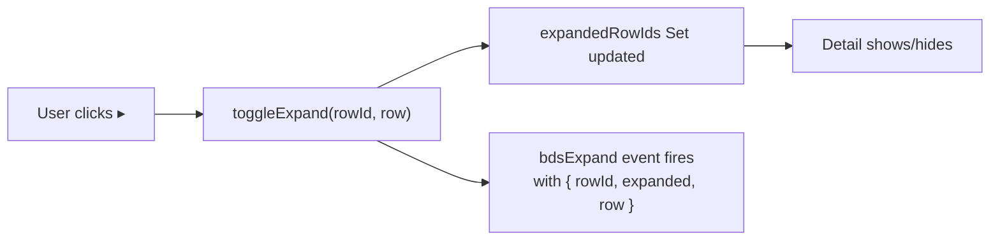
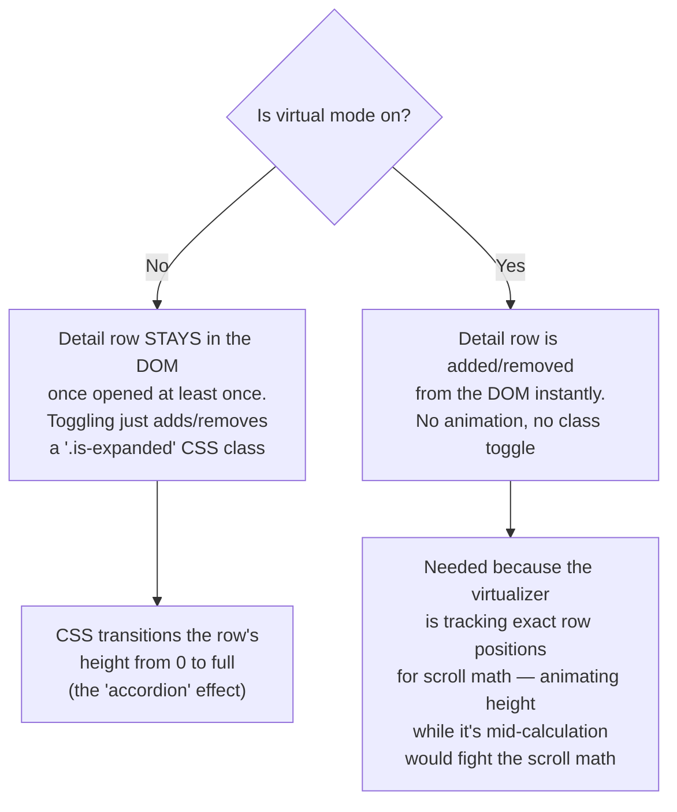

# bds-table row expand/collapse — explained in simple terms

## The problem it solves

Normally a `bds-table` row is just one line: checkbox, cell, cell, cell. This feature adds an optional "drawer" under any row that a user can open to see more detail — like an accordion, but for table rows.

## The pieces, in order

**1. You tell the table "I want detail panels" by giving it a template**

```html
<bds-table>
  <bds-table-column col-key="name" label="Name"></bds-table-column>
  ...
  <template slot="row-detail">
    <div class="order-history"></div>
  </template>
</bds-table>
```

If this `<template>` isn't there, nothing changes — no toggle column appears, zero impact on existing tables. That's the most important regression guard: **opt-in only**.

**2. Because the template exists, every row grows one extra column: a chevron toggle**

```
┌───┬────────────┬─────────┬────────┐
│ ▸ │ Name       │ Status  │ Amount │   ← header row
├───┼────────────┼─────────┼────────┤
│ ▸ │ Alice      │ active  │ $120   │   ← collapsed row
├───┼────────────┼─────────┼────────┤
│ ▾ │ Bob        │ active  │ $340   │   ← expanded row
├───┴────────────┴─────────┴────────┤
│  (cloned template content here,   │   ← the "detail row" —
│   spans the full table width)     │     one <tr> with colSpan
├───┬────────────┬─────────┬────────┤
│ ▸ │ Carol      │ inactive│ $75    │
└───┴────────────┴─────────┴────────┘
```

**3. Clicking the chevron does two things, and only two things**



Critically, this click handler **never touches row selection**. Even if the table also has checkboxes (`selectable`), clicking the chevron cannot select/deselect the row. This was a deliberate, tested guard — a real bug in MUI's own table component once let exactly this leak happen, so it's explicitly locked down here.

**4. Why the event carries the *whole row*, not just an ID**

A plain HTML attribute (`data-status="active"`) can't hold an array or nested object. So if a consumer wants to show, say, an order's list of line-items inside the detail panel, they need the actual `row.history` array — not just a stringified id. That's why `bdsExpand`'s payload is `{ rowId, expanded, row }` — the full row object — so a listener can pull out `event.detail.row.history` and build whatever nested content it wants.

**5. Two different animation behaviors, depending on `virtual`**

There are genuinely two separate code paths here:



In non-virtual mode you get a smooth open/close animation (nice UX). In virtual mode (used for huge datasets with a scrollbar), it just snaps open/closed instantly — animating would require constantly recalculating scroll position mid-animation, which was explicitly scoped out as too complex for this feature.

**6. Why content doesn't get recreated on every re-render**

The cloned detail content is stored in a cache, keyed by the row's id. If the row hasn't actually changed, the table reuses the same cloned DOM node instead of re-cloning the template every time something re-renders (e.g. a selection changes elsewhere). That's a performance optimization, not something you need to configure — it just works.

## The one-sentence summary

*"Add a `<template slot='row-detail'>`, and every row gets a chevron; clicking it shows a full-width panel below that row (built from your template), fires an event with the complete row data so you can populate complex content, and — depending on whether virtual scrolling is on — either animates open smoothly or snaps open instantly."*
