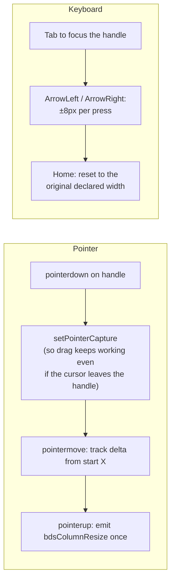
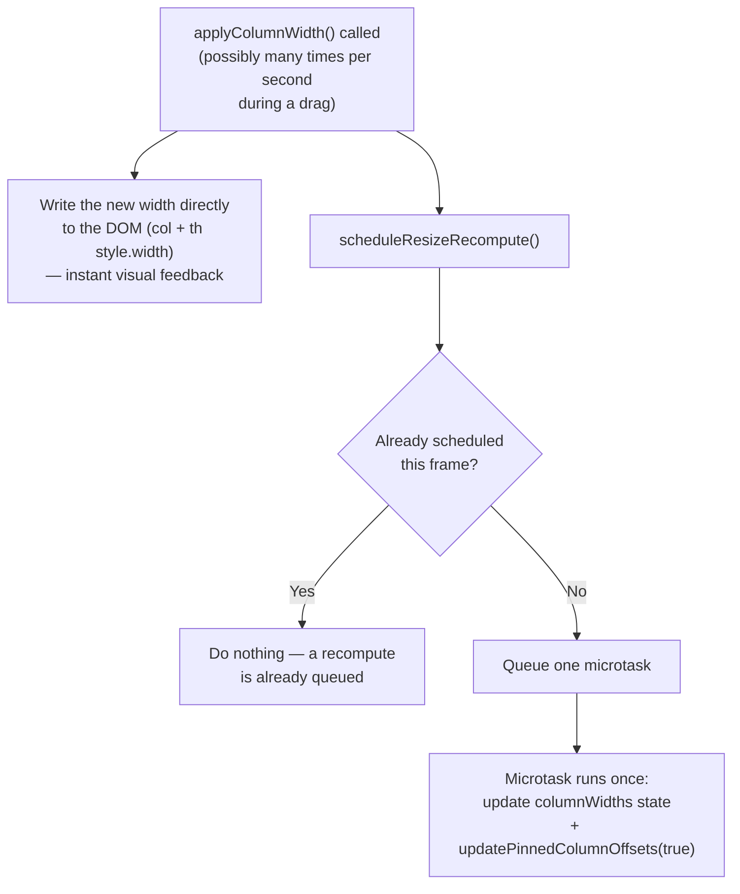

# bds-table column resizing — explained in simple terms

## The problem it solves

By default, every `bds-table` column has a fixed width set once by whoever declared it (`width="200px"` on `<bds-table-column>`, or nothing at all). There's no way for the *person looking at the table* to say "actually, I want this column wider" and have it stick. Column resizing adds that: drag a handle on the right edge of a column header (or use the keyboard), and the column resizes live — while everything else in the table (pinned-column offsets, the overall table width) stays correct.

## The pieces, in order

**1. You opt a column in with one prop**

```html
<bds-table-column col-key="email" label="Email" resizable></bds-table-column>
```

If `resizable` isn't set, nothing changes for that column — no handle, no behavior difference. Same "opt-in only" philosophy as every other `bds-table` feature (sorting, pinning, reordering).

**2. A resizable column's header gets an invisible handle that only shows up on hover/focus**

```
┌─────────────────┐
│ Email          ⟺│  ← hover the header, or Tab to focus the handle:
└─────────────────┘     an 8px-wide strip appears on the right edge
```

It's a `<div role="separator" aria-orientation="vertical" aria-valuenow={widthInPx} tabIndex={0}>` — the standard accessible pattern for a resize splitter, not a custom invention. `opacity: 0` by default, `opacity: 1` on `th:hover` or `:focus-visible`. It's never permanently visible, so a table with ten resizable columns doesn't look cluttered.

**3. Two independent ways to grab it: mouse/touch, or keyboard**



Both paths funnel into the same `applyColumnWidth(colKey, width)` method — there's exactly one place that actually changes a column's width, no matter how the resize was triggered.

**4. Resizing one column can't be allowed to recompute everything on every single pixel of movement**

`bds-table` already has pinned columns (sticky `left` offsets) and a virtualizer for huge datasets — both of which need to know the *current* width of every column to work correctly. If the resize drag recalculated all of that on every `pointermove` event (which can fire dozens of times per second), a drag would visibly stutter.

So resizing reuses the exact same throttle trick the table already uses for virtual scrolling (`scheduleVirtualRerender`): a boolean flag plus a microtask.



The visual resize itself is instant (direct DOM style write); the "expensive" bookkeeping (pin offsets, table width) happens at most once per animation frame, no matter how fast the mouse moves. This is the same shape as the virtualizer's own throttle — deliberately, so there's only one recompute pattern to reason about in the whole component instead of two competing ones.

**5. One event, fired once, not per pixel**

```
bdsColumnResize: { colKey: "email", width: "240px" }
```

Fires exactly once — on `pointerup` for a drag, or once per keyboard commit (each arrow press, or the Home reset). Not once per `pointermove`. A consumer listening for "the user resized a column, go save that to their preferences" doesn't get flooded with events mid-drag.

## Three real bugs found and fixed during manual testing

Unit tests (which run in a simulated DOM, not a real browser) passed the whole time these existed — none of them are the kind of thing a jsdom-based test can catch, because jsdom returns zero for every element's measured size and doesn't implement real CSS layout algorithms. All three were only found by actually dragging things around in a browser.

**Bug 1 — measuring the wrong element.** The code that figures out "how wide is this column right now" originally asked the `<col>` element (the one inside `<colgroup>`) for its `getBoundingClientRect()`. Per the CSS spec, `<col>` elements generate no rendered box at all — they're a pure styling hook, invisible to layout measurement. In a real browser this returns `0` every time; in jsdom, *every* element returns `0`, so the test suite couldn't tell the difference between "correctly measured" and "silently broken." Fixed by reading the column's own tracked width state first, only falling back to a DOM measurement (of the `<th>`, which *does* have a real box) as a last resort.

**Bug 2 — the browser fighting the resize.** `bds-table`'s `<table>` has `width: 100%; table-layout: fixed` in its base stylesheet. That's normally fine — but if every column has an explicit pixel width that adds up to *less* than the table's rendered 100% width, the browser doesn't just leave empty space: it proportionally stretches every column back out to fill the gap. So shrinking one column via drag would work for a frame, then the browser would silently push it back wider on the next layout pass — "arrow-left resizing gets stuck," exactly as reported. Fixed with `syncNaturalTableWidth()`: whenever every column has an explicit width, the table's own width is set to an explicit `calc(width1 + width2 + ...)` instead of `100%`, so there's no leftover space for the browser to redistribute. When any column is still auto-width, the table falls back to the original `100%` behavior untouched.

**Bug 3 (the surprise) — not a bug at all.** QA reported that in the React and Vue example apps, the very first `ArrowLeft`/`ArrowRight` keypress on a freshly focused resize handle silently did nothing — but worked fine after that. This looked like a real timing race (React/Vue set custom-element properties slightly later than plain HTML does), and got investigated twice, independently. Both times, the investigation was running against `pnpm dev`'s live dev server — and both times, the real cause turned out to be that dev server serving a *stale* build of `boreal-react`/`boreal-web-components`. Vite caches its pre-bundled dependencies and doesn't notice when a linked workspace package's compiled output changes underneath it, so a rebuild doesn't reliably reach the browser. Once verified against a real, freshly packed build (`pnpm dev:pack:react` / `dev:pack:vue` — which does a full rebuild and reinstalls an actual tarball, bypassing that cache entirely), the "bug" never reproduced: 4 out of 4 clean attempts resized correctly on the very first keypress. No code changed. The lesson that's now written down for next time: if a bug only shows up in the React/Vue playground and not in the plain web-component one, rebuild via `dev:pack` before spending time on a code fix — the dev server itself is a suspect.

## The one-sentence summary

*"A `resizable` column grows a hover/focus-only drag handle that resizes it live via pointer or arrow keys, funnels every change through one throttled recompute path shared with pinning and virtualization, fires `bdsColumnResize` once per completed gesture — and getting it pixel-correct meant fixing two real CSS-layout quirks (measuring the wrong element, and the browser fighting a shrink by re-expanding columns to fill 100%) plus learning to distrust a live dev server that can silently serve stale framework-wrapper builds."*
